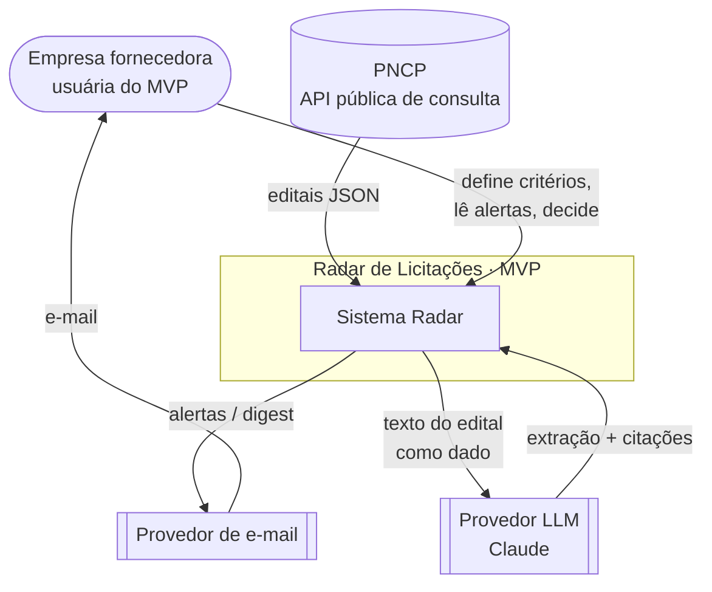
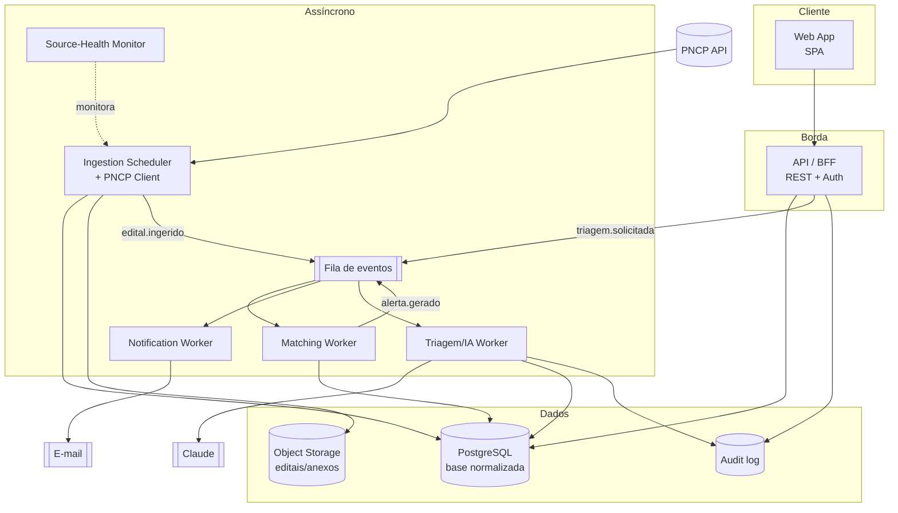

# A01 · Visão Arquitetural

> Estilo, drivers e a estrutura de alto nível do core do MVP. Diagramas em Mermaid (renderizam no GitHub). Números vêm de [docs/12](../docs/12-modelo-de-dados-e-requisitos-nao-funcionais.md); onde há escolha de tecnologia, é **proposta** marcada `[A VALIDAR]`.

## 1. Drivers arquiteturais

A arquitetura é moldada por poucos requisitos que, se falharem, quebram o produto:

| Driver | Requisito (docs/12, §3) | Consequência de projeto |
|--------|-------------------------|-------------------------|
| **Frescor** | p95 publicação→alerta ≤ 30 min | Polling frequente do PNCP + processamento assíncrono por fila |
| **Cobertura** | ≥ 99% dos editais do PNCP | Varredura por modalidade + reconciliação; idempotência por `numeroControlePNCP` |
| **Qualidade da triagem** | recall de campos críticos alto, zero alucinação numérica | Triagem por IA com citação da fonte e human-in-the-loop (docs/10) |
| **Conformidade** | API oficial, minimização, proveniência | Ingestão só via API; minimização antes de persistir |
| **Custo de IA** | teto por edital | Triagem assíncrona, cacheada, sob demanda |
| **Isolamento** | 0 vazamento cross-tenant (no *Next*) | `tenantId` desde já; caminho para RLS |
| **Resiliência de fonte** | degradação graciosa | Retry idempotente, detecção de *schema drift*, monitor de saúde |

## 2. Estilo arquitetural

**Monólito modular + workers assíncronos**, não microserviços. No MVP, um único deploy com módulos de fronteira clara (ingestão, matching, triagem, notificação, API) e *workers* que consomem uma fila. É o ponto ótimo de custo/velocidade para concepção: simples de operar, barato, e já desacoplado por eventos onde importa (ingestão → processamento). A quebra em serviços independentes fica para quando escala/organização exigirem. `[A VALIDAR — confirmar com a realidade de time e operação]`

## 3. Diagrama de contexto (C4 — nível 1)

Fontes futuras (Compras.gov.br, portais estaduais) e canais futuros (app, WhatsApp) entram no *Next* (docs/07); ficam fora do contexto do MVP.

## 4. Diagrama de contêineres (C4 — nível 2)

## 5. Stack proposta (`[A VALIDAR]`)

Escolhas default sensatas; o racional importa mais que a marca:

| Camada | Proposta | Racional |
|--------|----------|----------|
| Base normalizada | **PostgreSQL** | Modelo relacional casa com as entidades (docs/12); *full-text* nativo serve o matching do MVP; RLS habilita multi-tenant no *Next* |
| Fila de eventos | Fila gerenciada (SQS/RabbitMQ/Redis Streams) | Desacopla ingestão de processamento; retries e *dead-letter* |
| Object storage | S3-compatível | Guardar PDFs de editais/anexos para a triagem |
| Triagem/IA | **Claude** (família atual: um modelo *Sonnet* no caso comum por custo/latência, *Opus* em editais difíceis) | Qualidade de extração com citação; escolha exata e custo/edital são guardrail de docs/10, §7 `[A VALIDAR]` |
| E-mail | Provedor transacional (SES/SendGrid) | Entregabilidade de alertas e digest |
| Runtime/linguagem | **TypeScript** (linguagem única) — proposta | Deriva do compute por workload; ver [A08 §9](08-infraestrutura-e-implantacao.md); confirmar com o time `[A VALIDAR]` (P-27) |
| Hospedagem | Containers em nuvem, **região Brasil** | Latência e residência de dados (nice-to-have LGPD) |

## 6. Preparo para multi-tenant (mesmo sem usar no MVP)

O MVP é single-tenant, mas o custo de retrofit é alto (docs/05, §7). Portanto, desde já: `tenantId` em toda entidade (docs/12, §2); toda query de leitura passa por um filtro de tenant central; e o design de dados é compatível com *Row-Level Security* do Postgres, a ser **ativado** quando as consultorias entrarem (*Next*). Isso é decisão de arquitetura, não de produto.

## 7. Transversais mapeados aos contêineres

- **Segurança por camada** (docs/05, §4): validação/sanitização no `PNCP Client`; TLS em todo trânsito; segredos em cofre; AuthN/AuthZ na `API`; edital tratado como não-confiável no `Triagem/IA Worker` (anti prompt-injection).
- **Observabilidade**: logs estruturados, métricas de negócio (docs/08) e o `Source-Health Monitor` (docs/11, §7).
- **Auditoria**: `Audit log` append-only para todo acesso a dado pessoal e toda decisão automática (docs/05, §3).

## 8. Pendências

Confirmar estilo (monólito modular) e stack com o time; validar região/residência de dados. Rastreadas em [docs/98](../docs/98-decisoes-e-pendencias.md) (P-27, P-28).
