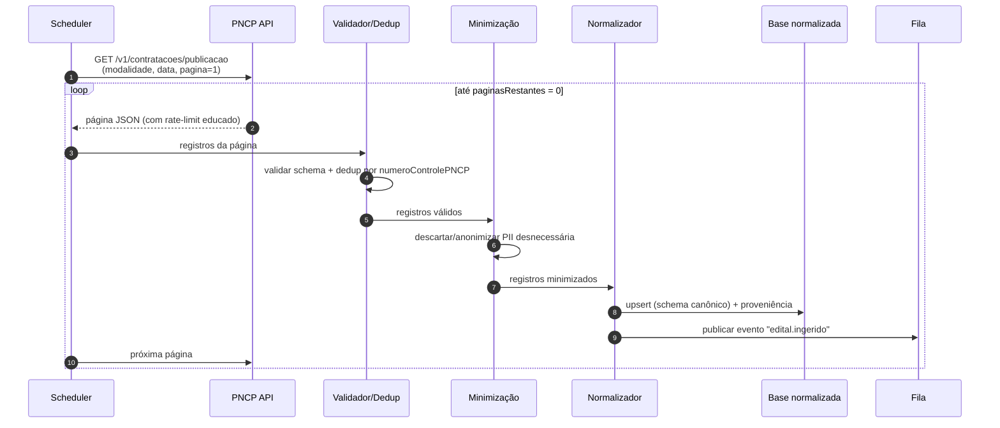

# A02 · Ingestão de Dados do PNCP

> **Como pegar os dados do PNCP** de forma completa, fresca e conforme. O PNCP é a fonte âncora do MVP (docs/02, §3 e docs/03, §7). Este documento desenha a ingestão que realiza o fluxo de sistema de docs/03, §2.
>
> ⚠️ **Nota de precisão.** Os contratos exatos da API (caminhos, nomes de parâmetro, códigos de modalidade) devem ser confirmados no **Swagger oficial** ([docs/06](../docs/06-glossario-e-fontes.md): `pncp.gov.br/api/consulta/swagger-ui`) antes de codar. O que está aqui é o **desenho**; campos marcados `[A VALIDAR — Swagger]` são a forma esperada, não contrato verificado.

## 1. Por que API, não scraping

Decisão fechada: no MVP a coleta é **só via API pública de consulta do PNCP**. Não é preferência técnica — é conformidade (docs/02, §4): consumir um endpoint oficial documentado é materialmente diferente de raspar HTML contra termos de uso, e a ANPD já tratou scraping como tratamento sujeito à LGPD. Bônus: a API é mais estável e paginada.

## 2. A API de Consulta do PNCP

- **Base (consulta pública, sem autenticação):** `https://pncp.gov.br/api/consulta` `[A VALIDAR — Swagger]`
- **Formato:** JSON, com **paginação** (campos de total de registros, total de páginas, página atual e páginas restantes — docs/03, §7).
- **Identificador único:** `numeroControlePNCP` de cada contratação — chave para deduplicação e idempotência (§4).

Endpoints relevantes ao MVP (forma esperada — confirmar):

| Propósito | Endpoint (esperado) | Parâmetros-chave |
|-----------|---------------------|------------------|
| Contratações por **data de publicação** | `GET /v1/contratacoes/publicacao` | `dataInicial`, `dataFinal` (yyyyMMdd), `codigoModalidadeContratacao`, `uf`, `codigoMunicipioIbge`, `pagina`, `tamanhoPagina` |
| Contratações com **proposta em aberto** | `GET /v1/contratacoes/proposta` | `dataFinal`, `codigoModalidadeContratacao`, `pagina` |
| Contratações por **data de atualização** | `GET /v1/contratacoes/atualizacao` | `dataInicial`, `dataFinal`, `pagina` |
| **Arquivos/anexos** de uma contratação | `GET /v1/orgaos/{cnpj}/compras/{ano}/{sequencial}/arquivos` | identificadores da compra |

Notas conhecidas: `tamanhoPagina` tem teto (na ordem de dezenas — `[A VALIDAR]`); a consulta por publicação **exige a modalidade** como parâmetro, o que obriga a iterar sobre as modalidades relevantes (§3).

## 3. Estratégia de sincronização

Três regimes:

1. **Carga inicial (backfill):** varrer janelas de data para trás até o horizonte desejado, por modalidade. Roda uma vez.
2. **Incremental (frescor):** o agendador dispara em intervalo curto o suficiente para o p95 ≤ 30 min (docs/12) — usando `publicacao` para novos editais e `atualizacao` para mudanças de fase/prazo. `[A VALIDAR — cadência exata]`
3. **Reconciliação (cobertura):** varredura periódica mais ampla (ex.: diária) para pegar o que o incremental perdeu e garantir ≥ 99% (docs/12). Divergência entre reconciliação e incremental é sinal de alerta.

**Iteração por modalidade.** Como `/publicacao` exige `codigoModalidadeContratacao`, o coletor faz um laço sobre a tabela de modalidades da Lei 14.133 — pregão, concorrência, concurso, leilão, diálogo competitivo, e as hipóteses de contratação direta (docs/02, §2). Os **códigos** vêm da tabela de domínio do PNCP. `[A VALIDAR — mapear códigos no Swagger]`

**Idempotência.** Toda gravação é *upsert* por `numeroControlePNCP` — reprocessar a mesma página nunca duplica nem corrompe. Isso torna *retries* seguros (§5).

## 4. Pipeline de ingestão

Realiza o fluxo de docs/03, §2 — a ordem importa, em especial a minimização **antes** de persistir:

Pontos de projeto:

- **Validação de schema** logo na entrada (docs/05, §4): se o payload do PNCP não bate com o schema esperado, não grava — sinaliza *drift* (§5).
- **Minimização antes da base** (docs/03, §2): CPF/nome de terceiro que não agrega à decisão é descartado ou anonimizado; nunca chega ao disco sem necessidade.
- **Normalização ao schema canônico** (docs/12): modalidade, fase, valores e prazos viram atributos de primeira classe; `faseAtual` é derivada dos dados, não de ordem fixa (docs/04, §4).
- **Proveniência obrigatória** (docs/05, §5): cada edital grava fonte (`PNCP`), timestamp de coleta e base legal.
- **Evento, não chamada direta:** a ingestão só publica `edital.ingerido`; matching e triagem reagem depois (desacoplamento).

## 5. Resiliência (docs/11, §7)

- **Rate-limit educado + backoff:** respeitar limites da fonte; recuar em 429/5xx com *exponential backoff*.
- **Retry idempotente:** falha no meio da paginação? Reprocessar é seguro por causa do *upsert* (§3).
- **Detecção de *schema drift*:** mudança de formato da API é detectada pela validação (§4) e **alerta** em vez de gravar lixo.
- **Monitor de saúde da fonte:** o `Source-Health Monitor` acompanha disponibilidade, latência e **volume esperado** de editais/dia; queda ou anomalia gera alerta interno.
- **Degradação graciosa:** falha do PNCP degrada frescor, não derruba o produto; o que já está na base continua servindo matching e triagem.

## 6. Anexos e o texto do edital

A triagem (docs/10) precisa do **edital e anexos** (PDFs), não só dos metadados. Desenho:

- Metadados vêm no fluxo principal (§4). Os **arquivos** são buscados via endpoint de arquivos (`.../arquivos`) **sob demanda** — quando um edital é enviado à triagem — e guardados em **object storage** com referência no registro.
- Baixar tudo sempre desperdiça storage e banda; baixar sob demanda casa com o custo de IA ser assíncrono e cacheado (docs/08, §4).
- PDF-imagem exige OCR na triagem (docs/10, §6); a ingestão só garante o arquivo disponível e íntegro.
- Retenção dos anexos segue a política de retenção (docs/05, §5). `[A VALIDAR — prazo]`

## 7. Conformidade da ingestão (checklist)

Espelha o checklist de docs/04, §6 aplicado à fonte PNCP:

- [ ] Coleta **só** por API oficial; sem scraping (docs/02, §4).
- [ ] Minimização aplicada **antes** de persistir (docs/03, §2).
- [ ] Proveniência (fonte, data, base legal) gravada em todo edital (docs/05, §5).
- [ ] Base legal registrada para qualquer dado pessoal retido (docs/02, §4).
- [ ] TLS em todo trânsito; nenhum dado sensível em texto claro (docs/05, §4).
- [ ] Rate-limit educado com a fonte (docs/03, §7).

## 8. Pendências

- Confirmar no **Swagger** os endpoints, parâmetros e `tamanhoPagina` (§2). `[A VALIDAR]`
- Mapear os **códigos de modalidade** do PNCP (§3). `[A VALIDAR]`
- Fixar a **cadência de polling** que atinge o frescor de 30 min (§3). `[A VALIDAR]`
- Definir **retenção de anexos** em object storage (§6). `[A VALIDAR]`

Rastreadas em [docs/98](../docs/98-decisoes-e-pendencias.md) (P-26).
