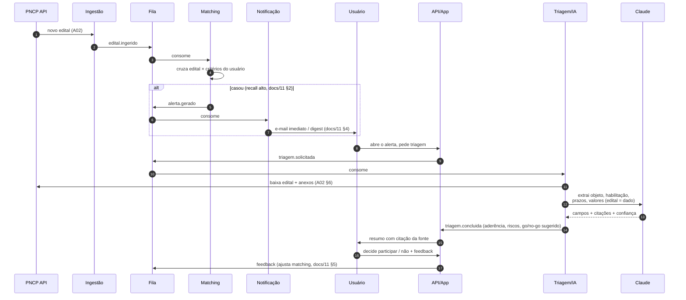
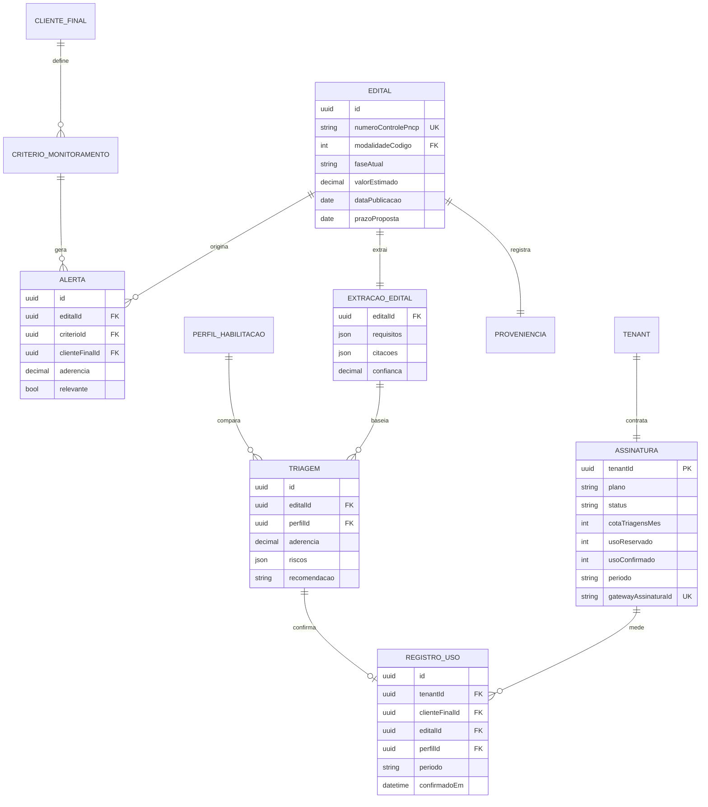

# A03 · Desenho da Solução

> Com a ingestão planejada (A02) e a estrutura definida (A01), aqui se **monta a solução ponta a ponta** do core do MVP: o fluxo do edital publicado até a decisão go/no-go, os contratos entre módulos, o modelo físico e como cada NFR é atingido.

## 1. Fluxo ponta a ponta

O caminho de valor do MVP, atravessando ingestão → matching → alerta → triagem → decisão → feedback:

## 2. Responsabilidades dos módulos

| Módulo | Faz | Não faz |
|--------|-----|---------|
| **Ingestão** | Coletar do PNCP, minimizar, normalizar, publicar evento (A02) | Não decide relevância nem lê o edital |
| **Matching** | Cruzar edital × critérios, pontuar aderência, gerar alerta (docs/11) | Não notifica nem analisa conteúdo |
| **Notificação** | Entregar alerta imediato/digest por criticidade (docs/11, §4) | Não decide o que é relevante |
| **Triagem/IA** | Extrair com citação, calcular aderência, sugerir go/no-go (docs/10) | **Não decide** — decisão é do usuário; **não faz gate de cota** (não conhece Assinatura — o Core não depende de um Generic downstream, docs/13 §4) |
| **API/App** | AuthN/AuthZ, orquestrar, servir a UI, registrar auditoria; **gate de entitlement** (reserva síncrona de cota) nas rotas que consomem triagem | Não fala direto com o LLM fora do worker |
| **Cobrança & Assinatura** | Manter `Assinatura` (plano, cota, status), reservar/confirmar uso, consumir `triagem.concluida` para faturar, receber o webhook do gateway (docs/13 §3, P-107) | Não guarda cartão (checkout hospedado/tokenizado) nem sabe o que é um edital |

## 3. Contratos de eventos (fila)

Payloads mínimos — a fila é o contrato entre módulos:

| Evento | Emissor → Consumidor | Payload essencial |
|--------|----------------------|-------------------|
| `edital.ingerido` | Ingestão → Matching | `numeroControlePNCP`, `tenantScope` (global no MVP), atributos normalizados |
| `alerta.gerado` | Matching → Notificação | `alertaId`, `tenantId`, `clienteFinalId`, `criterioId`, `editalId`, `aderencia` |
| `triagem.solicitada` | API → Triagem/IA | `tenantId`, `clienteFinalId`, `editalId`, `perfilId` (publicado **depois** da reserva de cota — docs/13 §3) |
| `triagem.concluida` | Triagem/IA → API · Cobrança | `tenantId`, `clienteFinalId`, `editalId`, `perfilId`, `confianca`, `aderencia`, `recomendacao`, `riscos` |
| `triagem.falhou` | Triagem/IA → Cobrança | `tenantId`, `clienteFinalId`, `editalId`, `perfilId`, `motivo` |
| `feedback.alerta` | API → Matching | `alertaId`, `relevante:bool` |

Toda mensagem carrega `tenantId` mesmo no MVP single-tenant (A01, §6).

> **`triagem.concluida` carrega a chave natural da Triagem, não o conteúdo do laudo.** *(Ajuste 2026-07-11, RAD-239: alinha o contrato ao evento realmente publicado — `modules/triagem/src/application/events.ts`.)* O payload traz `(tenantId, clienteFinalId, editalId, perfilId)` + veredicto (`aderencia`, `confianca`, `recomendacao`, `riscos`); **não** traz `campos`/`citacoes` — o laudo completo fica na `Triagem` e se lê pela API, não pelo evento. Essa quádrupla **é** a chave de idempotência do consumidor de **Cobrança** (SQS é *at-least-once* e o publisher pode republicar): dedupe por chave natural, não por `eventId` (docs/13 §3, nota de linguagem; docs/98 P-107). Mudar esses 4 campos quebra a idempotência da fatura — é contrato, não detalhe.

> **`triagem.falhou` é o compensador da reserva de cota, não um evento de erro genérico.** *(RAD-255, P-107 (c).)* Emitido por `TriarEditalUseCase` em todo caminho de falha/timeout/cancelamento — a reserva síncrona feita na borda antes de `triagem.solicitada` (§3 acima) só é liberada por Cobrança (`LiberarReservaUseCase`, RAD-247) se este evento chegar; sem ele a cota vaza e o gate passa a barrar um tenant que não consumiu nada. Carrega a **mesma quádrupla** `(tenantId, clienteFinalId, editalId, perfilId)` de `triagem.concluida` — sempre a do pedido original (`TriarEditalInput`), mesmo quando a falha é de autorização (perfil de outro cliente) e não há `Triagem` persistida para lê-la. `motivo` é o `code` estável de `DomainError` (ex.: `CONFIANCA_INSUFICIENTE`, `OCR_FALHOU`) ou `erro_inesperado` como fallback seguro — nunca mensagem, stack ou detalhe interno. *(RAD-259: fechado.)* O worker que consome `triagem.solicitada` → `TriarEditalUseCase` (`TriagemSolicitadaWorker`, composto em `apps/api/src/workers.ts`) tem handler de DLQ dedicado — ao esgotar retries de INFRA (crash antes de `executar()` rodar, ex. hidratação), publica `triagem.falhou` com a chave natural da mensagem original antes de descartá-la, fechando o `try/catch` de `TriarEditalUseCase` para o caso em que ele nunca chega a rodar.

> **`alerta.gerado` carrega o escopo, não o destinatário.** O Matching conhece o `clienteFinalId` (dono do `CRITERIO_MONITORAMENTO`), não o usuário nem o e-mail — resolver contato é responsabilidade da **Notificação** (Cliente-Fornecedor, leitura de Identidade/preferência; MVP 1 usuário por `clienteFinal`, P-25). Por isso o evento **não** carrega `usuarioId` nem `emailDestinatario`: colocá-los forçaria o produtor a conhecer o destinatário — violação de fronteira (docs/13, §5). *(Ajuste 2026-07-05: alinha o contrato ao que o Matching de fato produz e retira o e-mail do evento — ver [15](15-matching-e-alerta.md), [14](14-notificacao.md).)*

### 3.1 Transporte real do contrato (quem publica e quem consome, de verdade)

*(Decidido em RAD-317, P-113 — o contrato acima existia sem transporte: nada em produção publicava nem consumia.)*

O transporte é **um loop de consumo dentro de `apps/api`**, não Lambda + event source mapping. O seam serverless (A08 §2, `infra/terraform/modules/serverless`) segue **gated off** até o gatilho de elasticidade de [09](09-teste-de-elasticidade-infra.md) EL1/EL3 (P-67/P-31) — coabitação de API+workers no mesmo deploy é o que P-27/P-96 §4 decidiram para o MVP.

| Peça | Onde vive | Estado |
|------|-----------|--------|
| **Publicador** `SqsEventPublisher<E>` — serializa `{type, occurredAt, payload, correlationId}` | `@radar/kernel` (genérico, provider-agnóstico via port `QueueClient`) | **existe** |
| **`QueueClient` concreto** (`@aws-sdk/client-sqs`) | `apps/api/src/infra/` — composition root | a construir (o dublê de dev vive em `tools/pipeline-local`) |
| **Consumidor** long-poll (`receive`/`delete`/visibility) → `worker.processar(payload, signal)` | `apps/api/src/infra/` | a construir |
| **Retry + DLQ** (`redrive_policy`, `max_receive_count`) | broker (módulo Terraform `queue`) | **existe** |

Dois invariantes que caem daqui:

1. **Retry e DLQ são do broker; o `DlqClient` da aplicação é compensação semântica, não transporte.** Ele existe para publicar `triagem.falhou` antes do descarte (§3 acima) — e só pode disparar **na última tentativa**, o que exige o consumidor expor `ApproximateReceiveCount` ao worker. Sem isso, ou a cota vaza (a compensação nunca roda) ou ela roda a cada retry.
2. **O consumidor é *handler-shaped*.** Ele não faz nada além de puxar a mensagem e chamar `worker.processar(payload, signal)` — a mesma assinatura que um handler Lambda chamaria. Migrar para o tier serverless, quando o gatilho disparar, troca a casca, não o miolo.

## 4. Modelo físico (mapeando docs/12)

As entidades conceituais de docs/12 viram tabelas Postgres. Principais e seus índices críticos para os NFRs:

Índices que sustentam os NFRs: `numeroControlePncp` **único** (idempotência, A02); `dataPublicacao` e `modalidadeCodigo` (matching e reconciliação); `(editalId, perfilId)` **único** em `TRIAGEM` (uma aderência por empresa); `clienteFinalId` nas tabelas de dado de cliente — `ALERTA`, `TRIAGEM`, `CRITERIO_MONITORAMENTO` (isolamento). O **catálogo é global**: `EDITAL`, `EXTRACAO_EDITAL` e `RESULTADO` **não** levam `tenantId` (públicos e compartilhados — base do cache). Valores que mudam por decreto (docs/02, §2) ficam em **tabela de referência versionada e datada**.

**Cobrança — os dois índices que sustentam o entitlement** (P-107; decidido no RAD-232, ratificado por Negócio em 2026-07-11). `ASSINATURA` guarda `cotaTriagensMes`, `usoReservado` e `usoConfirmado` **na mesma linha**, porque o gate é uma **reserva atômica** na borda — `UPDATE assinatura SET uso_reservado = uso_reservado + 1 WHERE tenant_id = $1 AND status = 'ativa' AND uso_reservado < cota_triagens_mes RETURNING 1` (zero linhas ⇒ **402**, antes de gastar LLM). Espalhar cota e uso por tabelas diferentes reintroduz a race que a reserva existe para fechar. `REGISTRO_USO` leva **`UNIQUE (tenant_id, cliente_final_id, edital_id, perfil_id, periodo)`**: a chave natural é o que impede faturar duas vezes a mesma triagem, já que o SQS entrega *at-least-once* e o `DomainEvent` não carrega `eventId` (§3). **A reserva vive no contador `usoReservado` da `ASSINATURA`, não como linha em `REGISTRO_USO`**: a linha só nasce **confirmada**, quando o consumidor de Cobrança recebe `triagem.concluida` (`INSERT … ON CONFLICT DO NOTHING`, incrementando `usoConfirmado`) — o evento é a fonte da **fatura**, nunca do **gate** (docs/13, §4). Pré-inserir a linha na reserva anularia a idempotência: o `DO NOTHING` nunca a promoveria a confirmada. Triagem que **falha, expira ou é cancelada libera a reserva** (decrementa `usoReservado`) e **não gera registro** — logo o caminho de falha, **DLQ inclusive**, precisa **compensar a reserva**, senão a cota vaza. Ambas as tabelas levam `tenantId`: são dado de cliente, não catálogo.

## 5. Matching (docs/11) no MVP

- **Filtros estruturados** (SQL sobre atributos normalizados): região/UF, faixa de valor, órgão. **Não há filtro por ramo/CNAE** — o PNCP não publica CNAE da contratação (o CNAE do PNCP é o do *fornecedor*), então filtrar por ele zera o recall (docs/11 §3.1).
- **Camada de palavra-chave** via *full-text* do Postgres sobre objeto/descrição.
- **Postura recall-alto** (docs/11, §2): melhor um alerta a mais que perder um edital; a triagem e o feedback filtram os falsos positivos.
- **Ranking** por aderência antes de alertar; **digest** para conter fadiga (docs/11, §4).
- Matching semântico/vetorial fica para o *Next*. `[A VALIDAR]`

## 6. Triagem/IA (docs/10) no MVP

- **Worker assíncrono**, disparado por `triagem.solicitada` — nunca no caminho síncrono da API (custo e latência).
- **Edital como dado não-confiável** (docs/05, §4): instruções separadas do conteúdo; nada extraído é executado — defesa contra prompt-injection.
- **Saída estruturada** com citação da fonte e **score de confiança** por campo; abaixo do limiar, marca "verificar" e não pré-preenche (docs/10, §4).
- **Cache da extração por edital + pré-extração em lote na ingestão**: a `EXTRACAO_EDITAL` (objeto, requisitos, prazos, citações) é **1 por edital** e serve todos — corta custo (docs/08, §4). Como não é sensível à latência (docs/10, §7), a extração roda **assíncrona e em lote quando o edital é ingerido** (`edital.ingerido`), antes de o usuário pedir a triagem — ~50% mais barata e já pronta na hora (P-92). A **aderência** (`TRIAGEM`) é calculada **por perfil** (1 por edital × empresa), pois depende do perfil de habilitação — não é compartilhável. Separar as duas é o que faz cache e correção conviverem.
- **Modelo por dificuldade:** Claude, família atual — três faixas pela dificuldade do edital: *Haiku* nos fáceis (PDF nativo, item único, modalidade simples), *Sonnet* no caso comum, *Opus* nos difíceis; cada faixa é validada no gold set (docs/10, §5) e o **custo/edital** é guardrail de docs/10, §7. `[A VALIDAR — P-93]`
- **Fallback:** baixa confiança → leitura assistida (destacar trechos, sem decidir); PDF-imagem → OCR (docs/10, §6).

## 7. Como cada NFR é atingido

| NFR (docs/12, §3) | Como o desenho atende |
|-------------------|-----------------------|
| Frescor ≤ 30 min | Polling incremental (A02, §3) + processamento assíncrono por fila |
| Cobertura ≥ 99% | Laço por modalidade + reconciliação diária + idempotência (A02) |
| Latência de triagem | Worker assíncrono + cache por edital (§6) |
| Isolamento tenant (0) | `tenantId` em toda entidade/evento; filtro central; RLS no *Next* (A01, §6) |
| Auditabilidade (100%) | `Audit log` append-only em API e Triagem (A01, §7) |
| Custo de IA sob teto | Triagem assíncrona e cacheada; pré-extração em lote na ingestão + modelo por dificuldade + minimização de entrada (§6; P-92–P-95) |
| Resiliência de fonte | Retry idempotente + monitor de saúde + degradação graciosa (A02, §5) |

## 8. Segurança por camada (docs/05, §4) no desenho

Sanitização de entrada na Ingestão; TLS em todo trânsito; segredos em cofre; AuthN/AuthZ por usuário na API; edital não-confiável na Triagem; criptografia em repouso e `tenantId` no armazenamento; trilha de auditoria na Observabilidade.

## 9. Evolução da arquitetura (o que muda depois do MVP)

Ligado ao roadmap (docs/07):

- **Next:** ativar RLS multi-tenant; adicionar Compras.gov.br + 1-2 portais (novos coletores atrás da mesma fila); Módulo 3 (Gestão) consumindo `faseAtual`; matching semântico.
- **Later:** Módulo 4 (Inteligência) sobre os dados históricos já acumulados; cauda de portais; app e integrações.

O desacoplamento por eventos (A01, §2) é o que torna essa evolução aditiva: novas fontes e novos consumidores entram sem reescrever o núcleo.

## 10. Riscos arquiteturais e pendências

- **Dependência do contrato do PNCP** — mitigado por validação + monitor (A02, §5), mas o *schema* pode mudar; confirmar Swagger é P-26.
- **Custo de IA** pode furar a unidade econômica — mitigado por cache/assincronia e pelas alavancas de RAD-53 (lote na ingestão P-92, modelo por dificuldade P-93, minimização de entrada P-94, cache de prefixo P-95); teto é P-20/P-38 (docs/10).
- **Frescor vs. rate-limit da fonte** — a cadência de polling é um equilíbrio; é P-29.

Pendências de arquitetura consolidadas em [docs/98](../docs/98-decisoes-e-pendencias.md) (P-26 a P-30).
