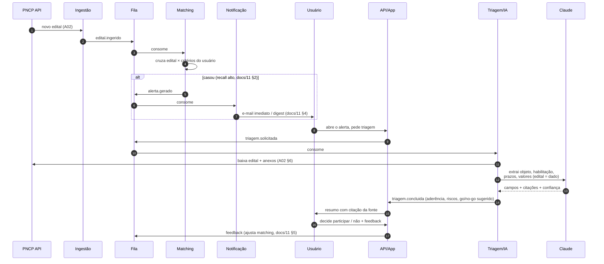
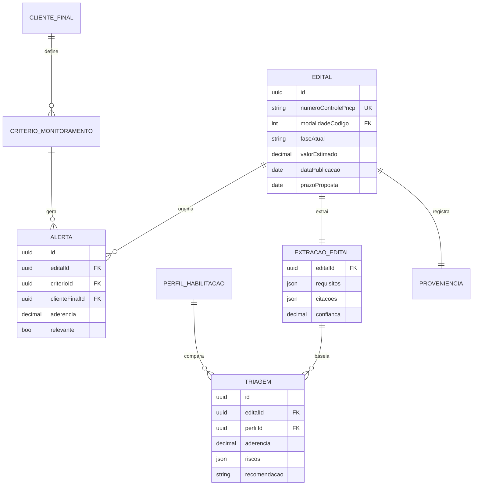

# A03 · Desenho da Solução

> Com a ingestão planejada (A02) e a estrutura definida (A01), aqui se **monta a solução ponta a ponta** do core do MVP: o fluxo do edital publicado até a decisão go/no-go, os contratos entre módulos, o modelo físico e como cada NFR é atingido.

## 1. Fluxo ponta a ponta

O caminho de valor do MVP, atravessando ingestão → matching → alerta → triagem → decisão → feedback:

## 2. Responsabilidades dos módulos

| Módulo | Faz | Não faz |
|--------|-----|---------|
| **Ingestão** | Coletar do PNCP, minimizar, normalizar, publicar evento (A02) | Não decide relevância nem lê o edital |
| **Matching** | Cruzar edital × critérios, pontuar aderência, gerar alerta (docs/11) | Não notifica nem analisa conteúdo |
| **Notificação** | Entregar alerta imediato/digest por criticidade (docs/11, §4) | Não decide o que é relevante |
| **Triagem/IA** | Extrair com citação, calcular aderência, sugerir go/no-go (docs/10) | **Não decide** — decisão é do usuário |
| **API/App** | AuthN/AuthZ, orquestrar, servir a UI, registrar auditoria | Não fala direto com o LLM fora do worker |

## 3. Contratos de eventos (fila)

Payloads mínimos — a fila é o contrato entre módulos:

| Evento | Emissor → Consumidor | Payload essencial |
|--------|----------------------|-------------------|
| `edital.ingerido` | Ingestão → Matching | `numeroControlePNCP`, `tenantScope` (global no MVP), atributos normalizados |
| `alerta.gerado` | Matching → Notificação | `tenantId`, `usuarioId`, `criterioId`, `editalId`, `aderencia` |
| `triagem.solicitada` | API → Triagem/IA | `tenantId`, `usuarioId`, `editalId` |
| `triagem.concluida` | Triagem/IA → API | `editalId`, `campos` + `citacoes` + `confianca`, `recomendacao`, `riscos` |
| `feedback.alerta` | API → Matching | `alertaId`, `relevante:bool` |

Toda mensagem carrega `tenantId` mesmo no MVP single-tenant (A01, §6).

## 4. Modelo físico (mapeando docs/12)

As entidades conceituais de docs/12 viram tabelas Postgres. Principais e seus índices críticos para os NFRs:

Índices que sustentam os NFRs: `numeroControlePncp` **único** (idempotência, A02); `dataPublicacao` e `modalidadeCodigo` (matching e reconciliação); `(editalId, perfilId)` **único** em `TRIAGEM` (uma aderência por empresa); `clienteFinalId` nas tabelas de dado de cliente — `ALERTA`, `TRIAGEM`, `CRITERIO_MONITORAMENTO` (isolamento). O **catálogo é global**: `EDITAL`, `EXTRACAO_EDITAL` e `RESULTADO` **não** levam `tenantId` (públicos e compartilhados — base do cache). Valores que mudam por decreto (docs/02, §2) ficam em **tabela de referência versionada e datada**.

## 5. Matching (docs/11) no MVP

- **Filtros estruturados** (SQL sobre atributos normalizados): ramo/CNAE, região/UF, faixa de valor, órgão.
- **Camada de palavra-chave** via *full-text* do Postgres sobre objeto/descrição.
- **Postura recall-alto** (docs/11, §2): melhor um alerta a mais que perder um edital; a triagem e o feedback filtram os falsos positivos.
- **Ranking** por aderência antes de alertar; **digest** para conter fadiga (docs/11, §4).
- Matching semântico/vetorial fica para o *Next*. `[A VALIDAR]`

## 6. Triagem/IA (docs/10) no MVP

- **Worker assíncrono**, disparado por `triagem.solicitada` — nunca no caminho síncrono da API (custo e latência).
- **Edital como dado não-confiável** (docs/05, §4): instruções separadas do conteúdo; nada extraído é executado — defesa contra prompt-injection.
- **Saída estruturada** com citação da fonte e **score de confiança** por campo; abaixo do limiar, marca "verificar" e não pré-preenche (docs/10, §4).
- **Cache da extração por edital**: a `EXTRACAO_EDITAL` (objeto, requisitos, prazos, citações) é **1 por edital** e serve todos — corta custo (docs/08, §4). A **aderência** (`TRIAGEM`) é calculada **por perfil** (1 por edital × empresa), pois depende do perfil de habilitação — não é compartilhável. Separar as duas é o que faz cache e correção conviverem.
- **Modelo:** Claude, família atual — *Sonnet* no caso comum, *Opus* nos editais difíceis; a escolha final e o **custo/edital** são guardrail de docs/10, §7. `[A VALIDAR]`
- **Fallback:** baixa confiança → leitura assistida (destacar trechos, sem decidir); PDF-imagem → OCR (docs/10, §6).

## 7. Como cada NFR é atingido

| NFR (docs/12, §3) | Como o desenho atende |
|-------------------|-----------------------|
| Frescor ≤ 30 min | Polling incremental (A02, §3) + processamento assíncrono por fila |
| Cobertura ≥ 99% | Laço por modalidade + reconciliação diária + idempotência (A02) |
| Latência de triagem | Worker assíncrono + cache por edital (§6) |
| Isolamento tenant (0) | `tenantId` em toda entidade/evento; filtro central; RLS no *Next* (A01, §6) |
| Auditabilidade (100%) | `Audit log` append-only em API e Triagem (A01, §7) |
| Custo de IA sob teto | Triagem assíncrona, cacheada, sob demanda (§6) |
| Resiliência de fonte | Retry idempotente + monitor de saúde + degradação graciosa (A02, §5) |

## 8. Segurança por camada (docs/05, §4) no desenho

Sanitização de entrada na Ingestão; TLS em todo trânsito; segredos em cofre; AuthN/AuthZ por usuário na API; edital não-confiável na Triagem; criptografia em repouso e `tenantId` no armazenamento; trilha de auditoria na Observabilidade.

## 9. Evolução da arquitetura (o que muda depois do MVP)

Ligado ao roadmap (docs/07):

- **Next:** ativar RLS multi-tenant; adicionar Compras.gov.br + 1-2 portais (novos coletores atrás da mesma fila); Módulo 3 (Gestão) consumindo `faseAtual`; matching semântico.
- **Later:** Módulo 4 (Inteligência) sobre os dados históricos já acumulados; cauda de portais; app e integrações.

O desacoplamento por eventos (A01, §2) é o que torna essa evolução aditiva: novas fontes e novos consumidores entram sem reescrever o núcleo.

## 10. Riscos arquiteturais e pendências

- **Dependência do contrato do PNCP** — mitigado por validação + monitor (A02, §5), mas o *schema* pode mudar; confirmar Swagger é P-26.
- **Custo de IA** pode furar a unidade econômica — mitigado por cache/assincronia; teto é P-20 (docs/10).
- **Frescor vs. rate-limit da fonte** — a cadência de polling é um equilíbrio; é P-29.

Pendências de arquitetura consolidadas em [docs/98](../docs/98-decisoes-e-pendencias.md) (P-26 a P-30).
