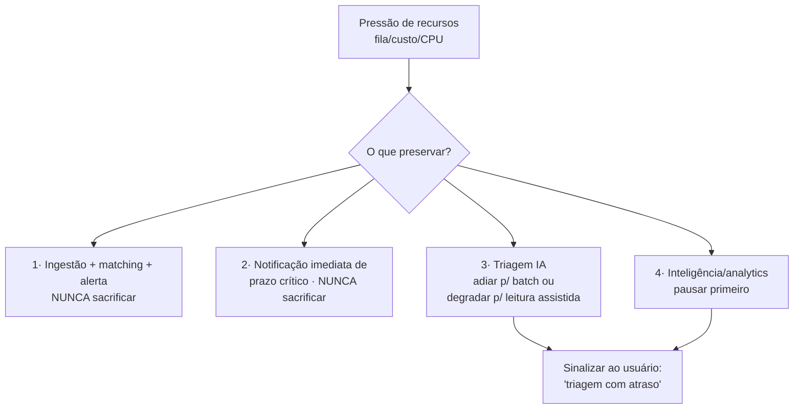
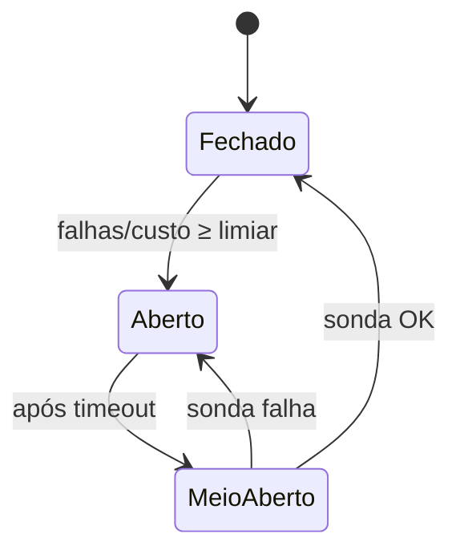

# A04 · Teste de Estresse e Resposta a Falhas

> Prova que o desenho (A01–A03) **aguenta a carga esperada** e **degrada com graça** quando algo quebra. Duas metades: (1) como estressar e o que medir; (2) o *runbook* — quando falhar, o que fazer. Os alvos derivam dos NFRs de [../docs/12](../docs/12-modelo-de-dados-e-requisitos-nao-funcionais.md); onde falta número real, é `[A VALIDAR]`.

## 1. Por que o perfil de carga deste produto é peculiar

Não é carga uniforme. Três características moldam o teste:

- **Ingestão em rajada.** O PNCP publica editais em picos (horários/dias de maior atividade), não de forma constante. O gargalo é o *burst*, não a média.
- **Triagem sob demanda e cara.** A IA (docs/10) roda quando o usuário pede, em ondas, e cada execução tem custo — estressar aqui é estressar **custo**, não só latência.
- **Fan-out do matching.** Um único edital popular pode casar com milhares de critérios e gerar milhares de alertas de uma vez.

Testar como se a carga fosse plana esconde exatamente os modos que quebram.

## 2. O que "passar" significa (critério de aceite)

A arquitetura passa no teste quando, sob a carga-alvo (§3): **mantém os NFRs** de docs/12, §3 e, sob falha injetada (§5), **degrada conforme a ordem de preservação** (§6) sem violar as regras duras — 0 vazamento cross-tenant e 0 alerta de prazo crítico perdido. Isso vira gate de release (../docs/07, §6).

## 3. Cenários de carga

| ID | Cenário | Estresse | NFR sob teste | Alvo (hipótese `[A VALIDAR]`) |
|----|---------|----------|---------------|-------------------------------|
| **S1** | Burst de publicação do PNCP | pico de editais/min em horário de pico | Frescor | p95 publicação→alerta ≤ 30 min **no pico** |
| **S2** | Reconciliação + incremental concorrentes | dupla varredura simultânea | Frescor + rate-limit da fonte | sem 429 sustentado; frescor mantido |
| **S3** | Enxurrada de triagens | N usuários pedem triagem ao mesmo tempo | Latência da triagem + custo | fila drena; custo/edital ≤ teto; **0 pedidos perdidos** |
| **S4** | Fan-out de matching | 1 edital casa com N mil critérios | Notificação + dedup | alertas sem duplicar; digest aplica o cap |
| **S5** | Soak (resistência) | carga média por horas/dias | Estabilidade | sem vazamento de memória/conexões |
| **S6** | "Pior dia" (spike + falha) | burst do PNCP **e** LLM lento juntos | Degradação graciosa | ingestão+alerta vivos; triagem degrada |
| **S7** | Anexos pesados / OCR | muitos PDFs grandes ou imagem | Storage + latência da triagem | throughput mantido; fallback de OCR (docs/10, §6) |

Os números só ficam reais depois de **medir o volume de publicação do PNCP** (P-31) — sem isso, não sabemos se o pico é 10× ou 100× a média.

## 4. Como testar

- **Tipos de teste:** *baseline* → *ramp-up* → *spike* → *soak* → *breakpoint* (achar o joelho onde os NFRs quebram).
- **Ferramenta:** gerador de carga para a API (k6/Locust/Gatling) + um simulador de ingestão. `[A VALIDAR]`
- **⚠️ Regra dura — nunca estressar a API real do PNCP.** É fonte pública oficial; martelá-la violaria o rate-limit educado (docs/03, §7) e os termos de uso (docs/02, §6). O teste usa **mock/fixtures** (respostas gravadas do PNCP) num ambiente isolado. O simulador reproduz os *bursts* sem tocar na fonte real.
- **Dados sintéticos** representativos de modalidades, valores e formatos de edital; incluir casos de isolamento (um usuário nunca vê o critério/alerta de outro — mesmo no MVP single-tenant).
- **O que medir:** latência p50/p95/p99, throughput, **profundidade das filas**, taxa de erro, DLQ, CPU/memória/conexões de banco, e **custo de IA por edital** (docs/08, §4).

## 5. Modos de falha — o que fazer quando falhar (runbook)

O coração deste documento. Para cada falha: como se detecta, o que o sistema faz sozinho, o que o humano faz.

| Falha | Detecção | Resposta automática | Ação humana (runbook) |
|-------|----------|---------------------|-----------------------|
| **PNCP fora do ar / lento** | Source-Health Monitor (A02, §5): volume/latência anômalos | Retry com backoff; degradar frescor; servir base existente | Conferir status do PNCP; comunicar se prolongado; retomar backfill ao voltar |
| **PNCP muda schema (drift)** | Validação de schema barra a gravação (A02, §4) | Parar de gravar aquela modalidade; alertar; **não gravar lixo** | Ajustar mapeamento de normalização; reprocessar janela afetada (idempotente) |
| **Fila entupida (backlog)** | Profundidade da fila acima do limiar | Autoscale de workers; **priorizar frescor sobre triagem**; DLQ para venenosas | Investigar causa; drenar DLQ; reprocessar |
| **LLM (Claude) indisponível/lento** | Timeout + taxa de erro no worker de triagem | *Circuit breaker* abre; triagem cai para **leitura assistida** (docs/10, §6); fila retém pedidos | Verificar provedor; reprocessar fila ao normalizar |
| **Custo de IA estoura o teto** | Alarme de custo/edital acima do guardrail (docs/08, §4) | *Circuit breaker de custo*: throttle de triagens; priorizar editais de alta aderência | Acionar negócio; decidir teto/plano (liga P-20) |
| **Banco sobrecarregado** | Latência de query, conexões saturadas | Throttle da ingestão; usar réplicas de leitura | Revisar índices/consultas; escalar |
| **Explosão de alertas (fan-out)** | Nº de alertas por edital muito alto | Dedup; **forçar digest**; aplicar cap por usuário (docs/11, §4) | Revisar critério ruidoso com o usuário |
| **Prompt-injection via edital** | Padrões suspeitos no conteúdo (docs/05, §4) | Tratar edital como dado; quarentena; não executar nada extraído | Acionar segurança; revisar amostra |
| **Vazamento cross-tenant** (o pior) | Alerta de acesso anômalo; teste de isolamento | **Parar o fluxo afetado**; isolar | **Incidente LGPD** (docs/05, §6): avaliar comunicação à ANPD/titulares |

## 6. Degradação graciosa — a ordem de preservação

Quando o recurso aperta, não se cai por igual: sacrifica-se de baixo para cima. O valor central é **não perder prazo** (docs/01, §1) — ele é o último a cair.

Regra: **nunca** se sacrifica o alerta de prazo crítico nem o isolamento de tenant. A inteligência (Módulo 4, *Later*) é a primeira a pausar; a triagem degrada antes de cair; a ingestão+alerta é intocável.

## 7. Padrões de resiliência aplicados

- **Idempotência** por `numeroControlePNCP` (A02, §3): retry nunca duplica.
- ***Circuit breakers*** nas integrações externas (PNCP, LLM) e um de **custo** para a IA:

- **Bulkheads:** a triagem (cara e lenta) roda em pool próprio, isolada da ingestão — saturar IA não trava a coleta.
- **DLQ + backoff:** mensagens venenosas vão para *dead-letter*; falhas transitórias recuam exponencialmente.
- **Timeouts em tudo:** nenhuma chamada externa sem prazo.

## 8. Ligação com incidentes e observabilidade

O runbook (§5) só funciona com detecção: alarmes sobre as métricas de §4 e os SLOs (docs/08). Falhas com dado pessoal escalam para o **plano de resposta a incidentes** (docs/05, §6) — que ainda é `[A VALIDAR]` e precisa definir quem é acionado e em quanto tempo (P-35).

## 9. Pendências

- Medir volume/perfil de publicação do PNCP para cargas-alvo reais (§3). `[A VALIDAR]` → P-31
- Montar mock/fixtures do PNCP; escolher ferramenta e ambiente isolado (§4). `[A VALIDAR]` → P-32, P-33
- Definir alarmes/SLO e limiares dos *circuit breakers* (fonte, LLM, custo) (§§5,7). `[A VALIDAR]` → P-34
- Runbook ligado ao plano de incidentes (§8). `[A VALIDAR]` → P-35

Rastreadas em [../docs/98](../docs/98-decisoes-e-pendencias.md).
