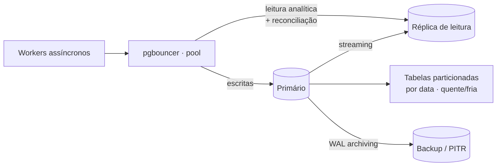

# A05 · Teste de Estresse do Banco de Dados

> Refina o [A04](04-teste-de-estresse-e-falhas.md) para a **camada de dados** (PostgreSQL, arquitetura/01, §5). O banco é o ponto de convergência: a ingestão escreve em rajada, o matching lê pesado e a triagem lê/escreve — tudo concorrente. Os cenários aqui **derivam** dos de A04, §3. Alvos sem número real são `[A VALIDAR]` (dependem de P-31).

## 1. Perfil de carga no banco

As operações que dominam e onde cada uma dói:

- **Escrita em rajada (ingestão, S1):** *upserts* em massa por `numeroControlePNCP` durante bursts → *write amplification*, manutenção de índice, contenção de lock, geração de WAL.
- **Leitura de fan-out (matching, S4):** cada novo edital cruza com milhares de critérios (ou vice-versa) → *read amplification*, risco de *sequential scan*.
- **Concorrência (S3+S1):** ingestão (escrita) + matching (leitura) + triagem simultâneos → contenção, *MVCC bloat*, pressão de autovacuum. A triagem **lê `EXTRACAO_EDITAL` do cache** (1/edital) e **escreve `TRIAGEM` por perfil** (1/edital×empresa).
- **Range scans (reconciliação, S2):** varreduras por faixa de data em tabela grande → I/O e *cache hit ratio*.
- **Crescimento (meses de editais):** tamanho de índice e tabela → latência que degrada com o volume.

## 2. Cenários de estresse do banco

Cada um mapeia um cenário de A04, §3:

| ID | Deriva de A04 | Carga no banco | Gargalo provável | Alvo (hipótese `[A VALIDAR]`) |
|----|---------------|----------------|------------------|-------------------------------|
| **DB1** | S1 burst | upsert em massa de editais | lock / índice / WAL | throughput de escrita sustenta o frescor (≤ 30 min) |
| **DB2** | S4 fan-out | matching 1 edital × N mil critérios | plano de query, índices | p95 do matching < alvo; **sem seq scan** |
| **DB3** | S3 triagens | *lookup* de `EXTRACAO_EDITAL` (cache, 1/edital) + escrita de `TRIAGEM` por perfil | pool de conexões, lock | *cache hit* alto na extração; pool não satura |
| **DB4** | S2 reconciliação | range scan por data | I/O, cache | usa índice de data, não *scan* sequencial |
| **DB5** | S5 soak | carga contínua por horas | bloat, autovacuum, conexões | *dead tuples* e *bloat* estáveis; sem vazar conexão |
| **DB6** | crescimento | volume 10× acumulado | tamanho de índice/tabela | queries constantes com dados 10× (particionamento) |
| **DB7** | isolamento (Next) | filtro por `tenantId` sob carga | overhead de RLS, índice composto | isolamento sem degradar p95 |

## 3. O que o teste valida no schema (documento 12)

- **Índice único** em `numeroControlePNCP` — sustenta o *upsert* idempotente (arquitetura/02, §3).
- **Índices de matching:** `dataPublicacao`, `modalidadeCodigo`, `uf/regiao`, faixa de `valorEstimado`; **GIN/tsvector** para o full-text do objeto em `EXTRACAO_EDITAL` (documento 11, §5).
- **Índice composto `(clienteFinalId, …)`** nas tabelas de dado de cliente — `ALERTA`, `TRIAGEM`, `CRITERIO_MONITORAMENTO` (documento 05, §3) — pré-requisito do isolamento (DB7); o catálogo (`EDITAL`, `EXTRACAO_EDITAL`) é **global**, sem `tenantId`.
- **Split cache/aderência:** `EXTRACAO_EDITAL` 1:1 com edital (chave `editalId`, JSON pesado em `TOAST`) e `TRIAGEM` com único `(editalId, perfilId)` — é o que sustenta o cache (DB3).
- **`AUDIT_LOG`** *append-only*, particionado por data (documento 05, §3).
- **Particionamento por range de `dataPublicacao`** — escrita/purga eficientes e queries de editais recentes rápidas; partições frias arquiváveis (DB6).
- **Fan-out reverso (DB2):** dado um edital, achar critérios que casam é o inverso do padrão comum. No MVP, varrer critérios com filtros indexados; em escala, avaliar abordagem tipo *percolator* (matching reverso). `[A VALIDAR]`

## 4. O que medir

p95/p99 de query; throughput de escrita (linhas/s); **profundidade de locks/waits**; *cache hit ratio* (`shared_buffers`); *lag* e trabalho do autovacuum; *dead tuples* / bloat; saturação do **pool de conexões**; taxa de geração de WAL; *temp files* (queries que estouram `work_mem`); e, se houver réplica, *replication lag*.

## 5. Modos de falha do banco — o que fazer quando falhar

| Falha | Detecção | Resposta automática | Ação humana (runbook) |
|-------|----------|---------------------|-----------------------|
| **Pool de conexões esgotado** | erros de conexão, fila de espera | `pgbouncer` limita; *backpressure* na ingestão | achar query lenta segurando conexão; subir pool com cautela |
| **Lock contention no upsert** (DB1) | *lock waits* altos | lotes menores; `ON CONFLICT` enxuto; retry idempotente | reduzir escopo da transação; revisar ordem de escrita |
| **Matching vira seq scan** (DB2) | *seq scan*, p95 explode | `statement_timeout` corta a query | criar/ajustar índice; `ANALYZE`; reescrever query |
| **Autovacuum não acompanha** (DB5) | *dead tuples*, bloat, tabela crescendo | tuning de autovacuum; *throttle* de escrita | vacuum manual; ajustar thresholds por tabela |
| **I/O saturado** (DB4) | *IO wait*, *temp files* | *throttle*; ler de réplica | escalar IOPS; particionar; subir `work_mem` |
| **Réplica com lag** | *replication lag* > limiar | rotear leitura crítica ao primário | investigar carga/rede da réplica |
| **Índice/tabela grande demais** (DB6) | tamanho, latência subindo | particionamento ativo | arquivar partições frias; remover índice não usado |
| **Hot partition / hot row** | contenção num registro/partição | — | rever design (ex.: contador agregado, sharding de chave) |
| **Falha de nó / corrupção** | health check, checksums | *failover* para standby | *restore* PITR (WAL archiving); RCA |

## 6. Estratégias PostgreSQL aplicadas

- **Upsert em lote** com `ON CONFLICT (numeroControlePNCP) DO UPDATE` — idempotência que torna retry seguro (arquitetura/02).
- **Connection pooling (`pgbouncer`)** — obrigatório com workers assíncronos; sem ele o pool satura em DB3.
- **Particionamento por range de data** — casa com o padrão "escreve o novo, lê o recente, arquiva o velho".
- **Índices parciais/compostos + GIN** para matching (documento 11, §5); `statement_timeout` e `lock_timeout` para uma query ruim não travar tudo.
- **Réplicas de leitura** para Inteligência de Mercado (*Later*) e reconciliação — *bulkhead* no nível de dados, isolando análise do caminho de escrita (espelha A04, §7).
- **Backup contínuo / PITR** (arquivamento de WAL) para recuperação.

## 7. Ligação com A04 e critério de aceite

Estes cenários detalham a linha "**Banco sobrecarregado**" do runbook de A04 (§5) e a degradação de A04 (§6): sob pressão, faz-se *throttle* da **escrita** (ingestão) para preservar a **leitura** que serve o alerta de prazo — coerente com a ordem de preservação (nunca sacrificar o alerta crítico). O banco "passa" quando sustenta os NFRs de DB1–DB5 sob a carga-alvo e degrada como em §5 sob falha. Compõe o gate de release junto com A04 (documento 07, §6).

## 8. Pendências

- Estratégia de particionamento (por data e/ou tenant) e política de arquivamento. `[A VALIDAR]` → P-39
- Abordagem de fan-out reverso do matching em escala (scan vs. percolator). `[A VALIDAR]` → P-40
- *Sizing* do pool de conexões e limites de `statement_timeout`/`work_mem`. `[A VALIDAR]` → P-41
- Quando introduzir réplicas de leitura e o que roteia para elas. `[A VALIDAR]` → P-42

Rastreadas em [../docs/98](../docs/98-decisoes-e-pendencias.md).
