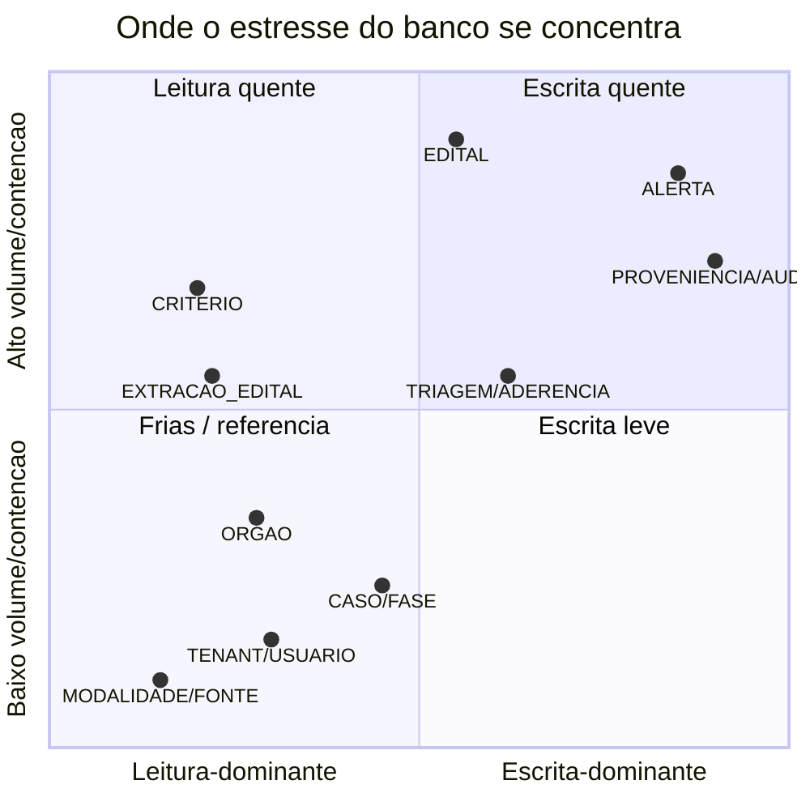

# A06 · Perfil de Estresse por Tabela

> Drill-down do [A05](05-stress-test-banco.md) para o nível de **tabela**. Estágio: **Concepção** — não há banco ainda, então isto é **caracterização de design** (padrão de acesso, volume, ponto de dor), não teste executado. O objetivo é discriminar: **quais tabelas realmente doem** e quais não precisam de estresse. As tabelas vêm do modelo do documento 12 e do modelo físico de A03, §4.

## 1. Faz sentido testar "cada" tabela? Não — só as quentes

A maioria das tabelas deste sistema é **pequena, de referência ou de baixo tráfego** e não justifica stress test: `MODALIDADE` (tabela de domínio, ~poucas linhas), `FONTE`, `ORGAO` (cresce devagar, leitura-quase-só), `TENANT`/`USUARIO`/`PERFIL_HABILITACAO` (poucas no MVP single-tenant), `CASO`/`FASE`/`RESULTADO` (Módulos 3/4, *Next/Later*, volume inicial baixo).

O estresse se concentra em **poucas tabelas**, e é nelas que o esforço vale. Testar as frias seria cerimônia sem retorno.

## 2. Onde o estresse se concentra

## 3. Tabelas quentes (as que merecem stress test)

| Tabela | Padrão dominante | Volume / crescimento | Ponto de dor | Estratégia | Cenário (A05) |
|--------|------------------|----------------------|--------------|------------|---------------|
| **EDITAL** | escrita em rajada + leitura pesada de matching | alto; cresce sem parar | *upsert* sob lock; seq scan no matching; tamanho de índice | único em `numeroControlePNCP`; índices de matching + GIN; **partição por `dataPublicacao`** | DB1, DB2, DB6 |
| **ALERTA** | **escrita explosiva** (fan-out) | alto; N mil por edital popular | *write amplification*; bloat de índice | inserção em lote; partição + **retenção**; dedup a montante (documento 11, §4) | DB2 (fan-out) |
| **CRITERIO_MONITORAMENTO** | leitura quente (alvo do fan-out) | moderado em linhas, lido a cada ingestão | seq scan se mal indexado | índices para filtros estruturados; avaliar *matching reverso* (P-40) | DB2 |
| **EXTRACAO_EDITAL** | leitura quente (cache), 1 por edital | moderado; cresce com editais | JSON grande (`requisitos`, `citacoes`) | `TOAST`; cache de leitura | DB3 |
| **TRIAGEM** (aderência) | escrita por perfil, 1 por edital×empresa | cresce com editais × empresas | contenção de pool; volume > 1/edital | pool dedicado (bulkhead); único `(editalId, perfilId)` | DB3 |
| **PROVENIENCIA / AUDIT_LOG** | **append-only**, escrita a cada ingestão e a cada acesso a dado pessoal | muito alto; cresce continuamente | crescimento ilimitado; I/O de escrita | *append-only*; **partição por data + arquivamento**; nunca no caminho de leitura crítico | DB1, DB5 |

## 4. Tabelas frias (o que NÃO estressar, e por quê)

- `MODALIDADE`, `FONTE` — tabelas de referência; cabem em cache; leitura trivial.
- `ORGAO` — cresce, mas devagar e é leitura-quase-só; um índice por CNPJ basta.
- `TENANT`, `USUARIO`, `PERFIL_HABILITACAO` — poucas linhas no MVP; viram quentes só com escala de contas (revisitar no *Next*).
- `CASO`, `FASE`, `RESULTADO` — Módulos 3/4 (*Next/Later*); volume baixo no início. Reavaliar quando entrarem.

Regra: uma tabela entra na lista quente quando **rajada de escrita**, **fan-out** ou **crescimento ilimitado** aparece. Nenhuma das frias tem isso hoje.

## 5. Modos de falha específicos das tabelas quentes

Complementa o runbook de A05, §5:

- **ALERTA infla o índice** no fan-out → índice fragmentado degrada inserção. *O que fazer:* inserção em lote, `REINDEX`/partição, e cortar fan-out a montante (dedup + digest, documento 11, §4).
- **EDITAL vira seq scan** conforme cresce → matching estoura p95. *O que fazer:* partição por data mantém o "recente" quente; `ANALYZE` frequente; índice parcial para editais ativos.
- **PROVENIENCIA/AUDIT crescem sem teto** → disco e vacuum sofrem. *O que fazer:* partição por data + **arquivamento/retenção** (liga documento 05, §5); jamais consultá-las no caminho do alerta.
- **CRITERIO sem índice adequado** → cada ingestão custa caro. *O que fazer:* índices compostos por filtro; se o volume de critérios explodir, matching reverso (P-40).

## 6. Ressalva de honestidade

Todo "alto/moderado" aqui é **qualitativo** — não há volumetria real. O que torna `EDITAL`/`ALERTA` "quentes" é o *padrão* (rajada, fan-out, append-only), que independe de número. Mas os **alvos** e a decisão de partição só fecham medindo o volume de publicação do PNCP (**P-31**) e a distribuição de fan-out real. Sem isso, este doc orienta o design, não dimensiona a infra.

## 7. Pendências

- Retenção/arquivamento das tabelas append-only e de alto crescimento (`EDITAL`, `ALERTA`, `PROVENIENCIA`, `AUDIT_LOG`). `[A VALIDAR]` → P-44
- Volumetria real por tabela quente para fixar alvos e partição (depende de P-31 e P-39).

Rastreadas em [../docs/98](../docs/98-decisoes-e-pendencias.md).
