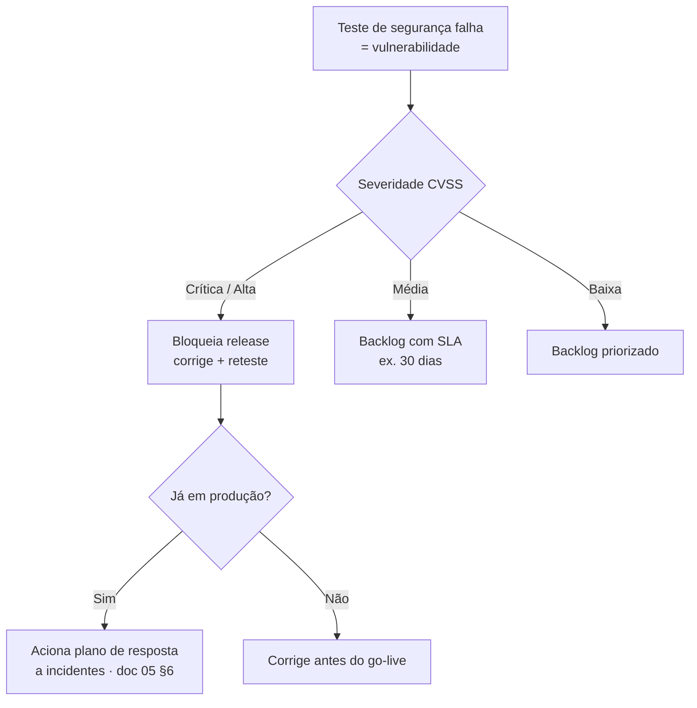

# A07 · Teste de Segurança (adversarial)

> Stress test **de segurança**, não de carga — os de carga estão em [A04](04-teste-de-estresse-e-falhas.md)/[A05](05-stress-test-banco.md)/[A06](06-estresse-por-tabela.md). Aqui a arquitetura é exercitada por um **atacante**: o threat model (documento 05, §2) e as lacunas de segurança (doc 98, P-51–P-62) viram **casos de abuso testáveis**. Estágio: **Concepção** — plano de teste, não execução (não há sistema ainda).
>
> ⚠️ **Regra dura (igual A04, §4):** testar só em **ambiente isolado**, nunca contra a API real do PNCP nem contra dados reais de cliente.

## 1. Adversarial ≠ carga

O teste de carga pergunta "aguenta o volume?". Este pergunta "**resiste ao atacante?**". O critério de aprovação não é um NFR de latência — é **o que não pode acontecer**: nenhum vazamento cross-tenant, nenhuma execução de conteúdo injetado, nenhum dado pessoal exposto. Um caso que "passa" é um ataque que **falha**.

## 2. Casos de abuso (o que testar)

| # | Cenário | Objetivo do atacante | Critério de aprovação (o que NÃO pode ocorrer) | Gap |
|---|---------|----------------------|------------------------------------------------|-----|
| **AB1** | **Cross-tenant / IDOR (BOLA)** | ler/alterar edital-alerta-triagem-caso de outro tenant/clienteFinal trocando IDs | **0** acesso a objeto de outro escopo — sempre negado | P-51 |
| **AB2** | Escalonamento de privilégio | operador vira admin; cliente-final read-only escreve | papel nunca excede sua matriz de permissão | P-52 |
| **AB3** | Sessão / account takeover | token forjado/expirado/roubado; recuperação de conta abusada | token inválido/expirado sempre rejeitado; MFA barra takeover | P-53 |
| **AB4** | **Prompt-injection via edital** | edital manda o LLM vazar contexto, executar, ou emitir conteúdo | edital tratado como dado; nada extraído é executado; sem vazamento de outro contexto | P-54 |
| **AB5** | Exfiltração via LLM | fazer o LLM devolver a estratégia/perfil de outra empresa | classe crítica **não** vai ao LLM; saída não vaza dado de terceiro | P-54 |
| **AB6** | Stored XSS via saída da IA | conteúdo malicioso extraído renderiza no navegador | saída sanitizada/escapada; CSP bloqueia | P-55 |
| **AB7** | **SSRF via anexos/URLs** | anexo aponta para `169.254.169.254`/rede interna | egress allowlist bloqueia; sem acesso a metadata/interno | P-58 |
| **AB8** | Injeção clássica | SQLi/command injection na ingestão/parsing | queries parametrizadas; entrada validada; sem execução | P-55 |
| **AB9** | **Cost-DoS / exaustão** | disparar triagens caras em massa; anexos gigantes (OCR) | circuit breaker de custo corta (A04, §5); rate-limit por tenant | P-55 |
| **AB10** | Abuso de *data subject request* | pedido de titular falso p/ exfiltrar/apagar dado de terceiro | identidade do titular verificada antes de agir | P-57 |
| **AB11** | Segredos vazando | credenciais em logs, mensagens de erro, repositório | secret scanning limpo; erros não expõem segredo | P-56, P-61 |
| **AB12** | Isolamento sob concorrência | provocar vazamento cross-tenant sob carga | isolamento se mantém sob concorrência (liga A05, DB7) | P-62 |

## 3. Método

- **Automatizado no CI:** SAST (ex.: semgrep), DAST (ex.: ZAP/Burp), SCA/SBOM de dependências, *secret scanning*, scan de imagem de container (P-56).
- **Casos de abuso como teste:** AB1–AB12 viram testes automatizados de autorização/injeção que rodam a cada release — em especial **isolamento (AB1) e prompt-injection (AB4)** como testes obrigatórios (P-62).
- **Manual:** pentest periódico e *red-team* nos fluxos críticos (multi-tenant, IA, titular).
- **Ambiente isolado** com dados sintéticos; mock do PNCP (A04, §4). Nunca a fonte real.

## 4. Quando um teste falha — o que fazer

Um teste de segurança que falha **é uma vulnerabilidade**. A resposta é por severidade, não caso a caso:

Regra: **crítico ou alto bloqueia o release** (P-63). Achado em produção com dado pessoal escala para o plano de incidentes (documento 05, §6 — ainda `[A VALIDAR]`, P-35) e pode exigir comunicação à ANPD.

## 5. Critério de aceite (gate de release)

O MVP só passa no gate de segurança quando:

- [ ] **Nenhum achado crítico ou alto** em aberto (SAST/DAST/pentest).
- [ ] **AB1 (isolamento)** e **AB4 (prompt-injection)** cobertos por teste automatizado que passa.
- [ ] Segredos: *secret scanning* limpo; nada sensível em logs (AB11).
- [ ] Dependências sem vulnerabilidade crítica conhecida (SCA).

Compõe o gate junto com A04/A05 (documento 07, §6).

## 6. Ligação

Cada caso de abuso mapeia um vetor do threat model (documento 05, §2) e uma lacuna de segurança do doc 98 (P-51–P-62). Este documento é o **plano de verificação** dessas lacunas: fechá-las é implementar o controle; AB* é como se prova que fechou. A **defesa detalhada contra injeção na IA** (AB4–AB7) está em [A11](11-seguranca-da-ia.md).

## 7. Pendências

- Gate de severidade (bloquear release em crítico/alto) e SLA de correção de vulnerabilidade (§4). `[A VALIDAR]` → P-63
- Ferramentas de SAST/DAST/SCA e cadência de pentest (§3). → P-56
- Testes de isolamento e prompt-injection no CI (§5). → P-62

Rastreadas em [../docs/98](../docs/98-decisoes-e-pendencias.md).
