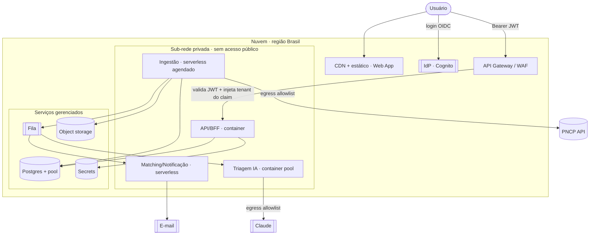

# A08 · Infraestrutura e Implantação

> O que o projeto **precisa de infra**: o modelo de compute por workload (serverless, containers, gerenciados) e seus equivalentes entre provedores. Complementa a stack de [A01, §5](01-visao-arquitetural.md) e a topologia de dados de [A05](05-stress-test-banco.md). Estágio: **Concepção**. Runtime/linguagem ([P-27](../docs/98-decisoes-e-pendencias.md)), modelo de compute + **provedor default AWS** ([P-64](../docs/98-decisoes-e-pendencias.md)), **região Brasil/SP** ([P-28](../docs/98-decisoes-e-pendencias.md)) e **IaC/CI-CD** ([P-65](../docs/98-decisoes-e-pendencias.md)) **confirmados** (2026-07-05); segue `[A VALIDAR]` só a residência do LLM + DPA de sub-operador ([P-66](../docs/98-decisoes-e-pendencias.md)/[P-54](../docs/98-decisoes-e-pendencias.md)).

## 1. Princípio de escolha

O compute não é uma decisão única — cada workload tem um perfil, e o perfil escolhe o modelo:

- **Serverless** (funções/jobs) para o que é **bursty, agendado ou de cola** e fica **ocioso** entre execuções — paga por uso, escala com o pico, custa ~zero parado.
- **Container gerenciado** para o que é **sempre-ligado** ou precisa de **pool controlado** (concorrência, custo, long-running).
- **Serviço gerenciado** para **estado** (banco, fila, storage, segredos) — comprar, nunca operar.

Regra de ouro: **serverless para o pico e a cola; container para o sempre-ligado e o pool; gerenciado para o dado.** Nada de Kubernetes ou VM crua no MVP (§10).

## 2. Modelo de compute por workload

Mapeando os contêineres de A01/A03:

| Workload | Perfil | Modelo recomendado | Por quê |
|----------|--------|--------------------|---------|
| **Web App (SPA)** | estático | **CDN + object storage** | sem compute; cache na borda |
| **API / BFF** | sempre-ligado, baixa latência | **Container gerenciado** | monólito modular num deploy só; escala horizontal |
| **Ingestão + scheduler** | agendado, bursty, ocioso entre polls | **Serverless (job agendado)** | paga o pico do PNCP, ~zero parado — encaixe perfeito |
| **Matching / Notificação** (consumidores de fila) | orientado a evento, leve | **Serverless (fila→função)** | escala com fan-out; sem servidor ocioso |
| **Triagem / IA** | long-running, caro, precisa de **pool** | **Container (pool limitado)** | *bulkhead* + teto de concorrência controlam custo (A04/A05, P-20); evita timeout de função |
| **Source-Health Monitor** | agendado, leve | **Serverless agendado** | idem ingestão |

Observação: no MVP monólito modular (A01, §2), API e workers podem coabitar um deploy; a tabela mostra o **destino** quando cada um justificar isolamento.

**Confirmado (P-64, 2026-07-05):** o modelo de compute por workload é a tabela acima; **provedor default do MVP = AWS** — o conjunto de gerenciados mais completo (§§3–4, todos de 1ª classe), `sa-east-1` em SP atende a residência (§7, P-28), e o **Bedrock** dá um caminho de Claude com controle de região/DPA que alimenta P-66. Mapeamento AWS: API/BFF+Triagem-pool → **Fargate/App Runner**; ingestão/matching/notificação/health → **Lambda + EventBridge Scheduler + SQS**; Postgres → **RDS + RDS Proxy**; blob → **S3**; segredos → **Secrets Manager**. As primitivas de §4 são portáveis: a escolha é *default operacional*, não lock-in estratégico (§10).

## 3. Serviços gerenciados (comprar, não operar)

| Serviço | Papel | Nota |
|---------|-------|------|
| **Postgres gerenciado** | base normalizada (A05) | **com pool** (pgbouncer/proxy) — serverless + Postgres explode conexões sem ele (P-41) |
| **Fila gerenciada** | eventos entre módulos (A03, §3) | retries + DLQ nativos |
| **Object storage** | editais/anexos (A02, §6) | já é serverless por natureza |
| **Secrets manager** | segredos, rotação (P-08) | nunca segredo no código (05, §4) |
| **Provedor de identidade (IdP)** | autenticação de usuário, emissão de token OIDC/JWT, MFA (P-08) | **default do MVP = Cognito** (User Pools); a borda valida o JWT e o BFF deriva o `tenantId` de **claim verificado**, nunca de header do cliente (05, §4; P-51). Operação (sessão/MFA/recuperação) em P-53 |
| **LLM (Claude)** | triagem (10) | API direta **ou** via nuvem (Bedrock/Vertex) — decisão de residência/DPA (P-54, P-66) |
| **E-mail transacional** | alertas/digest | entregabilidade |

### Object storage — tiering e retenção (S3, P-30/P-44)

**Tiering:** nativo via S3, sem código de aplicação. Bucket de anexos (`radar-editais-{env}`) configurado com **S3 Intelligent-Tiering** ou duas lifecycle rules:

1. `Standard → Glacier Instant Retrieval` após janela parametrizada de não-acesso, derivada da matriz de retenção (docs/05, §5; P-05/P-44 resolvidas) e ajustada por configuração de lifecycle.
2. `Glacier Instant → Deep Archive` para editais terminais que nunca mais serão lidos.

**Decisão de design (RAD-121):** sem SDK customizado de zip+manifesto — o overhead por objeto só vira custo relevante em dezenas de milhões de objetos com perfil arquivar-e-quase-nunca-restaurar. Para o volume do MVP, Intelligent-Tiering cobre sem complexidade de restore assíncrono ou expurgo-sobre-zip (crítico para P-30/LGPD).

**Expurgo LGPD:** `AplicarRetencaoUseCase` chama `ObjectStorage.deletar()` por chave para remoção individual de objetos — não há consolidação em zip, então o expurgo é atômico e não precisa descompactar (RAD-101, P-30).

## 4. Equivalentes por provedor (evitar lock-in)

Escolher **primitivas portáveis** (container OCI, Postgres, fila, blob) mantém a opção aberta:

| Primitiva | AWS | Google Cloud | Azure |
|-----------|-----|--------------|-------|
| Container gerenciado | Fargate / App Runner | Cloud Run | Container Apps |
| Função serverless | Lambda | Cloud Functions / Run Jobs | Functions |
| Agendador | EventBridge Scheduler | Cloud Scheduler | Timer trigger |
| Postgres gerenciado | RDS / Aurora | Cloud SQL / AlloyDB | DB for PostgreSQL |
| Pool de conexão | RDS Proxy | Auth Proxy / pgbouncer | pgbouncer (Flexible) |
| Fila | SQS | Pub/Sub | Service Bus |
| Object storage | S3 | Cloud Storage | Blob |
| Secrets | Secrets Manager | Secret Manager | Key Vault |
| Identidade (IdP, OIDC/JWT) | Cognito | Identity Platform | Entra External ID |
| CDN + estático | CloudFront + S3 | Cloud CDN + GCS | Front Door + Blob |
| LLM (Claude) | Bedrock | Vertex AI | (API Anthropic direta) |
| E-mail | SES | (SendGrid/Mailgun) | Communication Services |
| **Região Brasil** | sa-east-1 (SP) | southamerica-east1 (SP) | Brazil South (SP) |

## 5. Topologia de implantação

Pontos de segurança embutidos: workers e banco em **sub-rede privada** (sem IP público); **egress allowlist** nas saídas para PNCP e LLM (defesa de SSRF, P-58); WAF/gateway na borda (P-55). **Autenticação na borda (P-08):** o cliente faz login no **IdP (Cognito)** e apresenta um **JWT OIDC**; o GW valida assinatura/expiração e o BFF deriva `tenantId` (e `clienteFinalId` no Next) de **claim verificado do token** — nunca de header controlado pelo cliente. Requisição sem token válido é rejeitada na borda; o `x-tenant-id` que o BFF lê hoje é **placeholder de desenvolvimento** e não é fonte de autoridade em produção. Fecha a dimensão de autenticação de P-51 (anti-BOLA).

## 6. Ambientes, IaC e CI/CD

**Confirmado (P-65, 2026-07-05).** Implementação (workflows + módulos Terraform) delegada em **RAD-34**; o scaffold de IaC depende do provisionamento da conta AWS (dependência externa).

- **Ambientes separados** dev / staging / prod (documento 05, §4) — isolados em **contas AWS distintas** (Organizations).
- **IaC = Terraform** (não Pulumi no MVP: evita acoplar a infra a um runtime de linguagem; Terraform é declarativo, tem o maior ecossistema de providers e casa com as *primitivas portáveis* de §4). Estado remoto versionado com lock (S3 + DynamoDB); **nada clicado no console** (P-65). Módulos estruturados por primitiva (§4) para conter troca de provedor.
- **CI/CD (GitHub Actions)** com os gates, nesta ordem: `build`/`typecheck`/`lint` (inclui **boundary check** do monorepo, A10 §2 / P-69) → testes unitários/integração → **stress** (A04/A05) → **segurança** (A07 — crítico/alto **bloqueia**, P-63) → scan de imagem (P-56) → `terraform plan`/`apply` por ambiente.
- Imagens de container escaneadas (P-56); segredos vêm do **Secrets Manager**, nunca do pipeline.

## 7. Rede e residência de dados

- **Região Brasil / São Paulo** — **confirmado** (P-28, 2026-07-05): latência + residência LGPD dos dados pessoais e da estratégia comercial do cliente. No provedor default (AWS) = `sa-east-1`; os três provedores têm região em SP (§4), preservando a portabilidade. Dado em repouso e compute ficam na região; nada de dado pessoal/estratégico sai do país **exceto** o recorte enviado ao LLM (abaixo).
- O ponto sensível é o **LLM**: a API direta da Anthropic pode processar fora do Brasil; via **Bedrock/Vertex** há mais controle de região e o provedor de nuvem entra como sub-operador com DPA — decisão de P-54/P-66. Reforça **não enviar a classe crítica** ao LLM.
- Sub-redes privadas, egress allowlist, sem banco público (§5, liga segurança A07).

## 8. Custo

Pay-per-use do serverless favorece o MVP (volume baixo/bursty; ingestão ociosa custa ~zero). Os custos de base são os **gerenciados** (Postgres, storage) e, sobretudo, o **LLM** — que é guardrail de unidade econômica (P-20, documento 08, §4), não linha de infra comum. *Scale-to-zero* onde der (ingestão, health); pool com teto na triagem.

## 9. Linguagem por tier (deriva do compute)

O modelo de compute (§2) **decide a linguagem**. O gargalo é sempre externo — PNCP, Claude, Postgres — e o trabalho é **I/O-bound**; logo a linguagem da app não é o teto de throughput. O que discrimina é ergonomia com a SPA, riqueza do SDK do LLM e o **cold start** dos workers serverless (que o [A09](09-teste-de-elasticidade-infra.md) vai medir).

A topologia deste doc espalha os workloads por **três modelos de compute**: estático/edge (SPA), container long-running (API/BFF, Triagem-pool) e **função serverless com cold start** (ingestão, matching, notificação, health). A linguagem que cobre os três com suporte de 1ª classe é uma só:

**MVP: TypeScript, linguagem única, um deploy** (monólito modular, [A01 §2](01-visao-arquitetural.md)). É a única que é ao mesmo tempo a linguagem nativa da SPA, roda como container quente (BFF, Triagem) **e** é runtime serverless de cold start baixo (Lambda/Cloud Functions/Run) para os workers bursty. Reforços: SDK Anthropic de 1ª classe na Triagem ([A03 §6](03-desenho-da-solucao.md)); SQL tipado/parametrizado contra SQLi ([AB8](07-teste-de-seguranca.md)); Zod na validação de borda/ACL ([A02 §4](02-ingestao-pncp.md)).

| Tier | Compute (§2) | Linguagem |
|------|--------------|-----------|
| SPA | CDN/edge | **TypeScript** |
| API/BFF | container quente | **TypeScript** (pareia tipos com a SPA) |
| Triagem/IA | container pool | **TypeScript** (Python se OCR/eval exigir) |
| Ingestão / Matching / Notificação | **serverless** | **TS no MVP → Go no seam** (melhor cold start + imagem mínima/CVE no tier exposto a SSRF, [AB7](07-teste-de-seguranca.md)) |
| Eval de IA (offline) | CI | **Python** ([P-18](../docs/98-decisoes-e-pendencias.md)) |

**Consequência da escolha serverless (§2):** ela **desfavorece JVM/.NET** como linguagem única — cold start de segundos nas funções bursty sem GraalVM/SnapStart (complexidade que não se paga no MVP). E **eleva Go** ao runtime infra-ótimo do tier serverless de ingestão/matching *quando* o seam de [doc 13 §6](../docs/13-dominios-e-bounded-contexts.md) abrir — gatilho **medido** pelo [A09](09-teste-de-elasticidade-infra.md) + volume real do PNCP ([P-31](../docs/98-decisoes-e-pendencias.md)), não decisão de hoje. Do ponto de vista de infra, **Python é o mais fraco no fabric** de workers (cold start e imagem maiores, sem tipos com a SPA) e fica escopado a OCR/eval. Decisão registrada em P-27.

## 10. O que NÃO usar agora (e por quê)

Tão importante quanto o que usar:

- **Kubernetes** — overhead operacional que um time em concepção não justifica; container gerenciado (Cloud Run/Fargate) entrega 90% do valor com 10% da operação. Revisitar só com escala/organização que exijam.
- **VM crua** — reintroduz patching, hardening e escala manual que os gerenciados removem.
- **Multi-cloud ativo** — complexidade dupla sem retorno no MVP; a portabilidade (§4) é *seguro*, não estratégia de rodar em dois ao mesmo tempo.
- **Postgres/fila auto-hospedados** — operar estado é onde mais se erra em segurança e disponibilidade.

## 11. Pendências

- Runtime/linguagem: **TS-first** com seam para Go (§9) — **confirmado** (P-27, 2026-07-05).
- Modelo de compute por workload (§§2,4) e **provedor default do MVP = AWS** — **confirmado** (P-64, 2026-07-05): a tabela de §2 é o alvo; primitivas portáveis (§4) mantêm o exit aberto.
- Região e residência de dados (§7): **Brasil / São Paulo** — **confirmado** (P-28, 2026-07-05). A residência do **LLM** e o DPA de sub-operador seguem em P-66/P-54/P-80 (Jurídico+Eng).
- IaC = **Terraform**, ambientes **dev/staging/prod** isolados, pipeline CI/CD com gates (§6) — **confirmado** (P-65, 2026-07-05); implementação do CI + IaC scaffold delegada (RAD-34).
- Cofre de segredos + provedor de identidade (§§3,5) — **confirmado** (P-08, 2026-07-05): cofre = **AWS Secrets Manager** (rotação nativa; segredo nunca no código/pipeline, §6) e IdP = **Amazon Cognito** (User Pools; OIDC/JWT; `sa-east-1`, P-28), no default AWS de "comprar, não operar" (§1) e portável pelo padrão OIDC (§4). Invariante: a borda valida o JWT e o `tenantId` vem de **claim verificado**, nunca de header do cliente — o `x-tenant-id` do BFF é placeholder de dev. Escolha (Pré-dev) separada da **operação de identidade** — expiração/revogação de sessão, MFA obrigatório, brute-force, recuperação de conta — que segue em **P-53** (Pré-lançamento, sobre este mesmo IdP).

Rastreadas em [../docs/98](../docs/98-decisoes-e-pendencias.md).
