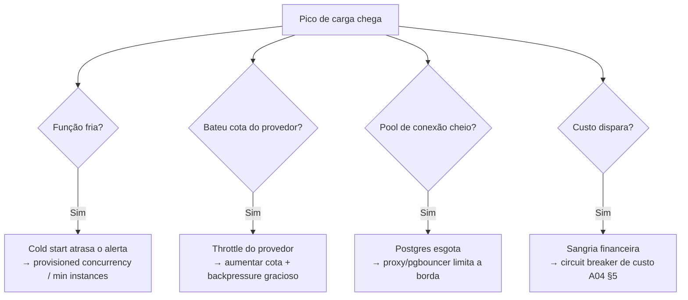

# A09 · Teste de Elasticidade e Limites da Infra

> Stress test da **camada de infra** (A08) — só o que [A04](04-teste-de-estresse-e-falhas.md) (sistema) e [A05](05-stress-test-banco.md) (banco) **não** cobrem. Aqueles assumem que a infra escala; **aqui testamos essa premissa**. Doc **enxuto de propósito**: se um cenário já está em A04/A05, ele não se repete aqui.

## 1. O que é novo aqui

A04 mede a aplicação sob volume; A05, o Postgres por dentro. Nenhum testa o comportamento do **modelo de compute escolhido** (A08): funções que esfriam, cotas do provedor, atraso de autoscale, o pool na borda serverless↔banco, e o custo que sobe com o pico. É isso — e só isso — que este doc cobre.

## 2. Cenários de elasticidade

| ID | O que testa | Risco específico de infra | Alvo (hipótese `[A VALIDAR]`) |
|----|-------------|---------------------------|-------------------------------|
| **EL1** | **Cold start vs frescor** | função de matching/notificação ociosa esfria; no burst, o *cold start* atrasa o alerta | frescor ≤ 30 min **mesmo com cold start** (documento 12) |
| **EL2** | **Cota/limite do provedor** | concorrência de função, throughput da fila, rate do API GW batem no teto do provedor | operar abaixo da cota + pedido de aumento aprovado; *throttle* nunca silencioso |
| **EL3** | **Lag de autoscale** | o pico chega antes de o pool de containers (triagem) subir | *min capacity* + pré-aquecimento absorvem o degrau |
| **EL4** | **Pool na borda serverless↔banco** | fan-out serverless abre N conexões e esgota o Postgres (liga P-41, A05 DB3) | proxy/pgbouncer limita; conexões estáveis sob fan-out |
| **EL5** | **Custo sob carga (stress financeiro)** | pay-per-use + IA escalam a **conta** com o pico, sem "quebrar" nada | dentro do teto (P-20); *circuit breaker* de custo dispara (A04, §5) |
| **EL6** | **Failover AZ/região** | perda de AZ/nó gerenciado | multi-AZ; RTO/RPO cumpridos (liga P-60) |

## 3. Quando falhar — o que fazer

Nota: o custo é o modo de falha **mais traiçoeiro da infra elástica** — nada cai, o serviço fica de pé, e a conta cresce. O breaker de custo (A04, §5) e o alarme de negócio (P-38) são a rede.

## 4. Método

Mesmo ambiente isolado e mock do PNCP do A04 (§4) — nunca a fonte real. O que se mede além de A04/A05: **p95 de cold start**, *throttles* do provedor, conexões abertas na borda, **custo por hora sob carga** e tempo de failover. Ferramenta e cargas dependem de P-31 (volume real) e P-33 (ferramenta).

## 5. Critério de aceite e ligação

Compõe o gate de release junto com A04/A05/A07 (documento 07, §6): os NFRs (frescor, custo) se mantêm **com o modelo de compute real** — cold start, cotas e autoscale incluídos —, não só na aplicação isolada. Se atingir o teto do provedor ou o custo estourar, é falha de elasticidade, tratada em §3.

## 6. Pendências

- Cold start vs frescor: *provisioned concurrency* / *min instances* e seu trade-off de custo (EL1). `[A VALIDAR]` → P-67
- Mapear cotas/limites do provedor (concorrência, fila, API GW) e os pedidos de aumento (EL2). `[A VALIDAR]` → P-68

Rastreadas em [../docs/98](../docs/98-decisoes-e-pendencias.md).
