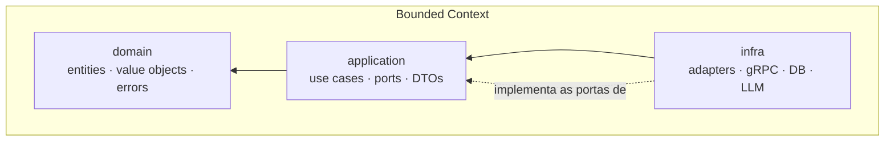

# A10 · Padrões de Projeto e Estrutura de Código (Clean Architecture)

> Como o código é organizado: **Clean Architecture por bounded context** (documento 13), num **monorepo**, com camadas **domain / application / infra**, **value objects**, **use cases** e **erros customizados**. Comunicação: **eventos** dentro do monólito (A03) — mantém o que já se tem; **gRPC** só para chamada **síncrona cross-domain**. Linguagem: **TypeScript** ([A08 §9](08-infraestrutura-e-implantacao.md)); contratos em proto são **language-independent** (habilitam o seam para Go). Estágio: **Concepção** — o código abaixo é exemplo ilustrativo.

## 1. Princípios

- **Regra da dependência (Clean Architecture):** as dependências apontam **para dentro** — `infra → application → domain`. O **domain não importa nada** de fora.
- **Ports & Adapters (hexagonal):** a `application` define **portas** (interfaces); a `infra` fornece **adaptadores** que as implementam. O núcleo não conhece Postgres, gRPC ou Claude.
- **Fronteiras = bounded contexts** (documento 13): cada contexto é isolado; o único acoplamento permitido é o *shared kernel* mínimo (§7).
- **Invariantes em value objects**, orquestração em **use cases**, falhas como **erros customizados** tipados.
- **Operações canceláveis (abortable):** todo use case e porta assíncrona **recebe e propaga um `AbortSignal`** — no back **e** no front. Cancelar (usuário sai da tela, timeout, cliente desconecta) aborta a operação em andamento; nada de trabalho órfão. Sempre que a operação suportar, é abortável. **Em loops de lote** (paginação de use case que processa N itens por execução): o `catch` por item que classifica erro fatal-vs-transiente **verifica `signal.aborted` antes de contar o item como erro** — abort nunca vira `erros++`, sempre relança e interrompe o lote (P-106, RAD-188/189).
- **Serviços extraídos por deduplicação (`application/services/`, RAD-183+) — contrato de persistência e evento:** quando uma sequência "persistir localmente + publicar evento" se repete entre use cases e é extraída, o contrato é: (a) **sem `UnitOfWork`/transação cross-repositório** — os `await`s de persistência local seguem sequenciais, não atômicos; nenhum adapter do monorepo dá suporte a isso hoje (o `DbClient` interno só expõe `query()`, sem primitiva de transação), e não há Postgres real provisionado para a Ingestão em `apps/api` ainda (stubs) — logo nem há chamador de produção para justificar a porta agora. O desenho já assume idempotência/retry-safe (upsert por chave natural, `jaNotificado`, etc.) como estratégia de tolerância a falha, não atomicidade forte. Revisar quando o Postgres da Ingestão for provisionado — aí sim envolver `upsertPorNumeroControle`+`proveniencias.registrar` numa transação mínima é barato (mesma conexão); (b) o evento é publicado **depois** que a persistência local teve sucesso, **fora** de qualquer transação — *publish-after-write*, *at-least-once*; nunca publicar antes de confirmar a escrita; (c) a decisão de **qual** evento publicar (quando há mais de uma opção, ex. `EditalIngerido` vs `EditalFaseMudou`) fica no **use case**, não no serviço extraído — o serviço só publica sozinho quando existe um único evento de sucesso possível (ex. `NotificacaoEnviada`). Risco aceito no MVP: falha entre persistir-com-sucesso e publicar-com-sucesso perde o evento (sem reconciliação que cubra esse caso especificamente — ver P-106); outbox transacional fica como melhoria **Next**, não MVP-bloqueante.

## 2. Estrutura do monorepo

```text
radar/                          (monorepo — workspaces)
├─ shared/                      # compartilhados
│  ├─ contracts/                # proto (gRPC) — LANGUAGE-INDEPENDENT
│  │  └─ triagem/v1/triagem.proto
│  └─ kernel/                   # tenantId, IDs, base VOs/errors (por linguagem: ts/)
└─ modules/                     # um por bounded context (doc 13)
   ├─ triagem/                  # o "projeto" = 3 módulos:
   │  ├─ domain/                #   entities, value objects, domain errors
   │  ├─ application/           #   use cases, ports (interfaces), app errors
   │  └─ infra/                 #   adapters (db, llm, grpc, http), DI
   ├─ ingestao/  (domain/ application/ infra/)
   ├─ matching/  (domain/ application/ infra/)
   └─ ...
```

Cada contexto é um **projeto com 3 módulos** — `domain`, `application`, `infra` — versionados juntos no monorepo (o *boundary* entre eles é imposto pelo tooling, P-69). `shared/contracts` guarda os **proto**: a fonte de verdade dos contratos cross-domain, da qual se geram stubs por linguagem.

## 3. As três camadas



| Módulo | Responsabilidade | Depende de | Exemplos |
|--------|------------------|------------|----------|
| **domain** | Regras e invariantes puras | **nada** | `Aderencia`, `Confianca`, `Triagem`, `DomainError` |
| **application** | Orquestração do caso de uso; define portas; `services/` reúne orquestração reusada por ≥2 use cases (extraída por deduplicação, RAD-183+ — mesmo contrato de DI/`AbortSignal` das use cases, sem porta própria) | domain | `TriarEditalUseCase`, `ExtracaoRepository`, `LlmGateway`, `NormalizarEPersistirEditalService` |
| **infra** | Adaptadores concretos e entrypoints | application, domain | `PostgresExtracaoRepository`, `AnthropicLlmGateway`, `TriagemGrpcServer` |

## 4. Exemplo — contexto **Triagem** (o core, documento 13)

### 4.1 domain · value objects

```ts
// domain/value-objects/confianca.ts
export class Confianca {
  private constructor(readonly valor: number) {}
  static criar(valor: number): Confianca {
    if (valor < 0 || valor > 1) throw new ConfiancaInvalidaError(valor);
    return new Confianca(valor);
  }
  suficiente(limiar: number): boolean { return this.valor >= limiar; }
}

// domain/value-objects/aderencia.ts
export class Aderencia {
  private constructor(readonly valor: number) {}
  static criar(valor: number): Aderencia {
    if (valor < 0 || valor > 1) throw new AderenciaInvalidaError(valor);
    return new Aderencia(valor);
  }
  get ehAlta(): boolean { return this.valor >= 0.7; } // documento 11, §2
}
```

### 4.2 domain · erros customizados

```ts
// domain/errors/domain-error.ts
export abstract class DomainError extends Error {
  abstract readonly code: string;             // estável, para mapear na borda (§6)
  constructor(message: string) { super(message); this.name = new.target.name; }
}

// domain/errors/index.ts
export class ConfiancaInvalidaError extends DomainError {
  readonly code = 'CONFIANCA_INVALIDA';
  constructor(v: number) { super(`confiança fora de [0,1]: ${v}`); }
}
export class ConfiancaInsuficienteError extends DomainError {
  readonly code = 'CONFIANCA_INSUFICIENTE';   // → fallback leitura assistida (documento 10, §6)
  constructor() { super('extração abaixo do limiar de confiança'); }
}
export class AderenciaInvalidaError extends DomainError {
  readonly code = 'ADERENCIA_INVALIDA';
  constructor(v: number) { super(`aderência fora de [0,1]: ${v}`); }
}
```

### 4.3 domain · entidades (reflete o split do P-45)

```ts
// domain/extracao-edital.ts — 1 por edital, cacheável (P-45)
export class ExtracaoEdital {
  constructor(
    readonly editalId: EditalId,
    readonly requisitos: Requisito[],
    readonly citacoes: Citacao[],
    readonly confianca: Confianca,
  ) {}
}

// domain/triagem.ts — aggregate: aderência por (edital, perfil) (P-45)
export class Triagem {
  private constructor(
    readonly editalId: EditalId,
    readonly perfilId: PerfilId,
    readonly aderencia: Aderencia,
    readonly recomendacao: 'go' | 'no-go',
    readonly riscos: Risco[],
  ) {}

  static avaliar(extracao: ExtracaoEdital, perfil: PerfilHabilitacao): Triagem {
    const { aderencia, riscos } = perfil.confrontar(extracao.requisitos); // regra de domínio
    return new Triagem(
      extracao.editalId, perfil.id, aderencia,
      aderencia.ehAlta ? 'go' : 'no-go', riscos,
    );
  }
}
```

### 4.4 application · portas (interfaces)

```ts
// application/ports.ts
// Toda porta assíncrona recebe e propaga AbortSignal (§1) — nada de trabalho órfão.
export interface ExtracaoRepository {
  porEdital(id: EditalId, signal: AbortSignal): Promise<ExtracaoEdital | null>;
  salvar(e: ExtracaoEdital, signal: AbortSignal): Promise<void>;
}
// Leitura cross-contexto do Perfil (Identidade & Organização, Cliente-Fornecedor) → é um **Gateway**,
// não Repository: a Triagem não é dona do agregado (§8; decisão P-83). Ver arquitetura/17.
export interface PerfilGateway { porId(id: PerfilId, signal: AbortSignal): Promise<PerfilHabilitacao | null>; }
export interface LlmGateway { extrair(editalTexto: string, signal: AbortSignal): Promise<ExtracaoEdital>; } // Claude, na infra
export interface TriagemRepository { salvar(t: Triagem, signal: AbortSignal): Promise<void>; }
export interface EventPublisher { publicar(e: DomainEvent, signal: AbortSignal): Promise<void>; }        // fila (A03)
```

### 4.5 application · use case (a peça central)

```ts
// application/use-cases/triar-edital.ts
export class TriarEditalUseCase {
  constructor(
    private readonly extracoes: ExtracaoRepository,
    private readonly perfis: PerfilGateway,
    private readonly llm: LlmGateway,
    private readonly triagens: TriagemRepository,
    private readonly eventos: EventPublisher,
  ) {}

  async executar(input: TriarEditalInput, signal: AbortSignal): Promise<TriagemDTO> {
    // 1. Extração CACHEADA por edital (P-45) — só chama o LLM uma vez por edital
    let extracao = await this.extracoes.porEdital(input.editalId, signal);
    if (!extracao) {
      extracao = await this.llm.extrair(input.editalTexto, signal); // cancelável: aborta o LLM/OCR (AB9/cost-DoS)
      await this.extracoes.salvar(extracao, signal);
    }
    if (!extracao.confianca.suficiente(input.limiarConfianca)) {
      throw new ConfiancaInsuficienteError();                 // → leitura assistida (doc 10, §6)
    }

    // 2. Autorização POR OBJETO (defesa de IDOR/BOLA, P-51 / AB1)
    const perfil = await this.perfis.porId(input.perfilId, signal);
    if (!perfil) throw new PerfilNaoEncontradoError(input.perfilId);
    if (perfil.clienteFinalId !== input.clienteFinalId) throw new AcessoNegadoError();

    // 3. Aderência POR PERFIL (não cacheável) + persistência + evento
    const triagem = Triagem.avaliar(extracao, perfil);
    await this.triagens.salvar(triagem, signal);
    await this.eventos.publicar(new TriagemConcluida(triagem), signal); // Published Language (doc 13)
    return TriagemDTO.de(triagem);
  }
}
```

### 4.6 infra · adaptadores e mapeamento de erro

```ts
// infra/llm/anthropic-llm-gateway.ts — adapta o SDK Claude à porta LlmGateway
export class AnthropicLlmGateway implements LlmGateway {
  async extrair(editalTexto: string): Promise<ExtracaoEdital> {
    // edital = dado não-confiável: instruções separadas do conteúdo (doc 05, §4 / AB4)
    // ... chamada ao Claude, parse da saída estruturada + citações ...
  }
}

// infra/grpc/error-mapping.ts — traduz erro de domínio para status na borda (§6)
export function paraGrpcStatus(err: unknown): Status {
  if (err instanceof AcessoNegadoError)        return Status.PERMISSION_DENIED;
  if (err instanceof PerfilNaoEncontradoError) return Status.NOT_FOUND;
  if (err instanceof ConfiancaInsuficienteError) return Status.FAILED_PRECONDITION;
  if (err instanceof DomainError)              return Status.INVALID_ARGUMENT;
  return Status.INTERNAL; // nunca vaza stack/PII (AB11 / P-61)
}
```

## 5. Comunicação entre contextos

| Situação | Mecanismo | Por quê |
|----------|-----------|---------|
| Pipeline assíncrono (ingestão → matching → triagem → notificação) | **Eventos na fila** (A03, §3) | desacoplado; **mantém o que já se tem** |
| Chamada **síncrona cross-domain** (ex.: Gestão consulta o Edital do Catálogo na hora) | **gRPC** | contrato forte, tipado, e **language-independent** (permite Go/Python no outro lado) |
| Dentro do mesmo contexto | chamada direta (use case → porta) | é o mesmo módulo |

Regra: **evento por padrão** (A03); **gRPC só quando um contexto precisa da resposta de outro de forma síncrona**. Não trocar a fila que já funciona por gRPC sem necessidade.

```proto
// shared/contracts/triagem/v1/triagem.proto  (language-independent)
syntax = "proto3";
package radar.triagem.v1;

service TriagemService {
  rpc TriarEdital(TriarEditalRequest) returns (TriagemResponse);
}
message TriarEditalRequest  { string edital_id = 1; string perfil_id = 2; string cliente_final_id = 3; }
message TriagemResponse     { double aderencia = 1; string recomendacao = 2; repeated string riscos = 3; }
```

## 6. Erros — estratégia por camada

| Camada | Tipo | Exemplo | Na borda (infra) |
|--------|------|---------|------------------|
| domain | `DomainError` (invariante) | `AderenciaInvalidaError` | `INVALID_ARGUMENT` / HTTP 400 |
| application | erro de orquestração | `AcessoNegadoError`, `PerfilNaoEncontradoError` | `PERMISSION_DENIED` / 403, `NOT_FOUND` / 404 |
| infra | falha técnica | timeout do LLM, fila indisponível | `INTERNAL` / 500 — **sem stack nem PII** (AB11, P-61) |

Todo erro carrega um `code` estável; o mapeamento vive **só na borda** (§4.6) — o núcleo nunca conhece gRPC/HTTP.

## 7. Pacotes compartilhados (`shared/`)

- **`shared/contracts/` — proto (gRPC), language-independent.** A verdade dos contratos cross-domain; gera stubs por linguagem no CI (P-70). É o que torna o **seam para Go** (A08 §9) viável sem reescrever contrato.
- **`shared/kernel/` — o mínimo compartilhado** (documento 13: `tenantId`/`clienteFinalId` como *Shared Kernel*), IDs e classes-base de VO/erro. Por linguagem (ex.: `ts/`). Manter **mínimo** — é o único acoplamento permitido entre contextos.
  - `scheduler.ts` (RAD-195): `iniciarAgendadorAbortavel<T>(executarCiclo, config, signal)` — controle de fluxo/temporização puro (loop de `setInterval` abortável com auto-cleanup via listener de `abort`), sem tocar `DomainEvent`/port/entidade de nenhum módulo. Composto por `PncpPollingScheduler` (ingestão) e `DigestScheduler` (notificação) em vez de cada um reimplementar o mesmo `iniciar()`; `executarCiclo` e a `Config` específica (janela, modalidades, destinatários...) continuam locais a cada scheduler.
  - `events.ts` (RAD-194): `DomainEvent` — `{ type, occurredAt }`, marker estrutural puro, par simétrico do `DomainError` (§4.2). Os 5 contextos (ingestão/matching/notificação/triagem/identidade) importam em vez de redeclarar.
  - `sqs-event-publisher.ts` (RAD-194): `QueueClient` (port mínimo de fila, tech-agnóstico apesar do nome do arquivo — decisão de infra concreta fica no composition root) + `SqsEventPublisher<E extends DomainEvent>` genérico. Única classe concreta hoje no kernel com I/O (as demais entradas desta lista são tipos/funções puras) — aceita porque não conhece union de eventos de nenhum contexto; cada `EventPublisher` port continua local. Serializa `{type, occurredAt, payload}` e propaga o `AbortSignal` até o **último hop** (`sendMessage`'s `opts.abortSignal` — P-78, §10): sem essa propagação um pedido já abortado ainda enfileira e o worker roda trabalho pago órfão (fronteira AB9/cost-DoS). Matching/notificação/triagem instanciam tipado com seu próprio `DomainEvent`; ingestão ainda não usa (adapter é stub, TODO).

## 8. Convenção de nomes — ports vs. adapters

O port (interface) vive em `application`; o adapter (implementação) vive em `infra`. A regra que sustenta a inversão de dependência é, antes de tudo, de **nome**:

> **O nome de um port nunca contém tecnologia.** Se contém (`PostgresRepository`, `AnthropicClient`), a abstração vazou o `infra` e a regra da dependência quebrou.

Regras:

1. **Sem prefixo `I`.** O port recebe o nome limpo do **papel** — `ExtracaoRepository`, não `IExtracaoRepository`. (Nomeie a interface pelo papel; a classe, pelo *como*.)
2. **Port = papel, tech-agnóstico.** Nunca `Postgres`, `Sql`, `Http`, `Anthropic`, `Sqs`, `S3`, `Kafka` no nome do port.
3. **Adapter = `<Tecnologia><Port>`.** A tecnologia aparece **só** no `infra`.

Taxonomia de sufixos (o papel do port):

| Sufixo | Papel | Port (`application`) | Adapter (`infra`) |
|--------|-------|----------------------|-------------------|
| `Repository` | persiste um agregado | `TriagemRepository` | `PostgresTriagemRepository` |
| `Gateway` | fronteira com sistema externo | `LlmGateway`, `PncpGateway` | `AnthropicLlmGateway`, `PncpHttpGateway` |
| `Publisher` | publica evento | `EventPublisher` | `SqsEventPublisher` |
| `Notifier` | notifica o usuário | `AlertaNotifier` | `SesEmailNotifier` |
| `Provider` | fornece valor/capacidade | `ClockProvider`, `IdProvider` | `SystemClockProvider` |

Portas de **entrada** (use cases) seguem `<Ação>UseCase` (`TriarEditalUseCase`); o serviço gRPC cross-domain é `<Contexto>Service` (`TriagemService`, em `shared/contracts`) — contrato, não port interno.

**Cheiro:** querer chamar um port de `PostgresRepository` ou `AnthropicClient` é sinal de abstração errada — renomeie pelo papel (`ExtracaoRepository`, `LlmGateway`) e mova a tecnologia para o adapter.

**Por que "por conta do repo de infra":** o `infra` é o **único** módulo que conhece tecnologia — é lá que `Postgres...`, `Anthropic...`, `Sqs...` existem. Manter o port abstrato garante que trocar Postgres por outro banco, ou Claude por outro LLM, é mudança **só no `infra`**: `application`/`domain` não mudam uma linha. É também o que viabiliza o **seam para Go** (A08 §9) — o mesmo port pode ter um adapter em outra linguagem atrás do proto. Uma *lint rule* impõe a convenção (P-74).

## 9. Como isto respeita as decisões anteriores

- **Split extração/aderência (P-45)** aparece nas entidades e no use case (§§4.3, 4.5).
- **Authz por objeto (P-51 / AB1)** é uma verificação explícita no use case (§4.5) + `AcessoNegadoError`.
- **Eventos mantidos (A03); gRPC só cross-domain** (§5) — honra "mantém o que já se tem".
- **TS-first com seam para Go** (A08 §9 / P-27) — os `contracts` proto são o *seam* language-independent.
- **Fronteiras = bounded contexts** (documento 13); *shared kernel* mínimo.

## 10. Pendências

- Tooling do monorepo (pnpm workspaces + Turborepo) e **boundary entre camadas/contextos** — **confirmado** (P-69, 2026-07-05): imposto por **`dependency-cruiser`** (config `.dependency-cruiser.cjs` na raiz, script `pnpm boundaries`) — proíbe domain→application/infra, application→infra, núcleo→pacote de tecnologia e um contexto importar o interior de outro (§§2,3,5,8). Roda no gate `lint` do CI (arq/08 §6).
- Geração de stubs a partir do proto (`contracts`) por linguagem no CI — **confirmado** (P-70, 2026-07-05): **`buf`** (lint + breaking-change + codegen) com `protoc-gen-es`/`protoc-gen-connect-es` para TS e `protoc-gen-go` no seam. **Diferido por gatilho**, não por prazo: só há proto quando surgir a 1ª necessidade **síncrona** cross-domain (§5); hoje o pipeline é event-first e `shared/contracts/` está vazio. Wiring no CI = RAD-34.
- Padrão de mapeamento `DomainError` → gRPC/HTTP na borda, sem vazar stack/PII — **confirmado** (P-71, 2026-07-09): mapeamento por `code` estável só na borda; cliente recebe `code` + mensagem genérica, nunca `message`/stack/detalhe interno; authz/cross-tenant colapsa em 403 sem revelar existência do recurso.
- Nome de port sem tecnologia + `<Tech><Port>` no adapter (§8) — **confirmado** (P-74, 2026-07-05): lado-**dependência** já imposto pelo `dependency-cruiser` (`nucleo-sem-tecnologia`); lado-**nome** = regra ESLint customizada (`no-tech-in-port-name`) — RAD-34.
- Operações abortáveis (`AbortSignal` em use cases/ports) — **confirmado** (P-78, 2026-07-05): convenção `executar(input, signal: AbortSignal)` já nos exemplos (§§4.4–4.5); imposição = regra ESLint customizada (`require-abort-signal`) + revisão — RAD-34.
  - **Regra do último hop (revisão de arquitetura, 2026-07-05):** "recebe **e propaga**" (§1) obriga o sinal a chegar até a **borda de I/O real do adapter** — o `signal` deve entrar no cliente de tecnologia concreto (driver de DB, SDK do LLM, ObjectStorage e o **cliente de fila** `sendMessage`/`send`), não parar na assinatura do port. Cortar a cadeia no último hop deixa um pedido **abortado ainda enfileirar/gravar** → trabalho órfão e custo (fronteira com AB9/cost-DoS). **Gap sistêmico encontrado:** os 4 `SqsEventPublisher` (`triagem`/`notificacao`/`matching` publicam de fato; `ingestao` é stub) recebem `signal` em `publicar` mas o descartam (`_signal`) porque o `QueueClient.sendMessage`/`SqsClient` não tem parâmetro de sinal. Correção delegada — triagem em RAD-30 (Iara); demais contextos (Bento). O `require-abort-signal` cobre a assinatura do use case; **não** detecta o descarte no adapter — reforçar por revisão.
- Semântica transacional e de `AbortSignal` nos serviços extraídos por deduplicação (RAD-183/188) — **decidido (P-106, Eng/Bento, 2026-07-11)**: **sem** `UnitOfWork`/porta de transação agora (nenhum adapter dá suporte; custo de infra cross-módulo > benefício no estágio MVP; retry idempotente já é a estratégia de tolerância a falha adotada — upsert por chave natural, `jaNotificado`). Persistência local sequencial não-atômica; evento publicado depois da escrita confirmada, fora de transação (*publish-after-write*, *at-least-once*); risco aceito de perda de evento se falhar entre escrita e publish (**verificado: a reconciliação diária não cobre esse caso** — se a escrita local já tiver sucesso, `reconciliar-catalogo` não detecta divergência e não republica). Outbox transacional fica como melhoria **Next** se a perda de evento se mostrar problema real em produção — não MVP-bloqueante. `AbortSignal` deve ser tratado como fatal (ao lado de `FonteIndisponivelError`/`SchemaDriftError`) em loops de lote — **verificado que o gap existia só nos 3 use cases de ingestão** (`ingerir-editais`, `ingerir-atualizacoes`, `reconciliar-catalogo`); `matching`/`notificacao` não têm loop de lote nesse formato e `triagem` (`triar-edital.ts`) já relança corretamente qualquer erro não tratado — **corrigido em RAD-189**. Contrato completo em §1 (bullets "abortable" e "serviços extraídos").

Rastreadas em [../docs/98](../docs/98-decisoes-e-pendencias.md).
