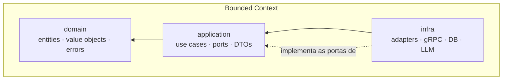

# A10 · Padrões de Projeto e Estrutura de Código (Clean Architecture)

> Como o código é organizado: **Clean Architecture por bounded context** (documento 13), num **monorepo**, com camadas **domain / application / infra**, **value objects**, **use cases** e **erros customizados**. Comunicação: **eventos** dentro do monólito (A03) — mantém o que já se tem; **gRPC** só para chamada **síncrona cross-domain**. Linguagem: **TypeScript** ([A08 §9](08-infraestrutura-e-implantacao.md)); contratos em proto são **language-independent** (habilitam o seam para Go). Estágio: **Concepção** — o código abaixo é exemplo ilustrativo.

## 1. Princípios

- **Regra da dependência (Clean Architecture):** as dependências apontam **para dentro** — `infra → application → domain`. O **domain não importa nada** de fora.
- **Ports & Adapters (hexagonal):** a `application` define **portas** (interfaces); a `infra` fornece **adaptadores** que as implementam. O núcleo não conhece Postgres, gRPC ou Claude.
- **Fronteiras = bounded contexts** (documento 13): cada contexto é isolado; o único acoplamento permitido é o *shared kernel* mínimo (§7).
- **Invariantes em value objects**, orquestração em **use cases**, falhas como **erros customizados** tipados.

## 2. Estrutura do monorepo

```text
radar/                          (monorepo — workspaces)
├─ shared/                      # compartilhados
│  ├─ contracts/                # proto (gRPC) — LANGUAGE-INDEPENDENT
│  │  └─ triagem/v1/triagem.proto
│  └─ kernel/                   # tenantId, IDs, base VOs/errors (por linguagem: ts/)
└─ modules/                     # um por bounded context (doc 13)
   ├─ triagem/                  # o "projeto" = 3 módulos:
   │  ├─ domain/                #   entities, value objects, domain errors
   │  ├─ application/           #   use cases, ports (interfaces), app errors
   │  └─ infra/                 #   adapters (db, llm, grpc, http), DI
   ├─ ingestao/  (domain/ application/ infra/)
   ├─ matching/  (domain/ application/ infra/)
   └─ ...
```

Cada contexto é um **projeto com 3 módulos** — `domain`, `application`, `infra` — versionados juntos no monorepo (o *boundary* entre eles é imposto pelo tooling, P-69). `shared/contracts` guarda os **proto**: a fonte de verdade dos contratos cross-domain, da qual se geram stubs por linguagem.

## 3. As três camadas



| Módulo | Responsabilidade | Depende de | Exemplos |
|--------|------------------|------------|----------|
| **domain** | Regras e invariantes puras | **nada** | `Aderencia`, `Confianca`, `Triagem`, `DomainError` |
| **application** | Orquestração do caso de uso; define portas | domain | `TriarEditalUseCase`, `ExtracaoRepository`, `LlmGateway` |
| **infra** | Adaptadores concretos e entrypoints | application, domain | `PostgresExtracaoRepository`, `AnthropicLlmGateway`, `TriagemGrpcServer` |

## 4. Exemplo — contexto **Triagem** (o core, documento 13)

### 4.1 domain · value objects

```ts
// domain/value-objects/confianca.ts
export class Confianca {
  private constructor(readonly valor: number) {}
  static criar(valor: number): Confianca {
    if (valor < 0 || valor > 1) throw new ConfiancaInvalidaError(valor);
    return new Confianca(valor);
  }
  suficiente(limiar: number): boolean { return this.valor >= limiar; }
}

// domain/value-objects/aderencia.ts
export class Aderencia {
  private constructor(readonly valor: number) {}
  static criar(valor: number): Aderencia {
    if (valor < 0 || valor > 1) throw new AderenciaInvalidaError(valor);
    return new Aderencia(valor);
  }
  get ehAlta(): boolean { return this.valor >= 0.7; } // documento 11, §2
}
```

### 4.2 domain · erros customizados

```ts
// domain/errors/domain-error.ts
export abstract class DomainError extends Error {
  abstract readonly code: string;             // estável, para mapear na borda (§6)
  constructor(message: string) { super(message); this.name = new.target.name; }
}

// domain/errors/index.ts
export class ConfiancaInvalidaError extends DomainError {
  readonly code = 'CONFIANCA_INVALIDA';
  constructor(v: number) { super(`confiança fora de [0,1]: ${v}`); }
}
export class ConfiancaInsuficienteError extends DomainError {
  readonly code = 'CONFIANCA_INSUFICIENTE';   // → fallback leitura assistida (documento 10, §6)
  constructor() { super('extração abaixo do limiar de confiança'); }
}
export class AderenciaInvalidaError extends DomainError {
  readonly code = 'ADERENCIA_INVALIDA';
  constructor(v: number) { super(`aderência fora de [0,1]: ${v}`); }
}
```

### 4.3 domain · entidades (reflete o split do P-45)

```ts
// domain/extracao-edital.ts — 1 por edital, cacheável (P-45)
export class ExtracaoEdital {
  constructor(
    readonly editalId: EditalId,
    readonly requisitos: Requisito[],
    readonly citacoes: Citacao[],
    readonly confianca: Confianca,
  ) {}
}

// domain/triagem.ts — aggregate: aderência por (edital, perfil) (P-45)
export class Triagem {
  private constructor(
    readonly editalId: EditalId,
    readonly perfilId: PerfilId,
    readonly aderencia: Aderencia,
    readonly recomendacao: 'go' | 'no-go',
    readonly riscos: Risco[],
  ) {}

  static avaliar(extracao: ExtracaoEdital, perfil: PerfilHabilitacao): Triagem {
    const { aderencia, riscos } = perfil.confrontar(extracao.requisitos); // regra de domínio
    return new Triagem(
      extracao.editalId, perfil.id, aderencia,
      aderencia.ehAlta ? 'go' : 'no-go', riscos,
    );
  }
}
```

### 4.4 application · portas (interfaces)

```ts
// application/ports.ts
export interface ExtracaoRepository {
  porEdital(id: EditalId): Promise<ExtracaoEdital | null>;
  salvar(e: ExtracaoEdital): Promise<void>;
}
export interface PerfilRepository { porId(id: PerfilId): Promise<PerfilHabilitacao | null>; }
export interface LlmGateway { extrair(editalTexto: string): Promise<ExtracaoEdital>; } // Claude, na infra
export interface TriagemRepository { salvar(t: Triagem): Promise<void>; }
export interface EventPublisher { publicar(e: DomainEvent): Promise<void>; }        // fila (A03)
```

### 4.5 application · use case (a peça central)

```ts
// application/use-cases/triar-edital.ts
export class TriarEditalUseCase {
  constructor(
    private readonly extracoes: ExtracaoRepository,
    private readonly perfis: PerfilRepository,
    private readonly llm: LlmGateway,
    private readonly triagens: TriagemRepository,
    private readonly eventos: EventPublisher,
  ) {}

  async executar(input: TriarEditalInput): Promise<TriagemDTO> {
    // 1. Extração CACHEADA por edital (P-45) — só chama o LLM uma vez por edital
    let extracao = await this.extracoes.porEdital(input.editalId);
    if (!extracao) {
      extracao = await this.llm.extrair(input.editalTexto);
      await this.extracoes.salvar(extracao);
    }
    if (!extracao.confianca.suficiente(input.limiarConfianca)) {
      throw new ConfiancaInsuficienteError();                 // → leitura assistida (doc 10, §6)
    }

    // 2. Autorização POR OBJETO (defesa de IDOR/BOLA, P-51 / AB1)
    const perfil = await this.perfis.porId(input.perfilId);
    if (!perfil) throw new PerfilNaoEncontradoError(input.perfilId);
    if (perfil.clienteFinalId !== input.clienteFinalId) throw new AcessoNegadoError();

    // 3. Aderência POR PERFIL (não cacheável) + persistência + evento
    const triagem = Triagem.avaliar(extracao, perfil);
    await this.triagens.salvar(triagem);
    await this.eventos.publicar(new TriagemConcluida(triagem)); // Published Language (doc 13)
    return TriagemDTO.de(triagem);
  }
}
```

### 4.6 infra · adaptadores e mapeamento de erro

```ts
// infra/llm/anthropic-llm-gateway.ts — adapta o SDK Claude à porta LlmGateway
export class AnthropicLlmGateway implements LlmGateway {
  async extrair(editalTexto: string): Promise<ExtracaoEdital> {
    // edital = dado não-confiável: instruções separadas do conteúdo (doc 05, §4 / AB4)
    // ... chamada ao Claude, parse da saída estruturada + citações ...
  }
}

// infra/grpc/error-mapping.ts — traduz erro de domínio para status na borda (§6)
export function paraGrpcStatus(err: unknown): Status {
  if (err instanceof AcessoNegadoError)        return Status.PERMISSION_DENIED;
  if (err instanceof PerfilNaoEncontradoError) return Status.NOT_FOUND;
  if (err instanceof ConfiancaInsuficienteError) return Status.FAILED_PRECONDITION;
  if (err instanceof DomainError)              return Status.INVALID_ARGUMENT;
  return Status.INTERNAL; // nunca vaza stack/PII (AB11 / P-61)
}
```

## 5. Comunicação entre contextos

| Situação | Mecanismo | Por quê |
|----------|-----------|---------|
| Pipeline assíncrono (ingestão → matching → triagem → notificação) | **Eventos na fila** (A03, §3) | desacoplado; **mantém o que já se tem** |
| Chamada **síncrona cross-domain** (ex.: Gestão consulta o Edital do Catálogo na hora) | **gRPC** | contrato forte, tipado, e **language-independent** (permite Go/Python no outro lado) |
| Dentro do mesmo contexto | chamada direta (use case → porta) | é o mesmo módulo |

Regra: **evento por padrão** (A03); **gRPC só quando um contexto precisa da resposta de outro de forma síncrona**. Não trocar a fila que já funciona por gRPC sem necessidade.

```proto
// shared/contracts/triagem/v1/triagem.proto  (language-independent)
syntax = "proto3";
package radar.triagem.v1;

service TriagemService {
  rpc TriarEdital(TriarEditalRequest) returns (TriagemResponse);
}
message TriarEditalRequest  { string edital_id = 1; string perfil_id = 2; string cliente_final_id = 3; }
message TriagemResponse     { double aderencia = 1; string recomendacao = 2; repeated string riscos = 3; }
```

## 6. Erros — estratégia por camada

| Camada | Tipo | Exemplo | Na borda (infra) |
|--------|------|---------|------------------|
| domain | `DomainError` (invariante) | `AderenciaInvalidaError` | `INVALID_ARGUMENT` / HTTP 400 |
| application | erro de orquestração | `AcessoNegadoError`, `PerfilNaoEncontradoError` | `PERMISSION_DENIED` / 403, `NOT_FOUND` / 404 |
| infra | falha técnica | timeout do LLM, fila indisponível | `INTERNAL` / 500 — **sem stack nem PII** (AB11, P-61) |

Todo erro carrega um `code` estável; o mapeamento vive **só na borda** (§4.6) — o núcleo nunca conhece gRPC/HTTP.

## 7. Pacotes compartilhados (`shared/`)

- **`shared/contracts/` — proto (gRPC), language-independent.** A verdade dos contratos cross-domain; gera stubs por linguagem no CI (P-70). É o que torna o **seam para Go** (A08 §9) viável sem reescrever contrato.
- **`shared/kernel/` — o mínimo compartilhado** (documento 13: `tenantId`/`clienteFinalId` como *Shared Kernel*), IDs e classes-base de VO/erro. Por linguagem (ex.: `ts/`). Manter **mínimo** — é o único acoplamento permitido entre contextos.

## 8. Como isto respeita as decisões anteriores

- **Split extração/aderência (P-45)** aparece nas entidades e no use case (§§4.3, 4.5).
- **Authz por objeto (P-51 / AB1)** é uma verificação explícita no use case (§4.5) + `AcessoNegadoError`.
- **Eventos mantidos (A03); gRPC só cross-domain** (§5) — honra "mantém o que já se tem".
- **TS-first com seam para Go** (A08 §9 / P-27) — os `contracts` proto são o *seam* language-independent.
- **Fronteiras = bounded contexts** (documento 13); *shared kernel* mínimo.

## 9. Pendências

- Tooling do monorepo (workspaces, build, imposição de *boundary* entre camadas/contextos). `[A VALIDAR]` → P-69
- Geração de stubs a partir do proto (`contracts`) por linguagem no CI. `[A VALIDAR]` → P-70
- Padrão de mapeamento `DomainError` → gRPC/HTTP na borda, sem vazar stack/PII. `[A VALIDAR]` → P-71

Rastreadas em [../docs/98](../docs/98-decisoes-e-pendencias.md).
