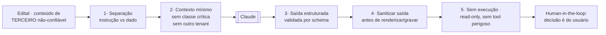

# A11 · Segurança da IA — Defesa contra Injeção

> A triagem (documento 10) consome o **edital — conteúdo de terceiro, não-confiável** — e o manda a um LLM. Isso torna a **injeção de prompt** (direta e indireta) e o **manuseio inseguro da saída** o risco de segurança mais específico do produto. Este doc detalha a defesa que os demais só citam (documento 05, §4; A07 AB4–AB6; P-54). Estágio: **Concepção**.

## 1. O problema

O edital é a **entrada não-confiável que vai direto ao modelo**. O atacante que publica (ou adultera) um edital controla texto que o LLM vai ler — é **injeção indireta**: o payload não vem do usuário, vem do dado. Objetivos típicos: fazer o LLM **ignorar as instruções**, **vazar** o que está no contexto (dado de outra empresa, a estratégia), **emitir conteúdo malicioso** (que depois renderiza no navegador), ou induzir uma **ação** (buscar uma URL, executar algo).

Premissa de projeto: **não existe defesa 100% de prompt injection.** Por isso a arquitetura assume que a injeção *pode passar* e trabalha para **limitar o impacto** — defesa em profundidade, não uma bala de prata.

## 2. Defesa em profundidade

| # | Camada | O que faz | Liga |
|---|--------|-----------|------|
| **1** | **Separação instrução/dado** | o edital **nunca** é concatenado no prompt de instrução; entra como *dado a analisar* em papel/mensagem separada, com delimitadores. Instrução do sistema não é editável pelo conteúdo. | 05 §4 |
| **2** | **Contexto mínimo (anti-exfiltração)** | ao prompt vai **só** o edital + o necessário. **Nunca** a classe crítica/estratégia comercial, nem dado de outro tenant/perfil. Se a injeção "vazar o contexto", não há o que vazar. | P-54, 05 §9 |
| **3** | **Saída estruturada e validada** | forçar saída estruturada (tool use / structured output do Claude) e **validar por schema** (Zod). O que não bate no schema é rejeitado. A saída do LLM é **também não-confiável**. | 10 §4 |
| **4** | **Manuseio seguro da saída** | escapar/sanitizar antes de renderizar (defesa de XSS armazenado) e antes de gravar. Nunca usar a saída como SQL/URL/comando sem validar. | A07 AB6 |
| **5** | **Sem agência excessiva** | o worker de triagem é **read-only**: não segue URLs que o edital mande (anti-SSRF), não tem ferramenta com efeito colateral, não executa nada extraído. | A07 AB7 |
| **6** | **Citação verificável** | cada afirmação linka o trecho-fonte (10 §4) — conteúdo **inventado** por injeção não tem citação que bate, e fica detectável. Regra de qualidade que também é de segurança. | 10 §4 |
| **7** | **Limites** | timeout, teto de custo (anti cost-DoS) e rate-limit por usuário na triagem. | A07 AB9 |

## 3. Direta vs. indireta

- **Indireta (principal):** o payload vem no **edital/anexo** — a fonte não-confiável. É o vetor central e o que as camadas 1–6 endereçam.
- **Direta (menor):** o usuário injeta nos **próprios critérios/palavras-chave** de monitoramento. Superfície pequena (afeta só o próprio contexto), mas o mesmo princípio vale: entrada do usuário é dado, não instrução.

## 4. O que testar

Operacionaliza A07 (AB4 injeção, AB5 exfiltração, AB6 saída maliciosa):

- **Conjunto de editais adversariais** — payloads conhecidos de prompt injection ("ignore as instruções...", tentativa de exfiltração, HTML/script na saída) rodados como teste (P-72).
- **Regressão** a cada mudança de prompt ou modelo — o mesmo rigor do *gold set* de qualidade (10 §5).
- **Red-team** manual nos anexos (PDF/imagem via OCR — o texto pode esconder instrução).

## 5. Limites honestos

Nenhuma camada sozinha basta, e o conjunto **mitiga, não elimina**. É por isso que:

- a **decisão go/no-go continua do usuário** (human-in-the-loop, 10 §4) — a IA sugere, não decide;
- o **contexto é mínimo** — para que uma injeção bem-sucedida tenha pouco a vazar ou fazer;
- a **saída é tratada como não-confiável** — mesmo "vindo do nosso LLM".

Segurança da IA aqui é **contenção de dano**, não confiança no modelo.

## 6. Ligação

Aprofunda documento 05, §4 (princípio) e §9 (classe crítica); é testada em A07 (AB4–AB7, AB9); depende do contexto mínimo de P-54; e reforça a regra de citação de 10 §4. O adaptador `AnthropicLlmGateway` (A10, §4.6) é onde as camadas 1–4 vivem em código.

## 7. Pendências

- Conjunto de editais adversariais + red-team de prompt injection no CI (§4). `[A VALIDAR]` → P-72
- Schema de validação da saída do LLM + política de sanitização de saída (§2, camadas 3–4). `[A VALIDAR]` → P-73

Rastreadas em [../docs/98](../docs/98-decisoes-e-pendencias.md).
