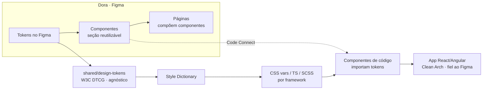
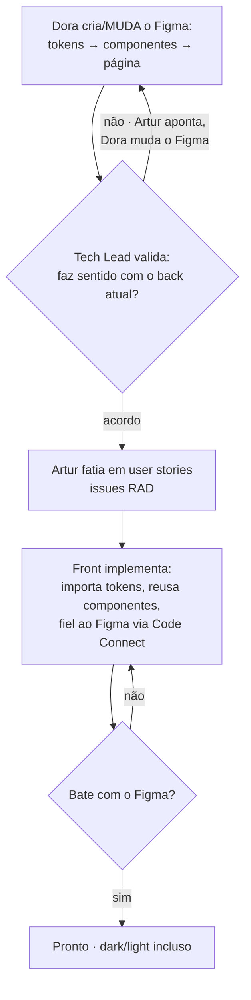

# A12 · Frontend — Clean Architecture, Design Tokens e Figma

> Define **como o front será feito**. A construção é *Next* (documento 07 — front/UX entram depois do núcleo), mas as decisões estruturais ficam registradas agora. Consistente com a Clean Architecture do backend ([A10](10-padroes-e-estrutura-de-codigo.md)) e com o monorepo `modules/ + shared/`. Estágio: **Concepção**.

## 1. Princípios

- **Clean Architecture também no front** — as dependências apontam para dentro; a UI (presentation) é a casca externa. Mesmo espírito do backend (A10).
- **Figma é a fonte da verdade de design** — o front **não foge do Figma**: implementa fiel ao que a UX desenhou, via Code Connect (§5). Divergência entre tela e código é bug.
- **Component-first** — antes de montar uma página, os **componentes** existem (no Figma e no código). Se um componente já existe, **reusa** (instância), não recria (§6).
- **Tokens agnósticos** — a identidade visual mora em **design tokens independentes de framework**; o app (React/Angular/…) importa, não redefine (§4).
- **Sem lock-in de vendor.** Nada de meta-framework acoplado a fornecedor — **não usar Next.js** (nem equivalentes presos a um vendor). O front é uma **SPA** com build agnóstico (ex.: Vite) e **hospedagem estática portável** em qualquer CDN (A08, §4). A Clean Arch mantém o framework **só na `ui/`** (trocável); com os tokens agnósticos (§4) e os contratos `shared/contracts`, nada prende o produto a um fornecedor. *(Aqui "Next.js" é o framework — não confundir com a fase "Next" do roadmap.)*

## 2. Estrutura no monorepo

Estende o layout de A10 (`modules/ + shared/`) com os `apps/` de front e os tokens em `shared/`:

```text
radar/
├─ shared/
│  ├─ contracts/          # proto (gRPC) — já em A10
│  ├─ kernel/             # tenantId, base — já em A10
│  └─ design-tokens/      # tokens agnósticos (W3C DTCG) + build — NOVO
└─ apps/                  # front(s) — NOVO
   └─ web/                # SPA (React/Angular/Vue) · sem Next.js · Clean Arch:
      ├─ domain/          #   view models, regras de apresentação
      ├─ application/     #   USE CASES (pacote próprio) + ports · a UI importa daqui · abortable
      ├─ infra/           #   clientes da API (gRPC-web/REST, gerados de shared/contracts)
      └─ ui/              #   componentes + páginas · importam use cases + design-tokens
```

`design-tokens` é **agnóstico**: não sabe o que é React ou Angular. Cada app em `apps/` importa o **build** dos tokens (§4). A **UI importa os use cases** de `application` (um pacote próprio; ver §3) e **nunca** chama `infra`/API direto; o `infra/` fala com o backend pelos mesmos `shared/contracts`. Todo use case é **abortável** (recebe `AbortSignal`, [A10 §1](10-padroes-e-estrutura-de-codigo.md)) — casa com o cancelamento de navegação/fetch no front. `[A VALIDAR — apps/ é novo em relação a A10; confirmar]`

## 3. Clean Architecture no front — camadas, ports e use cases

Expande a estrutura de `apps/web/` (§2). A disciplina é a mesma do backend ([A10](10-padroes-e-estrutura-de-codigo.md)), adaptada ao contexto de apresentação:

| Camada | Responsabilidade | Depende de | Não faz |
|--------|-----------------|------------|---------|
| **domain** | View models, enums de UI, regras de apresentação (ex.: quando exibir badge "prazo crítico") | nada | lógica de negócio; rede |
| **application** | Use cases do front: orquestram chamadas via ports e retornam view models prontos para a UI | domain | conhecer framework; renderizar |
| **infra** | Adapters dos ports — stubs gRPC-web/REST gerados de `shared/contracts`; cache local | application, domain | renderizar; importar React/Angular |
| **ui** | Componentes, páginas e hooks; importam apenas use cases e tokens | application + tokens | lógica de negócio; rede direta |

**Regra da dependência:** `ui → application → domain`. O `infra` é **injetado** nos use cases (inversão de controle) — nenhum componente de UI importa `infra` diretamente.

### 3.1 Use cases do front

Os use cases vivem em `apps/web/application/use-cases/`. Eles **não duplicam** a lógica do backend — delegam ao backend via port e adaptam o resultado para a apresentação: mapeiam DTOs para view models, combinam chamadas quando necessário, traduzem erros de domínio para estados de UI.

Nomenclatura idêntica ao backend (A10 §8): `<Verbo><Substantivo>UseCase`. Ports: papel puro, sem tecnologia no nome (A10 §8).

```ts
// apps/web/application/ports.ts
export interface TriagemApiGateway {
  triar(input: TriarEditalInput, signal: AbortSignal): Promise<TriagemDTO>;
}
export interface EditaisApiGateway {
  listar(filtros: FiltrosEdital, signal: AbortSignal): Promise<EditalDTO[]>;
  porId(id: string, signal: AbortSignal): Promise<EditalDTO | null>;
}
```

```ts
// apps/web/application/use-cases/obter-triagem.ts
export class ObterTriagemUseCase {
  constructor(private readonly triagem: TriagemApiGateway) {}

  async executar(
    input: { editalId: string; perfilId: string; clienteFinalId: string },
    signal: AbortSignal,                         // propagado desde o hook de navegação (§3.2)
  ): Promise<TriagemViewModel> {
    const dto = await this.triagem.triar(input, signal);
    return TriagemViewModel.de(dto);             // DTO → view model
  }
}
```

```ts
// apps/web/infra/api/grpc-web-triagem-gateway.ts
// Adapter: implementa TriagemApiGateway com o stub gerado de shared/contracts
export class GrpcWebTriagemGateway implements TriagemApiGateway {
  async triar(input: TriarEditalInput, signal: AbortSignal): Promise<TriagemDTO> {
    // repassa signal ao stub gRPC-web (mapeia para deadline/cancel)
    // captura GrpcStatus → paraAppError() (§3.3)
  }
}
```

O adapter recebe nome `<Tecnologia><Port>` (`GrpcWebTriagemGateway`) e vive **só em `infra/`** — o port não carrega tecnologia no nome (A10 §8).

### 3.2 AbortSignal — cancelamento de navegação

Todo port do front **recebe e propaga `AbortSignal`** (A10 §1). O componente (ou hook de roteamento) cria o `AbortController`; o use case repassa o signal até o adapter; o adapter mapeia para o mecanismo do transporte (`fetch signal`, gRPC cancel).

```ts
// ui — framework-agnóstico; adapte ao hook de rota da stack escolhida (P-77)
const controller = new AbortController();
onNavigateAway(() => controller.abort());
const viewModel = await obterTriagemUseCase.executar(input, controller.signal);
```

A ausência de `signal` em qualquer port do front é **defeito**, não omissão aceitável.

### 3.3 Mapeamento de erros — backend → UI

O adapter (`infra/`) é o **único** ponto que conhece gRPC status codes ou HTTP status. Ele os traduz para erros de aplicação tipados; o use case trata ou re-lança; a UI interpreta o tipo e exibe a mensagem correta — **nunca exibe stack ou código interno** (P-61).

```ts
// apps/web/infra/api/error-mapping.ts
export function paraAppError(status: GrpcStatus, code?: string): AppError {
  if (status === Status.NOT_FOUND)         return new RecursoNaoEncontradoError();
  if (status === Status.PERMISSION_DENIED) return new AcessoNegadoError();
  if (status === Status.FAILED_PRECONDITION && code === 'CONFIANCA_INSUFICIENTE')
    return new TriagemIndisponivelError('leitura assistida necessária');
  return new ErroInesperadoError();        // nunca vaza mensagem bruta
}
```

A UI recebe `AppError` tipado — o tratamento é por tipo, não por pattern matching de string.

## 4. Design tokens (repo agnóstico)

Fonte única da identidade visual, **independente de linguagem/framework**:

- **Formato:** W3C **Design Tokens (DTCG)** — JSON com `$type`/`$value`. Não é CSS nem TS; é neutro.
- **Build:** **Style Dictionary** transforma os tokens em saídas por plataforma — CSS custom properties, TS/JS, SCSS, tema Angular. O app importa a saída da sua stack; ninguém copia valor de cor na mão.
- **Três camadas:**
  1. **Core/primitivo** — valores crus (`color.blue.600`, `space.4`, `radius.md`).
  2. **Semântico** — por papel (`color.bg.surface`, `color.text.critical`, `color.action.primary`). Referencia o core.
  3. **Componente** — por componente (`button.bg.primary`). Referencia o semântico.
- Regra: o código usa **semântico/componente**, nunca o core direto — é o que faz o **dark/light** funcionar sem tocar em tela (§7).



## 5. Figma como fonte da verdade

- **A UX (Dora) cria o Figma do zero** — tokens, biblioteca de componentes e páginas (§6). É o artefato mestre do design.
- **O front não foge do Figma.** A fidelidade é garantida por **Figma Code Connect**, que mapeia cada componente do Figma ao seu componente de código — o agente de front implementa o componente **exato**, não uma aproximação. Tela ≠ Figma é defeito, não estilo.
- **Validação antes de implementar (divisão clara de papéis).** O Tech Lead (Artur) valida se o design **faz sentido com o backend que temos hoje** — viabilidade técnica: contratos e use cases (docs/14), o que o back já entrega. Ele **não edita o Figma**: aponta os ajustes, e **quem muda o Figma é a UX (Dora)** — mexer no Figma é trabalho de UX, não do Tech Lead. Iteram até o acordo; enquanto isso, o Artur roda os stress tests. Só com o acordo ele fatia em user stories.

## 6. Disciplina component-first (reuso)

**Antes de qualquer página, a seção de componentes.** Vale no Figma **e** no código, espelhados 1:1:

- **No Figma:** existe uma página/seção **Componentes** (design system) com os componentes publicados e suas variantes; as páginas de produto são compostas de **instâncias**, nunca de formas soltas.
- **No código:** existe uma **biblioteca de componentes** (`apps/web/ui/components`) que importa os tokens e espelha o Figma.
- **Regra de reuso:** ao desenhar/implementar uma página, primeiro verifica se o componente **já existe** → se existe, **reaplica** (instância/import); só cria um novo quando é genuinamente novo, e aí ele nasce **na seção de componentes** (para o próximo reusar). Nada de recriar botão a cada tela.

## 7. Dark / light

Um requisito, resolvido na **camada semântica** dos tokens (§4), não tela a tela:

- `color.bg.surface`, `color.text.default` etc. resolvem para valores diferentes em **claro** e **escuro**, referenciando os mesmos primitivos.
- O app troca de tema num único ponto (ex.: `data-theme="dark"` na raiz, sobrescrevendo as CSS vars). Componentes que usam **só** tokens semânticos viram dark/light **de graça**.
- No Figma, o mesmo: os componentes usam *color styles* semânticos com modo claro/escuro (variáveis de modo do Figma), espelhando os tokens.

## 8. Fluxo de trabalho



## 9. Pendências

- Repo/package **`shared/design-tokens`** agnóstico (DTCG + Style Dictionary) e o pipeline de build por framework. `[A VALIDAR]` → P-75
- **Figma do zero** pela Dora (tokens + biblioteca de componentes + páginas) + **Code Connect** Figma↔código. `[A VALIDAR]` → P-76
- **Framework do front** (React, Angular, …) e como cada um consome os tokens; confirmar `apps/` no monorepo. `[A VALIDAR]` → P-77
- **Use cases do front** em pacote próprio, ports por papel, `AbortSignal` e mapeamento de erros (ver §3). `[A VALIDAR]` → P-79

Rastreadas em [../docs/98](../docs/98-decisoes-e-pendencias.md).
