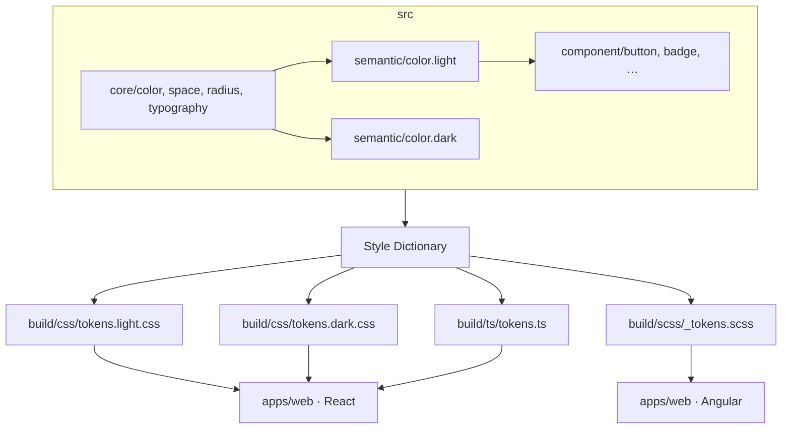

# A13 · Pacote `shared/design-tokens` (P-75)

> Especificação do pacote de design tokens agnóstico do Radar de Licitações. Realiza o que [A12 §3](12-frontend-design-tokens-e-figma.md) descreve conceitualmente: estrutura de arquivos, formato DTCG, configuração do Style Dictionary e saídas por plataforma. Estágio: **Concepção** — proposta a validar na entrada do Next (gate P-75).

## 1. Posição no monorepo

```text
radar/
└─ shared/
   └─ design-tokens/          ← este pacote
      ├─ src/
      │  ├─ core/             # valores primitivos (cores, espaços, tipografia…)
      │  ├─ semantic/         # papéis semânticos (light + dark)
      │  └─ component/        # tokens por componente
      ├─ build/               # saídas geradas — nunca editadas à mão (gitignore)
      │  ├─ css/
      │  ├─ ts/
      │  └─ scss/
      ├─ config/
      │  └─ style-dictionary.config.ts
      └─ package.json
```

O pacote **não depende de React, Angular nem de qualquer framework**. Cada `app/` em `apps/` importa a saída de `build/` que corresponde à sua stack — CSS custom properties, módulo TypeScript ou SCSS parcial. Ninguém copia valores de cor na mão.

## 2. Formato: W3C DTCG

Todos os arquivos em `src/` seguem o formato **W3C Design Token Community Group (DTCG)**: JSON com `$type` e `$value`. As referências entre tokens usam a sintaxe `{caminho.do.token}` — o Style Dictionary resolve o grafo de referências em tempo de build.

### 2.1 Core/primitivos (`src/core/`)

Valores crus, sem contexto semântico. Nenhum componente ou tela importa daqui — são a base que o semântico referencia.

**`src/core/color.json`**
```json
{
  "color": {
    "blue": {
      "50":  { "$type": "color", "$value": "#eff6ff" },
      "100": { "$type": "color", "$value": "#dbeafe" },
      "400": { "$type": "color", "$value": "#60a5fa" },
      "600": { "$type": "color", "$value": "#2563eb" },
      "700": { "$type": "color", "$value": "#1d4ed8" },
      "900": { "$type": "color", "$value": "#1e3a8a" }
    },
    "red": {
      "50":  { "$type": "color", "$value": "#fff1f2" },
      "500": { "$type": "color", "$value": "#ef4444" },
      "700": { "$type": "color", "$value": "#b91c1c" }
    },
    "green": {
      "50":  { "$type": "color", "$value": "#f0fdf4" },
      "500": { "$type": "color", "$value": "#22c55e" },
      "700": { "$type": "color", "$value": "#15803d" }
    },
    "yellow": {
      "50":  { "$type": "color", "$value": "#fefce8" },
      "500": { "$type": "color", "$value": "#eab308" },
      "700": { "$type": "color", "$value": "#a16207" }
    },
    "neutral": {
      "0":   { "$type": "color", "$value": "#ffffff" },
      "50":  { "$type": "color", "$value": "#f9fafb" },
      "100": { "$type": "color", "$value": "#f3f4f6" },
      "200": { "$type": "color", "$value": "#e5e7eb" },
      "400": { "$type": "color", "$value": "#9ca3af" },
      "600": { "$type": "color", "$value": "#4b5563" },
      "700": { "$type": "color", "$value": "#374151" },
      "800": { "$type": "color", "$value": "#1f2937" },
      "900": { "$type": "color", "$value": "#111827" },
      "950": { "$type": "color", "$value": "#030712" }
    }
  }
}
```

**`src/core/space.json`**
```json
{
  "space": {
    "0":   { "$type": "dimension", "$value": "0px" },
    "1":   { "$type": "dimension", "$value": "4px" },
    "2":   { "$type": "dimension", "$value": "8px" },
    "3":   { "$type": "dimension", "$value": "12px" },
    "4":   { "$type": "dimension", "$value": "16px" },
    "5":   { "$type": "dimension", "$value": "20px" },
    "6":   { "$type": "dimension", "$value": "24px" },
    "8":   { "$type": "dimension", "$value": "32px" },
    "10":  { "$type": "dimension", "$value": "40px" },
    "12":  { "$type": "dimension", "$value": "48px" },
    "16":  { "$type": "dimension", "$value": "64px" },
    "20":  { "$type": "dimension", "$value": "80px" }
  }
}
```

**`src/core/radius.json`**
```json
{
  "radius": {
    "none": { "$type": "dimension", "$value": "0px" },
    "sm":   { "$type": "dimension", "$value": "4px" },
    "md":   { "$type": "dimension", "$value": "6px" },
    "lg":   { "$type": "dimension", "$value": "8px" },
    "xl":   { "$type": "dimension", "$value": "12px" },
    "full": { "$type": "dimension", "$value": "9999px" }
  }
}
```

**`src/core/typography.json`**
```json
{
  "font": {
    "family": {
      "sans":  { "$type": "fontFamily", "$value": "Inter, ui-sans-serif, system-ui, sans-serif" },
      "mono":  { "$type": "fontFamily", "$value": "JetBrains Mono, ui-monospace, monospace" }
    },
    "size": {
      "xs":   { "$type": "dimension", "$value": "12px" },
      "sm":   { "$type": "dimension", "$value": "14px" },
      "md":   { "$type": "dimension", "$value": "16px" },
      "lg":   { "$type": "dimension", "$value": "18px" },
      "xl":   { "$type": "dimension", "$value": "20px" },
      "2xl":  { "$type": "dimension", "$value": "24px" },
      "3xl":  { "$type": "dimension", "$value": "30px" },
      "4xl":  { "$type": "dimension", "$value": "36px" }
    },
    "weight": {
      "regular":  { "$type": "fontWeight", "$value": 400 },
      "medium":   { "$type": "fontWeight", "$value": 500 },
      "semibold": { "$type": "fontWeight", "$value": 600 },
      "bold":     { "$type": "fontWeight", "$value": 700 }
    },
    "lineHeight": {
      "tight":   { "$type": "number", "$value": 1.25 },
      "normal":  { "$type": "number", "$value": 1.5 },
      "relaxed": { "$type": "number", "$value": 1.75 }
    }
  }
}
```

### 2.2 Semântico (`src/semantic/`)

Cada token semântico define um **papel** — não uma cor. Um mesmo papel (`color.bg.surface`) resolve para valores diferentes no tema claro e escuro, referenciando os primitivos. É o que garante que dark/light funcione sem tocar nas telas ([A12 §6](12-frontend-design-tokens-e-figma.md)).

**`src/semantic/color.light.json`**
```json
{
  "color": {
    "bg": {
      "page":      { "$type": "color", "$value": "{color.neutral.50}" },
      "surface":   { "$type": "color", "$value": "{color.neutral.0}" },
      "elevated":  { "$type": "color", "$value": "{color.neutral.0}" },
      "muted":     { "$type": "color", "$value": "{color.neutral.100}" }
    },
    "text": {
      "default":   { "$type": "color", "$value": "{color.neutral.900}" },
      "secondary":  { "$type": "color", "$value": "{color.neutral.600}" },
      "placeholder":{ "$type": "color", "$value": "{color.neutral.400}" },
      "inverse":   { "$type": "color", "$value": "{color.neutral.0}" },
      "critical":  { "$type": "color", "$value": "{color.red.700}" },
      "success":   { "$type": "color", "$value": "{color.green.700}" },
      "warning":   { "$type": "color", "$value": "{color.yellow.700}" },
      "info":      { "$type": "color", "$value": "{color.blue.700}" }
    },
    "action": {
      "primary":        { "$type": "color", "$value": "{color.blue.600}" },
      "primaryHover":   { "$type": "color", "$value": "{color.blue.700}" },
      "primaryText":    { "$type": "color", "$value": "{color.neutral.0}" },
      "secondary":      { "$type": "color", "$value": "{color.neutral.100}" },
      "secondaryHover": { "$type": "color", "$value": "{color.neutral.200}" },
      "secondaryText":  { "$type": "color", "$value": "{color.neutral.900}" },
      "danger":         { "$type": "color", "$value": "{color.red.500}" },
      "dangerHover":    { "$type": "color", "$value": "{color.red.700}" }
    },
    "border": {
      "default":  { "$type": "color", "$value": "{color.neutral.200}" },
      "strong":   { "$type": "color", "$value": "{color.neutral.400}" },
      "focus":    { "$type": "color", "$value": "{color.blue.600}" },
      "critical": { "$type": "color", "$value": "{color.red.500}" }
    },
    "status": {
      "criticalBg": { "$type": "color", "$value": "{color.red.50}" },
      "successBg":  { "$type": "color", "$value": "{color.green.50}" },
      "warningBg":  { "$type": "color", "$value": "{color.yellow.50}" },
      "infoBg":     { "$type": "color", "$value": "{color.blue.50}" }
    }
  }
}
```

**`src/semantic/color.dark.json`** — os mesmos papéis, invertidos:
```json
{
  "color": {
    "bg": {
      "page":      { "$type": "color", "$value": "{color.neutral.950}" },
      "surface":   { "$type": "color", "$value": "{color.neutral.900}" },
      "elevated":  { "$type": "color", "$value": "{color.neutral.800}" },
      "muted":     { "$type": "color", "$value": "{color.neutral.800}" }
    },
    "text": {
      "default":    { "$type": "color", "$value": "{color.neutral.50}" },
      "secondary":  { "$type": "color", "$value": "{color.neutral.400}" },
      "placeholder":{ "$type": "color", "$value": "{color.neutral.600}" },
      "inverse":    { "$type": "color", "$value": "{color.neutral.950}" },
      "critical":   { "$type": "color", "$value": "{color.red.500}" },
      "success":    { "$type": "color", "$value": "{color.green.500}" },
      "warning":    { "$type": "color", "$value": "{color.yellow.500}" },
      "info":       { "$type": "color", "$value": "{color.blue.400}" }
    },
    "action": {
      "primary":        { "$type": "color", "$value": "{color.blue.400}" },
      "primaryHover":   { "$type": "color", "$value": "{color.blue.600}" },
      "primaryText":    { "$type": "color", "$value": "{color.neutral.950}" },
      "secondary":      { "$type": "color", "$value": "{color.neutral.800}" },
      "secondaryHover": { "$type": "color", "$value": "{color.neutral.700}" },
      "secondaryText":  { "$type": "color", "$value": "{color.neutral.50}" },
      "danger":         { "$type": "color", "$value": "{color.red.500}" },
      "dangerHover":    { "$type": "color", "$value": "{color.red.700}" }
    },
    "border": {
      "default":  { "$type": "color", "$value": "{color.neutral.800}" },
      "strong":   { "$type": "color", "$value": "{color.neutral.600}" },
      "focus":    { "$type": "color", "$value": "{color.blue.400}" },
      "critical": { "$type": "color", "$value": "{color.red.500}" }
    },
    "status": {
      "criticalBg": { "$type": "color", "$value": "{color.red.700}" },
      "successBg":  { "$type": "color", "$value": "{color.green.700}" },
      "warningBg":  { "$type": "color", "$value": "{color.yellow.700}" },
      "infoBg":     { "$type": "color", "$value": "{color.blue.700}" }
    }
  }
}
```

**`src/semantic/space.json`** — aliases semânticos para espaçamentos recorrentes:
```json
{
  "spacing": {
    "inset": {
      "xs": { "$type": "dimension", "$value": "{space.2}" },
      "sm": { "$type": "dimension", "$value": "{space.3}" },
      "md": { "$type": "dimension", "$value": "{space.4}" },
      "lg": { "$type": "dimension", "$value": "{space.6}" },
      "xl": { "$type": "dimension", "$value": "{space.8}" }
    },
    "stack": {
      "xs": { "$type": "dimension", "$value": "{space.2}" },
      "sm": { "$type": "dimension", "$value": "{space.3}" },
      "md": { "$type": "dimension", "$value": "{space.4}" },
      "lg": { "$type": "dimension", "$value": "{space.6}" },
      "xl": { "$type": "dimension", "$value": "{space.8}" }
    }
  }
}
```

### 2.3 Componente (`src/component/`)

Tokens de componente referenciam **só** o semântico — nunca o core diretamente. Isso garante que dark/light já está resolvido antes de chegar aqui.

**`src/component/button.json`**
```json
{
  "button": {
    "primary": {
      "bg":         { "$type": "color", "$value": "{color.action.primary}" },
      "bgHover":    { "$type": "color", "$value": "{color.action.primaryHover}" },
      "text":       { "$type": "color", "$value": "{color.action.primaryText}" },
      "border":     { "$type": "color", "$value": "{color.action.primary}" },
      "radius":     { "$type": "dimension", "$value": "{radius.md}" },
      "paddingX":   { "$type": "dimension", "$value": "{spacing.inset.md}" },
      "paddingY":   { "$type": "dimension", "$value": "{spacing.inset.sm}" },
      "fontSize":   { "$type": "dimension", "$value": "{font.size.sm}" },
      "fontWeight": { "$type": "fontWeight", "$value": "{font.weight.semibold}" }
    },
    "secondary": {
      "bg":         { "$type": "color", "$value": "{color.action.secondary}" },
      "bgHover":    { "$type": "color", "$value": "{color.action.secondaryHover}" },
      "text":       { "$type": "color", "$value": "{color.action.secondaryText}" },
      "border":     { "$type": "color", "$value": "{color.border.default}" },
      "radius":     { "$type": "dimension", "$value": "{radius.md}" },
      "paddingX":   { "$type": "dimension", "$value": "{spacing.inset.md}" },
      "paddingY":   { "$type": "dimension", "$value": "{spacing.inset.sm}" }
    },
    "danger": {
      "bg":         { "$type": "color", "$value": "{color.action.danger}" },
      "bgHover":    { "$type": "color", "$value": "{color.action.dangerHover}" },
      "text":       { "$type": "color", "$value": "{color.action.primaryText}" },
      "border":     { "$type": "color", "$value": "{color.action.danger}" },
      "radius":     { "$type": "dimension", "$value": "{radius.md}" }
    }
  }
}
```

**`src/component/badge.json`** — status de triagem (go / no-go / aguardando):
```json
{
  "badge": {
    "success": {
      "bg":   { "$type": "color", "$value": "{color.status.successBg}" },
      "text": { "$type": "color", "$value": "{color.text.success}" },
      "border": { "$type": "color", "$value": "{color.text.success}" }
    },
    "critical": {
      "bg":   { "$type": "color", "$value": "{color.status.criticalBg}" },
      "text": { "$type": "color", "$value": "{color.text.critical}" },
      "border": { "$type": "color", "$value": "{color.text.critical}" }
    },
    "warning": {
      "bg":   { "$type": "color", "$value": "{color.status.warningBg}" },
      "text": { "$type": "color", "$value": "{color.text.warning}" },
      "border": { "$type": "color", "$value": "{color.text.warning}" }
    },
    "neutral": {
      "bg":   { "$type": "color", "$value": "{color.bg.muted}" },
      "text": { "$type": "color", "$value": "{color.text.secondary}" },
      "border": { "$type": "color", "$value": "{color.border.default}" }
    }
  }
}
```

## 3. Style Dictionary — configuração

**`config/style-dictionary.config.ts`**

```ts
import StyleDictionary from 'style-dictionary';

const sd = new StyleDictionary({
  source: ['src/core/**/*.json', 'src/component/**/*.json'],
  platforms: {

    // CSS custom properties (light — padrão)
    'css/light': {
      transformGroup: 'css',
      prefix: 'rdr',
      buildPath: 'build/css/',
      files: [
        {
          destination: 'tokens.light.css',
          format: 'css/variables',
          options: { selector: ':root, [data-theme="light"]' },
          filter: token => token.attributes?.category !== 'font',
        },
      ],
    },

    // CSS custom properties (dark)
    'css/dark': {
      source: ['src/core/**/*.json', 'src/semantic/color.dark.json', 'src/component/**/*.json'],
      transformGroup: 'css',
      prefix: 'rdr',
      buildPath: 'build/css/',
      files: [
        {
          destination: 'tokens.dark.css',
          format: 'css/variables',
          options: { selector: '[data-theme="dark"]' },
          filter: token => token.filePath.includes('dark') || token.filePath.includes('component'),
        },
      ],
    },

    // TypeScript (auto-complete nos componentes React/Angular)
    ts: {
      transformGroup: 'js',
      prefix: 'rdr',
      buildPath: 'build/ts/',
      files: [
        {
          destination: 'tokens.ts',
          format: 'javascript/es6',
        },
        {
          destination: 'tokens.d.ts',
          format: 'typescript/es6-declarations',
        },
      ],
    },

    // SCSS (para apps que preferem pré-processador)
    scss: {
      transformGroup: 'scss',
      prefix: 'rdr',
      buildPath: 'build/scss/',
      files: [
        { destination: '_tokens.scss', format: 'scss/variables' },
      ],
    },

  },
});

sd.buildAllPlatforms();
```

> **Nota:** o seletor `[data-theme="dark"]` na raiz (`<html>` ou `<body>`) ativa o dark mode. Componentes que usam **só** tokens semânticos viram dark/light de graça ([A12 §6](12-frontend-design-tokens-e-figma.md)).

## 4. Saídas geradas (`build/`)

### 4.1 CSS custom properties

**`build/css/tokens.light.css`** (trecho gerado):
```css
:root, [data-theme="light"] {
  --rdr-color-bg-page:    #f9fafb;
  --rdr-color-bg-surface: #ffffff;
  --rdr-color-text-default:   #111827;
  --rdr-color-text-secondary: #4b5563;
  --rdr-color-action-primary: #2563eb;
  --rdr-color-border-default: #e5e7eb;
  --rdr-space-4: 16px;
  --rdr-radius-md: 6px;
  /* … */
}
```

**`build/css/tokens.dark.css`** (trecho):
```css
[data-theme="dark"] {
  --rdr-color-bg-page:    #030712;
  --rdr-color-bg-surface: #111827;
  --rdr-color-text-default:   #f9fafb;
  --rdr-color-action-primary: #60a5fa;
  --rdr-color-border-default: #1f2937;
  /* … */
}
```

### 4.2 TypeScript/ESM

**`build/ts/tokens.ts`** (trecho):
```ts
export const rdrColorBgPage         = '#f9fafb';
export const rdrColorBgSurface      = '#ffffff';
export const rdrColorTextDefault    = '#111827';
export const rdrColorActionPrimary  = '#2563eb';
export const rdrRadiusMd            = '6px';
```

```ts
// build/ts/tokens.d.ts
export declare const rdrColorBgPage: string;
export declare const rdrColorBgSurface: string;
// …
```

### 4.3 SCSS

**`build/scss/_tokens.scss`** (trecho):
```scss
$rdr-color-bg-page:        #f9fafb !default;
$rdr-color-bg-surface:     #ffffff !default;
$rdr-color-text-default:   #111827 !default;
$rdr-color-action-primary: #2563eb !default;
$rdr-radius-md:            6px     !default;
```

## 5. Como cada framework consome

| Framework | Import | Mecanismo de dark/light |
|-----------|--------|------------------------|
| React (Next.js) | `import '@radar/design-tokens/css/light'`<br>`import '@radar/design-tokens/css/dark'` | `document.documentElement.dataset.theme = 'dark'` |
| Angular | `@import '@radar/design-tokens/scss/tokens'` | `renderer.setAttribute(el, 'data-theme', 'dark')` |
| Qualquer (só CSS) | `<link rel="stylesheet" href="tokens.light.css">` | Idem `data-theme` na raiz |
| Tailwind (pré-v4) | `theme.extend.colors` via `build/ts/tokens` | Classe `.dark` com `data-theme` |

> **Regra:** o código de componente usa **sempre** a CSS custom property ou a constante TS — nunca os hex dos primitivos na mão. Exemplo: `color: var(--rdr-color-text-default)` ou `color: rdrColorTextDefault`. Hardcodar `#111827` num componente é defeito.

## 6. `package.json`

```json
{
  "name": "@radar/design-tokens",
  "version": "0.1.0",
  "private": true,
  "description": "Design tokens agnósticos do Radar de Licitações (W3C DTCG + Style Dictionary)",
  "scripts": {
    "build":   "ts-node config/style-dictionary.config.ts",
    "build:watch": "nodemon --watch src --ext json --exec npm run build"
  },
  "exports": {
    "./css/light": "./build/css/tokens.light.css",
    "./css/dark":  "./build/css/tokens.dark.css",
    "./ts":        "./build/ts/tokens.js",
    "./ts/types":  "./build/ts/tokens.d.ts",
    "./scss":      "./build/scss/_tokens.scss"
  },
  "devDependencies": {
    "style-dictionary": "^4.x",
    "ts-node":           "^10.x",
    "typescript":        "^5.x",
    "nodemon":           "^3.x"
  }
}
```

## 7. Regras de uso (resumo)

| Regra | Detalhe |
|-------|---------|
| **Só semântico no código** | Componentes referenciam `color.text.default`, não `color.neutral.900` |
| **Nunca editar `build/`** | Os arquivos são gerados; a fonte é `src/`. Alterar `build/` direto é defeito |
| **Novo token → nova camada certa** | Cor nova → core primeiro; papel novo → semântico; variação de componente → component |
| **Sem hex na mão** | `var(--rdr-…)` no CSS e a constante TS no resto |
| **Dark/light por seletor** | `[data-theme="dark"]` na raiz; sem `prefers-color-scheme` direto no token |

## 8. Diagrama de dependências



## 9. Pendências relacionadas

- **P-76** — Figma do zero (Dora): tokens + biblioteca de componentes + páginas + Code Connect Figma↔código. Os tokens deste doc precisam espelhar as *color styles* e *variables* do Figma. `[A VALIDAR]`
- **P-77** — Framework do front (React/Angular) e como `apps/` no monorepo consome os tokens; confirmar os exports deste package. `[A VALIDAR]`
- **P-69** — Tooling do monorepo (workspaces, build, imposição de boundary); o `@radar/design-tokens` precisa participar do workspace e ter seu `build` invocado pelo CI. `[A VALIDAR]`

Rastreadas em [../docs/98](../docs/98-decisoes-e-pendencias.md).
