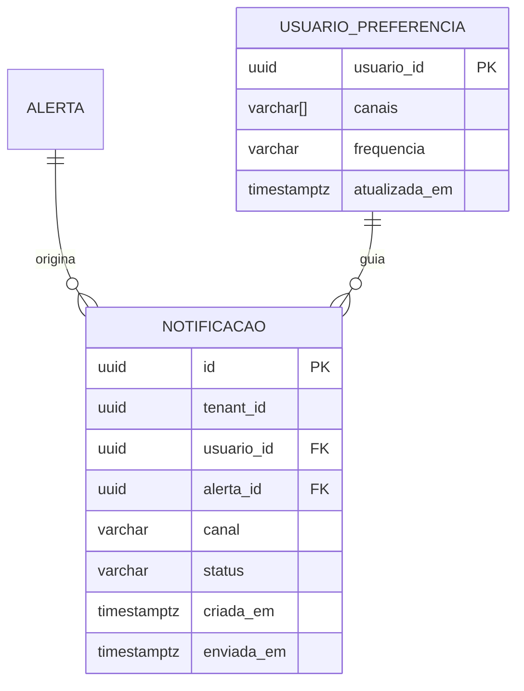

# A14 · Notificação: Canais, E-mail e Digest

> Especificação de implementação do bounded context **Notificação** (documento 13, §§2–3 · tipo: Generic). Entrega alertas por canal conforme preferência e criticidade — e-mail imediato ou agrupado em digest. Consome o evento `alerta.gerado` publicado pelo Matching (arquitetura/03, §3). Estágio: **Concepção** — código abaixo é exemplo ilustrativo.
>
> Convenções de código: Clean Architecture conforme [arquitetura/10](10-padroes-e-estrutura-de-codigo.md); ports sem tecnologia no nome; todo use case recebe `AbortSignal` (arquitetura/10 §1). Use cases listados em [docs/14 §4](../docs/14-casos-de-uso.md).

## 1. Posição no context map

O contexto de Notificação é **a última etapa da esteira do MVP** (arquitetura/03, §1): recebe `alerta.gerado` via fila e entrega ao usuário sem saber nada do conteúdo do edital.

```mermaid
flowchart LR
    MAT[Matching] -->|alerta.gerado · fila| NOT[Notificação]
    NOT -->|e-mail imediato / digest| U[Usuário]
    NOT -.publica notificacao.enviada.-> GOV[Governança]
    IDT[Identidade] -.tenantId · Shared Kernel.-> NOT
```

**Não faz:** decidir o que é relevante (é o Matching); acessar o texto do edital; interagir diretamente com a API do PNCP.

## 2. Modelo de domínio

### 2.1 Value objects

```ts
// domain/value-objects/canal.ts
export type CanalTipo = 'EMAIL' | 'WEBHOOK' | 'IN_APP';

export class Canal {
  private constructor(readonly tipo: CanalTipo) {}
  static criar(tipo: string): Canal {
    if (!['EMAIL', 'WEBHOOK', 'IN_APP'].includes(tipo))
      throw new CanalInvalidoError(tipo);
    return new Canal(tipo as CanalTipo);
  }
  get ehEmail(): boolean { return this.tipo === 'EMAIL'; }
}

// domain/value-objects/frequencia.ts
export type FrequenciaTipo = 'IMEDIATA' | 'DIARIA' | 'SEMANAL';

export class Frequencia {
  private constructor(readonly tipo: FrequenciaTipo) {}
  static criar(tipo: string): Frequencia {
    if (!['IMEDIATA', 'DIARIA', 'SEMANAL'].includes(tipo))
      throw new PreferenciaInvalidaError(`frequência inválida: ${tipo}`);
    return new Frequencia(tipo as FrequenciaTipo);
  }
  get ehImediata(): boolean { return this.tipo === 'IMEDIATA'; }
}

// domain/value-objects/criticidade.ts
// Calculada a partir da proximidade do prazo da proposta (docs/11, §4)
export class Criticidade {
  private constructor(readonly urgente: boolean) {}
  static deAlerta(diasAtePrazo: number): Criticidade {
    return new Criticidade(diasAtePrazo <= 3);  // ≤ 3 dias → imediato
  }
  get canalForçado(): CanalTipo { return this.urgente ? 'EMAIL' : 'EMAIL'; }
  get exigeImediato(): boolean { return this.urgente; }
}
```

### 2.2 Agregado raiz — Notificação

```ts
// domain/notificacao.ts
export class Notificacao {
  private constructor(
    readonly id: NotificacaoId,
    readonly tenantId: TenantId,       // Shared Kernel (docs/13 §5)
    readonly usuarioId: UsuarioId,
    readonly alertaId: AlertaId,
    readonly canal: Canal,
    private _status: 'PENDENTE' | 'ENVIADA' | 'FALHOU',
    readonly criadaEm: Date,
    private _enviadaEm?: Date,
  ) {}

  static criar(params: {
    tenantId: TenantId; usuarioId: UsuarioId; alertaId: AlertaId; canal: Canal;
  }): Notificacao {
    return new Notificacao(
      NotificacaoId.novo(), params.tenantId, params.usuarioId,
      params.alertaId, params.canal, 'PENDENTE', new Date(),
    );
  }

  marcarEnviada(): void {
    this._status = 'ENVIADA';
    this._enviadaEm = new Date();
  }
  marcarFalhou(): void { this._status = 'FALHOU'; }

  get status() { return this._status; }
  get enviadaEm() { return this._enviadaEm; }
}
```

### 2.3 Erros customizados

```ts
// domain/errors/index.ts
import { DomainError } from '../../shared/kernel/ts/domain-error';

export class CanalIndisponivelError extends DomainError {
  readonly code = 'CANAL_INDISPONIVEL';
  constructor(canal: string) { super(`canal indisponível: ${canal}`); }
}
export class PreferenciaInvalidaError extends DomainError {
  readonly code = 'PREFERENCIA_INVALIDA';
  constructor(detalhe: string) { super(`preferência inválida: ${detalhe}`); }
}
export class CanalInvalidoError extends DomainError {
  readonly code = 'CANAL_INVALIDO';
  constructor(tipo: string) { super(`tipo de canal desconhecido: ${tipo}`); }
}
```

## 3. Camada application — ports (interfaces)

```ts
// application/ports.ts

// Consulta alertas pendentes de envio para um usuário em uma janela de tempo
export interface AlertaRepository {
  porId(id: AlertaId, signal: AbortSignal): Promise<AlertaResumoDTO | null>;
  pendentesDigest(
    params: { usuarioId: UsuarioId; aPartirDe: Date },
    signal: AbortSignal,
  ): Promise<AlertaResumoDTO[]>;
}

// Lê e persiste preferências de notificação do usuário
export interface PreferenciaRepository {
  porUsuario(id: UsuarioId, signal: AbortSignal): Promise<PreferenciaDTO | null>;
  salvar(p: PreferenciaDTO, signal: AbortSignal): Promise<void>;
}

// Persiste o registro de notificação para auditoria e idempotência
export interface NotificacaoRepository {
  salvar(n: Notificacao, signal: AbortSignal): Promise<void>;
  jaNotificado(alertaId: AlertaId, usuarioId: UsuarioId, signal: AbortSignal): Promise<boolean>;
}

// Entrega a mensagem pelo canal — tech-agnóstico (SES, webhook, in-app)
export interface Notifier {
  enviar(params: {
    canal: Canal; destinatario: string; assunto: string; corpo: string;
    signal: AbortSignal;
  }): Promise<void>;    // lança CanalIndisponivelError se o provedor falhar
}

export interface EventPublisher {
  publicar(evento: DomainEvent, signal: AbortSignal): Promise<void>;
}

/**
 * Gateway cross-contexto para Identidade/preferência (docs/13 §5 — Cliente-Fornecedor).
 * Resolve clienteFinalId → { usuarioId, email }. MVP: 1 usuário por clienteFinal (P-25).
 * Mesmo padrão do PerfilGateway da Triagem (P-83). Retorna null se o cliente não existir.
 */
export interface ClienteFinalGateway {
  porId(id: ClienteFinalId, signal: AbortSignal): Promise<ClienteFinalDTO | null>;
}
```

## 4. Use cases

### 4.1 `DefinirPreferenciasNotificacaoUseCase`

Trigger: usuário (docs/14 §4). Persiste os canais e a frequência escolhidos.

```ts
// application/use-cases/definir-preferencias-notificacao.ts
export class DefinirPreferenciasNotificacaoUseCase {
  constructor(private readonly preferencias: PreferenciaRepository) {}

  async executar(
    input: DefinirPreferenciasInput,
    signal?: AbortSignal,
  ): Promise<PreferenciaDTO> {
    const canais = input.canais.map(c => Canal.criar(c));     // valida no VO
    const frequencia = Frequencia.criar(input.frequencia);    // valida no VO

    const dto: PreferenciaDTO = {
      usuarioId: input.usuarioId,
      canais: canais.map(c => c.tipo),
      frequencia: frequencia.tipo,
    };
    await this.preferencias.salvar(dto, signal);
    return dto;
  }
}
```

### 4.2 `NotificarAlertaUseCase`

Trigger: evento `alerta.gerado` (fila). Recebe `clienteFinalId` (contrato canônico — A03 §3); resolve usuário/e-mail via `ClienteFinalGateway` (P-83). MVP: 1 usuário por clienteFinal (P-25). Idempotente por `alertaId + usuarioId`.

```ts
// application/use-cases/notificar-alerta.ts
export interface NotificarAlertaInput {
  alertaId: AlertaId;
  clienteFinalId: ClienteFinalId;
  tenantId: TenantId;
}

export class NotificarAlertaUseCase {
  constructor(
    private readonly alertas: AlertaRepository,
    private readonly preferencias: PreferenciaRepository,
    private readonly notificacoes: NotificacaoRepository,
    private readonly notifier: Notifier,
    private readonly eventos: EventPublisher,
    private readonly ids: IdProvider,
    private readonly clienteFinalGateway: ClienteFinalGateway,
  ) {}

  async executar(input: NotificarAlertaInput, signal: AbortSignal): Promise<void> {
    // Resolve destinatário — clienteFinal pode ter sido removido entre matching e notificação
    const clienteFinal = await this.clienteFinalGateway.porId(input.clienteFinalId, signal);
    if (!clienteFinal) return;

    // Idempotência — não reprocessar o mesmo alerta (mensagem duplicada na fila)
    if (await this.notificacoes.jaNotificado(input.alertaId, clienteFinal.usuarioId, signal)) return;

    const [alerta, preferencia] = await Promise.all([
      this.alertas.porId(input.alertaId, signal),
      this.preferencias.porUsuario(clienteFinal.usuarioId, signal),
    ]);
    if (!alerta) return;  // edital removido/reconciliado — descarta silenciosamente

    const criticidade = Criticidade.criar(alerta.diasAtePrazo);

    // Urgente OU preferência imediata → entrega agora; caso contrário, aguarda o digest
    if (!criticidade.exigeImediato && preferencia?.frequencia !== 'IMEDIATA') return;

    const canal = Canal.criar(preferencia?.canais[0] ?? 'EMAIL');
    let notificacao = Notificacao.criar({
      id: NotificacaoId(this.ids.gerar()),
      tenantId: input.tenantId,
      usuarioId: clienteFinal.usuarioId,
      alertaId: input.alertaId,
      canal,
    });

    try {
      await this.notifier.enviar({
        canal,
        destinatario: clienteFinal.email,   // resolvido pelo gateway — nunca vem do evento
        assunto: `Novo alerta: ${alerta.objeto}`,
        corpo: montarCorpoAlerta(alerta),
        signal,
      });
      notificacao = notificacao.marcarEnviada();
    } catch {
      notificacao = notificacao.marcarFalhou();
      throw new CanalIndisponivelError(canal.tipo);  // propaga → retry na fila
    } finally {
      await this.notificacoes.salvar(notificacao, signal);
    }

    await this.eventos.publicar(new NotificacaoEnviada(notificacao), signal);
  }
}
```

### 4.3 `EnviarDigestUseCase`

Trigger: scheduler (diário ou semanal). Agrupa alertas pendentes do período e envia em uma única mensagem; aplica cap anti-fadiga (docs/11, §4).

```ts
// application/use-cases/enviar-digest.ts

const CAP_ALERTAS_DIGEST = 20;  // `[A VALIDAR]` → P-81

export class EnviarDigestUseCase {
  constructor(
    private readonly alertas: AlertaRepository,
    private readonly preferencias: PreferenciaRepository,
    private readonly notificacoes: NotificacaoRepository,
    private readonly notifier: Notifier,
    private readonly eventos: EventPublisher,
  ) {}

  async executar(input: EnviarDigestInput, signal?: AbortSignal): Promise<DigestDTO> {
    const preferencia = await this.preferencias.porUsuario(input.usuarioId, signal);

    // Usuário com preferência imediata ou sem preferência recebe por alerta individual
    if (!preferencia || preferencia.frequencia === 'IMEDIATA') {
      return { enviados: 0, agrupados: 0 };
    }

    const pendentes = await this.alertas.pendentesDigest({
      usuarioId: input.usuarioId,
      aPartirDe: input.janela.inicio,
      signal,
    });

    if (pendentes.length === 0) return { enviados: 0, agrupados: 0 };

    // Anti-fadiga: limita ao cap e ordena por aderência decrescente (docs/11, §4)
    const selecionados = pendentes
      .sort((a, b) => b.aderencia - a.aderencia)
      .slice(0, CAP_ALERTAS_DIGEST);

    const canal = Canal.criar(preferencia.canais[0] ?? 'EMAIL');
    const notificacao = Notificacao.criar({
      tenantId: input.tenantId, usuarioId: input.usuarioId,
      alertaId: selecionados[0].id,   // âncora do registro de auditoria
      canal,
    });

    try {
      await this.notifier.enviar({
        canal,
        destinatario: input.emailDestinatario,
        assunto: `${selecionados.length} novo(s) alerta(s) — Radar de Licitações`,
        corpo: montarCorpoDigest(selecionados, pendentes.length),
        signal,
      });
      notificacao.marcarEnviada();
    } catch (err) {
      notificacao.marcarFalhou();
      throw new CanalIndisponivelError(canal.tipo);
    } finally {
      await this.notificacoes.salvar(notificacao, signal);
    }

    await this.eventos.publicar(new NotificacaoEnviada(notificacao), signal);
    return { enviados: selecionados.length, agrupados: pendentes.length };
  }
}
```

**Montagem do corpo do digest** (helper de domínio — sem lógica de negócio):

```ts
// application/helpers/montar-corpo-digest.ts
function montarCorpoDigest(alertas: AlertaResumoDTO[], total: number): string {
  const linhas = alertas.map(a =>
    `• ${a.objeto} · ${a.orgao} · Prazo: ${a.prazoProposta} · Aderência: ${(a.aderencia * 100).toFixed(0)}%`
  );
  const rodape = total > alertas.length
    ? `\n(+ ${total - alertas.length} alerta(s) não exibido(s) — acesse o painel para ver todos)`
    : '';
  return linhas.join('\n') + rodape;
}
```

## 5. Camada infra — adaptadores

### 5.1 Adapter de e-mail

```ts
// infra/email/ses-notifier.ts — adapta SES (AWS) à porta Notifier
import { SESClient, SendEmailCommand } from '@aws-sdk/client-ses';

export class SesNotifier implements Notifier {
  constructor(private readonly ses: SESClient, private readonly remetente: string) {}

  async enviar(params: {
    canal: Canal; destinatario: string; assunto: string; corpo: string;
    signal?: AbortSignal;
  }): Promise<void> {
    if (!params.canal.ehEmail) throw new CanalIndisponivelError(params.canal.tipo);
    try {
      await this.ses.send(
        new SendEmailCommand({
          Source: this.remetente,
          Destination: { ToAddresses: [params.destinatario] },
          Message: {
            Subject: { Data: params.assunto, Charset: 'UTF-8' },
            Body: { Text: { Data: params.corpo, Charset: 'UTF-8' } },
          },
        }),
        { abortSignal: params.signal },
      );
    } catch (err) {
      // Falha de infra → CanalIndisponivelError; nunca vaza detalhe técnico (P-71)
      throw new CanalIndisponivelError('EMAIL');
    }
  }
}
```

### 5.2 Adapters de persistência

```ts
// infra/db/postgres-notificacao-repository.ts (esqueleto)
export class PostgresNotificacaoRepository implements NotificacaoRepository {
  async salvar(n: Notificacao, signal?: AbortSignal): Promise<void> {
    // INSERT INTO NOTIFICACAO ... ON CONFLICT (id) DO UPDATE
    // (idempotência de upsert — reprocessamento de mensagem da fila)
  }
  async jaNotificado(alertaId: AlertaId, usuarioId: UsuarioId): Promise<boolean> {
    // SELECT EXISTS (SELECT 1 FROM NOTIFICACAO WHERE alerta_id=? AND usuario_id=? AND status='ENVIADA')
  }
}

// infra/db/postgres-preferencia-repository.ts (esqueleto)
export class PostgresPreferenciaRepository implements PreferenciaRepository {
  async porUsuario(id: UsuarioId, signal?: AbortSignal): Promise<PreferenciaDTO | null> {
    // SELECT * FROM PREFERENCIA_NOTIFICACAO WHERE usuario_id=?
  }
  async salvar(p: PreferenciaDTO, signal?: AbortSignal): Promise<void> {
    // INSERT INTO PREFERENCIA_NOTIFICACAO ... ON CONFLICT (usuario_id) DO UPDATE
  }
}
```

## 6. Modelo físico — tabelas do contexto

Tabelas exclusivas do Notificação no banco do MVP (complementam o modelo de docs/12 §1):



Índice crítico: `(alerta_id, usuario_id, status)` em `NOTIFICACAO` — consulta de idempotência no `jaNotificado`.

## 7. Anti-fadiga e agrupamento (docs/11, §4)

| Mecanismo | Onde é implementado | Detalhe |
|-----------|---------------------|---------|
| **Canal por criticidade** | `NotificarAlertaUseCase` | Urgente (≤ 3 dias) → entrega imediata, mesmo que preferência seja digest |
| **Cap de alertas no digest** | `EnviarDigestUseCase` | Máx `CAP_ALERTAS_DIGEST` por envio; excedente indicado no rodapé |
| **Ordenação por aderência** | `EnviarDigestUseCase` | Os mais relevantes aparecem primeiro no digest |
| **Idempotência de entrega** | `NotificacaoRepository.jaNotificado` | Não reenvia para o mesmo alerta em caso de retry da fila |

O limiar de dias para "urgente" e o cap numérico são `[A VALIDAR]` → P-81.

## 8. Canais no MVP e evolução

No MVP apenas **e-mail** é implementado. A abstração `Notifier` + `Canal` já suporta novos adaptadores sem mudar os use cases:

| Canal | MVP | Next/Later |
|-------|-----|------------|
| `EMAIL` | `SesNotifier` | — |
| `WEBHOOK` | — `[A VALIDAR]` → P-82 | Adapter via HTTP |
| `IN_APP` | — | Push / SSE |

## 9. Mapeamento de erro na borda

Segue o padrão de arquitetura/10 §6. Na entrypoint do consumidor de fila (worker):

```ts
// infra/queue/notificacao-worker.ts

/** Contrato canônico de `alerta.gerado` (A03 §3). Sem usuarioId nem emailDestinatario. */
interface AlertaGeradoMsg {
  alertaId: string;
  tenantId: string;
  clienteFinalId: string;   // Matching conhece o dono do critério, não o destinatário
}

export class NotificacaoWorker {
  async processar(msg: AlertaGeradoMsg, signal: AbortSignal): Promise<void> {
    try {
      await notificarAlertaUC.executar(
        {
          alertaId: AlertaId(msg.alertaId),
          tenantId: TenantId(msg.tenantId),
          clienteFinalId: ClienteFinalId(msg.clienteFinalId),
        },
        signal,
      );
    } catch (err) {
      if (err instanceof CanalIndisponivelError) {
        // Canal instável → NACK com retry (max 3×, depois DLQ) — degradação graciosa
        throw err;
      }
      // DomainError inesperado → DLQ imediato (não há retry útil)
      await dlq.encaminhar(msg, err);
    }
  }
}
```

## 10. Como respeita as decisões anteriores

- **Eventos como Published Language (docs/13, §5):** consome `alerta.gerado` e publica `notificacao.enviada` — nenhum acoplamento direto ao Matching.
- **Shared Kernel `tenantId` (docs/13, §5):** presente em `Notificacao` e em toda query.
- **AbortSignal em todo use case (arquitetura/10, §1):** todos os 3 use cases propagam o sinal.
- **Port sem tecnologia no nome (arquitetura/10, §8):** `Notifier`, `PreferenciaRepository` — nunca `SesClient` ou `PostgresRepository`.
- **Idempotência na fila (arquitetura/03, §3):** `jaNotificado` antes de enviar.
- **Anti-fadiga e digest (docs/11, §4):** cap + ordenação por aderência no `EnviarDigestUseCase`.

## 11. Pendências

- Provedor de e-mail transacional (SES vs. SendGrid vs. Postmark) e DPA de sub-operador (docs/02, §9). `[A VALIDAR]` → P-80
- Limiar de criticidade (dias até o prazo) e cap de alertas no digest. `[A VALIDAR]` → P-81
- Canal webhook e in-app: escopo e adapter no *Next*. `[A VALIDAR]` → P-82
- **Contrato `alerta.gerado` alinhado (2026-07-05):** o evento carrega `clienteFinalId` (escopo), **não** `usuarioId`/`emailDestinatario` — o destinatário (usuário + e-mail) é **resolvido aqui** a partir de `clienteFinalId` via leitura cross-contexto de Identidade/preferência (Gateway; MVP 1:1, P-25). O worker (§9) e o `NotificarAlertaUseCase` precisam refletir isso — ver contrato autoritativo em [arquitetura/03](03-desenho-da-solucao.md), §3 e RAD-24.

Rastreadas em [../docs/98](../docs/98-decisoes-e-pendencias.md).
