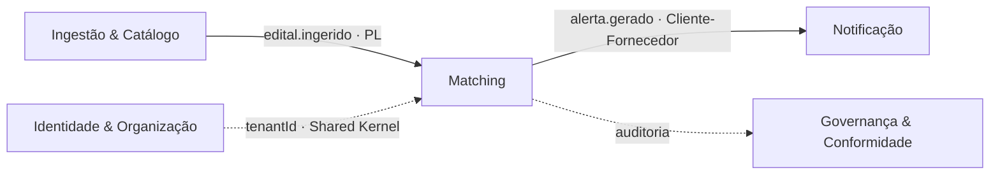

# A15 · Matching & Alerta — Clean Architecture

> Detalhamento do bounded context **Monitoramento & Matching** (documento 13, §3) seguindo os padrões de [A10](10-padroes-e-estrutura-de-codigo.md): camadas **domain / application / infra**, value objects, use cases, ports e erros customizados. Complementa o desenho de solução de [A03, §5](03-desenho-da-solucao.md#5-matching-docs11-no-mvp) e a visão de produto de [docs/11](../docs/11-monitoramento-matching-e-cobertura.md). Estágio: **Concepção** — código ilustrativo.

## 1. Posição no mapa de contextos

O Matching consome `edital.ingerido` publicado pela Ingestão (Published Language — docs/13 §4), cruza contra os critérios ativos e publica `alerta.gerado` para a Notificação (Cliente-Fornecedor — docs/13 §4). O `tenantId` é o único acoplamento com Identidade & Organização (Shared Kernel — docs/13 §5).



> **Nota de linguagem ubíqua:** "Aderência" neste contexto significa *quão relevante é o edital para o critério* (filtro estrutural + full-text, barato). Na Triagem, "Aderência" mede *quão apta está a empresa* (por IA, por perfil). Mesmo termo, modelos distintos — a fronteira do bounded context protege esse split (docs/13 §3, P-45).

## 2. Estrutura do módulo

```text
modules/
└─ matching/
   ├─ domain/
   │  ├─ criterio-de-monitoramento.ts    # agregado raiz
   │  ├─ alerta.ts                        # agregado raiz
   │  ├─ value-objects/
   │  │  ├─ aderencia-matching.ts         # [0,1] — recall-alto, não confundir com Triagem
   │  │  ├─ faixa-valor.ts               # de tabela parametrizável e datada (docs/02 §2)
   │  │  └─ palavras-chave.ts
   │  └─ errors/
   │     └─ index.ts
   ├─ application/
   │  ├─ ports.ts                         # interfaces tech-agnósticas
   │  └─ use-cases/
   │     ├─ definir-criterio-monitoramento.ts
   │     ├─ casar-edital-com-criterios.ts
   │     └─ registrar-feedback-alerta.ts
   └─ infra/
      ├─ db/
      │  ├─ postgres-criterio-repository.ts
      │  └─ postgres-alerta-repository.ts
      └─ events/
         └─ sqs-event-publisher.ts       # (ou Redis Streams / RabbitMQ — A01 §4)
```

## 3. Domain

### 3.1 Value objects

```ts
// domain/value-objects/aderencia-matching.ts
// Aderência no sentido de matching: quão relevante é o edital para o critério.
// Diferente da Aderência de Triagem (docs/13 §3, P-45) — não misturar.
export class AderenciaMatching {
  private constructor(readonly valor: number) {}

  static criar(valor: number): AderenciaMatching {
    if (valor < 0 || valor > 1) throw new AderenciaMatchingInvalidaError(valor);
    return new AderenciaMatching(valor);
  }

  // Postura recall-alto (docs/11 §2): limiar baixo intencionalmente.
  // P-21 (2026-07-11) fixou a barra como métrica — recall ≥ 90% no conjunto de controle —,
  // não como número: 0.3 é o ponto de partida a calibrar contra o gold set (A16).
  get superaLimiar(): boolean { return this.valor >= 0.3; }

  // "Alta aderência" = ≥ 0,80 — decisão de Produto P-81 (docs/11 §4). É o mesmo corte
  // que dispara alerta imediato na Notificação (A14 §2.1). Não confundir com a
  // `Aderencia` da Triagem (ehAlta ≥ 0,7, go/no-go — docs/10 §4, A17 §2): outro conceito (P-45).
  get ehAlta(): boolean { return this.valor >= 0.8; }
}
```

```ts
// domain/value-objects/faixa-valor.ts
// Faixas de valor definem-se por decreto e mudam com o tempo (docs/02 §2, docs/11 §5).
// NUNCA representar como constante no código — lida de tabela parametrizável e datada.
export class FaixaValor {
  private constructor(
    readonly min: number | null,   // null = sem piso
    readonly max: number | null,   // null = sem teto
  ) {}

  static criar(min: number | null, max: number | null): FaixaValor {
    if (min !== null && max !== null && min > max)
      throw new FaixaValorInvalidaError(min, max);
    return new FaixaValor(min, max);
  }

  abrange(valor: number): boolean {
    const acimaDoPiso = this.min === null || valor >= this.min;
    const abaixoDoTeto = this.max === null || valor <= this.max;
    return acimaDoPiso && abaixoDoTeto;
  }
}
```

```ts
// domain/value-objects/palavras-chave.ts
export class PalavrasChave {
  private constructor(readonly termos: readonly string[]) {}

  static criar(termos: string[]): PalavrasChave {
    const normalizados = termos.map(t => t.trim().toLowerCase()).filter(Boolean);
    if (normalizados.length === 0) throw new PalavrasChaveVaziaError();
    return new PalavrasChave(normalizados);
  }
}
```

### 3.2 Erros customizados

```ts
// domain/errors/index.ts
import { DomainError } from 'shared/kernel/ts/domain-error';

export class AderenciaMatchingInvalidaError extends DomainError {
  readonly code = 'ADERENCIA_MATCHING_INVALIDA';
  constructor(v: number) { super(`aderência de matching fora de [0,1]: ${v}`); }
}

export class FaixaValorInvalidaError extends DomainError {
  readonly code = 'FAIXA_VALOR_INVALIDA';
  constructor(min: number, max: number) { super(`faixa inválida: min ${min} > max ${max}`); }
}

export class PalavrasChaveVaziaError extends DomainError {
  readonly code = 'PALAVRAS_CHAVE_VAZIAS';
  constructor() { super('critério requer ao menos uma palavra-chave'); }
}

export class CriterioInvalidoError extends DomainError {
  readonly code = 'CRITERIO_INVALIDO';
  constructor(msg: string) { super(msg); }
}

// Erros de orquestração (vivem em application, mas declarados aqui por co-localização)
export class AcessoNegadoError extends DomainError {
  readonly code = 'ACESSO_NEGADO';
  constructor() { super('acesso negado: recurso não pertence ao cliente'); }
}

export class AlertaNaoEncontradoError extends DomainError {
  readonly code = 'ALERTA_NAO_ENCONTRADO';
  constructor(id: string) { super(`alerta não encontrado: ${id}`); }
}
```

### 3.3 Entidades (agregados raiz)

```ts
// domain/criterio-de-monitoramento.ts
export class CriterioDeMonitoramento {
  private constructor(
    readonly id: CriterioId,
    readonly tenantId: TenantId,              // Shared Kernel — presente desde o dia 1 (A01 §6)
    readonly clienteFinalId: ClienteFinalId,  // segregação por cliente (P-49)
    readonly ramoCnae: string | null,
    readonly regiaoUf: string | null,
    readonly faixaValor: FaixaValor | null,
    readonly palavrasChave: PalavrasChave | null,
    readonly ativo: boolean,
  ) {}

  static definir(params: {
    id: CriterioId;
    tenantId: TenantId;
    clienteFinalId: ClienteFinalId;
    ramoCnae?: string;
    regiaoUf?: string;
    faixaValor?: FaixaValor;
    palavrasChave?: PalavrasChave;
  }): CriterioDeMonitoramento {
    if (!params.ramoCnae && !params.palavrasChave)
      throw new CriterioInvalidoError('critério requer ao menos ramo/CNAE ou palavras-chave');
    return new CriterioDeMonitoramento(
      params.id, params.tenantId, params.clienteFinalId,
      params.ramoCnae ?? null, params.regiaoUf ?? null,
      params.faixaValor ?? null, params.palavrasChave ?? null,
      true,
    );
  }
}
```

```ts
// domain/alerta.ts
export class Alerta {
  private constructor(
    readonly id: AlertaId,
    readonly tenantId: TenantId,
    readonly clienteFinalId: ClienteFinalId,
    readonly criterioId: CriterioId,
    readonly editalId: EditalId,
    readonly aderencia: AderenciaMatching,
    public relevante: boolean | null,        // null = aguardando feedback do usuário
  ) {}

  static gerar(params: {
    id: AlertaId;
    tenantId: TenantId;
    clienteFinalId: ClienteFinalId;
    criterioId: CriterioId;
    editalId: EditalId;
    aderencia: AderenciaMatching;
  }): Alerta {
    return new Alerta(
      params.id, params.tenantId, params.clienteFinalId,
      params.criterioId, params.editalId, params.aderencia,
      null,
    );
  }

  registrarFeedback(relevante: boolean): void {
    this.relevante = relevante;
  }
}
```

## 4. Application

### 4.1 Ports (interfaces tech-agnósticas)

```ts
// application/ports.ts
// Convenção A10 §8: nome do port = papel (sem tecnologia). Adapter = <Tecnologia><Port>.

export interface EditalMatchingView {
  // Visão somente-leitura do Catálogo — o que o Matching precisa para cruzar.
  // Isolada do agregado Edital (que vive em Ingestão): o Matching não escreve no Catálogo.
  porId(id: EditalId, signal?: AbortSignal): Promise<EditalParaMatchingDTO | null>;
}

export interface CriterioRepository {
  salvar(criterio: CriterioDeMonitoramento, signal?: AbortSignal): Promise<void>;
  porId(id: CriterioId, signal?: AbortSignal): Promise<CriterioDeMonitoramento | null>;
  listarAtivos(signal?: AbortSignal): Promise<CriterioDeMonitoramento[]>;
  // P-40: fan-out (edital × todos os critérios) — implementação escolhe scan ou percolator.
  casarComEdital(edital: EditalParaMatchingDTO, signal?: AbortSignal): Promise<CriterioComScore[]>;
}

export interface AlertaRepository {
  salvar(alerta: Alerta, signal?: AbortSignal): Promise<void>;
  porId(id: AlertaId, signal?: AbortSignal): Promise<Alerta | null>;
  atualizarFeedback(id: AlertaId, relevante: boolean, signal?: AbortSignal): Promise<void>;
}

export interface FaixaValorReferencia {
  // Lê a tabela parametrizável e datada (docs/02 §2 / docs/11 §5).
  // Nunca um enum ou constante no código — valores mudam por decreto.
  faixasVigentes(data: Date, signal?: AbortSignal): Promise<FaixaValorDTO[]>;
}

export interface EventPublisher {
  publicar(evento: DomainEvent, signal?: AbortSignal): Promise<void>;
}
```

### 4.2 DTOs

```ts
// application/dtos.ts
export interface EditalParaMatchingDTO {
  id: EditalId;
  tenantScope: 'global';              // catálogo é global no MVP (A03 §4)
  modalidadeCodigo: number;
  objetoDescricao: string;
  uf: string | null;
  cnae: string | null;
  valorEstimado: number | null;
  dataPublicacao: Date;
}

export interface CriterioComScore {
  criterio: CriterioDeMonitoramento;
  score: number;                      // [0,1] calculado pelo adapter (SQL + full-text)
}

export interface CriterioDTO {
  id: string;
  clienteFinalId: string;
  ramoCnae: string | null;
  regiaoUf: string | null;
  faixaValorMin: number | null;
  faixaValorMax: number | null;
  palavrasChave: string[];
}

export interface AlertaDTO {
  id: string;
  editalId: string;
  criterioId: string;
  clienteFinalId: string;
  aderencia: number;
}

export interface FaixaValorDTO {
  codigo: string;
  min: number | null;
  max: number | null;
  vigenteDe: Date;
  vigenteAte: Date | null;
}
```

### 4.3 Use cases

```ts
// application/use-cases/definir-criterio-monitoramento.ts
export interface DefinirCriterioInput {
  clienteFinalId: string;
  ramoCnae?: string;
  regiaoUf?: string;
  faixaValorCodigo?: string;           // chave da tabela de referência — não um valor fixo
  palavrasChave?: string[];
  signal?: AbortSignal;
}

export class DefinirCriterioMonitoramentoUseCase {
  constructor(
    private readonly criterios: CriterioRepository,
    private readonly faixasRef: FaixaValorReferencia,
    private readonly ids: IdProvider,
    private readonly clock: ClockProvider,
  ) {}

  async executar(input: DefinirCriterioInput): Promise<CriterioDTO> {
    // Faixa de valor: lida da tabela datada, nunca hardcoded (docs/02 §2)
    let faixaValor: FaixaValor | undefined;
    if (input.faixaValorCodigo) {
      const faixas = await this.faixasRef.faixasVigentes(this.clock.agora(), input.signal);
      const dto = faixas.find(f => f.codigo === input.faixaValorCodigo);
      if (!dto) throw new CriterioInvalidoError(`faixa de valor desconhecida: ${input.faixaValorCodigo}`);
      faixaValor = FaixaValor.criar(dto.min, dto.max);
    }

    const criterio = CriterioDeMonitoramento.definir({
      id: this.ids.gerar(),
      tenantId: 'global' as TenantId,   // MVP: single-tenant (P-25)
      clienteFinalId: input.clienteFinalId as ClienteFinalId,
      ramoCnae: input.ramoCnae,
      regiaoUf: input.regiaoUf,
      faixaValor,
      palavrasChave: input.palavrasChave
        ? PalavrasChave.criar(input.palavrasChave)
        : undefined,
    });

    await this.criterios.salvar(criterio, input.signal);
    return CriterioDTO.de(criterio);
  }
}
```

```ts
// application/use-cases/casar-edital-com-criterios.ts
// Trigger: evento edital.ingerido (A03 §3) — nunca no caminho síncrono da API.
export interface CasarEditalInput {
  editalId: string;
  signal?: AbortSignal;
}

export class CasarEditalComCriteriosUseCase {
  constructor(
    private readonly editais: EditalMatchingView,
    private readonly criterios: CriterioRepository,
    private readonly alertas: AlertaRepository,
    private readonly eventos: EventPublisher,
    private readonly ids: IdProvider,
  ) {}

  async executar(input: CasarEditalInput): Promise<AlertaDTO[]> {
    const edital = await this.editais.porId(input.editalId as EditalId, input.signal);
    if (!edital) return [];   // edital pode ter sido removido/reconciliado — não é erro

    // Fan-out: edital × critérios ativos (P-40 — scan no MVP; percolator no Next)
    const casamentos = await this.criterios.casarComEdital(edital, input.signal);

    const alertasGerados: AlertaDTO[] = [];

    for (const { criterio, score } of casamentos) {
      const aderencia = AderenciaMatching.criar(score);

      // Postura recall-alto (docs/11 §2): gera alerta mesmo com score baixo,
      // desde que supere o limiar mínimo. Limiares exatos → P-21.
      if (!aderencia.superaLimiar) continue;

      const alerta = Alerta.gerar({
        id: this.ids.gerar(),
        tenantId: criterio.tenantId,
        clienteFinalId: criterio.clienteFinalId,
        criterioId: criterio.id,
        editalId: edital.id,
        aderencia,
      });

      await this.alertas.salvar(alerta, input.signal);

      // alerta.gerado → Notificação (A03 §3) — payload carrega o ESCOPO (clienteFinalId), não o
      // destinatário: quem/e-mail é resolvido pela Notificação (Cliente-Fornecedor; MVP 1:1, P-25).
      await this.eventos.publicar(new AlertaGerado({
        alertaId: alerta.id,
        tenantId: alerta.tenantId,
        clienteFinalId: alerta.clienteFinalId,
        criterioId: alerta.criterioId,
        editalId: alerta.editalId,
        aderencia: alerta.aderencia.valor,
      }), input.signal);

      alertasGerados.push(AlertaDTO.de(alerta));
    }

    return alertasGerados;
  }
}
```

```ts
// application/use-cases/registrar-feedback-alerta.ts
export interface RegistrarFeedbackInput {
  alertaId: string;
  relevante: boolean;
  clienteFinalId: string;   // para autorização por objeto (P-51)
  signal?: AbortSignal;
}

export class RegistrarFeedbackAlertaUseCase {
  constructor(
    private readonly alertas: AlertaRepository,
    private readonly eventos: EventPublisher,
  ) {}

  async executar(input: RegistrarFeedbackInput): Promise<void> {
    const alerta = await this.alertas.porId(input.alertaId as AlertaId, input.signal);

    if (!alerta) throw new AlertaNaoEncontradoError(input.alertaId);

    // Autorização POR OBJETO (P-51 / AB1): o alerta deve pertencer ao clienteFinal que
    // está registrando o feedback — defesa de IDOR/BOLA, vetor nº1 de vazamento cross-tenant.
    if (alerta.clienteFinalId !== input.clienteFinalId) throw new AcessoNegadoError();

    alerta.registrarFeedback(input.relevante);
    await this.alertas.atualizarFeedback(alerta.id, input.relevante, input.signal);

    // feedback.alerta → Matching (A03 §3) — usado para ajustar pesos futuramente (docs/11 §5)
    await this.eventos.publicar(new FeedbackAlerta({
      alertaId: alerta.id,
      relevante: input.relevante,
    }), input.signal);
  }
}
```

## 5. Infra

### 5.1 Adapter de repositório

```ts
// infra/db/postgres-criterio-repository.ts
export class PostgresCriterioRepository implements CriterioRepository {

  async salvar(criterio: CriterioDeMonitoramento, signal?: AbortSignal): Promise<void> {
    // upsert por id — idempotente (A01 §3)
    await this.db.query(
      `INSERT INTO criterio_monitoramento (id, tenant_id, cliente_final_id, ramo_cnae,
         regiao_uf, faixa_valor_min, faixa_valor_max, palavras_chave, ativo)
       VALUES ($1,$2,$3,$4,$5,$6,$7,$8,$9)
       ON CONFLICT (id) DO UPDATE SET ...`,
      [...],
      { signal },
    );
  }

  async casarComEdital(edital: EditalParaMatchingDTO, signal?: AbortSignal): Promise<CriterioComScore[]> {
    // Filtros estruturados + full-text (A03 §5):
    //   1. WHERE ativo = true
    //   2. AND (ramo_cnae IS NULL OR ramo_cnae = $cnae)
    //   3. AND (regiao_uf IS NULL OR regiao_uf = $uf)
    //   4. AND (faixa_valor_min IS NULL OR $valor >= faixa_valor_min)
    //   5. AND (faixa_valor_max IS NULL OR $valor <= faixa_valor_max)
    //   6. ORDER BY ts_rank(objeto_tsv, to_tsquery($palavras)) DESC
    //
    // P-40: em escala, trocar scan por percolator (pré-indexar critérios, match invertido).
    // No MVP single-tenant com poucos critérios, scan é aceitável. [A VALIDAR] → P-40
    throw new Error('não implementado — ilustrativo');
  }
}
```

### 5.2 Mapeamento de erros na borda

```ts
// infra/error-mapping.ts
// O mesmo padrão de A10 §4.6 — o núcleo nunca conhece gRPC/HTTP.
export function paraHttpStatus(err: unknown): number {
  if (err instanceof AcessoNegadoError)       return 403;
  if (err instanceof AlertaNaoEncontradoError) return 404;
  if (err instanceof CriterioInvalidoError)    return 400;
  if (err instanceof AderenciaMatchingInvalidaError) return 400;
  if (err instanceof DomainError)              return 400;
  return 500;  // nunca vaza stack/PII (P-61)
}
```

## 6. Fan-out e performance (P-40)

O `CasarEditalComCriteriosUseCase` cruza **1 edital × N critérios ativos**. No MVP (single-tenant, N pequeno), um scan SQL com filtros estruturados + `ts_rank` é suficiente — O(N) por edital ingerido.

Em escala (Next/multi-tenant, N grande):

| Estratégia | Quando | Trade-off |
|------------|--------|-----------|
| **Scan SQL** | MVP, N < 10 k critérios | Simples; degrada linearmente |
| **Percolator** (índice invertido de critérios) | Next, N > 10 k | Complexidade de manutenção; escala melhor |
| **Particionamento por tenant** | Multi-tenant | Isola fan-out por tenant |

Decisão de escala: **P-40** (pré-Next).

## 7. Eventos publicados (A03, §3)

| Evento | Emissor | Consumidor | Payload |
|--------|---------|-----------|---------|
| `alerta.gerado` | `CasarEditalComCriteriosUseCase` | Notificação | `tenantId`, `clienteFinalId`, `criterioId`, `editalId`, `aderencia` |
| `feedback.alerta` | `RegistrarFeedbackAlertaUseCase` | Matching (ajuste de pesos — docs/11 §5) | `alertaId`, `relevante` |
| `criterio.definido` | `DefinirCriterioMonitoramentoUseCase` | — (audit) | `criterioId`, `clienteFinalId` |

Toda mensagem carrega `tenantId`, mesmo no MVP single-tenant (A01 §6).

## 8. Como este documento respeita as decisões anteriores

- **Aderência distinta da Triagem (P-45 / docs/13 §3):** `AderenciaMatching` é um VO separado; o código não reutiliza o VO de Triagem.
- **Autorização por objeto (P-51 / AB1):** verificação explícita `alerta.clienteFinalId !== input.clienteFinalId` antes de qualquer mutação.
- **Faixa de valor por decreto (docs/02 §2):** lida de `FaixaValorReferencia` (port) → `faixaValorCodigo` no input, nunca constante.
- **AbortSignal em toda operação (P-78 / A10 §1):** todos os use cases e ports recebem `signal?: AbortSignal`.
- **tenantId desde o dia 1 (A01 §6):** presente em `CriterioDeMonitoramento` e `Alerta`.
- **Recall-alto (docs/11 §2):** `aderencia.superaLimiar` usa limiar baixo; P-21 fixou a barra em recall ≥ 90% / precisão ≥ 60% — o número (0.3) é calibrado contra o gold set (A16), não decidido no código.
- **Eventos mantidos (A03):** `alerta.gerado` e `feedback.alerta` publicados via `EventPublisher` (port), não chamada direta.

## 9. Pendências

| Referência | Pendência |
|------------|-----------|
| P-21 / P-81 | **Resolvidos (Produto, 2026-07-11, RAD-200).** Barra: recall ≥ 90% / precisão ≥ 60% (calibrar `superaLimiar` contra o gold set — A16). `ehAlta` = **0,80**, o corte de alerta imediato de P-81 (A14 §§2.1, 7). Política de digest: A14 §7 |
| P-40 | Estratégia de fan-out em escala (scan → percolator) |
| P-49 | `clienteFinalId` em CRITERIO e ALERTA — ativar isolamento no Next multi-tenant |
| P-51 | Testes de autorização por objeto como gate de release |
| P-78 | Verificar que `AbortSignal` está sendo propagado até o driver de DB/fila |

Pendências consolidadas em [docs/98](../docs/98-decisoes-e-pendencias.md).
