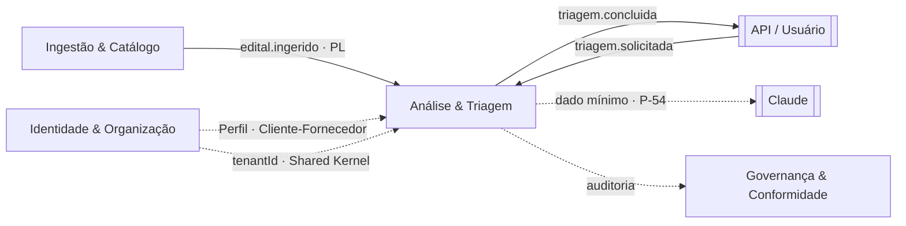

# A17 · Análise & Triagem — Clean Architecture

> Detalhamento do bounded context **Análise & Triagem** (documento 13, §3 · tipo: **Core**) seguindo os padrões de [A10](10-padroes-e-estrutura-de-codigo.md): camadas **domain / application / infra**, value objects, use cases, ports e erros customizados. Realiza a barra de qualidade de [docs/10](../docs/10-modulo-analise-ia.md), os use cases de [docs/14, §3](../docs/14-casos-de-uso.md#3-análise--triagem) e a defesa de injeção de [A11](11-seguranca-da-ia.md). O gold set e a avaliação (eval) vivem em [A16](16-plano-de-verificacao-e-gold-set.md) — aqui está o **seam de código** que aquele plano exercita. Estágio: **Concepção** — código ilustrativo.
>
> Convenções de código: ports sem tecnologia no nome (A10 §8); todo use case recebe e propaga `AbortSignal` (A10 §1 / P-78); o adapter do LLM é onde as camadas 1–4 de A11 vivem (A10 §4.6).

## 1. Posição no mapa de contextos

A Triagem é o **core** da esteira (documento 13, §2): transforma "achei um edital" em "vale a pena, e aqui está o porquê" (docs/10 §1). Ela **consome** `edital.ingerido` (Published Language — docs/13 §4) para pré-extrair na ingestão; é **acionada** de forma assíncrona por `triagem.solicitada` (a API publica o comando via `SolicitarTriagemUseCase`; um worker consome — A03 §§1,3); lê o **Perfil de Habilitação** de Identidade & Organização via **Cliente-Fornecedor** (docs/13 §5, P-43); e **publica** `triagem.concluida`. O `tenantId` é o único acoplamento estrutural com Identidade (Shared Kernel — docs/13 §5). O edital, dado de terceiro, vai a um LLM externo com **contexto mínimo** (P-54).



> **Nota de linguagem ubíqua (docs/13 §3, P-45):**
> - **"Aderência"** aqui significa *quão apta a empresa está para o edital* (cara, por IA, por perfil) — distinta da Aderência do Matching, que é *quão relevante é o edital para o critério* (barata, estrutural). Mesmo termo, modelos distintos; o `Aderencia` deste contexto **não** reutiliza o VO do Matching.
> - **"Extração" ≠ "Aderência"**: `ExtracaoEdital` são os **fatos do edital** (1 por edital, **cacheável**, catálogo global sem `tenantId`); `Triagem` é a **aderência da empresa** (1 por `edital × perfil`, escopada a `tenantId`/`clienteFinalId`). Unir as duas quebraria o cache (custo) ou a correção (docs/12 §2, P-45).

## 2. Estrutura do módulo

```text
modules/
└─ triagem/
   ├─ domain/
   │  ├─ extracao-edital.ts               # agregado raiz — 1 por edital, cacheável (P-45)
   │  ├─ triagem.ts                       # agregado raiz — 1 por edital × perfil (P-45)
   │  ├─ perfil-habilitacao.ts            # modelo LOCAL conformante (fonte: Identidade, P-43)
   │  ├─ value-objects/
   │  │  ├─ confianca.ts                  # [0,1] — política de limiar (docs/10 §4, P-19)
   │  │  ├─ aderencia.ts                  # [0,1] — quão apta a empresa está (≠ Matching)
   │  │  ├─ citacao.ts                    # trecho + página: sem citação, não é fato (docs/10 §4)
   │  │  ├─ campo-extraido.ts             # valor + confiança + citação + is_critico (docs/10 §5.2)
   │  │  ├─ requisito.ts                  # exigência de habilitação extraída
   │  │  └─ risco.ts
   │  └─ errors/
   │     └─ index.ts
   ├─ application/
   │  ├─ ports.ts                         # interfaces tech-agnósticas
   │  ├─ dtos.ts
   │  └─ use-cases/
   │     ├─ solicitar-triagem.ts          # API → publica triagem.solicitada (authz na borda)
   │     ├─ extrair-edital.ts             # interno / edital.ingerido — cacheia por edital
   │     └─ triar-edital.ts               # worker de triagem.solicitada — aderência por perfil
   └─ infra/
      ├─ llm/
      │  └─ anthropic-llm-gateway.ts      # camadas 1–4 de A11 (defesa de injeção)
      ├─ db/
      │  ├─ postgres-extracao-repository.ts   # catálogo global (sem tenantId)
      │  └─ postgres-triagem-repository.ts    # escopado a tenantId/clienteFinalId
      ├─ identidade/
      │  └─ perfil-habilitacao-adapter.ts # lê Perfil de Identidade (Cliente-Fornecedor · P-83)
      ├─ storage/
      │  └─ s3-object-storage.ts          # anexos do edital (baixados pela Ingestão)
      └─ events/
         └─ sqs-event-publisher.ts        # (ou Redis Streams / RabbitMQ — A01 §4)
```

## 3. Domain

### 3.1 Value objects

```ts
// domain/value-objects/confianca.ts — realiza A10 §4.1
export class Confianca {
  private constructor(readonly valor: number) {}

  static criar(valor: number): Confianca {
    if (valor < 0 || valor > 1) throw new ConfiancaInvalidaError(valor);
    return new Confianca(valor);
  }

  // Limiar por campo é [A VALIDAR] → P-19; calibrado contra o gold set (A16 §2.4).
  suficiente(limiar: number): boolean { return this.valor >= limiar; }

  static menor(a: Confianca, b: Confianca): Confianca {
    return a.valor <= b.valor ? a : b;
  }
}
```

```ts
// domain/value-objects/aderencia.ts — realiza A10 §4.1
// Aderência de TRIAGEM: quão apta a empresa está (por perfil, por IA).
// NÃO confundir com AderenciaMatching (A15 §3.1, docs/13 §3, P-45).
export class Aderencia {
  private constructor(readonly valor: number) {}

  static criar(valor: number): Aderencia {
    if (valor < 0 || valor > 1) throw new AderenciaInvalidaError(valor);
    return new Aderencia(valor);
  }

  // Limiar de "go" é sugestão; a decisão é sempre do usuário (HITL — docs/10 §4).
  // O corte exato é [A VALIDAR] → P-19.
  get ehAlta(): boolean { return this.valor >= 0.7; }
}
```

```ts
// domain/value-objects/citacao.ts
// Toda afirmação exibida como fato linka o trecho-fonte (docs/10 §4). É regra de qualidade E de
// segurança: conteúdo inventado por injeção não tem citação que bate (A11 §2, camada 6).
export class Citacao {
  private constructor(
    readonly pagina: number,
    readonly secao: string | null,
    readonly trecho: string,
  ) {}

  static criar(pagina: number, trecho: string, secao?: string): Citacao {
    if (pagina < 1 || trecho.trim().length === 0) throw new CitacaoInvalidaError();
    return new Citacao(pagina, secao ?? null, trecho.trim());
  }
}
```

```ts
// domain/value-objects/campo-extraido.ts
// Cada campo carrega SEU próprio score e SUA citação (docs/10 §4, princípio 2).
// `critico` reflete o is_critico do esquema de rótulo (docs/10 §5.2 / A16 §2.2).
export class CampoExtraido<T> {
  private constructor(
    readonly valor: T,
    readonly confianca: Confianca,
    readonly citacao: Citacao | null,
    readonly critico: boolean,
  ) {}

  static criar<T>(p: {
    valor: T; confianca: Confianca; citacao: Citacao | null; critico: boolean;
  }): CampoExtraido<T> {
    return new CampoExtraido(p.valor, p.confianca, p.citacao, p.critico);
  }

  // Sem citação, não se exibe como fato (docs/10 §4). Abaixo do limiar, marca "verificar".
  exibivelComoFato(limiar: number): boolean {
    return this.citacao !== null && this.confianca.suficiente(limiar);
  }
}
```

```ts
// domain/value-objects/requisito.ts
export type CategoriaHabilitacao = 'juridica' | 'fiscal' | 'tecnica' | 'economica';

export class Requisito {
  private constructor(
    readonly categoria: CategoriaHabilitacao,
    readonly descricao: string,
    readonly citacao: Citacao | null,
  ) {}

  static criar(categoria: CategoriaHabilitacao, descricao: string, citacao: Citacao | null): Requisito {
    if (descricao.trim().length === 0) throw new RequisitoInvalidoError();
    return new Requisito(categoria, descricao.trim(), citacao);
  }
}
```

```ts
// domain/value-objects/risco.ts
export type Severidade = 'baixa' | 'media' | 'alta';

export class Risco {
  private constructor(
    readonly descricao: string,
    readonly severidade: Severidade,
    readonly citacao: Citacao | null,
  ) {}

  static criar(descricao: string, severidade: Severidade, citacao: Citacao | null): Risco {
    return new Risco(descricao, severidade, citacao);
  }
}
```

### 3.2 Erros customizados

```ts
// domain/errors/index.ts
import { DomainError } from '@radar/kernel';   // Shared Kernel — base + AcessoNegadoError (docs/13 §5)

export class ConfiancaInvalidaError extends DomainError {
  readonly code = 'CONFIANCA_INVALIDA';
  constructor(v: number) { super(`confiança fora de [0,1]: ${v}`); }
}

// → fallback leitura assistida (docs/10 §6). Mapeado para FAILED_PRECONDITION / 422 na borda.
export class ConfiancaInsuficienteError extends DomainError {
  readonly code = 'CONFIANCA_INSUFICIENTE';
  constructor() { super('extração abaixo do limiar de confiança — degradar para leitura assistida'); }
}

export class AderenciaInvalidaError extends DomainError {
  readonly code = 'ADERENCIA_INVALIDA';
  constructor(v: number) { super(`aderência fora de [0,1]: ${v}`); }
}

export class CitacaoInvalidaError extends DomainError {
  readonly code = 'CITACAO_INVALIDA';
  constructor() { super('citação requer página válida e trecho não-vazio'); }
}

export class RequisitoInvalidoError extends DomainError {
  readonly code = 'REQUISITO_INVALIDO';
  constructor() { super('requisito requer descrição não-vazia'); }
}

// OCR falhou / PDF-imagem ilegível (docs/10 §6). Não inventar conteúdo.
export class OcrFalhouError extends DomainError {
  readonly code = 'OCR_FALHOU';
  constructor() { super('OCR falhou — marcar "requer leitura manual"'); }
}

// Saída do LLM não bate no schema (A11 §2, camada 3). A saída do modelo é NÃO-confiável.
export class SaidaLlmInvalidaError extends DomainError {
  readonly code = 'SAIDA_LLM_INVALIDA';
  constructor(motivo: string) { super(`saída do LLM rejeitada pelo schema: ${motivo}`); }
}

// Erro de orquestração (co-localizado; ver A10 §6)
export class PerfilNaoEncontradoError extends DomainError {
  readonly code = 'PERFIL_NAO_ENCONTRADO';
  constructor(id: string) { super(`perfil de habilitação não encontrado: ${id}`); }
}
```

> `AcessoNegadoError` vem do Shared Kernel (`@radar/kernel`) — é o mesmo erro de IDOR/cross-tenant usado em todos os contextos (A10 §6, P-51).

### 3.3 Agregados raiz

```ts
// domain/extracao-edital.ts — 1 por edital, CACHEÁVEL (P-45). Catálogo GLOBAL: sem tenantId (docs/12 §2).
import { EditalId } from '@radar/kernel';

export class ExtracaoEdital {
  private constructor(
    readonly editalId: EditalId,
    readonly objeto: CampoExtraido<string>,
    readonly valorEstimado: CampoExtraido<number | null>,   // null = sigiloso/omitido (docs/10 §5.2)
    readonly dataAberturaPropostas: CampoExtraido<Date | null>,
    readonly requisitos: Requisito[],
    readonly riscosBrutos: Risco[],
    readonly paginas: number,   // nº de páginas do edital (PDF/OCR) — fonte de `paginasEdital` no contrato de leitura (§4.2 TriagemLeituraDTO)
  ) {}

  static montar(p: {
    editalId: EditalId;
    objeto: CampoExtraido<string>;
    valorEstimado: CampoExtraido<number | null>;
    dataAberturaPropostas: CampoExtraido<Date | null>;
    requisitos: Requisito[];
    riscosBrutos: Risco[];
    paginas: number;
  }): ExtracaoEdital {
    return new ExtracaoEdital(
      p.editalId, p.objeto, p.valorEstimado, p.dataAberturaPropostas,
      p.requisitos, p.riscosBrutos, p.paginas,
    );
  }

  private get camposCriticos(): CampoExtraido<unknown>[] {
    return [this.objeto, this.valorEstimado, this.dataAberturaPropostas].filter(c => c.critico);
  }

  // Confiança agregada = a MENOR entre os campos críticos: um único campo crítico fraco
  // derruba a extração inteira (docs/10 §4). É o `confianca` persistido (docs/12 §1).
  confiancaGlobal(): Confianca {
    return this.camposCriticos.reduce(
      (min, c) => Confianca.menor(min, c.confianca),
      Confianca.criar(1),
    );
  }

  suficiente(limiar: number): boolean {
    return this.confiancaGlobal().suficiente(limiar);
  }
}
```

```ts
// domain/perfil-habilitacao.ts
// Modelo LOCAL conformante. A FONTE DA VERDADE é Identidade & Organização (docs/13 §5, P-43);
// aqui é uma visão de leitura consumida via Cliente-Fornecedor. A Triagem NÃO possui este agregado.
import { PerfilId, ClienteFinalId } from '@radar/kernel';

export class PerfilHabilitacao {
  private constructor(
    readonly id: PerfilId,
    readonly clienteFinalId: ClienteFinalId,     // usado na autorização por objeto (P-51)
    readonly habJuridica: string[],
    readonly habFiscal: string[],
    readonly habTecnica: string[],
    readonly habEconomica: string[],             // campos definidos em docs/12 (P-50)
  ) {}

  // Factory usado pelo PerfilHabilitacaoAdapter (infra) após o ACL traduzir o modelo externo.
  // RAD-56: IDs chegam já branded (o cast string→PerfilId/ClienteFinalId é responsabilidade do adapter).
  static de(props: { id: PerfilId; clienteFinalId: ClienteFinalId; habJuridica: string[]; habFiscal: string[]; habTecnica: string[]; habEconomica: string[] }): PerfilHabilitacao {
    return new PerfilHabilitacao(
      props.id, props.clienteFinalId,
      props.habJuridica, props.habFiscal, props.habTecnica, props.habEconomica,
    );
  }

  // Regra de domínio: confronta o perfil da empresa com os requisitos do edital. Produz aderência
  // [0,1] + a lista de riscos (lacunas de habilitação). Cada risco herda a citação do requisito de
  // origem — sem fonte, não vira afirmação (docs/10 §4).
  confrontar(requisitos: Requisito[]): { aderencia: Aderencia; riscos: Risco[] } {
    const possuidos: Record<CategoriaHabilitacao, string[]> = {
      juridica: this.habJuridica, fiscal: this.habFiscal,
      tecnica: this.habTecnica, economica: this.habEconomica,
    };
    const riscos: Risco[] = [];
    let atendidos = 0;

    for (const req of requisitos) {
      const atende = possuidos[req.categoria].some(h => atendeRequisito(h, req.descricao));
      if (atende) atendidos++;
      else riscos.push(Risco.criar(`não atende: ${req.descricao}`, severidadeDe(req.categoria), req.citacao));
    }

    const valor = requisitos.length === 0 ? 0 : atendidos / requisitos.length;
    return { aderencia: Aderencia.criar(valor), riscos };
  }
}
```

```ts
// domain/triagem.ts — aggregate: aderência por (edital, perfil) (P-45). Escopado ao tenant.
import { EditalId, PerfilId, TenantId, ClienteFinalId } from '@radar/kernel';

export type Recomendacao = 'go' | 'no-go';

export class Triagem {
  private constructor(
    readonly editalId: EditalId,
    readonly perfilId: PerfilId,
    readonly tenantId: TenantId,                 // Shared Kernel — desde o dia 1 (A01 §6)
    readonly clienteFinalId: ClienteFinalId,     // segregação por cliente (P-49)
    readonly aderencia: Aderencia,
    readonly recomendacao: Recomendacao,
    readonly riscos: Risco[],
  ) {}

  // A recomendação é uma SUGESTÃO — a decisão go/no-go é sempre do usuário (HITL, docs/10 §4).
  static avaliar(extracao: ExtracaoEdital, perfil: PerfilHabilitacao, tenantId: TenantId): Triagem {
    const { aderencia, riscos } = perfil.confrontar(extracao.requisitos);
    return new Triagem(
      extracao.editalId, perfil.id, tenantId, perfil.clienteFinalId,
      aderencia, aderencia.ehAlta ? 'go' : 'no-go', riscos,
    );
  }
}
```

## 4. Application

### 4.1 Ports (interfaces tech-agnósticas)

```ts
// application/ports.ts — Convenção A10 §8: port = papel, sem tecnologia. Adapter = <Tecnologia><Port>.

// Extração é catálogo GLOBAL e cacheável (P-45): a chave é só o editalId, sem tenantId.
export interface ExtracaoRepository {
  porEdital(id: EditalId, signal?: AbortSignal): Promise<ExtracaoEdital | null>;
  salvar(extracao: ExtracaoEdital, signal?: AbortSignal): Promise<void>;
}

// Triagem é escopada ao tenant/cliente (P-49). A leitura por chave natural recebe o ESCOPO
// (tenantId/clienteFinalId) além do sub-key: a chave única é (tenant, edital, perfil) (P-45), então
// filtrar só por (edital, perfil) não é único sob multi-tenant → escopa a query; authz por objeto
// (§5.3, P-51) fica como defesa em profundidade.
export interface TriagemRepository {
  salvar(triagem: Triagem, signal?: AbortSignal): Promise<void>;
  porEditalEPerfil(tenantId: TenantId, clienteFinalId: ClienteFinalId, editalId: EditalId, perfilId: PerfilId, signal?: AbortSignal): Promise<Triagem | null>;
}

// Perfil de Habilitação: leitura de Identidade & Organização (Cliente-Fornecedor, P-43). A Triagem
// lê, nunca escreve — não é dona do agregado.
// Decisão P-83 (2026-07-05): é um **Gateway**, não um Repository. Na taxonomia de ports (A10 §8) o
// Repository possui/persiste um agregado do próprio contexto (EditalRepository, TriagemRepository); o
// Gateway lê o modelo de OUTRO contexto/externo via ACL/Cliente-Fornecedor (PncpGateway, LlmGateway).
// Como a Triagem NÃO possui o Perfil, o port é `PerfilGateway`. É um port consumer-defined, distinto do
// `IdentidadeGateway` da Governança (§ docs/14 §5) — mesmo padrão (Gateway), consumidores e contratos
// diferentes; só o `tenantId` é compartilhado (Shared Kernel).
// RAD-56: ACL moveu para o adapter de infra → port devolve o modelo local conformante diretamente.
export interface PerfilGateway {
  porId(id: PerfilId, signal?: AbortSignal): Promise<PerfilHabilitacao | null>;
}

// Anexos do edital (PDFs) no object storage — baixados pela Ingestão (BaixarAnexosEditalUseCase,
// docs/14 §1); a Triagem apenas lê o conteúdo para alimentar a extração.
export interface ObjectStorage {
  obterTextoAnexo(ref: string, signal?: AbortSignal): Promise<string>;
}

// Fronteira com o LLM. O adapter (AnthropicLlmGateway) aplica a defesa de injeção (A11 §2). A saída
// já vem validada por schema — o que não bate é rejeitado (SaidaLlmInvalidaError). Generaliza a
// assinatura de A10 §4.4 (`extrair(editalTexto)`) para incluir anexos.
export interface LlmGateway {
  extrair(entrada: EntradaExtracaoDTO, signal?: AbortSignal): Promise<ExtracaoEdital>;
}

export interface EventPublisher {
  publicar(evento: DomainEvent, signal?: AbortSignal): Promise<void>;
}
```

### 4.2 DTOs

```ts
// application/dtos.ts
export interface EntradaExtracaoDTO {
  editalId: string;
  texto: string;                 // texto selecionável já extraído (ou saída do OCR)
  temTextoSelecionavel: boolean; // false → passou por OCR (docs/10 §3)
  anexos: string[];              // texto de cada anexo, já resolvido do ObjectStorage
  paginas: number;               // nº de páginas do PDF/OCR — o worker mede ao hidratar; alimenta ExtracaoEdital.paginas (§3)
  // NUNCA inclui classe crítica / estratégia comercial — contexto mínimo ao LLM (P-54).
}

// PerfilParaTriagemDTO removido (RAD-56): o PerfilGateway agora devolve PerfilHabilitacao diretamente;
// o ACL (cast string→branded IDs) vive no PerfilHabilitacaoAdapter (infra), não na application.

export interface ExtracaoEditalDTO {
  editalId: string;
  objeto: string;
  confianca: number;             // confiança agregada (mínimo dos campos críticos)
  campos: { nome: string; valor: unknown; confianca: number; citacao: CitacaoDTO | null }[];
}

export interface CitacaoDTO { pagina: number; secao: string | null; trecho: string; }

export interface TriagemDTO {
  editalId: string;
  perfilId: string;
  aderencia: number;
  recomendacao: 'go' | 'no-go';  // sugestão — a decisão é do usuário
  riscos: { descricao: string; severidade: string; citacao: CitacaoDTO | null }[];
}

// CONTRATO DE LEITURA SÍNCRONO (BFF GET /api/triagem/:editalId — docs/98 P-86, RAD-31).
// É DISTINTO do TriagemDTO/evento acima: fonte da verdade EXECUTÁVEL é o front (a SPA fixou o shape),
// espelhado em apps/web/domain/triagem-view-model.ts e apps/api/src/routes/triagem.ts::TriagemResponseSchema.
// NÃO carrega `riscos[]`: as lacunas de habilitação são exatamente os itens `checklist.ok === false`.
export interface TriagemLeituraDTO {
  editalId: string;
  perfilId: string;
  aderencia: number;             // [0,1] — Triagem.aderencia.valor
  recomendacao: 'go' | 'no-go';
  confiancaIA: number;           // [0,1] — ExtracaoEdital.confiancaGlobal().valor
  paginasEdital: number;         // ExtracaoEdital.paginas (§3)
  camposAnalise: { titulo: string; conteudo: string; fonte: string }[];  // projeção dos CampoExtraido
  checklist: { ok: boolean; texto: string }[];                           // 1 item por Requisito
}

// Comando publicado na fila (docs/14 §3): payload enxuto.
export interface SolicitarTriagemInput {
  editalId: string; perfilId: string; clienteFinalId: string; signal?: AbortSignal;
}
export interface ExtrairEditalInput {
  editalId: string; texto: string; temTextoSelecionavel: boolean;
  anexosRefs: string[];
  paginas: number;               // nº de páginas medido ao hidratar → alimenta EntradaExtracaoDTO.paginas → ExtracaoEdital.paginas (§3); obrigatório para o read path (paginasEdital, §4.2). RAD-30.
  signal?: AbortSignal;
}
// Input do worker: o consumidor de `triagem.solicitada` hidrata o conteúdo do edital
// (texto/anexos) e o limiar antes de invocar o use case (A03 §4.5 usa editalTexto no input).
// RAD-56: tenantId é campo obrigatório do input (resolvido no worker/borda; P-25: 'global' no MVP).
// signal é parâmetro separado de executar(), não parte do DTO de entrada.
export interface TriarEditalInput {
  editalId: string; perfilId: string; clienteFinalId: string;
  tenantId: string;              // Shared Kernel (docs/13 §5) — 'global' no MVP single-tenant (P-25)
  conteudo: EntradaExtracaoDTO;  // hidratado pelo worker a partir do Catálogo/ObjectStorage
  limiarConfianca: number;       // da política de confiança (docs/10 §4, P-19)
}
```

### 4.3 Use cases

```ts
// application/use-cases/solicitar-triagem.ts
// Trigger: Usuário (API). Faz a 1ª verificação de autorização (defesa em profundidade) e publica
// o comando na fila — a triagem em si é assíncrona (custo/latência, A03 §§1,3; A00 princípio 6).
export class SolicitarTriagemUseCase {
  constructor(
    private readonly perfis: PerfilGateway,
    private readonly eventos: EventPublisher,
  ) {}

  async executar(input: SolicitarTriagemInput): Promise<void> {
    // Autorização por objeto JÁ na borda (P-51 / AB1): não enfileira pedido de perfil alheio.
    const perfil = await this.perfis.porId(input.perfilId as PerfilId, input.signal);
    if (!perfil || perfil.clienteFinalId !== input.clienteFinalId) throw new AcessoNegadoError();

    await this.eventos.publicar(new TriagemSolicitada({
      tenantId: 'global',                 // MVP single-tenant (P-25)
      usuarioId: input.clienteFinalId,
      editalId: input.editalId,
      perfilId: input.perfilId,
    }), input.signal);
  }
}
```

```ts
// application/use-cases/consultar-triagem.ts
// Trigger: BFF, GET /api/triagem/:editalId (RAD-31, docs/98 P-86). É o CAMINHO DE LEITURA SÍNCRONO —
// distinto do fluxo assíncrono comando/worker: NÃO chama o LLM, apenas projeta o que já foi triado.
// Serve o `TriagemLeituraDTO` (§4.2), NÃO o TriagemDTO/`riscos[]` de comando.
export class ConsultarTriagemUseCase {
  constructor(
    private readonly triagens: TriagemRepository,
    private readonly extracoes: ExtracaoRepository,
  ) {}

  // Chave (tenantId, editalId, perfilId). A URL só traz editalId + x-tenant-id; o BFF resolve o par
  // {clienteFinalId, perfilId} ANTES de chamar, via seu port `PerfilAtivoGateway` (borda, NÃO deste
  // módulo — a seleção do perfil ativo é do contexto Identidade & Organização, não da Triagem). Regra
  // MVP (P-25): 1 tenant → 1 cliente → 1 perfil; migra para query param no *Next* (>1 perfil/cliente).
  // Seam decidido em docs/98 P-90 (Resolvido); implementação do port → RAD-31 (BFF).
  async executar(
    input: { tenantId: TenantId; editalId: EditalId; perfilId: PerfilId; clienteFinalId: ClienteFinalId },
    signal?: AbortSignal,
  ): Promise<TriagemLeituraDTO | null> {
    // RAD-56: porEditalEPerfil recebe (tenantId, clienteFinalId, editalId, perfilId, signal) — 5 params.
    const triagem = await this.triagens.porEditalEPerfil(input.tenantId, input.clienteFinalId, input.editalId, input.perfilId, signal);
    if (!triagem) return null;                         // sem triagem → BFF 404 → SPA null

    // Autorização POR OBJETO (P-51 / AB1), nunca por filtro de query: escopo divergente lança —
    // o BFF mapeia AcessoNegadoError → 403 e a SPA também devolve null (nunca vaza o motivo; §5.3).
    if (triagem.tenantId !== input.tenantId || triagem.clienteFinalId !== input.clienteFinalId) {
      throw new AcessoNegadoError();
    }

    // Extração é catálogo GLOBAL (P-45): reidrata confiança/páginas/campos + a lista COMPLETA de
    // requisitos — o checklist precisa dos ATENDIDOS, não só das lacunas guardadas em `triagem.riscos`.
    const extracao = await this.extracoes.porEdital(input.editalId, signal);
    if (!extracao) return null;                        // triagem sem extração é estado inconsistente → ausente

    return projetarLeitura(triagem, extracao);
  }
}

// Projeção domínio → TriagemLeituraDTO. Regra-chave: `riscos[]` do domínio NÃO aparece no contrato de
// leitura — vira `checklist.ok === false` (docs/10 §4). `camposAnalise` é a face de apresentação dos
// CampoExtraido: `conteudo` = "verificar" quando o campo não é exibível como fato (sem citação ou abaixo
// do limiar, §6), e `fonte` = citação renderizada ("p. 12, seção 5.1" | "").
function projetarLeitura(triagem: Triagem, extracao: ExtracaoEdital): TriagemLeituraDTO {
  const lacunas = new Set(triagem.riscos.map(r => r.descricao));   // "não atende: <requisito>"
  return {
    editalId: triagem.editalId,
    perfilId: triagem.perfilId,
    aderencia: triagem.aderencia.valor,
    recomendacao: triagem.recomendacao,
    confiancaIA: extracao.confiancaGlobal().valor,
    paginasEdital: extracao.paginas,
    camposAnalise: camposExibiveis(extracao),          // [{ titulo: rótulo (docs/10 §5.2), conteudo, fonte }]
    checklist: extracao.requisitos.map(req => ({
      ok: !lacunas.has(`não atende: ${req.descricao}`),
      texto: req.descricao,
    })),
  };
}
```

```ts
// application/use-cases/extrair-edital.ts
// Trigger: interno na 1ª triagem, ou evento edital.ingerido (pré-extração em LOTE na ingestão — docs/10 §7.1 / P-92).
// Cacheia por edital (P-45): só chama o LLM UMA vez por edital, independente de quantos perfis triam.
export class ExtrairEditalUseCase {
  constructor(
    private readonly llm: LlmGateway,
    private readonly extracoes: ExtracaoRepository,
    private readonly storage: ObjectStorage,
  ) {}

  async executar(input: ExtrairEditalInput): Promise<ExtracaoEditalDTO> {
    const editalId = input.editalId as EditalId;

    // Cache-hit: extração já existe → não re-chama o LLM (guardrail de custo, docs/10 §7 / P-20).
    const existente = await this.extracoes.porEdital(editalId, input.signal);
    if (existente) return ExtracaoEditalDTO.de(existente);

    if (!input.temTextoSelecionavel && input.texto.trim().length === 0) {
      throw new OcrFalhouError();          // sem texto após OCR → leitura manual (docs/10 §6)
    }

    // Resolve o texto dos anexos (baixados pela Ingestão) e monta o contexto MÍNIMO (P-54).
    const anexos = await Promise.all(
      input.anexosRefs.map(ref => this.storage.obterTextoAnexo(ref, input.signal)),
    );
    const entrada: EntradaExtracaoDTO = {
      editalId: input.editalId, texto: input.texto,
      temTextoSelecionavel: input.temTextoSelecionavel, anexos,
      paginas: input.paginas,                                // obrigatório em EntradaExtracaoDTO (§4.2) → ExtracaoEdital.paginas (§3)
    };

    // O adapter aplica a defesa de injeção (A11 §2) e valida a saída por schema (camada 3).
    const extracao = await this.llm.extrair(entrada, input.signal);

    // Piso de confiança: se nenhum campo crítico saiu com citação utilizável, é leitura assistida.
    if (extracao.confiancaGlobal().valor === 0) throw new ConfiancaInsuficienteError();

    await this.extracoes.salvar(extracao, input.signal);   // campos fracos ficam marcados "verificar"
    return ExtracaoEditalDTO.de(extracao);                  // extracao.concluida é emitido pelo entrypoint
  }
}
```

```ts
// application/use-cases/triar-edital.ts
// Entrypoint: worker que consome `triagem.solicitada` (A03 §3). Segue o esqueleto de A10 §4.5.
export class TriarEditalUseCase {
  constructor(
    private readonly extracoes: ExtracaoRepository,
    private readonly perfis: PerfilGateway,
    private readonly llm: LlmGateway,
    private readonly triagens: TriagemRepository,
    private readonly eventos: EventPublisher,
  ) {}

  async executar(input: TriarEditalInput, signal?: AbortSignal): Promise<TriagemDTO> {
    const editalId = input.editalId as EditalId;
    const perfilId = input.perfilId as PerfilId;
    const tenantId = input.tenantId as TenantId;  // 'global' no MVP single-tenant (P-25)

    // 1. Autorização POR OBJETO (P-51 / AB1) ANTES da extração paga: o perfil deve pertencer ao
    //    clienteFinal solicitante. Checá-lo primeiro fecha a chamada PAGA de LLM (passo 2) atrás do
    //    authz — protege contra fila envenenada (defesa em profundidade além de SolicitarTriagem).
    //    RAD-56: PerfilGateway.porId() devolve PerfilHabilitacao diretamente (ACL no adapter de infra).
    const perfil = await this.perfis.porId(perfilId, signal);
    if (!perfil) throw new PerfilNaoEncontradoError(input.perfilId);
    if (perfil.clienteFinalId !== input.clienteFinalId) throw new AcessoNegadoError();

    // 2. Extração CACHEADA por edital (P-45). Cache-miss → 1 chamada de LLM (A10 §4.5).
    let extracao = await this.extracoes.porEdital(editalId, signal);
    if (!extracao) {
      extracao = await this.llm.extrair(input.conteudo, signal);
      await this.extracoes.salvar(extracao, signal);
    }

    // 3. Gate de confiança (docs/10 §4). Abaixo do limiar → leitura assistida (docs/10 §6),
    //    nunca apresentar palpite como certeza. Limiar vem da política por campo (P-19).
    if (!extracao.suficiente(input.limiarConfianca)) throw new ConfiancaInsuficienteError();

    // 4. Aderência POR PERFIL (não cacheável) — regra de domínio pura.
    const triagem = Triagem.avaliar(extracao, perfil, tenantId);
    await this.triagens.salvar(triagem, signal);

    // 5. triagem.concluida → API/front (A03 §3). Payload leva campos + citações + confiança.
    await this.eventos.publicar(new TriagemConcluida({
      tenantId: triagem.tenantId,
      clienteFinalId: triagem.clienteFinalId,
      editalId: triagem.editalId,
      perfilId: triagem.perfilId,
      confianca: extracao.confiancaGlobal().valor,
      aderencia: triagem.aderencia.valor,
      recomendacao: triagem.recomendacao,
      riscos: triagem.riscos.map(r => r.descricao),
    }), signal);

    return TriagemDTO.de(triagem);   // a UI exibe com citação em um clique; usuário decide (HITL)
  }
}
```

## 5. Infra

### 5.1 Adapter do LLM — onde a defesa de injeção vive (A11)

O `AnthropicLlmGateway` é o único ponto do contexto que fala com o modelo. É aqui que as **camadas 1–4 de A11 §2** viram código; as camadas 5–7 são propriedades do worker (read-only, limites).

```ts
// infra/llm/anthropic-llm-gateway.ts
export class AnthropicLlmGateway implements LlmGateway {
  constructor(private readonly client: Anthropic) {}   // SDK Claude — tecnologia só na infra (A10 §8)

  async extrair(entrada: EntradaExtracaoDTO, signal?: AbortSignal): Promise<ExtracaoEdital> {
    // CAMADA 1 — separação instrução/dado (A11 §2): a instrução é fixa e do sistema; o edital entra
    // como DADO em mensagem separada, entre delimitadores. Conteúdo do edital nunca é concatenado no
    // prompt de instrução, e nunca pode reescrevê-la.
    const resposta = await this.client.messages.create({
      model: escolherModelo(entrada),        // 3 tiers por dificuldade: Haiku (fácil) / Sonnet / Opus (difícil) — P-93, validado no gold set (A16); P-66
      system: INSTRUCAO_EXTRACAO,            // fixa, versionada, roda no gold set a cada mudança (A16 §2.4)
      messages: [{
        role: 'user',
        content: `<edital_nao_confiavel>\n${entrada.texto}\n${entrada.anexos.join('\n')}\n</edital_nao_confiavel>`,
      }],
      // CAMADA 3 — saída estruturada: força tool use / structured output; nada de texto livre.
      tools: [FERRAMENTA_EXTRACAO],
      tool_choice: { type: 'tool', name: 'registrar_extracao' },
      // CAMADA 7 — limites: timeout curto (anti cost-DoS, A11 §2 camada 7 / P-38).
    }, { signal });

    // CAMADA 3 (cont.) — a saída do LLM é TAMBÉM não-confiável: valida por schema (Zod).
    // O que não bate é rejeitado, não "consertado".
    const bruto = extrairToolInput(resposta);
    const parsed = SCHEMA_EXTRACAO.safeParse(bruto);
    if (!parsed.success) throw new SaidaLlmInvalidaError(parsed.error.message);

    // CAMADA 4 — manuseio seguro: sanitiza os textos antes de qualquer render/persistência (anti-XSS
    // armazenado). CAMADA 6 — cada campo só vira fato se tiver citação que casa com o texto-fonte.
    return montarExtracaoValidada(entrada.editalId, parsed.data, sanitizar);
    // CAMADA 5 — sem agência: este adapter NÃO segue URLs que o edital mande (anti-SSRF), não tem
    // ferramenta com efeito colateral e não executa nada extraído. É read-only por construção (A11 §2).
  }
}
```

> **Contexto mínimo (A11 §2, camada 2 / P-54):** `EntradaExtracaoDTO` carrega **só** o edital e anexos — nunca a classe crítica, a estratégia comercial ou dado de outro tenant/perfil. Se uma injeção "vazar o contexto", não há o que vazar. O DPA com o provedor e a residência de dados são P-54/P-66.

### 5.2 Repositórios e leitura cross-contexto

```ts
// infra/db/postgres-extracao-repository.ts — catálogo GLOBAL: chave é o editalId, SEM tenantId (docs/12 §2).
export class PostgresExtracaoRepository implements ExtracaoRepository {
  async porEdital(id: EditalId, signal?: AbortSignal): Promise<ExtracaoEdital | null> {
    // SELECT ... FROM extracao_edital WHERE edital_id = $1  — 1 linha por edital (P-45)
    throw new Error('não implementado — ilustrativo');
  }
  async salvar(extracao: ExtracaoEdital, signal?: AbortSignal): Promise<void> {
    // upsert por edital_id — idempotente; persiste objeto, requisitos (json), citacoes (json),
    // confianca (decimal = confiancaGlobal) conforme docs/12 §1.
    throw new Error('não implementado — ilustrativo');
  }
}
```

```ts
// infra/db/postgres-triagem-repository.ts — escopado a tenantId/clienteFinalId (P-49).
export class PostgresTriagemRepository implements TriagemRepository {
  async salvar(triagem: Triagem, signal?: AbortSignal): Promise<void> {
    // INSERT com tenant_id e cliente_final_id — isolamento estrutural (docs/05 §3).
    throw new Error('não implementado — ilustrativo');
  }
  async porEditalEPerfil(/* tenantId, clienteFinalId, editalId, perfilId, signal */): Promise<Triagem | null> {
    // SELECT ... WHERE tenant_id=$1 AND cliente_final_id=$2 AND edital_id=$3 AND perfil_id=$4 — escopo
    // no WHERE (a chave única é (tenant, edital, perfil)): sem ele, (edital, perfil) não é único sob
    // multi-tenant e rows[0] seria arbitrário. Authz por objeto (§5.3) segue como defesa em profundidade.
    throw new Error('não implementado — ilustrativo');
  }
}
```

O adapter de Perfil (`PerfilHabilitacaoAdapter`) implementa o port **`PerfilGateway`** (decisão P-83) e lê o Perfil de **Identidade & Organização** por chamada síncrona cross-domain — **gRPC** (A10 §5), pois a triagem precisa da resposta na hora. No monólito modular do MVP pode ser chamada em processo por trás do mesmo port; o contrato (`shared/contracts`) já habilita o seam. É **Gateway** (leitura cross-contexto via Cliente-Fornecedor), não Repository — a Triagem não é dona do agregado (A10 §8); alinhado em docs/14 §3 e A10 §4.4.

### 5.3 Mapeamento de erros na borda

```ts
// infra/error-mapping.ts — o mesmo padrão de A10 §4.6 / §6; o núcleo nunca conhece HTTP/gRPC.
export function paraHttpStatus(err: unknown): number {
  if (err instanceof AcessoNegadoError)          return 403;   // IDOR/cross-tenant (P-51)
  if (err instanceof PerfilNaoEncontradoError)   return 404;
  if (err instanceof ConfiancaInsuficienteError) return 422;   // → leitura assistida (docs/10 §6)
  if (err instanceof OcrFalhouError)             return 422;   // → leitura manual
  if (err instanceof SaidaLlmInvalidaError)      return 502;   // falha do provedor, sem vazar detalhe
  if (err instanceof DomainError)                return 400;
  return 500;  // nunca vaza stack/PII (AB11 / P-61)
}
```

## 6. Confiança, limiar e fallback (política — docs/10 §4 e §6)

A política de confiança é o que impede "apresentar um palpite como certeza". Ela opera **por campo**, com o `is_critico` do esquema de rótulo (docs/10 §5.2) definindo onde a régua é dura:

| Classe de campo | Exemplos | Abaixo do limiar → | Alucinação |
|-----------------|----------|--------------------|-----------|
| **Crítico numérico** | `valorEstimado`, `dataAberturaPropostas`, `dataSessao` | marca "verificar", **não pré-preenche** (docs/10 §4, princípio 2) | **zero** — regra dura (guardrail docs/08 §4) |
| **Crítico textual** | `objeto`, `habilitacao.{juridica,fiscal,tecnica}` | marca "verificar"; conta para a extração incompleta | não aplicável |
| **Não-crítico** | `prazoVigenciaMeses`, `habilitacao.economica`, `penalidades` | exibe com aviso de baixa confiança | — |

Regras que o código impõe:

1. **Sem citação, não é fato** (`CampoExtraido.exibivelComoFato`) — docs/10 §4.
2. **A confiança agregada é o mínimo dos críticos** (`ExtracaoEdital.confiancaGlobal`) — um campo crítico fraco derruba a extração e dispara `ConfiancaInsuficienteError` → **leitura assistida** (docs/10 §6): destacar trechos sem decidir.
3. **Zero alucinação em campo numérico** é gate de release (docs/08 §4 / A16 §2.4), não um limiar ajustável.

O **valor de lançamento** do limiar é P-19 (docs/10 §4.1): **fonte única `LIMIAR_CONFIANCA_PADRAO = 0,70`** (`@radar/triagem/application`), que a composição-root injeta em `TriarEditalInput.limiarConfianca` (worker/RAD-31) — sem literal mágico; omitir o campo aplica esse default. É um **corte provisório**, não calibração: o **número** segue `[A VALIDAR] → P-18`, recalibrado contra o gold set (A16 §2.4) pelo menor corte que garante recall ≥ 95% nos críticos, com corte possivelmente mais estrito nos críticos numéricos (guardrail de alucinação). O código já expõe o limiar como parâmetro para permitir a calibração sem mudar a estrutura.

## 7. Barra de qualidade: o seam para o gold set (docs/10 §5 / A16)

A avaliação não vive aqui — vive em [A16](16-plano-de-verificacao-e-gold-set.md) (Quésia). O que este módulo oferece é o **seam** que torna a triagem avaliável e a regressão barata:

- **`LlmClient` é a fronteira testável.** O gold set roda o pipeline real trocando a seam `LlmClient` (não o `AnthropicLlmGateway` inteiro) por um **`RecordReplayLlmClient`** (`infra/adapters`, realizado): grava respostas reais uma vez (modo RECORD, credenciado) e reproduz de forma determinística (modo REPLAY, sem rede) — o eval mede extração vs. rótulo sem custo nem flakiness. É o **substrato framework-agnóstico** do eval: independe da escolha de framework de orquestração/relatório (P-85 — Braintrust/Phoenix/custom).
- **Saída estruturada e validada** (`SCHEMA_EXTRACAO`) dá ao gold set um alvo comparável campo a campo (A16 §2.3), e rejeita deriva de formato antes de contaminar a métrica.
- **Editais adversariais** (A16 §2.1 / P-72) exercitam as camadas 1 e 3 do adapter: a asserção é que nenhuma instrução do corpo foi executada e nenhum system prompt vazou (A11 §4).
- **Regressão como gate** — o gold set roda a cada mudança de `INSTRUCAO_EXTRACAO`, modelo ou schema; nenhuma sobe sem passar (docs/10 §5, A16 §2.4). O `system`/prompt é versionado justamente para isso.

Metas numéricas (recall ≥ 95%, precisão ≥ 90%, fidelidade ≥ 98%, custo/edital) são `[A VALIDAR]` em P-18 e P-20 — donas em A16 e docs/08 §4.

## 8. Eventos (A03, §3)

| Evento | Direção | Emissor / Consumidor | Payload |
|--------|---------|----------------------|---------|
| `edital.ingerido` | consome | Ingestão → Triagem (pré-extração **em lote**, P-92) | `numeroControlePNCP`, atributos normalizados |
| `triagem.solicitada` | publica/consome | `SolicitarTriagemUseCase` (API) → worker `TriarEditalUseCase` | `tenantId`, `usuarioId`, `editalId`, `perfilId` |
| `triagem.concluida` | publica | `TriarEditalUseCase` → API/front (e Gestão da Participação no *Next*) | `editalId`, `perfilId`, `campos`+`citacoes`+`confianca`, `recomendacao`, `riscos`, `tenantId` |
| `extracao.concluida` | interno | intra-contexto (aquece o cache) | `editalId`, `confianca` |

`triagem.solicitada`/`triagem.concluida` são o contrato de fila de A03 §3; `extracao.concluida` é **interno** ao contexto (não é Published Language cross-context). Toda mensagem carrega `tenantId`, mesmo no MVP single-tenant (A01 §6).

## 9. Como este documento respeita as decisões anteriores

- **Split extração/aderência (P-45 / docs/13 §3):** `ExtracaoEdital` (cacheável, sem `tenantId`) e `Triagem` (por `edital × perfil`, com `tenantId`) são agregados separados; o LLM é chamado **uma vez por edital**.
- **Triagem assíncrona (A03 §§1,3 / A00 princípio 6):** `SolicitarTriagemUseCase` publica `triagem.solicitada`; o worker roda `TriarEditalUseCase` — nunca no caminho síncrono da API.
- **Dois contratos, coexistindo (docs/98 P-86):** o **evento** `triagem.concluida` é Published Language (carrega `riscos`, para consumidores assíncronos como a Gestão da Participação); o **read DTO síncrono** `TriagemLeituraDTO` (§4.2) é a projeção fixada pelo front que o BFF serve no `GET /api/triagem/:editalId` — sem `riscos[]` (viram `checklist.ok:false`), com `confiancaIA`/`paginasEdital`/`camposAnalise`. `ConsultarTriagemUseCase` (§4.3) é o único read path; a fonte da verdade executável do shape é `apps/web/.../triagem-http-gateway.ts` + `apps/api/.../routes/triagem.ts`.
- **Autorização por objeto (P-51 / AB1):** verificada **duas vezes** (na solicitação e na execução) por `clienteFinalId` — defesa em profundidade, não filtro de query.
- **Edital = dado não-confiável (A11):** a defesa de injeção (camadas 1–6) vive no `AnthropicLlmGateway`; a saída do LLM é validada por schema e sanitizada.
- **Contexto mínimo ao LLM (P-54):** `EntradaExtracaoDTO` nunca leva a classe crítica/estratégia comercial nem dado de outro tenant.
- **Citação obrigatória (docs/10 §4):** `Citacao` é VO de primeira classe; `CampoExtraido.exibivelComoFato` recusa fato sem fonte.
- **Confiança calibrada + fallback (docs/10 §4, §6):** `ConfiancaInsuficienteError` → leitura assistida; zero alucinação numérica é regra dura (docs/08 §4).
- **Decisão é do usuário (HITL, docs/10 §4):** `recomendacao` é sugestão; o use case não decide, publica e devolve.
- **AbortSignal em toda operação (P-78 / A10 §1):** todos os use cases e ports recebem `signal?: AbortSignal`.
- **Eventos mantidos; gRPC só cross-domain (A03 / A10 §5):** eventos via `EventPublisher`; o Perfil (síncrono cross-context) é o único gRPC — port `PerfilGateway` (Gateway, não Repository; decisão P-83).
- **Perfil vive em Identidade (P-43):** modelado como visão de leitura conformante, não agregado próprio.

## 10. Pendências

| Referência | Pendência |
|------------|-----------|
| P-18 | Gold set rotulado + metas finais de qualidade (recall/precisão/fidelidade) — spec em A16 |
| P-19 | Estrutura + default de lançamento fixados (`LIMIAR_CONFIANCA_PADRAO = 0,70`, §6 / docs/10 §4.1); **número** e refinamento por classe seguem `[A VALIDAR]` no gold set (P-18) |
| P-20 / P-38 | Teto de custo de IA por edital + alarme como guardrail de negócio (alavancas em P-92–P-95, RAD-53) |
| P-92 | Pré-extração em **lote** (Message Batches) na ingestão — Tier A (preserva inferência), impl RAD-54 |
| P-93 | Router de modelo por dificuldade (Haiku 4.5 / Sonnet 5 / Opus 4.8) — Tier B, gate no gold set (`escolherModelo`) |
| P-94 | Minimização de input (pré-filtro de seções candidatas) + teto por edital via `count_tokens` — Tier B (`montarConteudoUsuario`) |
| P-95 | Prompt caching do prefixo estável (tools→system) — condicional a few-shot do gold set (NO-OP hoje) |
| P-51 | Testes de autorização por objeto (perfil × clienteFinal) como gate de release |
| P-54 | Minimização do dado enviado ao LLM + DPA/residência com o provedor |
| P-66 | LLM: API direta Anthropic vs. via nuvem (Bedrock/Vertex) para residência/DPA |
| P-72 | Editais adversariais (prompt injection) + red-team no CI — cobertos por A16 §5 |
| P-73 | Schema de validação (`SCHEMA_EXTRACAO`) + política de sanitização da saída do LLM |
| P-78 | Verificar que `AbortSignal` é propagado até o SDK do LLM e o driver de DB |
| P-83 | ~~Forma do port de leitura do Perfil cross-contexto~~ **Resolvido (2026-07-05): `PerfilGateway`** (Gateway, não Repository — A10 §8) |
| P-90 | ~~Resolução do `perfilId` no read path (§4.3)~~ **Resolvido (2026-07-05):** seam `PerfilAtivoGateway` é do **BFF** (não da Triagem — seleção do perfil ativo é do contexto Identidade); regra MVP 1 tenant→1 cliente→1 perfil (seed/config até haver módulo Identidade); migra para query param no *Next* (>1 perfil/cliente, P-49). Implementação → RAD-31 |

Pendências consolidadas em [docs/98](../docs/98-decisoes-e-pendencias.md).
