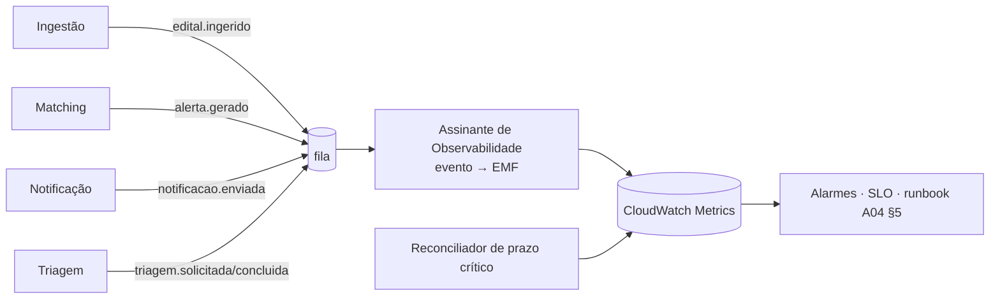

# A18 · Observabilidade: Correlação, Métricas e SLOs Medidos

> Contrato de observabilidade do MVP (P-111 · RAD-300). **Transversal — não é um bounded context**: não tem agregado, não tem use case próprio, e não pode virar uma dependência que os módulos importem para dentro. Realiza os SLOs de [docs/08 §4.1](../docs/08-metricas.md) (P-36) e a detecção que [arquitetura/04 §8](04-teste-de-estresse-e-falhas.md) assume ("o runbook só funciona com detecção").
>
> Convenções de código conforme [arquitetura/10](10-padroes-e-estrutura-de-codigo.md). Nenhum use case muda de assinatura por causa deste documento — ver §3.3.

## 1. O problema, dito com precisão

Não é "faltam métricas". É que **os dois SLOs que mais importam não são computáveis, e um deles governa uma categoria que o sistema não sabe rotular**.

Estado verificado no código (2026-07-12):

| O que existe | O que falta |
|---|---|
| Logging com redação de dado sensível (`apps/api/src/logging.ts`: `redigirParaLog`, `redigirUrlParaLog`, `criarLoggerHttpSeguro`) — cobre CPF/CNPJ/e-mail/`Bearer`/token, por chave e por padrão. **Ponto forte, não regredir.** | É `console.log` de **texto de 1 linha**. Sem JSON, sem correlação. Um log de API e um log de worker da mesma requisição não têm nenhum campo em comum. |
| 22 eventos de domínio publicados nos 7 contextos, incl. **todos** os que os SLOs de docs/08 §4.1 citam pelo nome: `edital.ingerido`, `alerta.gerado`, `notificacao.enviada`, `triagem.solicitada`, `triagem.concluida`, `pipeline.ciclo.concluido`, `pipeline.breaker.estado-mudou`. | **Zero métrica emitida.** Nenhum consumidor traduz evento em métrica. |
| Log group CloudWatch da API (`compute/main.tf`) e do worker (`serverless/main.tf`). | **Um único alarme em todo o sistema** — `session_pinned` do RDS Proxy (`db_proxy/main.tf`). Nenhum alarme sobre SLO. Sem dashboard, sem tracing. |

E os três achados que mudam o desenho:

**(1) `alerta.gerado` joga fora a data que o SLO de frescor precisa.** O SLO é "p95 entre publicação no PNCP e `alerta.gerado`". O Matching **tem** `dataPublicacao` (chega em `edital.ingerido`, vira `EditalParaMatchingDTO.dataPublicacao`) — e não a repassa ao emitir `alerta.gerado` (payload: `alertaId`, `tenantId`, `clienteFinalId`, `criterioId`, `editalId`, `aderencia`). No ponto de emissão da métrica, a origem do relógio não está lá.

**(2) O SLO de error budget ZERO governa uma categoria que o sistema não consegue identificar.** "Alerta de prazo crítico" (docs/08 §4.1: edital com **prazo final conhecido em até 3 dias corridos**, P-81) — mas `prazoProposta` **existe em `Edital` e não atravessa `edital.ingerido`** (o mapper não o inclui), e `Alerta` não tem nenhuma noção de prazo ou criticidade: só `aderencia`. Hoje a imediaticidade do alerta é decidida **só por aderência ≥ 0,8**. Ou seja: o Matching não sabe o prazo do edital, logo **não consegue nem rotular** um alerta como "de prazo crítico" — quanto mais medir se perdeu um. O SLO mais duro do produto (estoura ⇒ bloqueia release externo) é hoje **inalarmável por construção**. Isso não é lacuna de instrumentação: é **lacuna de modelo**.

**(3) "0 perdidos" é um não-evento — nenhum contador de caminho feliz o revela.** Um alerta perdido é, por definição, um `alerta.gerado` que **não** aconteceu. Contador só conta o que passou. Medir esse SLO exige varrer o conjunto **elegível** e provar cobertura — um reconciliador (§5), não uma métrica.

## 2. Consequência de desenho

Como todos os eventos que os SLOs citam **já existem e já são publicados**, a instrumentação que falta é **um assinante que traduz evento → métrica**, não contadores espalhados pelos use cases.



Isso preserva a regra de ouro: **nenhum use case ganha um port de métrica, nenhum `executar(input, signal)` muda de assinatura.** Métrica de SLO se deriva do fato de negócio que já é publicado — não de instrumentação injetada na regra.

## 3. Contrato de correlação

### 3.1 Identidade do trace

Adotamos **W3C Trace Context**. `correlationId` = o `trace-id` do `traceparent` (32 hex chars, lowercase). Padrão aberto, não amarra provedor, e é traduzível na borda para o backend de tracing que a infra escolher (§7).

**Ingresso (API).** O middleware lê o header `traceparent` do cliente. **Header de cliente é dado não confiável**: só é aceito se casar com a regex estrita do formato; qualquer coisa fora disso é **descartada e um trace novo é gerado**. Não é fronteira de segurança (não autoriza nada), mas é vetor de **log forging** — um `traceparent` livre entraria no log estruturado como campo. Validar antes de usar, sempre.

**Interno.** Todo log emitido dentro do escopo de uma requisição/mensagem carrega `correlationId`. Nada mais precisa mudar de assinatura — ver §3.3.

### 3.2 O correlationId **não** entra no `DomainEvent`

O `DomainEvent` do kernel (`{ type, occurredAt }`) descreve **o que aconteceu no negócio**. Um trace id é metadado de **transporte** — não é fato de domínio, não pertence ao agregado, e não deve poluir os construtores dos 22 eventos.

Ele vai no **envelope**, que é o que a fila de fato carrega:

```ts
// o que trafega na fila (infra), não o que o domínio conhece
interface EnvelopeDeEvento {
  readonly type: string;              // já existia
  readonly occurredAt: string;        // já existia (ISO-8601)
  readonly payload: unknown;          // já existia
  readonly correlationId: string;     // NOVO — trace-id W3C, 32 hex
}
```

O publisher (infra) estampa; o consumidor (infra) lê e re-entra no contexto antes de chamar o use case. Aditivo e não-breaking: consumidor que receba envelope sem `correlationId` gera um e loga a lacuna.

### 3.3 Como o publisher sabe o trace sem que o use case o passe

**`AsyncLocalStorage`**, lido **apenas na infra** (o publisher e o logger). O use case continua `executar(input, signal)` — não recebe, não repassa, não conhece o trace. É exatamente a fronteira que o A10 desenha: contexto ambiente de I/O é assunto de infra.

Casa nova: pacote **`shared/observabilidade`** (`@radar/observabilidade`) — contexto de correlação (ALS), logger estruturado, emissor de métrica.

> **Regra de importação, sem exceção:** só `infra/**` e `apps/**` importam `@radar/observabilidade`. **`domain/` e `application/` nunca.** Não vai no `@radar/kernel` — o kernel é importado pelo *domain*, e o domain não pode ganhar dependência de runtime Node (`AsyncLocalStorage`) nem de I/O.

## 4. Log estruturado

`console.log` de texto → **JSON Lines em stdout** (CloudWatch coleta; sem SDK, sem I/O no caminho da requisição).

Campos: `ts`, `nivel`, `correlationId`, `contexto` (`api` | `worker:<nome>`), `evento`, `msg`, `duracaoMs`, `tenantId` — mais o que o call site passar.

**Invariante não-negociável:** todo valor serializado passa por **`redigirParaLog`** antes de virar JSON. A migração para JSON é o momento clássico de regredir a proteção — hoje a redação é aplicada na *string* montada; no JSON ela tem de ser aplicada em **cada campo**, incluindo os que o call site adiciona. Classe crítica (estratégia comercial do cliente — `docs/05 §9`) **nunca** vai a log, em nenhum nível, nem em `debug`: nada de `objeto` do edital, texto de anexo, critério do usuário ou saída de triagem. IDs (`editalId`, `tenantId`) sim; conteúdo, não.

## 5. Os SLOs, ligados ao sistema rodando

Métricas em **EMF** (CloudWatch Embedded Metric Format): o assinante escreve JSON no stdout e o CloudWatch extrai a métrica. Sem `PutMetricData` no caminho quente (sem latência, sem throttling, sem IAM novo), idêntico em container e Lambda, e portável — trocar por OTel/Prometheus é trocar **um adapter**, o assinante não muda.

Namespace `Radar/SLO`. Dimensões: `ambiente`; **nunca `tenantId` como dimensão** (cardinalidade explode e o custo com ela).

| SLO (docs/08 §4.1) | Métrica | Fonte | O que falta hoje |
|---|---|---|---|
| Frescor do alerta padrão — p95 ≤ 30 min | `alerta.frescor_ms` (p95) | `alerta.gerado.occurredAt` − data de publicação no PNCP | **`alerta.gerado` precisa carregar `editalPublicadoEm`** (1 campo aditivo; o Matching já tem o dado) |
| Entrega imediata — p95 ≤ 5 min | `notificacao.latencia_entrega_ms` (p95, dim `imediato`) | `notificacao.enviada.occurredAt` − instante do `alerta.gerado` | **`notificacao.enviada` precisa carregar `alertaGeradoEm`** (1 campo aditivo) |
| Triagem — p95 ≤ 3 min | `triagem.latencia_ms` (p95) | `triagem.concluida.occurredAt` − instante da solicitação | **`triagem.concluida` precisa carregar `solicitadaEm`** (1 campo aditivo) |
| Caminho crítico ingestão → alerta — ≥ 99,5%/mês | `pipeline.ciclo.ok` / `pipeline.ciclo.erro`, `api.5xx`, `pipeline.breaker.aberto` | `pipeline.ciclo.concluido` e `pipeline.breaker.estado-mudou` já trazem tudo | nada — só o assinante |
| **Alerta de prazo crítico — 0 perdidos, error budget = 0** | `alerta.prazo_critico.elegivel`, `alerta.prazo_critico.coberto`, **`alerta.prazo_critico.perdido`** | **reconciliador** (abaixo) | **o conceito de prazo crítico não existe no domínio** — ver §1(2) |

**`<contexto>.ciclo.falhou` (RAD-332) — o sinal para quando o ciclo nem chega a publicar evento.** As duas linhas da tabela acima nascem de eventos publicados ao **fim** de um ciclo bem-sucedido (`pipeline.ciclo.concluido`, `alerta.prazo-critico.reconciliado`). Um ciclo que lança **antes** disso — ex. `cobertura.contar` quebrando no Postgres, dentro do `ReconciliarPrazoCriticoUseCase` — não publica nada, então nenhuma das duas métricas se move; só o `aoFalhar` de `iniciarAgendadorAbortavel` (`@radar/kernel`) vê o erro. Cada composition root (`apps/api/src/workers.ts`, `apps/api/src/scheduler.ts`) chama `metricaDeCicloFalhou(contexto, ambiente, erro)` nesse `aoFalhar`, emitindo `alerta.prazo_critico.ciclo.falhou` / `pipeline.ciclo.falhou` (Count=1) — mesma hierarquia de `pipeline.ciclo.ok`/`pipeline.ciclo.erro`, `erro` só como campo de log redigido (`{ tipo, code? }`, nunca message/stack). **Alarmado (RAD-333):** `pipeline.ciclo.falhou` soma no `total` de `caminho_critico_disponibilidade`, e `alerta.prazo_critico.ciclo.falhou` tem alarme dedicado (`prazo_critico_ciclo_falhou`, mesma severidade máxima de `prazo_critico_perdido`, sem `treat_missing_data`) — ver §8.

**Por que os três campos aditivos, e não um join.** A alternativa (um consumidor que guarda estado ou consulta o DB de outro contexto para achar o instante de origem) recria leitura cross-contexto — o mesmo débito já registrado em RAD-91. Carregar o instante do elo anterior no payload mantém o emissor **stateless** e é literalmente o que o SLO diz que a métrica é. Os três são **aditivos**: campo novo, opcional na deserialização, `schemaVersion` já é convenção em `edital.ingerido`. Nenhum consumidor existente quebra.

### 5.1 O SLO de budget zero exige domínio antes de métrica

Para `alerta.prazo_critico.perdido` existir, nesta ordem:

1. **`prazoProposta` atravessa `edital.ingerido`** (o `Edital` já tem; o mapper não inclui).
2. **Matching ganha a noção de criticidade**: alerta é *de prazo crítico* quando o edital casado tem prazo final conhecido em ≤ 3 dias corridos (docs/08 §4.1, P-81). Isso é regra de domínio — vive no agregado/VO, não no worker. Hoje a imediaticidade é decidida **só** por aderência ≥ 0,8; passa a ser `aderência alta **ou** prazo crítico`. **É mudança de comportamento do produto, não só de telemetria: alertas que hoje caem em digest passam a ser imediatos.** Correto segundo docs/08 §4.1 — e por isso precisa de ciente de Produto, não só de Eng.
3. **Reconciliador** (job periódico): varre os editais elegíveis da janela (prazo ≤ 3 dias, casados com algum critério) e verifica que cada um tem `alerta.gerado` **e** `notificacao.enviada` antes do prazo. A métrica é o **déficit** — `perdido = elegivel − coberto`. Alarme em `perdido ≥ 1`, severidade máxima: é o gatilho de RCA + replay que P-36 exige e o que P-35 (runbook ↔ incidentes) vai pendurar.

Sem (1) e (2), (3) não tem o que varrer, e o "0 perdidos" continua sendo uma frase no documento.

### 5.2 A fonte de `elegivel` é um read-model local, não uma varredura cross-schema (P-114)

O reconciliador precisa de fatos que hoje moram em três contextos: *edital com prazo na janela* (Ingestão), *casou com critério ativo* (Matching), *alerta gerado + notificação enviada* (Matching + Notificação). Ler os três schemas direto está **vedado**: é exatamente o padrão que P-97/RAD-95 removeu (`PostgresEditalMatchingView`, SQL cru contra a tabela de outro contexto) e que P-111 rejeitou para este mesmo SLO. **Decisão (P-114):** o Matching mantém, **no próprio schema**, uma projeção de **alertas devidos** — uma linha por obrigação (`alerta_id`, `edital_id`, `criterio_id`, `tenant_id`, `prazo_proposta`, `devido_em`, `notificado_em`) —, alimentada só por fatos que o próprio contexto já tem ou por evento já publicado. Tudo que o reconciliador lê é local.

Três invariantes que o desenho tem de respeitar — cada um deles, violado, faz a métrica mentir:

1. **`elegivel` é alerta DEVIDO, não edital avaliado.** Um edital na janela que não casou com nenhum critério **não deve alerta nenhum**; contá-lo em `elegivel` deixaria `perdido > 0` de forma crônica e transformaria o único SLO de error budget zero em alarme morto no primeiro dia. A obrigação nasce do casamento (edital × critério ativo) e é 1:1 com o `Alerta` que o sistema passou a dever.
2. **A linha é gravada para todo casamento com `prazoProposta` conhecido — não só quando o prazo já é crítico no instante do casamento.** A janela é avaliada na hora da reconciliação, não na da ingestão: um edital ingerido a 30 dias do prazo entra na janela depois, e um alerta que se perdeu lá atrás **é** um alerta de prazo crítico perdido quando o prazo aperta. Gravar só quando `PrazoCritico.critico === true` cega o reconciliador justamente no caso mais comum.
3. **O observador não pode andar no mesmo transporte do observado.** O alerta é enfileirado (`FilaAlertaPort`) e persistido por `ConsumidorAlertaBatch` (P-41/RAD-179); se o registro do devido viajasse pela mesma fila, sumiria junto com aquilo que existe para denunciar. A gravação é **direta no schema do Matching**, dentro do `CasarEditalComCriteriosUseCase`, em **um único INSERT multi-linha por edital**, na conexão que o use case já abriu para `listarAtivos` ⇒ nenhuma pressão nova de conexão. O que P-41 proíbe é o fan-out de N writes por edital, não um write O(1) por mensagem.

`coberto` sai de duas pernas, ambas locais: **alerta gerado** — a linha existe na tabela `alerta` (mesmo schema, join intra-contexto pelo `alerta_id`, que o use case já gera antes de enfileirar); **notificação enviada** — um assinante local de `notificacao.enviada` (mesmo padrão evento→métrica do §5) marca `notificado_em`. A chave desse assinante é o **`alertaId`** do payload, **não** o `alertaGeradoEm`: `alertaGeradoEm` é opcional e ausente no caminho digest, e um alerta notificado por digest apareceria falsamente descoberto.

**Limite conhecido, e é limite de propósito.** Um edital de prazo crítico que o Matching **nunca avaliou** (mensagem `edital.ingerido` perdida antes do worker) não deixa rastro local — não há linha de devido — e o reconciliador não o enxerga. Vê-lo exigiria ler o catálogo da Ingestão, que é o que está vedado. Essa perna tem outro controle: profundidade de DLQ e *lag* do consumidor de `edital.ingerido` (§4). Portanto `perdido = 0` afirma "nenhum alerta que o sistema **sabia dever** deixou de sair" — não "nada se perdeu na esteira"; quem afirma a segunda coisa é o par DLQ + lag, e os dois têm de ser lidos juntos no runbook (A04 §5).

## 6. Fronteiras e donos

| Trilha | Dono | Escopo |
|---|---|---|
| `@radar/observabilidade` + log JSON + correlação ponta-a-ponta | **Bento** | pacote, ALS, logger, envelope, publisher/consumidor |
| Campos aditivos nos 3 eventos + assinante evento→EMF | **Bento** | Published Language (A03 §3) — forma já ratificada aqui |
| Prazo crítico: `prazoProposta` no evento + criticidade no domínio do Matching + reconciliador | **Bento** (com ciente de **Produto** sobre a mudança de comportamento) | domínio + job |
| Alarmes CloudWatch sobre as métricas, dashboard, metric filters, tracing backend | **Otávio** coda · **Artur** valida (`guardiao-iac`) | `infra/**` |

Cruzar `guardiao-arquitetura` (o envelope atravessa fronteira de contexto) e `guardiao-seguranca` (log + redação + header não confiável) antes de fechar cada diff de app.

## 7. Tracing: correlação sim, span **não** (decisão de escopo — RAD-307)

**O MVP não emite span.** Não há SDK OTel no app, não há coletor ADOT provisionado, não há backend de tracing. O que o MVP entrega é **correlação**: o mesmo `trace-id` W3C (§3.1) atravessa API → envelope da fila → worker e aparece em **cada linha de log JSON** (§4). Trace visual é adiado, com gatilho explícito abaixo.

**Correção factual (achado de RAD-305).** A redação anterior deste parágrafo listava "ALB / ADOT collector" como opções equivalentes de tradução `traceparent` → `X-Amzn-Trace-Id`. **São diferentes, e o ALB não traduz**: ele repassa `traceparent`/`tracestate` inalterados e injeta o **seu próprio** `X-Amzn-Trace-Id`, sem nenhuma relação com o trace-id do app. A única tradução real é o **ADOT Collector** (receptor OTLP → exportador X-Ray) — e, desde a v0.34.0 (out/2023), o X-Ray aceita trace-id em formato **W3C nativo**, logo o app **não precisaria** do gerador `AwsXRayIdGenerator`: o contrato do §3.1 (`correlationId` = trace-id W3C puro) permaneceria intacto de qualquer forma.

**Por que fora do MVP mesmo sendo barato de infra** (o coletor sidecar custa ~US$9/mês — o custo não é esse):

1. **Tracing não mede nenhum SLO nosso.** Os SLOs de [docs/08 §4.1](../docs/08-metricas.md) são latências **entre eventos** em escala de minutos a horas (publicação no PNCP → `alerta.gerado`) e um **não-evento** (alerta de prazo crítico perdido). Nenhum dos dois é *trace-shaped*: um trace não sobrevive a um ciclo de polling, e não existe span para o que não aconteceu. Quem mede é o assinante EMF (§5) e o reconciliador (§5.1) — não o X-Ray. Ligar tracing não move o P-36 um milímetro.
2. **A topologia não paga.** Monólito modular + fila: o trace tem ~3 spans (API, publish, worker). Sobre a linha de log JSON com o mesmo `correlationId`, que RAD-301 já entrega, o ganho marginal é a árvore visual — não um fato novo. O valor de tracing sobe com fan-out de rede real; o nosso seam serverless está *gated-off* e o gRPC cross-domain (P-27) não existe ainda.
3. **O custo real é de segurança, não de dinheiro.** Auto-instrumentação OTel estampa `http.url` (com query string), `db.statement` e atributos de exceção — e **atributo de span não passa por `redigirParaLog`** (§4/`redacao.ts`, que só cobre o caminho do log). Instrumentar hoje abriria um canal de saída de dado sensível — incluindo **classe crítica** ([docs/05 §9](../docs/05-seguranca-e-privacidade.md)) — **ao lado do único controle de redação que temos**. Antes de qualquer span sair do processo, a redação precisa cobrir o *span processor*; isso é escopo de story, não de configuração.

**Regra forward-compat (obrigatória, custo zero hoje).** O `trace-id` tem **uma única fonte**: `@radar/observabilidade` (`extrairOuGerarTraceId` + ALS, §3.3). Se/quando OTel entrar, `contexto-correlacao` passa a **ler o span ativo** (`trace.getSpan(context.active()).spanContext().traceId`) — **nunca** um segundo gerador em paralelo, sob pena de o log e o trace divergirem de id e a correlação morrer justamente quando ela passa a valer. Corolário: o desenho do §3 já torna OTel uma decisão de *late binding* — entra como bootstrap em `apps/**` + coletor na infra, **sem tocar `domain/` nem `application/`**. Adiar não cria dívida estrutural.

**Gatilho de reversão** (qualquer um destes ⇒ nova story de instrumentação para o Bento, precedida da redação de atributos do item 3):

- a seam serverless deixar de ser *gated-off*, ou entrar um segundo serviço de rede real (gRPC cross-domain, P-27);
- dois incidentes do runbook ([A04 §5](04-teste-de-estresse-e-falhas.md)) fechados sem conseguir localizar onde o tempo foi;
- SLO de latência estourar sem que log + métrica expliquem qual etapa degradou.

## 8. Pendências

- Números de alarme (limiares de warning antes do estouro do error budget mensal) — dependem de baseline com tráfego real. `[A VALIDAR]` → P-111
- ~~Backend de tracing (X-Ray vs. ADOT/OTel) e o custo da tradução do §7.~~ **Decidido (RAD-307): sem span no MVP** — §7. Reabrir só pelo gatilho de reversão; a instrumentação OTel exige, antes, redação de atributo de span.
- Ciente de Produto sobre a mudança de comportamento do §5.1(2) — alerta de prazo crítico passa a ser imediato. → P-111
- Detecção destrava P-35 (runbook ↔ resposta a incidentes) e P-37 (comunicação em degradação), ambos Abertos.
- ~~`alerta.prazo_critico.ciclo.falhou` / `pipeline.ciclo.falhou` (§5, RAD-332) emitidos mas sem alarme.~~ **Feito (RAD-333):** `caminho_critico_disponibilidade` soma `pipeline.ciclo.falhou` ao `total`, e `prazo_critico_ciclo_falhou` é alarme dedicado (severidade máxima, sem `treat_missing_data`) — `infra/terraform/modules/observability/main.tf`.
