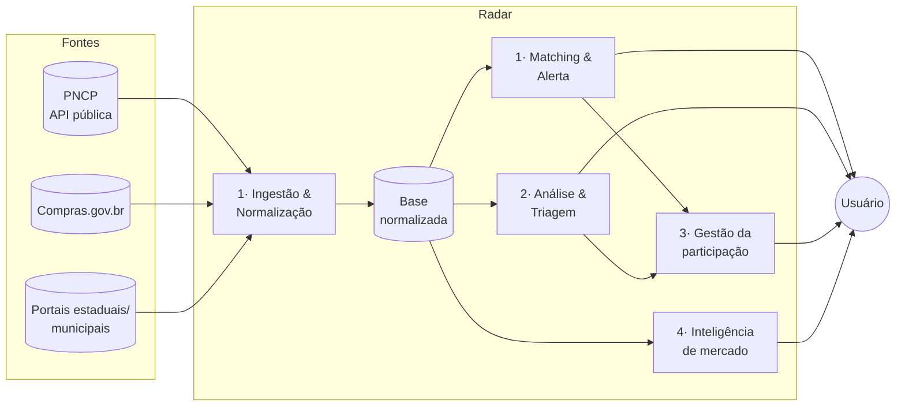
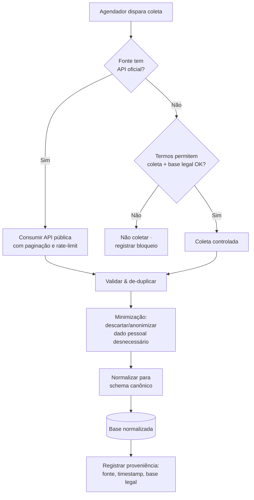
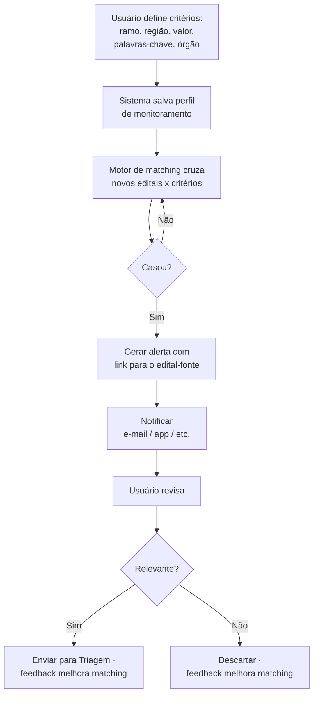
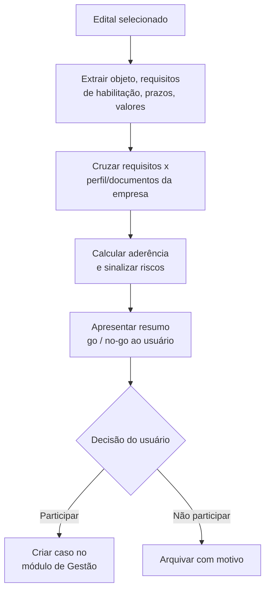
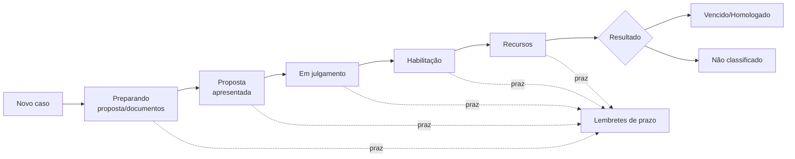
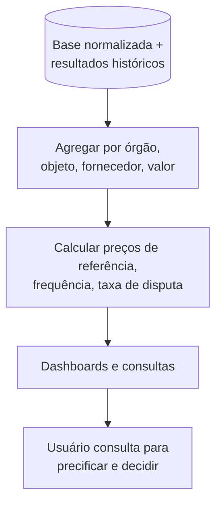

# 03 · Fluxos do Produto

> Fluxos de sistema e de usuário na fase de concepção. Diagramas em Mermaid renderizam no GitHub e em visualizadores compatíveis. Controles de segurança citados aqui estão detalhados no documento 05.

## 1. Arquitetura de fluxo em alto nível

O produto é, em essência, uma esteira que vai da **fonte pública** ao **acionamento do usuário**, com quatro estágios que espelham os quatro módulos.

Cada seta que cruza a fronteira "Fontes → Radar" é um ponto de controle legal (base LGPD + termos de uso) e de segurança (validação de entrada). Cada seta "Radar → Usuário" é um ponto de controle de acesso (o usuário só vê o que lhe pertence).

## 2. Fluxo de sistema — Ingestão e normalização (Módulo 1)

Este é o fluxo mais crítico para conformidade, porque é onde dados de terceiros entram no sistema.

Pontos-chave: a preferência por API oficial (documento 02, §4) é uma decisão do próprio fluxo; a **minimização acontece antes da persistência**, não depois; e cada registro carrega sua **proveniência** (de onde veio, quando, sob qual base legal) — essencial para auditoria e para atender direitos do titular.

## 3. Fluxo de usuário — Configuração de radar e alerta (Módulo 1)

O laço de *feedback* (relevante/não relevante) é o que faz o matching melhorar com o tempo e é uma métrica de sucesso (documento 01, §7).

## 4. Fluxo de usuário — Triagem de edital (Módulo 2)

Aqui a extração automática pode errar (risco de qualidade de dados, documento 01, §8). Por isso o produto **apresenta e sugere**, mas a decisão go/no-go é sempre do usuário, e o resumo sempre linka o trecho-fonte do edital para conferência.

## 5. Fluxo de usuário — Gestão da participação (Módulo 3)

Os estados espelham as fases legais da Lei 14.133 (ver documento 04 para o mapeamento formal). O motor de prazos é a funcionalidade que mais reduz risco operacional do usuário.

## 6. Fluxo de dados — Inteligência de mercado (Módulo 4)

Este módulo trabalha majoritariamente com **dados agregados**, o que é favorável à LGPD: agregação e anonimização reduzem o risco de tratamento de dado pessoal. Onde houver identificação de pessoa física, valem as regras do documento 02.

## 7. Fontes de dados (insumo do Módulo 1)

| Fonte | Tipo de acesso | Papel no produto |
|-------|----------------|------------------|
| **PNCP** — Portal Nacional de Contratações Públicas | APIs públicas de consulta (sem login) + dados abertos | Fonte âncora; publicação obrigatória por lei |
| **Compras.gov.br / Comprasnet** (federal) | API de dados abertos (Swagger) | Complementa dados federais e resultados |
| **Portais estaduais / municipais / privados credenciados** | Heterogêneo (API ou HTML) | Cobertura ampliada; entram só após checklist do doc 02, §6 |

Notas técnicas observadas nas fontes oficiais: as APIs do PNCP e do Compras.gov.br retornam **JSON**, usam **paginação** (total de registros, total de páginas, página atual) e o acesso de **consulta é público**; apenas as APIs de manutenção exigem autenticação — irrelevantes para o Radar. O design da ingestão deve respeitar paginação e aplicar *rate-limiting* educado para não sobrecarregar as fontes.

## 8. Onde a segurança entra em cada fluxo

Cada fluxo acima tem um controle de segurança correspondente no documento 05: a ingestão (§2) exige validação de entrada e registro de proveniência; a configuração de alertas (§3) e a gestão (§5) exigem controle de acesso por usuário/cliente; a inteligência (§6) exige agregação/anonimização. Nenhum fluxo é considerado "pronto" sem seu par de controle.
