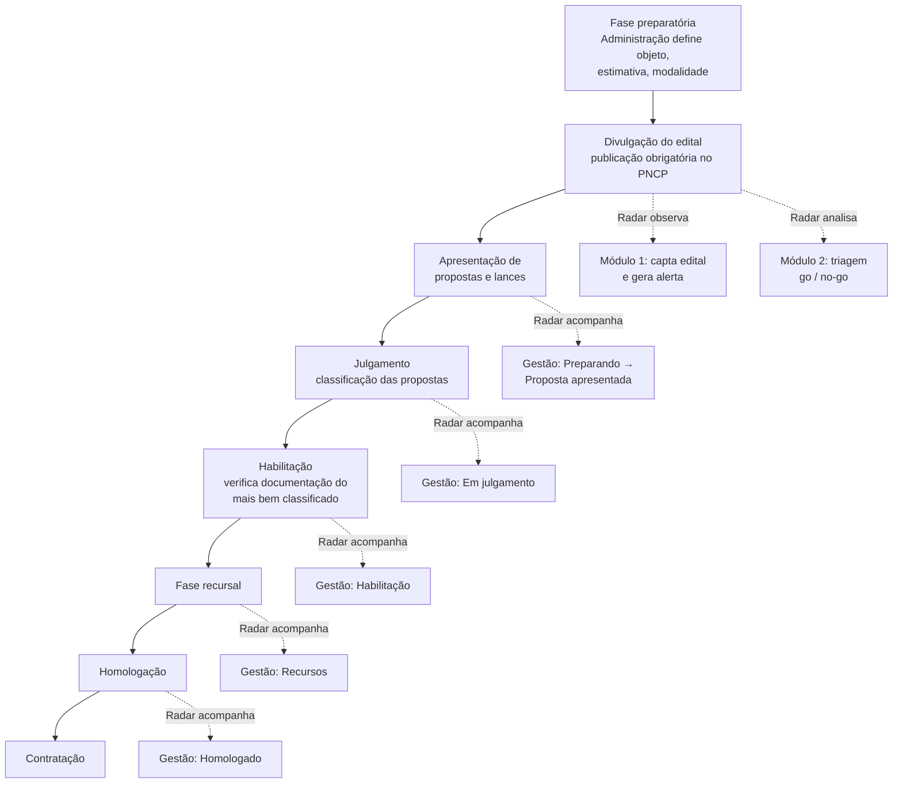
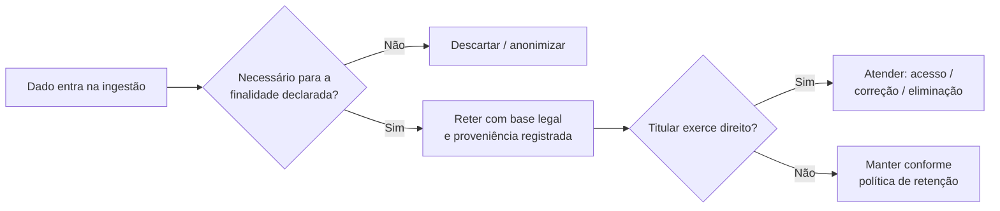

# 04 · Fluxos conforme a Lei

> Ponte entre o produto (documento 03) e o direito (documento 02). Aqui os fluxos do Radar são mapeados às **fases legais da licitação** sob a Lei 14.133/2021, para que cada estado do produto corresponda a um momento juridicamente definido — e para que os prazos e regras que o produto monitora estejam corretos.

## 1. Por que esse mapeamento importa

O módulo de Gestão da Participação (documento 03, §5) só é confiável se seus estados refletirem fielmente as fases legais. Se o produto entender a ordem das fases de forma errada, ele calcula prazos errados e o usuário perde o certame. Como a Lei 14.133 **inverteu** a ordem clássica (julgamento antes de habilitação), esse alinhamento não é opcional — é o coração da correção do produto.

## 2. As fases legais (Lei 14.133/2021) e o estado correspondente no Radar

## 3. Tabela de correspondência fase legal → produto

| Fase legal (Lei 14.133) | O que ocorre juridicamente | Estado no Radar | Ação do produto |
|-------------------------|----------------------------|-----------------|-----------------|
| **Preparatória** | Órgão define objeto, estimativa, modalidade. Ainda não há edital público. | — (não observável) | Nenhuma; dados podem aparecer no PCA/plano de contratações `[A VALIDAR]` |
| **Divulgação do edital** | Publicação obrigatória no PNCP (art. 174). Marco inicial da observabilidade. | Alerta gerado (Mód. 1) → Triagem (Mód. 2) | Captar, normalizar, alertar, apoiar go/no-go |
| **Apresentação de propostas/lances** | Licitantes enviam propostas dentro do prazo do edital. | "Preparando" → "Proposta apresentada" | Monitorar prazo de submissão; checklist de documentos |
| **Julgamento** | Classificação das propostas conforme critério. **Vem antes da habilitação.** | "Em julgamento" | Acompanhar resultado da classificação |
| **Habilitação** | Verifica-se a documentação apenas do licitante mais bem classificado. | "Habilitação" | Monitorar exigências e prazo de resposta a diligências |
| **Recursal** | Prazo para interposição de recursos. | "Recursos" | Alertar prazo recursal — janela curta e crítica |
| **Homologação** | Autoridade homologa o resultado. | "Homologado" | Registrar resultado; alimentar inteligência (Mód. 4) |
| **Contratação** | Assinatura do contrato; publicação no PNCP. | "Concluído" | Encerrar caso; dados históricos para Mód. 4 |

## 4. Regras legais que o produto precisa respeitar em cada fluxo

**Prazos são definidos pelo edital, dentro dos mínimos legais.** O Radar não deve assumir prazos fixos; deve extrair o prazo de cada edital e validá-lo contra os mínimos da lei/modalidade. A modalidade (pregão, concorrência, etc.) altera prazos e ritos — o modelo de dados precisa carregar a modalidade como atributo de primeira classe.

**A inversão julgamento→habilitação.** **Decisão de Produto (P-10, 2026-07-12):** o produto nunca deve sinalizar "habilitação" antes do "julgamento" no fluxo padrão da Lei 14.133/2021. Como há exceções motivadas no edital, o estado da licitação no Radar deve ser **dirigido pelos dados do edital/fonte**, não por uma ordem fixa codificada. No futuro Módulo 3, a sequência padrão é julgamento → habilitação, mas o modelo precisa aceitar a inversão expressamente informada pela fonte.

**Publicação no PNCP como marco.** Como a publicação no PNCP é condição de eficácia, o timestamp de publicação no PNCP é a referência temporal mais confiável para iniciar contagens — preferível a datas raspadas de portais secundários.

**Valores atualizados por decreto.** Faixas de valor que definem modalidade ou tratamento simplificado mudam por decreto anual (ex.: Decreto 12.343/2024 para 2025). Regras do produto que dependam de valor devem ler uma tabela parametrizável e datada, nunca constantes no código.

## 5. Conformidade LGPD embutida no fluxo (não só no fim)

O mapeamento acima é jurídico-processual (eixo 1 do documento 02). Sobreposto a ele, corre o eixo de proteção de dados. Em cada transição de fase, a pergunta de privacidade é a mesma: *estou tratando apenas o dado necessário para esta finalidade?*

Esse laço não é um passo único: ele se repete a cada nova coleta e a cada novo tipo de dado que uma fonte passe a fornecer. É a materialização do *compliance-by-design* do documento 02, §8.

## 6. Checklist de conformidade por funcionalidade

Antes de dar como "pronta" qualquer funcionalidade que toque dados de fonte pública, o time confirma:

- [ ] A fase legal que a funcionalidade representa está corretamente modelada (tabela §3).
- [ ] Prazos vêm do edital e são validados contra mínimos legais, não hard-coded.
- [ ] A modalidade da licitação é considerada onde altera rito/prazo.
- [ ] Valores dependentes de decreto leem tabela parametrizável e datada.
- [ ] Há base legal LGPD registrada para os dados pessoais tratados.
- [ ] A minimização foi aplicada na ingestão.
- [ ] A proveniência (fonte, data, base legal) está registrada.
- [ ] Existe caminho para atender direitos do titular sobre esses dados.
- [ ] Os controles de segurança do documento 05 aplicáveis estão implementados.

Este checklist é a interseção prática entre "fluxo" e "lei" — o produto do próprio título deste documento.
