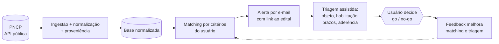
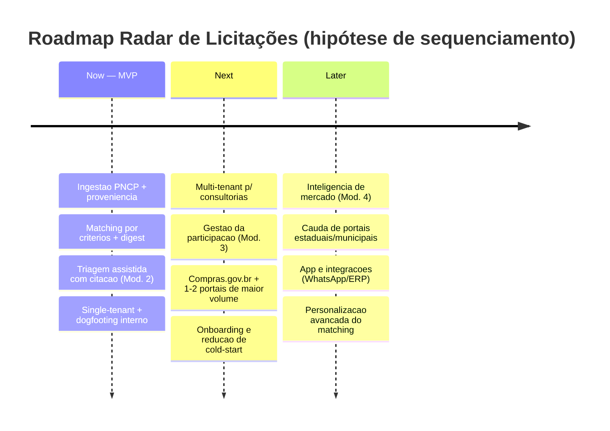

# 07 · MVP e Roadmap

> Do escopo dos quatro módulos (documento 01) para uma decisão de **o que construir primeiro**. Este documento recorta o MVP, define a persona-alvo inicial, sequência as entregas em Now / Next / Later e fixa o critério de "pronto para lançar". Estágio: **Concepção** — recortes marcados `[A VALIDAR]` dependem de decisão de negócio.

## 1. Princípio de recorte

O documento 01 (§4) diz que os módulos 1 e 2 formam o "núcleo mínimo de valor". Isso é um agrupamento, não um MVP. Um MVP é a **menor fatia ponta a ponta que entrega valor real e derruba o maior risco** — aqui, o risco de que ninguém confie em um alerta automático o suficiente para decidir com ele.

Regra de recorte do projeto: cada corte de MVP é justificado por *valor ao usuário* **e** por *risco que derruba*, não por completude funcional. Fatiamos por profundidade (uma esteira fina e inteira), não por largura (todos os módulos pela metade).

## 2. O MVP — a esteira mínima (walking skeleton)

O MVP é a menor esteira que vai da **fonte pública** à **decisão go/no-go apoiada**: ingestão do PNCP → matching por critérios → alerta → triagem assistida com citação da fonte. Um único módulo (1) só "avisa"; é a triagem (2) que transforma aviso em decisão — por isso o MVP atravessa 1 **e** 2, mesmo que raso.

Escopo mínimo por peça (o "fino" de cada uma):

| Peça | No MVP (fino) | Fora do MVP |
|------|---------------|-------------|
| Fonte | **Só PNCP** (âncora obrigatória, API pública) | Compras.gov.br, portais estaduais/municipais |
| Matching | Critérios estruturados (ramo/CNAE, região, faixa de valor, palavra-chave) + recall alto | Ranking semântico avançado, aprendizado por perfil |
| Alerta | E-mail + digest configurável | App, WhatsApp, integrações |
| Triagem (Mód. 2) | Extração de objeto, requisitos de habilitação, prazos e valores, com **citação da fonte** e aderência básica | Análise de risco fina, comparação entre editais |
| Conta | Single-tenant (uma empresa por conta) | Multi-tenant de consultoria |

## 3. O que fica fora do MVP — e por quê

- **Módulo 3 (Gestão da participação)** — valor real, mas só depois que o usuário confia no alerta+triagem. Vem no *Next*.
- **Módulo 4 (Inteligência de mercado)** — depende de acúmulo de dados históricos; sem base, não há inteligência. Vem no *Later*.
- **Multi-tenant para consultorias** — é o requisito de segurança mais caro (documento 05, §7: isolamento por tenant). Adiar reduz risco e custo até validarmos o núcleo. Vem no *Next*.
- **Persona Órgão público** — uso consultivo, não central; fora do MVP. Resolve o `[A VALIDAR]` do documento 01, §3. `[A VALIDAR — confirmar]`
- **Fontes além do PNCP** — cada fonte nova custa integração + checklist legal (documento 02, §6). O PNCP sozinho já dá cobertura nacional obrigatória para o MVP.

## 4. Persona primária do MVP

Proposta: **empresa fornecedora** (documento 01, §3 — "persona central para priorização"), tendo o **uso interno/próprio** como primeiro campo de prova (dogfooding). A consultoria multi-cliente é a persona do *Next*, quando o multi-tenant estiver pronto. `[A VALIDAR — confirmar persona primária]` (rastreado no documento 98).

## 5. Roadmap Now / Next / Later

A ordem **Now → Next → Later** segue os riscos a derrubar (§7), não a numeração dos módulos.

## 6. Critérios de "pronto para lançar" (release do MVP)

O MVP só vai a usuários externos quando **todos** forem verdade:

- [ ] Cobertura do PNCP comprovada: ≥ 99% dos editais publicados no período são capturados (documento 12, NFRs).
- [ ] Frescor dentro do alvo: p95 do tempo publicação→alerta abaixo da meta (documento 08 / 12). `[A VALIDAR — meta]`
- [ ] Barra de qualidade da triagem atingida no *gold set* (documento 10): recall de campos críticos — prazo, objeto, habilitação — acima da meta, e **zero alucinação em campos numéricos**.
- [ ] Base legal registrada e minimização aplicada na ingestão (documentos 02, §4 e 05, §5).
- [ ] Checklist de conformidade por funcionalidade satisfeito (documento 04, §6).
- [ ] Métricas de ativação e precisão instrumentadas e observáveis (documento 08).
- [ ] Teste de estresse do core passa: NFRs mantidos sob a carga-alvo e degradação graciosa comprovada, sem violar as regras duras (arquitetura/04).

## 7. Sequência de riscos a derrubar

O roadmap existe para atacar risco na ordem certa:

1. **Risco de qualidade/confiança** (o maior) — o usuário confia na triagem por IA? → derrubado pelo *gold set* e pela citação-da-fonte no MVP (documento 10).
2. **Risco de dependência de fonte** — a ingestão do PNCP é estável e completa? → derrubado no MVP com monitoramento de saúde da fonte (documento 11, §7).
3. **Risco de fadiga de alerta** — o matching acerta o suficiente sem afogar o usuário? → medido no MVP, ajustado com digest e feedback (documento 11, §2).
4. **Risco de multi-tenant** — dá para isolar consultorias com segurança? → endereçado no *Next*, antes de abrir para o segmento (documento 05, §7).

## 8. Pendências

- Confirmar persona primária do MVP e prioridade do Órgão público (§4). `[A VALIDAR]`
- Fixar metas numéricas de release (frescor, cobertura, qualidade) — dependem dos documentos 08 e 12. `[A VALIDAR]`
- Validar o corte de "single-tenant no MVP" com a expectativa comercial de vender para consultorias cedo (documento 09). `[A VALIDAR]`

Todas rastreadas no documento **98 · Decisões e pendências**.
