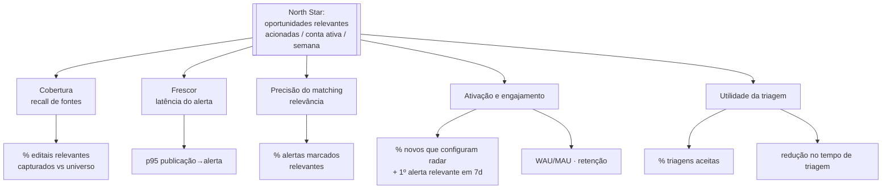

# 08 · Métricas de Sucesso

> As métricas candidatas do documento 01 (§7) eram hipóteses sem alvo. Aqui elas viram uma **árvore**: uma métrica-norte (North Star), as métricas de entrada que a movem, e os guardrails que impedem que a gente "vença a métrica" degradando o produto. Os alvos de §3 são metas de concepção para o MVP; guardrails ainda pendentes continuam marcados `[A VALIDAR]`.

## 1. Métrica-norte (North Star)

**Oportunidades relevantes acionadas por conta ativa, por semana.**

Uma oportunidade "acionada" = um edital que o usuário marcou como relevante **e** levou à triagem ou a uma decisão go/no-go. Essa métrica captura, num só número, o valor da esteira inteira: só sobe se o produto **encontra** o edital certo (cobertura), **na hora certa** (frescor), **filtra bem** (precisão do matching) e **ajuda a decidir** (triagem útil). Vaidade — nº de alertas enviados — não conta; ação conta.

## 2. Árvore de métricas

## 3. Métricas de entrada e alvos (hipóteses)

| Métrica | Definição | Alvo (hipótese) | Módulo |
|---------|-----------|-----------------|--------|
| **Cobertura (recall)** | % dos editais publicados no PNCP capturados no período de controle | ≥ 99% no PNCP; cobertura geral fora do MVP | 1 |
| **Frescor** | p95 do tempo entre publicação no PNCP e alerta | ≤ 30 min | 1 |
| **Precisão do matching** | % de alertas que o usuário marca como relevantes | ≥ 60% e crescente, sem reduzir a postura de recall alto | 1 |
| **Ativação** | % de novos usuários que configuram ≥1 radar e recebem 1º alerta relevante em 7 dias | ≥ 50% | 1 |
| **Utilidade da triagem** | % de triagens cujo go/no-go o usuário aceita sem refazer | ≥ 70% | 2 |
| **Ganho de tempo** | Redução no tempo médio de triagem por edital vs. leitura manual | ≥ 70% | 2 |
| **Retenção** | WAU/MAU; churn mensal de contas pagas | acompanhar no MVP; meta comercial pós-MVP | todos |

## 4. Guardrails (não vencer a métrica degradando o produto)

Empurrar a North Star sem estes limites cria dano — logo, cada um é um teto/piso rígido:

| Guardrail | Por que existe | Limite |
|-----------|----------------|--------|
| **Fadiga de alerta** | Recall alto pode afogar o usuário em falsos positivos | alertas irrelevantes / conta / semana abaixo de X `[A VALIDAR]` (documento 11, §2) |
| **Alucinação em campos numéricos** | Um prazo ou valor errado na triagem gera decisão errada | **zero** — regra dura (documento 10, §5) |
| **Custo de IA por edital** | Triagem por IA não pode inviabilizar a unidade econômica | teto por edital processado `[A VALIDAR]` (documentos 09, 10) |
| **Vazamento cross-tenant** | Exposição de estratégia competitiva é risco de sobrevivência | **zero** — regra dura (documento 05, §2) |
| **Incidentes LGPD** | Falha de conformidade é risco legal e reputacional | zero incidentes reportáveis (documento 02) |

## 5. Métricas de negócio (a partir do *Next*)

Dependem dos módulos 3 e 4 e do go-to-market (documento 09), então entram depois do MVP: conversão participação→vitória, receita recorrente (MRR/ARR), CAC e payback, expansão em consultorias (contas → clientes-finais). Listadas aqui para não serem esquecidas; alvos `[A VALIDAR]` na fase de negócio.

## 6. Instrumentação

Para o MVP ser avaliável (critério de release, documento 07, §6), a instrumentação precisa existir **antes** do lançamento: eventos de alerta gerado/aberto/marcado-relevante, triagem iniciada/aceita/refeita, e o funil de ativação. Cada métrica de §3 mapeia a eventos concretos — a definição desse esquema de eventos é um `[A VALIDAR]` de engenharia (documento 98).
