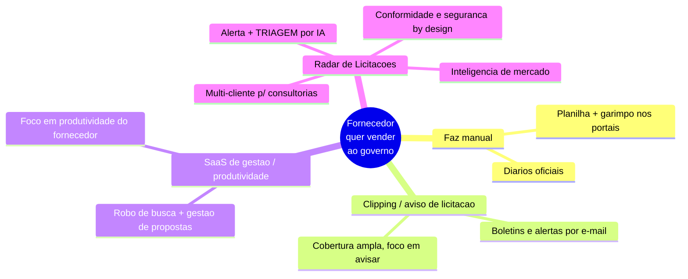
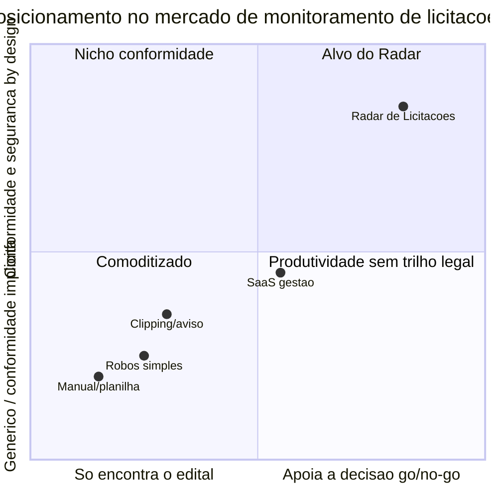

# 09 · Mercado, Posicionamento e Modelo de Negócio

> Onde o Radar joga, contra quem, por que nós, e como se sustenta. Análise competitiva ancorada no que **este projeto** faz de diferente (documento 01). Estágio: **Concepção**.
>
> ⚠️ **Nota de método.** Esta análise usa conhecimento público do mercado brasileiro de licitações até jan/2026. Nomes citados são **exemplos representativos de categorias**, não um ranking. Comparações de *features* e *preços* específicos de cada concorrente exigem pesquisa primária e estão marcadas `[A VALIDAR]` — ver documento 98.

## 1. Recorte do mercado — dois "concorrentes" que não se confundem

O documento 02 (§1) separa dois eixos legais; o mercado tem uma separação análoga que **não pode ser confundida**:

1. **Portais onde a licitação acontece** (plataformas de pregão eletrônico): PNCP, Compras.gov.br/Comprasnet, Licitações-e (BB), BLL, BNC, Portal de Compras Públicas, Licitar Digital, entre outros. Estes são **insumo/fonte** do Radar (documento 03, §7), **não** concorrentes. O produto os consome, não compete com eles.
2. **Ferramentas de monitoramento e inteligência para fornecedores**: serviços que avisam, organizam e/ou ajudam a decidir sobre editais. **Aqui estão os concorrentes.**

Confundir os dois leva a erro estratégico (tratar uma fonte como rival, ou vice-versa).

## 2. Panorama competitivo por categoria

| Categoria | Exemplos representativos `[A VALIDAR]` | Força típica | Lacuna que o Radar explora |
|-----------|----------------------------------------|--------------|----------------------------|
| **Manual / planilha** | O próprio usuário, diários oficiais | Custo zero de software | Lento, perde prazo, não escala — é o "concorrente" real da maioria |
| **Clipping / aviso** | ConLicitação, Publinexo `[A VALIDAR]` | Cobertura ampla, mercado maduro | Avisa, mas **não decide**: usuário ainda lê o edital inteiro |
| **SaaS gestão/produtividade** | Effecti e similares `[A VALIDAR]` | Fluxo de trabalho do fornecedor | Triagem por IA rasa; conformidade LGPD raramente é diferencial explícito `[A VALIDAR]` |
| **Alertas/robôs simples** | Ferramentas pontuais de busca | Baratas, simples | Sem inteligência de decisão nem multi-tenant robusto |

## 3. Posicionamento

Duas dimensões separam o Radar do campo: **quanto o produto ajuda a decidir** (não só a encontrar) e **quanto conformidade + segurança são embutidas por padrão** — num mercado onde a ANPD já sinalizou que scraping de dado público é tratamento sujeito à LGPD (documento 02, §4).

## 4. Diferenciação — por que o Radar

Quatro apostas, cada uma ancorada num documento deste repositório:

1. **De "encontrar" para "decidir".** A triagem por IA com **citação da fonte** (documento 10) muda a unidade de valor: o concorrente entrega uma lista de editais; o Radar entrega um go/no-go fundamentado em minutos. É o fosso mais difícil de copiar bem, porque exige barra de qualidade e avaliação (documento 10, §5).
2. **Conformidade como feature, não overhead.** Num mercado com muita coleta em zona cinzenta pós-*Radar Tecnológico nº 3* da ANPD, ser o player que preferе API oficial, registra proveniência e minimiza dado pessoal (documentos 02 e 05) é diferenciação **defensável** e vendável para clientes maiores e para o jurídico deles.
3. **Multi-cliente de verdade para consultorias.** O isolamento por tenant com segurança forte (documento 05, §§2-3) atende um segmento — assessorias que gerenciam vários clientes — mal servido por ferramentas single-user. É também a base de expansão de receita (§6).
4. **Ciclo fechado decisão → precificação.** A inteligência de mercado (Módulo 4) realimenta a decisão de participar e a estratégia de preço (documento 01, §4), algo que ferramentas de puro alerta não fazem.

## 5. Segmentação e sequência de entrada

Alinhada ao roadmap (documento 07):

- **MVP:** empresa fornecedora (single-tenant) + uso interno como prova. Bate de frente com clipping e planilha, ganhando na **triagem**. Consultorias podem entrar apenas como early adopters single-tenant, sem multi-cliente, para validar demanda sem antecipar o risco de isolamento.
- **Next:** consultorias (multi-tenant). Segmento de maior disposição a pagar e onde a diferenciação de isolamento pesa.
- **Later:** inteligência de mercado como upsell; órgãos públicos em uso consultivo (baixa prioridade, documento 01, §3).

## 6. Modelo de negócio e pricing (hipóteses)

SaaS por assinatura recorrente. Eixos de valor que sugerem os planos (todos `[A VALIDAR]` — dependem de pesquisa de preço e da unidade econômica da IA, documento 08 e §4 do documento 10):

| Plano | Alvo | Eixos incluídos | Racional de preço |
|-------|------|-----------------|-------------------|
| **Starter** | Empresa fornecedora pequena | PNCP, alertas, triagens limitadas/mês | Porta de entrada; preço baixo, expansão por uso |
| **Pro** | Empresa ativa em licitações | Mais fontes, triagem IA ampla, gestão (Mód. 3) | Núcleo de receita; cobra pela decisão, não só pelo aviso |
| **Consultoria** | Assessorias multi-cliente | Multi-tenant, portfólio, permissões, clientes-final | Preço por assento **e/ou** por cliente-final gerido |
| **Inteligência** (add-on) | Quem precifica com dados | Módulo 4 (histórico, referência de preços) | Upsell de maior margem |

Alavancas de precificação a testar: por **assento**, por **cliente-final** (consultoria), por **volume de fontes/regiões**, por **uso de IA** (triagens/mês). Um nível gratuito/prova (uso interno e trials) apoia a ativação (documento 08, §3). A unidade econômica só fecha se o **custo de IA por edital** (guardrail do documento 08, §4) ficar abaixo do preço médio por triagem — decisão de arquitetura do documento 10.

O plano **Consultoria** não é oferta de MVP: depende do *Next* multi-tenant. Antes disso, qualquer venda exploratória para assessoria usa os planos single-tenant, sem cobrança por cliente-final gerido e sem compromisso de portfólio multi-cliente.

## 7. Riscos competitivos

- **Incumbentes com cobertura maior** podem adicionar "IA" como checkbox. Defesa: barra de qualidade real e citação-da-fonte (documento 10) — difícil de fingir; medível.
- **Fontes mudam as regras** (APIs, termos de uso), afetando todos os players; nossa postura de preferir fonte oficial e monitorar saúde (documentos 02, §6 e 11, §7) reduz a exposição relativa.
- **Commoditização do alerta simples** empurra preço para baixo na base do mercado; por isso o Radar ancora valor na **decisão** (Módulos 2 e 4), não no aviso.

## 8. Pendências

- Pesquisa primária de concorrentes: features, cobertura e **preços** reais por player. `[A VALIDAR]`
- Definir planos, faixas de preço e a alavanca principal de cobrança. `[A VALIDAR]`
- Validar disposição a pagar por segmento (empresa vs. consultoria). `[A VALIDAR]`

Rastreadas no documento **98 · Decisões e pendências**.
