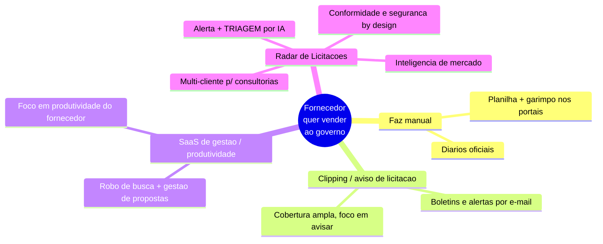
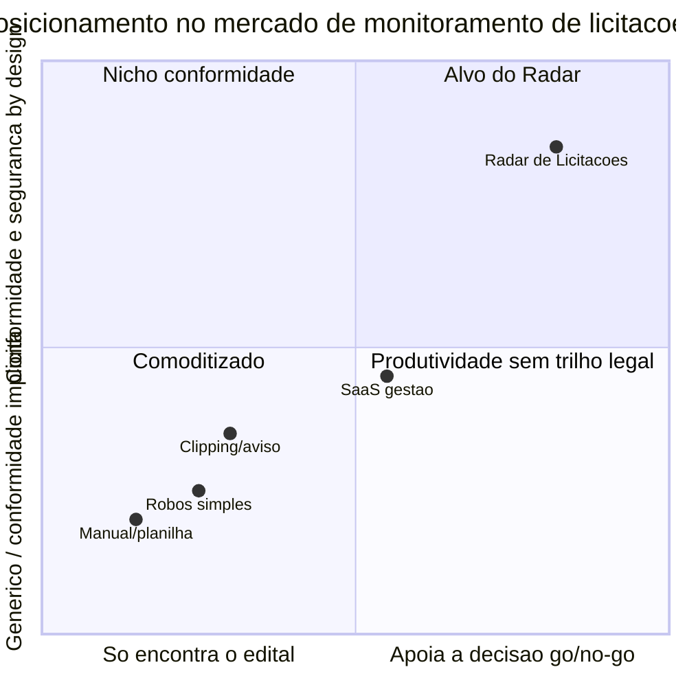

# 09 · Mercado, Posicionamento e Modelo de Negócio

> Onde o Radar joga, contra quem, por que nós, e como se sustenta. Análise competitiva ancorada no que **este projeto** faz de diferente (documento 01). Estágio: **Concepção**.
>
> ⚠️ **Nota de método.** Esta análise usa conhecimento público do mercado brasileiro de licitações até jan/2026. Nomes citados são **exemplos representativos de categorias**, não um ranking. Comparações de *features* e *preços* específicos de cada concorrente exigem pesquisa primária e estão marcadas `[A VALIDAR]` — ver documento 98.

## 1. Recorte do mercado — dois "concorrentes" que não se confundem

O documento 02 (§1) separa dois eixos legais; o mercado tem uma separação análoga que **não pode ser confundida**:

1. **Portais onde a licitação acontece** (plataformas de pregão eletrônico): PNCP, Compras.gov.br/Comprasnet, Licitações-e (BB), BLL, BNC, Portal de Compras Públicas, Licitar Digital, entre outros. Estes são **insumo/fonte** do Radar (documento 03, §7), **não** concorrentes. O produto os consome, não compete com eles.
2. **Ferramentas de monitoramento e inteligência para fornecedores**: serviços que avisam, organizam e/ou ajudam a decidir sobre editais. **Aqui estão os concorrentes.**

Confundir os dois leva a erro estratégico (tratar uma fonte como rival, ou vice-versa).

## 2. Panorama competitivo por categoria

| Categoria | Exemplos representativos `[A VALIDAR]` | Força típica | Lacuna que o Radar explora |
|-----------|----------------------------------------|--------------|----------------------------|
| **Manual / planilha** | O próprio usuário, diários oficiais | Custo zero de software | Lento, perde prazo, não escala — é o "concorrente" real da maioria |
| **Clipping / aviso** | ConLicitação, Publinexo `[A VALIDAR]` | Cobertura ampla, mercado maduro | Avisa, mas **não decide**: usuário ainda lê o edital inteiro |
| **SaaS gestão/produtividade** | Effecti e similares `[A VALIDAR]` | Fluxo de trabalho do fornecedor | Triagem por IA rasa; conformidade LGPD raramente é diferencial explícito `[A VALIDAR]` |
| **Alertas/robôs simples** | Ferramentas pontuais de busca | Baratas, simples | Sem inteligência de decisão nem multi-tenant robusto |

## 3. Posicionamento

Duas dimensões separam o Radar do campo: **quanto o produto ajuda a decidir** (não só a encontrar) e **quanto conformidade + segurança são embutidas por padrão** — num mercado onde a ANPD já sinalizou que scraping de dado público é tratamento sujeito à LGPD (documento 02, §4).

## 4. Diferenciação — por que o Radar

Quatro apostas, cada uma ancorada num documento deste repositório:

1. **De "encontrar" para "decidir".** A triagem por IA com **citação da fonte** (documento 10) muda a unidade de valor: o concorrente entrega uma lista de editais; o Radar entrega um go/no-go fundamentado em minutos. É o fosso mais difícil de copiar bem, porque exige barra de qualidade e avaliação (documento 10, §5).
2. **Conformidade como feature, não overhead.** Num mercado com muita coleta em zona cinzenta pós-*Radar Tecnológico nº 3* da ANPD, ser o player que preferе API oficial, registra proveniência e minimiza dado pessoal (documentos 02 e 05) é diferenciação **defensável** e vendável para clientes maiores e para o jurídico deles.
3. **Multi-cliente de verdade para consultorias.** O isolamento por tenant com segurança forte (documento 05, §§2-3) atende um segmento — assessorias que gerenciam vários clientes — mal servido por ferramentas single-user. É também a base de expansão de receita (§6).
4. **Ciclo fechado decisão → precificação.** A inteligência de mercado (Módulo 4) realimenta a decisão de participar e a estratégia de preço (documento 01, §4), algo que ferramentas de puro alerta não fazem.

## 5. Segmentação e sequência de entrada

Alinhada ao roadmap (documento 07):

- **MVP:** empresa fornecedora (single-tenant) + uso interno como prova. Bate de frente com clipping e planilha, ganhando na **triagem**. Consultorias podem entrar apenas como early adopters single-tenant, sem multi-cliente, para validar demanda sem antecipar o risco de isolamento.
- **Next:** consultorias (multi-tenant). Segmento de maior disposição a pagar e onde a diferenciação de isolamento pesa.
- **Later:** inteligência de mercado como upsell; órgãos públicos em uso consultivo (baixa prioridade, documento 01, §3).

## 6. Modelo de negócio e pricing (proposta)

> **Nota de método (pricing).** As faixas de preço e a leitura de mercado abaixo vêm de um **levantamento desk de 2026-07** das plataformas concorrentes (rastreado em P-16); preços marcados *(oficial)* saíram da página de preços do próprio player, *(reportado)* de terceiros. Planos e faixas são **proposta de Negócio**, ainda `[A VALIDAR]` (ratificação em P-17); a disposição a pagar é **estimativa por proxy**, pendente validação de campo (§6.3). Números em BRL; o custo de IA é em USD (risco de câmbio, §6.4).

**Melhor formato: SaaS recorrente em tiers, com trial de ativação e expansão por uso.** O valor é ancorado na **decisão** (triagem por IA, Módulos 2 e 4), não no aviso — que o mercado já commoditizou (§7). A **alavanca principal de cobrança é triagens de IA por mês**, o eixo de valor exclusivo do Radar; assento e volume de fontes são limites de plano, não a régua de preço. Descarta-se "por assento" como principal (o segmento SMB é de 1-2 usuários) e "por processo" (transacional demais, canibaliza a recorrência). Na Consultoria entra a alavanca **secundária por cliente-final gerido** — como a assessoria multi-cliente já é cobrada no mercado (§6.2).

### 6.1. Planos e faixas

| Plano | Alvo | Faixa (R$/mês) `[A VALIDAR]` | Inclui | Alavanca |
|-------|------|------------------------------|--------|----------|
| **Trial** (14 dias) | Ativação | grátis | PNCP, alertas, **5 triagens no período** | — |
| **Starter** | Empresa fornecedora pequena | 129–169 | PNCP, alertas, ~30 triagens/mês | triagens/mês (excedente por uso) |
| **Pro** | Empresa ativa em licitações | 399–549 | mais fontes/UFs, ~150 triagens/mês, gestão (Mód. 3) | triagens/mês + volume de fontes/regiões |
| **Consultoria** *(Next)* | Assessorias multi-cliente | 890–1.290 base **+ 120–160/cliente-final** | multi-tenant, portfólio, permissões, clientes-final | **por cliente-final gerido** |
| **Inteligência** (add-on) | Quem precifica com dados | +349–449 | Módulo 4 (histórico, referência de preços) | upsell de maior margem |

O **Trial** de 14 dias casa com a janela de calibração de matching (documento 08, §3) e apoia a ativação. A cota do trial é **5 triagens de IA no período**, vitalícia para o trial e sem renovação mensal; ao consumir a cota, a próxima triagem é bloqueada e direciona para conversão ou upgrade. O trial base continua **sem cartão obrigatório**. Excedente por uso existe apenas em plano pago, com opt-in explícito, cap por tenant/plano e alertas de cota (P-107).

Para anti-abuso de trial (P-109), a **pré-autorização de cartão** não entra como barreira inicial do signup. Ela liga apenas para elevar a cota ou estender o trial quando houver sinal agregado: gasto do coorte trial **≥ 40%** do orçamento de IA reservado ao trial por **2 janelas móveis de 7 dias consecutivas**, ou **≥ 25%** dos trials esgotando as 5 triagens em menos de 24h. Quando ligada, esse passo passa a ser obrigatório para qualquer elevação de cota ou extensão do trial, sem captura de cobrança se não houver conversão. A execução depende do bulkhead de orçamento do coorte trial e do ledger de custo (P-20/P-38/P-109).

### 6.2. Ancoragem de mercado (P-16)

Levantamento desk 2026-07 dos concorrentes diretos:

| Player | Preço observado | Alavanca | Fonte |
|--------|-----------------|----------|-------|
| Alerta Licitação | R$39–54/mês | assinatura por volume de alertas | *(oficial)* |
| Licitanet | R$98 (1 processo) · R$152–161 (30 dias) | por processo / janela de tempo | *(oficial)* |
| Portal de Compras Públicas | ~R$165/mês | assinatura flat | *(reportado)* |
| Effecti | ~R$135/mês (R$809/semestre) | assinatura por período | *(reportado)* |
| Siga Pregão | R$397/mês (Basic) | por tier | *(reportado)* |
| ConLicitação (incumbente) | sob consulta (semestral/anual/bienal) | comercial negociado; tem "IA/análise de edital" | *(oficial — preço não publicado)* |

Leitura: a base do mercado é barata (R$39–165/mês) e ancorada no **aviso**; **ninguém cobra "uso de IA/triagem" como linha explícita** — espaço aberto para a alavanca por triagem. A assessoria multi-cliente já é cobrada **por CNPJ/cliente gerido**, o que confirma a alavanca secundária da Consultoria. O incumbente vende **sob consulta**, sinal de que o topo do mercado tolera preço mais alto e negociado.

### 6.3. Disposição a pagar por segmento (P-17)

Estimativa **por proxy** (âncora = o que o segmento já paga hoje), `[A VALIDAR — campo]`:

| Segmento | WTP estimada | Base |
|----------|--------------|------|
| Empresa fornecedora (SMB) | R$100–250/mês | já paga R$44–165 só por alertar; IA justifica prêmio |
| Empresa ativa | R$400–600/mês | Siga Pregão R$397 já aceito; ROI = 1 licitação ganha paga o ano |
| Consultoria *(Next)* | R$150–250/mês por cliente gerido | repassa custo ao cliente-final; maior WTP do mercado (§5) |

WTP verdadeiro **exige dado de campo** — instrumento a rodar antes de fechar preço: **Van Westendorp (PSM)** com 15–20 prospects por segmento (devolve a faixa aceitável e o ponto ótimo); **entrevistas** (8–10 fornecedores + 4–5 consultorias) sobre quanto pagam hoje, quantas triagens/mês fariam e o valor-hora do analista interno; **teste de fumaça** (pricing page com os três tiers medindo clique por plano antes de cobrar).

### 6.4. Unidade econômica

A conta não fecha pela média simples "custo por triagem vendida". O custo de IA tem **duas unidades econômicas** que precisam ser medidas separadamente:

1. **Extração do edital** — 1 vez por edital ingerido, cacheável, global e anterior à demanda do usuário. Escala com o volume do PNCP ingerido, não com a cota vendida no plano.
2. **Aderência por perfil** — 1 vez por `edital × perfil`, disparada pela triagem solicitada pelo usuário. Reusa a extração pronta e é a unidade que conversa com a alavanca comercial de **triagens/mês**.

Por isso, a cobrança por triagens/mês continua correta como alavanca de valor e de expansão, mas **não prova sozinha a margem da extração global**. O excedente de R$2,50–4,00/triagem protege o uso marginal da aderência por perfil; não deve ser usado para justificar, sem medição, a pré-extração de todo o catálogo PNCP.

A proposta anterior de fixar o **teto P-20 em ~R$0,60/edital processado** foi reprovada em RAD-227 e fica descartada. A forma correta do guardrail é **orçamento acumulado por janela**: orçamento global para extrações e orçamento por tenant/plano para aderências e retriagens. O item individual entra por **admission control** (`count_tokens` no input, limite de output e fallback/degradação para outliers), não por *hard ceiling* por edital.

Na magnitude, RAD-231 recoloca o desconto de batch no cálculo da **extração**: quando o tier estiver disponível na matriz batch do Bedrock, a extração em lote pós-P-94 cai para referência aproximada de **R$0,07 (Haiku) · R$0,19 (Sonnet) · ~R$0,32 (Opus)**. A conta usa a referência de P-20 para uma extração pós-P-94 (~8k tokens de entrada / 3k de saída), câmbio de R$5,50 e o desconto oficial de batch inference do Bedrock de 50% sobre o on-demand:

| Tier de extração | Referência on-demand pós-P-94 | Com batch Bedrock (-50%) | Leitura de negócio |
|---|---:|---:|---|
| Haiku 4.5 | R$0,13/edital | **R$0,07/edital** | Editais fáceis; custo marginal baixo, mas ainda depende de volume PNCP. |
| Sonnet 4.6 | R$0,38/edital | **R$0,19/edital** | Caso comum; base mais provável para orçamento global. |
| Opus 4.6 | R$0,63/edital | **~R$0,32/edital** | Editais difíceis; só usar em lote quando o tier estiver na matriz batch. |

A **aderência por perfil** segue interativa e sem desconto de batch; é ela que conversa com a cota e o excedente de triagens do plano. Portanto, o excedente de R$2,50–4,00/triagem protege principalmente o uso marginal de aderência, enquanto a extração global precisa de orçamento próprio por janela.

Enquanto o ledger de uso e custo de RAD-230 não existir, as faixas de §6.1 são uma hipótese de WTP/posicionamento, **não uma prova de margem**. P-20/P-38 permanecem `[A VALIDAR]`: Eng+Negócio ainda precisam ratificar os orçamentos por janela, os limiares por plano e a política de acionamento, considerando batch inference nativo na extração quando o tier for suportado (RAD-231) e aderência sem desconto.

O plano **Consultoria** não é oferta de MVP: depende do *Next* multi-tenant (P-25). Antes disso, qualquer venda exploratória para assessoria usa os planos single-tenant, sem cobrança por cliente-final gerido e sem compromisso de portfólio multi-cliente.

## 7. Riscos competitivos

- **Incumbentes com cobertura maior** podem adicionar "IA" como checkbox. Defesa: barra de qualidade real e citação-da-fonte (documento 10) — difícil de fingir; medível.
- **Fontes mudam as regras** (APIs, termos de uso), afetando todos os players; nossa postura de preferir fonte oficial e monitorar saúde (documentos 02, §6 e 11, §7) reduz a exposição relativa.
- **Commoditização do alerta simples** empurra preço para baixo na base do mercado; por isso o Radar ancora valor na **decisão** (Módulos 2 e 4), não no aviso.

## 8. Pendências

- Pesquisa primária de concorrentes: features, cobertura e **preços** reais por player. Levantamento **desk** inicial em §6.2 (P-16); falta pesquisa **primária** confirmatória. `[A VALIDAR]`
- Definir planos, faixas de preço e a alavanca principal de cobrança. Proposta em §6.1 — alavanca principal = **triagens/mês**, secundária = **cliente-final** na Consultoria; pendente ratificação de Negócio (P-17). `[A VALIDAR]`
- Validar disposição a pagar por segmento (empresa vs. consultoria). Estimativa por proxy em §6.3; falta rodar o instrumento de campo (Van Westendorp / entrevistas / teste de fumaça). `[A VALIDAR]`

Rastreadas no documento **98 · Decisões e pendências**.
