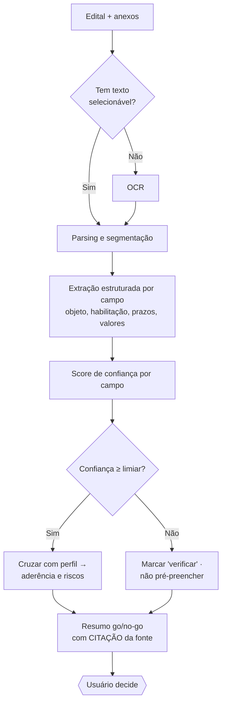

# 10 · Módulo 2 — Análise e Triagem por IA

> Aprofundamento do módulo mais **diferenciador e mais arriscado** do produto (documento 01, §§4 e 8). O fluxo já está no documento 03 (§4); aqui define-se a barra de qualidade, como se avalia (eval), a política de confiança e human-in-the-loop, e os modos de falha. Segurança de prompt injection está no documento 05 (§4). Estágio: **Concepção**.

## 1. Por que este módulo decide o produto

O Módulo 1 encontra editais; qualquer concorrente faz isso (documento 09). É o Módulo 2 que converte "achei um edital" em "vale a pena participar, e aqui está o porquê". Esse salto é o fosso competitivo — e também o maior risco: uma extração errada gera uma decisão de negócio errada (documento 01, §8). Confiança é o produto. Sem barra de qualidade, este módulo é um passivo, não um ativo.

## 2. Escopo — o que a IA faz e o que não faz

**Faz:** extrai do edital e anexos o objeto, os requisitos de habilitação (jurídica, fiscal, técnica, econômica), prazos, valores, modalidade, penalidades e condições; cruza com o perfil/documentos da empresa; calcula **aderência**; sinaliza **riscos**; e apresenta um resumo go/no-go.

**Não faz:** não **decide** (a decisão go/no-go é sempre do usuário — documento 03, §4); não dá **parecer jurídico** (documento 01, §6); não preenche automaticamente campos numéricos críticos sem confiança suficiente (§4).

## 3. Pipeline de extração

## 4. Princípios de qualidade e confiança

1. **Sempre citar a fonte.** Todo campo extraído e toda afirmação do resumo linkam o trecho e a página do edital (já em documento 03, §4). O usuário confere em um clique. Sem citação, não se exibe como fato.
2. **Confiança calibrada.** Cada campo carrega um score. Abaixo do limiar, o campo é marcado "verificar" e **não** alimenta automaticamente a decisão — nunca se apresenta um palpite como certeza.
3. **Human-in-the-loop.** A decisão é do usuário; campos de baixa confiança exigem confirmação antes de contar para a aderência.
4. **Conteúdo do edital é não confiável.** Trata-se o texto como dado, não instrução — defesa contra prompt injection (documento 05, §4): separar instruções de dados, nunca executar conteúdo extraído.

### 4.1 Limiar de confiança — política e valor calibrado (P-19)

O princípio 2 acima só vira gate executável quando o **limiar** tem um valor. A **estrutura** da política já está fixada (arquitetura/17, §6): opera **por campo**, com o `is_critico` do esquema de rótulo (§5.2) definindo onde a régua é dura, e a **confiança agregada = o mínimo dos campos críticos** — um único crítico fraco derruba a extração inteira. Abaixo do limiar, o campo é marcado "verificar" e **não pré-preenche** nem alimenta a decisão; se um crítico ficar abaixo, a extração é **incompleta** e cai em leitura assistida (§6).

O **valor calibrado** é a decisão de P-19 (RAD-139, 2026-07-08):

| Parâmetro | Valor calibrado | Onde vive | Status |
|-----------|:--------------:|-----------|--------|
| Limiar da confiança agregada (gate de release dos campos críticos) | **0,70** | `LIMIAR_CONFIANCA_PADRAO` em `@radar/triagem` (fonte única; a composição-root injeta em `TriarEditalInput.limiarConfianca`) | Calibrado — P-19 fechado |

- **Resultado da calibração (A16 §2.4 · RAD-139).** Protocolo executado com gold set sintético de 30 editais (`scripts/calibrar-limiar-gold-set.ts`): recall@0,70 = **95,1%** ✓, recall@0,71 = 92,2% ✗ — 0,70 é o maior corte que mantém recall ≥ 95%. Zero alucinação numérica verificada @0,70 (todos os erros numéricos tinham confiança < 0,70). Sem corte separado por classe numérica necessário. *(Números atualizados em RAD-218 ao estender o fixture sintético com `habilitação`/`dataSessao` — §5.2; a conclusão de P-19 não muda, só o denominador do recall.)*
- **Recalibração com gold set real.** Quando P-18 (gold set rotulado, ≥ 50 editais reais) e P-84/P-85 (protocolo de rotulagem + framework de eval) estiverem resolvidos, rodar `pnpm --filter @radar/triagem calibrar:limiar [gold-set-rotulado.json]` para confirmar ou ajustar o número. A estrutura (parâmetro injetado) não muda — só o valor aqui e no código-fonte.

## 5. Barra de qualidade e avaliação (eval)

Sem medição, não há confiança. O módulo é avaliado contra um **gold set**: um conjunto de editais rotulados por especialista, cobrindo modalidades e formatos heterogêneos.

| Dimensão | Como se mede | Meta (hipótese) `[A VALIDAR]` |
|----------|--------------|-------------------------------|
| **Recall de campos críticos** (prazo, objeto, habilitação) | vs. rótulos do gold set | ≥ 95% — perder um prazo é inaceitável |
| **Precisão de extração** | vs. rótulos do gold set | ≥ 90% |
| **Alucinação em campos numéricos** (valores, prazos, datas) | auditoria dos campos numéricos | **zero** — regra dura (guardrail, documento 08, §4) |
| **Fidelidade do resumo** (faithfulness) | % de afirmações rastreáveis à fonte citada | ≥ 98% `[A VALIDAR]` |
| **Aceitação pelo usuário** | % de triagens aceitas sem refazer (documento 08, §3) | ≥ 70% `[A VALIDAR]` |

**Regressão.** O gold set roda a cada mudança de prompt, modelo ou pipeline — nenhuma mudança sobe sem passar. É o mesmo espírito do checklist de conformidade (documento 04, §6) aplicado à qualidade da IA.

### 5.1 Cobertura mínima

O gold set deve cobrir os eixos de variação que mais impactam a extração:

- **Modalidade** (Lei 14.133/2021): Pregão Eletrônico, Concorrência, Dispensa de Licitação e Inexigibilidade como eixo principal; Leilão, Concurso e Credenciamento como cobertura complementar.
- **Formato do documento**: PDF nativo (texto selecionável), PDF imagem pura (OCR obrigatório), PDF misto.
- **Complexidade**: simples (objeto único, item único), moderada (múltiplos itens), complexa (múltiplos lotes, requisitos técnicos especializados).
- **Casos-limite**: edital mal estruturado, prazos conflitantes entre seções, valor estimado sigiloso (§9 do documento 05), habilitação técnica de alta especificidade.

Distribuição mínima `[A VALIDAR — confirmar com especialista de domínio]`:

| Modalidade / Formato | PDF nativo | PDF imagem | PDF misto |
|---------------------|-----------|------------|-----------|
| Pregão Eletrônico | ≥ 10 | ≥ 5 | ≥ 3 |
| Concorrência | ≥ 5 | ≥ 2 | ≥ 2 |
| Dispensa de Licitação | ≥ 3 | — | — |
| Inexigibilidade | ≥ 3 | — | — |
| Demais modalidades | ≥ 2 | — | — |
| **Casos-limite** | ≥ 5 (transversal às linhas acima) | | |

**Total mínimo: ≥ 50 editais rotulados**, garantindo pelo menos 15 no caminho OCR para stressar o pipeline de pré-processamento. Os casos-limite são ortogonais à modalidade — um edital com prazos conflitantes pode ser Pregão ou Concorrência.

### 5.2 Esquema de rótulo

Cada edital no gold set carrega um rótulo estruturado. O campo `is_critico` define onde o **recall ≥ 95% é regra dura** (gate de release, documento 07, §6); campos não-críticos seguem a meta de precisão geral (≥ 90%).

Implementado no tipo `EditalRotulado` (`modules/triagem/src/application/calibracao-limiar.ts`, RAD-218): `objeto`, `valor_estimado`, `data_abertura_propostas`, `data_sessao` e as quatro categorias de `habilitacao`. **`habilitação` não é escalar** — cada categoria é uma **lista de `CampoRotulado`** (um por requisito, não `string[]` de descrições soltas); `varreLimiar()`/`calibrar()` somam hits/total requisito a requisito, o que expressa **recall parcial** sobre a lista (ex.: 7 de 9 requisitos técnicos corretos) em vez de um booleano por categoria. `modalidade_codigo`, `prazo_vigencia_meses`, `penalidades` e `fontes` ainda não têm campo dedicado no tipo — não bloqueiam P-18 (só `modalidade_codigo` é `is_critico`, e a modalidade já existe como metadado de estratificação em `EditalRotulado.modalidade`, apenas sem recall/confiança de extração associados; ficou de fora do escopo de RAD-218 por não ter sido apontado na análise de RAD-202).

| Campo | Tipo | `is_critico` | Notas |
|-------|------|:------------:|-------|
| `objeto` | `string` | sim | Descrição literal do edital |
| `modalidade_codigo` | `string` | sim | Código PNCP (FK para tabela de domínio, arquitetura/03, §4). **Não implementado como `CampoRotulado`** — ver nota acima |
| `valor_estimado` | `number \| null` | sim | `null` se sigiloso ou omitido |
| `data_abertura_propostas` | `ISO date` | sim | Prazo para envio de propostas |
| `data_sessao` | `ISO date \| null` | sim | Data da sessão pública |
| `prazo_vigencia_meses` | `number \| null` | não | Do contrato, se mencionado. Não implementado (não-crítico) |
| `habilitacao.juridica` | `CampoRotulado[]` | sim | Um item por requisito jurídico exigido |
| `habilitacao.fiscal` | `CampoRotulado[]` | sim | Um item por requisito fiscal exigido |
| `habilitacao.tecnica` | `CampoRotulado[]` | sim | Um item por requisito técnico exigido |
| `habilitacao.economica` | `CampoRotulado[]` | não | Um item por requisito econômico exigido |
| `penalidades` | `string[]` | não | Percentuais ou condições. Não implementado (não-crítico) |
| `fontes` | `Record<campo, {pagina, secao}>` | — | Origem de cada campo no PDF. Não implementado |

### 5.3 Protocolo de avaliação

1. **Extração sem dica** — o pipeline recebe o PDF bruto; nenhum metadado de rótulo é fornecido.
2. **Comparação por campo** — cada campo extraído é classificado como `correto`, `parcial` (capturado, mas com imprecisão aceitável) ou `ausente/errado`.
3. **Cálculo das métricas** (via as definições da tabela acima):
   - *Recall crítico* = corretos(campos\_criticos) / rotulados(campos\_criticos)
   - *Precisão geral* = (corretos + parciais) / total\_extraídos
   - *Alucinação numérica* = qualquer campo numérico com valor inventado → falha imediata
   - *Faithfulness* = afirmações\_com\_citação\_verificável / total\_afirmações\_do\_resumo
4. **Reprovação automática** se qualquer regra dura falhar: recall crítico < 95%, alucinação numérica > 0, ou faithfulness < 98%.
5. **Relatório por categoria** — resultados quebrados por modalidade × formato para identificar onde o pipeline degrada (§6).

### 5.4 Protocolo de rotulagem do gold set (P-84)

#### Quem rotula

- **Anotador primário:** especialista de produto (Produto) com conhecimento do domínio de licitações — interpreta o edital e preenche o esquema de rótulo (§5.2).
- **Anotador de revisão:** engenheiro de IA (Eng/Iara) — revisa a anotação quanto a consistência com o esquema e cobertura dos campos críticos.
- **Árbitro:** tech lead (Artur) — resolve qualquer discordância que persista após a revisão.

A separação de papéis evita viés de confirmação: o primário não sabe o que o modelo extraiu; a revisão valida o protocolo, não a saída da IA.

#### Dupla anotação e medida de concordância

Anotar em duplicata os **50 editais inteiros custa caro e não paga**. A regra:

- **100% dos editais** recebem anotação do primário.
- **≥ 20% (amostra sorteada, mínimo 10 editais)** recebem também anotação independente do revisor, *às cegas* — o revisor não vê o rótulo do primário antes de fechar o seu.
- Sobre essa amostra mede-se a **taxa de discordância por campo crítico**. Se passar de **10%**, o protocolo falhou (não o anotador): o esquema de rótulo está ambíguo → suspender a rotulagem, corrigir a definição do campo em §5.2 e **rerotular a amostra**. Desempatar caso a caso um esquema ambíguo só esconde o problema.

#### Critério de desempate entre anotadores

O desempate é **procedimental** — acontece na planilha de anotação, contra o texto-fonte, *antes* de virar rótulo. O artefato final (§5.2) grava só o resultado:

1. Comparar as anotações campo a campo **antes** de reabrir o edital.
2. Discordância em campo **não-crítico** (`critico: false`): prevalece o anotador primário.
3. Discordância em campo **crítico** (`critico: true`): obrigatório reabrir o texto-fonte. Prevalece a anotação que o anotador consegue **ancorar num trecho literal** do edital. Se ambos ancoram em trechos diferentes (o edital se contradiz — é um caso-limite legítimo de §5.1), decide o **árbitro**.
4. Campo que **nenhum** anotador consegue ancorar no texto-fonte é rotulado `rotuloPresente: false` — o campo é tratado como ausente do edital, e o `varreLimiar()` já o exclui do denominador do recall. Não se inventa um valor "provável" para não deixar a célula vazia.

> A regra 4 usa o vocabulário que o esquema tipado **já tem** (`CampoRotulado.rotuloPresente`, em `modules/triagem/src/application/calibracao-limiar.ts`); não há — nem é preciso haver — um estado `indeterminado`.

#### Cadência de atualização

| Momento | Ação |
|---|---|
| **Pré-lançamento** | Rotular os ≥ 50 editais iniciais (cobertura obrigatória de §5.1) antes do Gate 4 (CI). |
| **A cada mudança de prompt, modelo ou pipeline** | O gold set roda como gate (§5.3). Se o recall cair num eixo (modalidade × formato), **acrescentar editais reais daquele eixo** até o recall voltar — a regressão diz onde o gold set é raso. Sem cota fixa: a métrica é que manda. |
| **Trimestral** | Reamostrar contra o PNCP: descartar rótulos de editais cujo formato o órgão publicador mudou e repor mantendo a matriz de §5.1. |
| **Ao resolver P-93/P-94/P-95** | Rerotular os editais das faixas de dificuldade impactadas e **recalibrar o limiar** (P-19, `calibrar:limiar`). |

#### Onde o artefato vive

O gold set é **um único arquivo JSON** tipado `GoldSet` (`meta` + `editais[]`), ao lado do sintético em `modules/triagem/scripts/fixtures/` — o real entra como `gold-set-rotulado-real.json` com `meta.tipo: 'real'`. O versionamento **já existe no próprio artefato** (`meta.versao`, `meta.geradoEm`): é git, não um CHANGELOG paralelo. O sintético de 30 editais **não é descartado** — continua servindo de teste do harness de calibração (P-19/RAD-139).

#### Pré-condição de código — resolvida (RAD-218)

Este § define **quem** rotula e **como** desempata; a rotulagem só produz um gold set útil com um esquema tipado correto, e esse era o bloqueio: `EditalRotulado.campos` tinha exatamente três campos — `objeto`, `valorEstimado`, `dataAberturaPropostas` — enquanto este documento (§5) define os críticos como prazo, objeto e habilitação. `habilitação` não existia no tipo nem no fixture: os 50 editais reais de P-18 mediriam recall sobre um conjunto que não inclui o campo que sustenta a aderência e o checklist — um verde falso no eval (P-85), o pior tipo: o gate passaria.

**Resolvido.** `EditalRotulado.campos` agora tem `dataSessao` (cobre a lacuna de "prazo" apontada — `data_sessao` é `is_critico: sim` em §5.2, distinto do prazo de envio de propostas) e `habilitacao: { juridica, fiscal, tecnica, economica }`, cada categoria uma **lista de `CampoRotulado`** — um item por requisito, não um booleano por campo — para expressar recall parcial (ex.: 7 de 9 requisitos corretos). `varreLimiar()`/`calibrar()` (`modules/triagem/src/application/calibracao-limiar.ts`) achatam escalares e itens de habilitação num único pool de campos atômicos, sem agregação especial. Fixture sintético (`gold-set-rotulado-sintetico.json`) estendido com exemplos de habilitação, incluindo um caso de recall parcial (8 de 9); `LIMIAR_CONFIANCA_PADRAO = 0,70` (P-19) confirmado com o novo denominador (recall@0,70 = 95,1%, ver §4.1) — não exigiu recalibração. **P-18 desbloqueado.**

## 6. Modos de falha e fallback

Degradar com transparência é melhor que errar com confiança:

- **Baixa confiança na extração** → degradar para **leitura assistida**: destacar os trechos relevantes sem decidir por ele.
- **PDF imagem / OCR falha** → marcar "requer leitura manual"; não inventar conteúdo.
- **Anexos ausentes ou ilegíveis** → sinalizar triagem **incompleta**; não apresentar aderência como final.
- **Edital fora do padrão** (modalidade rara, estrutura atípica) → reduzir confiança e pedir revisão humana.

## 7. Custo e desempenho

O **custo de IA** é guardrail da unidade econômica (documentos 08, §4 e 09, §6), mas não se resume a "custo por edital abaixo do preço por triagem". A extração é **1 por edital, cacheável, global e não sensível à latência**; a aderência por perfil é interativa e escala com a triagem solicitada. A **latência de triagem** é um NFR (documento 12): a promessa de "horas para minutos" (documento 01, §5) só se cumpre com resposta rápida. Custo e latência não competem aqui — o **split extração/aderência** (documento 12; arquitetura/03, §6; P-45) é o que os concilia.

### 7.1 Alavancas de custo/desempenho

Decididas na avaliação do adaptador de LLM (arquitetura/17, §5.1; RAD-53) e **todas subordinadas à barra de qualidade** — nenhuma troca recall ≥ 95% ou zero alucinação numérica (§5) por custo. As que **mudam o que vai ao modelo** só valem depois de passar no gold set (§5.3):

- **Pré-extração em lote na ingestão** (P-92) — como a extração não é sensível à latência, ela roda de forma **assíncrona quando o edital é ingerido** (antes de o usuário pedir a triagem) e **em lote**, o que corta ~metade do custo de extração. Quando o usuário chega, a extração já está pronta e só a aderência por perfil é calculada — rápida e barata. Preserva a inferência (mesmo modelo e prompt), então não depende do gold set.
- **Modelo por dificuldade** (P-93) — editais fáceis (PDF nativo, item único, modalidade simples — eixos de §5.1) usam um modelo mais barato; os difíceis, um mais capaz. Cada faixa é validada no gold set (§5.3) antes de valer.
- **Minimização do que vai ao modelo** (P-94) — o input é a parte controlável antes da chamada; enviar só as **seções candidatas** (objeto, habilitação, prazos, valores) em vez do edital inteiro, medindo o consumo para **admission control por item** (P-20/P-38). Sujeito ao gold set, pois recortar demais arrisca o recall.
- **Reuso do prefixo estável** (P-95) — quando o prompt tiver exemplos do gold set, o trecho fixo (instrução + esquema) pode ser cacheado entre chamadas. Hoje o prefixo é pequeno demais para compensar; fica condicionado ao gold set.

O **orçamento de custo de IA** que fecha a unidade econômica continua `[A VALIDAR]` (P-20/P-38): deve ser acumulado por janela — global e por tenant/plano — e medido por ledger de uso. Por item, o controle é admission control de input/output e fallback para outliers.

## 8. Pendências

- Construir o gold set rotulado (cobertura e esquema em §§5.1–5.2; rótulos a produzir e metas a validar pré-lançamento). `[A VALIDAR]`
- Fixar os limiares de confiança por campo (§4). `[A VALIDAR]`
- Definir o orçamento de custo de IA por janela que fecha a unidade econômica (§7). `[A VALIDAR]`
- Validar no gold set as alavancas de custo que mudam o modelo/entrada (§7.1) — modelo por dificuldade (P-93), minimização de entrada (P-94), cache de prefixo (P-95); a pré-extração em lote (P-92) preserva a inferência e não depende do gold set. `[A VALIDAR]`

Rastreadas no documento **98 · Decisões e pendências**.
