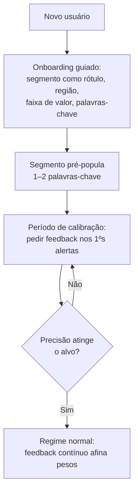
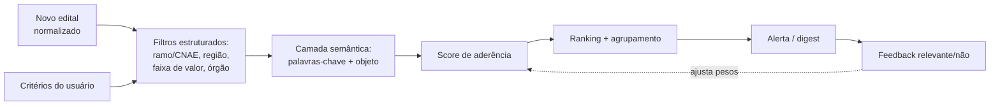
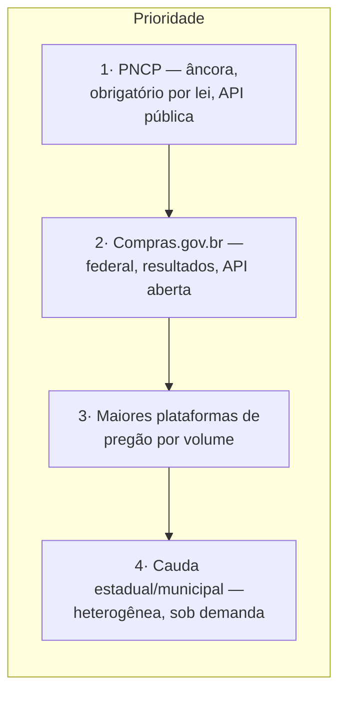

# 11 · Módulo 1 — Matching, Cold-start e Cobertura

> Aprofundamento do módulo fundacional (documento 01, §4). O fluxo está no documento 03 (§§2-3); aqui decidem-se as questões de produto que aquele fluxo deixa em aberto: a postura precisão × recall, o problema do usuário novo (cold-start), a fadiga de alerta e a estratégia de priorização de fontes. Estágio: **Concepção**.

## 1. As três alavancas do Módulo 1

O valor do monitoramento é o produto de três alavancas — se qualquer uma zera, o módulo perde sentido:

- **Cobertura (recall de fontes)** — capturei o edital? (documento 08 mede)
- **Frescor (latência)** — avisei a tempo de agir? (documento 12, NFR)
- **Precisão do matching (relevância)** — o que avisei era relevante? (documento 08 mede)

## 2. Precisão × recall — a decisão de produto

Os dois erros do matching não custam igual. **Perder um edital relevante (falso negativo) é pior que um alerta a mais (falso positivo)**, porque o valor central prometido é "não perder oportunidade" (documento 01, §1). Logo:

**Decisão:** tunar o matching para **recall alto**, e usar a triagem (documento 10) e o feedback do usuário (documento 03, §3) como as camadas que filtram os falsos positivos.

**Limiar MVP:** no conjunto de controle de editais PNCP relevantes ao ICP, o matching precisa alertar pelo menos **90%** dos editais que deveriam casar com algum critério ativo (**recall de matching ≥ 90%**) e manter **precisão ≥ 60%** dos alertas avaliados como relevantes por contas ativas (documento 08, §3). Abaixo de 60% de precisão por duas semanas consecutivas, a ação padrão é ajustar ranking, agrupamento, digest e onboarding — não reduzir recall — salvo se o novo corte continuar provando recall ≥ 90%.

Há um teto: recall alto demais afoga o usuário e dispara o **guardrail de fadiga de alerta** (documento 08, §4). O contrapeso não é baixar o recall, e sim **rankear e agrupar** melhor (§4) — mostrar tudo o que importa, na ordem certa, sem spammar.

## 3. Cold-start — o usuário novo sem histórico

O matching melhora com feedback (documento 03, §3), mas o usuário novo não tem histórico. Sem tratamento, a primeira experiência é ruim justamente quando mais importa (ativação, documento 08, §3).

Ideia-chave: no início, o produto **pede mais** (feedback) e **assume mais** (sugere critérios), convergindo para pedir menos conforme aprende.

### 3.1 O segmento é rótulo, nunca filtro — CNAE não existe no edital

**Decisão (arquitetura, 2026-07-12):** o onboarding **nunca escreve `ramoCnae`**. O PNCP não publica CNAE da *contratação* — o CNAE que existe lá é o do **fornecedor**, não o da compra. Como o edital chega ao matching sempre sem CNAE, todo critério com `ramoCnae` preenchido casa com **zero** editais: preencher o campo **silencia a conta**, e o usuário não é avisado.

Consequências, que valem como restrição de contrato:

- A pergunta "qual o seu ramo/segmento?" sobrevive **apenas como rótulo de produto que pré-popula palavras-chave**. Ela não vira filtro estrutural, não é persistida no critério e não tem campo no modelo.
- Um critério exige **ao menos um filtro efetivo** — palavras-chave, **ou** UF, **ou** faixa de valor. Nenhum dos três casa com tudo e vira firehose. (O invariante antigo, *"ao menos ramo/CNAE ou palavras-chave"*, aceitava um critério só-CNAE: garantidamente mudo.)
- **`ramoCnae` e `regiaoUf` são escalares, não listas.** Um multi-select de UF na tela ⇒ o front cria **N critérios**, não um.

### 3.2 Sugestão por segmento: listas curtas, score proporcional

O score de palavras-chave é **proporcional** — `encontrados / termos.length` — e não tudo-ou-nada. Com o corte de alta aderência em **0,80** (documento 98, P-81), isso passa a significar "**≥ 80% dos termos batem**", o que é uma barra legível e mantém a postura de recall alto de §2.

Isso governa o formato das sugestões: **1–2 palavras-chave genéricas por segmento**, nunca listas longas. Uma sugestão de 5–6 termos exigiria que o `objetoCompra` contivesse quase todos para superar o limiar — na prática, **sugerir mais palavras reduz o alcance**. Um usuário onboardado *sem* nenhuma palavra-chave fica no score neutro de 0,5: recebe alerta, mas nunca de alta aderência, logo nunca crítico por aderência no digest (só por prazo).

**Decisão de Produto (2026-07-12, P-23).** Os seis segmentos do ICP e as palavras-chave que o onboarding pré-popula:

| Segmento exibido no onboarding | Palavras-chave pré-populadas |
|---|---|
| TI e software | `software`, `sistema` |
| Equipamentos de informática | `computador`, `notebook` |
| Limpeza e conservação | `limpeza`, `conservação` |
| Segurança e vigilância | `vigilância`, `segurança` |
| Saúde e insumos hospitalares | `medicamento`, `hospitalar` |
| Obras e manutenção predial | `obra`, `reforma` |

Regras de uso, todas decorrentes de §3.1:

- O segmento é **atalho visual de onboarding**, não dado de domínio: nada dele é persistido. O que fica salvo é só o critério efetivo — palavras-chave, UF e faixa de valor.
- As palavras-chave entram **editáveis** antes de salvar; o usuário não fica preso à sugestão.
- **UF:** pré-selecionar a UF do CNPJ do tenant quando disponível; se não estiver, exigir escolha explícita (nunca inferir por IP). Como `regiaoUf` é escalar, escolher mais de uma UF faz o front criar **N critérios**. **Hoje ela nunca está disponível** (ver a nota de viabilidade abaixo) ⇒ na prática o MVP cai no ramo "escolha explícita", com a opção *Brasil inteiro / sem filtro*.
- **Faixa de valor:** default **aberto**, sem mínimo nem máximo, e nunca obrigatória no onboarding — o valor estimado falta ou varia muito no PNCP, e exigir faixa no primeiro acesso corta recall antes do primeiro alerta relevante. Reforço do motor: quando há faixa, `casaCom` **descarta** o edital cujo `valorEstimado` é `null` — qualquer faixa preenchida silencia os editais sem valor publicado.

**Nota de viabilidade (Artur, 2026-07-12, RAD-295) — duas coisas que a tela não pode prometer:**

- **Não existe UF do tenant para pré-preencher.** `OrganizacaoDTO` é `{tenantId, cnpj, razaoSocial, papel}` (`modules/identidade/src/application/dtos.ts`) — sem UF e sem endereço — e o **CNPJ não codifica UF** (quem codifica região é o CPF). "Pré-selecionar a UF do CNPJ" exigiria consulta ou enriquecimento externo, rejeitado para o MVP em **P-112**. Portanto, o campo UF nasce **vazio, com escolha explícita**. Se Produto quiser o pré-preenchimento, o caminho barato é **perguntar a UF no provisionamento** e persisti-la no `Tenant` (mudança aditiva) — nunca derivá-la do CNPJ.
- **A faixa de valor não é min/máx livre no contrato.** A borda aceita `faixaValorCodigo` — chave da **tabela de referência datada** (`FaixaValorReferencia.faixasVigentes`, `POST /criterios` em `apps/api/src/routes/matching.ts`) —, não dois números. E **não há endpoint que liste as faixas vigentes**, então a tela não teria como popular um seletor. O default aberto (**omitir o campo**) é o único comportamento implementável hoje — e é justamente o decidido. Se um dia a faixa entrar no onboarding, ela precisa antes de um `GET` de faixas vigentes e vira **select de códigos**, jamais dois inputs numéricos.

**Duas palavras por segmento, não uma.** Com o score proporcional, dois termos dão *gradação*: um termo que bate ⇒ 0,5 (alerta, pois supera o piso de 0,3), os dois ⇒ 1,0 (alta aderência). Um critério de **uma só palavra** só produz 0 ou 1 — ou seja, **todo** casamento vira alta aderência e crítico no digest, o que reintroduz fadiga de alerta por outro caminho (§4).

> ⚠️ **O casamento precisa dobrar acento** (`normalize('NFD')`, dois lados). O `objetoCompra` do PNCP vem com frequência em caixa alta e **sem** acento, e a comparação é `includes` cru: sem *folding*, `conservação` não casa com `CONSERVACAO` e os segmentos *Limpeza e conservação* e *Segurança e vigilância* perdem editais **em silêncio**. Rastreado em `RAD-306`.

## 4. Fadiga de alerta e canais

Volume sem controle mata produtos de monitoramento. Controles de produto:

- **Criticidade define o canal:** prazo final em até **3 dias corridos** ou alta aderência (**score ≥ 0,80**) → alerta imediato; o resto → **digest**.
- **Agrupamento:** editais semelhantes num só alerta, não N e-mails.
- **Frequência configurável** por usuário, com padrão diário; digest diário envia no máximo **10 itens** e digest semanal no máximo **25 itens** por usuário, sempre ordenados por prazo e aderência.
- **Priorização visível:** o alerta chega ordenado por aderência, não por ordem de chegada.
- **Excedente sem spam:** itens acima do cap são agrupados por critério/órgão e ficam acessíveis no produto; não viram e-mails individuais. Alertas críticos não esperam o digest nem contam para o cap.

## 5. Motor de matching

A **modalidade** e a **faixa de valor** (que muda por decreto — documento 02, §2) são atributos de primeira classe do edital (documento 12), então o filtro por valor lê tabela parametrizável e datada, nunca constante em código (documento 04, §4).

## 6. Estratégia de cobertura de fontes

Cada fonte nova custa integração + o checklist legal de 3 perguntas (documento 02, §6). Portanto, prioriza-se por **valor ÷ esforço**: volume de editais relevantes ao ICP, dividido pelo esforço de integração e manutenção.

Regra: **nenhuma fonte entra sem passar pelo checklist do documento 02, §6** (existe API oficial? o que dizem os termos de uso? qual a base legal LGPD?). Cobertura ampla nunca justifica atalho de conformidade.

## 7. Resiliência de fontes

O risco de dependência de fontes (documento 01, §8) exige tratamento operacional, não só jurídico:

- **Monitoramento de saúde** por fonte: disponibilidade, latência e volume esperado; alerta interno quando cai ou muda de comportamento.
- **Detecção de *schema drift*:** quando uma API/portal muda formato, a ingestão sinaliza em vez de gravar lixo (liga à validação de entrada, documento 05, §4).
- **Degradação graciosa:** a queda de uma fonte degrada cobertura parcial, não derruba o produto; o PNCP como âncora garante um piso.

## 8. Pendências

- Recalibrar limiares de recall/precisão, criticidade e cap de digest após o piloto MVP, usando feedback real por segmento (§§2, 4).
- Definir a lista priorizada de fontes além do PNCP para o *Next* (§6, documento 07). `[A VALIDAR]`
- ~~Especificar o onboarding de cold-start e os critérios sugeridos por segmento (§3).~~ **Resolvido** (P-23, 2026-07-12): fluxo em §3, ruling do CNAE em §3.1, lista de segmentos e defaults em §3.2.

Rastreadas no documento **98 · Decisões e pendências**.
