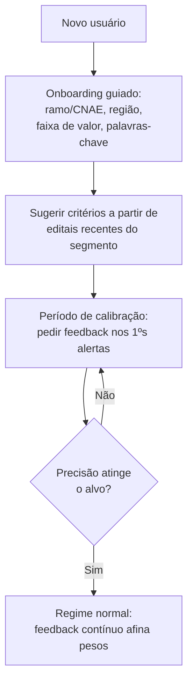
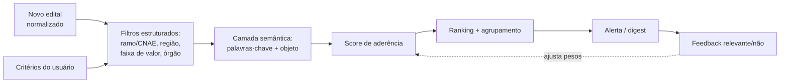
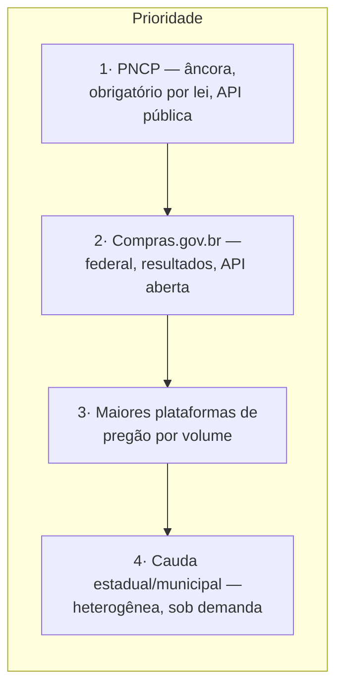

# 11 · Módulo 1 — Matching, Cold-start e Cobertura

> Aprofundamento do módulo fundacional (documento 01, §4). O fluxo está no documento 03 (§§2-3); aqui decidem-se as questões de produto que aquele fluxo deixa em aberto: a postura precisão × recall, o problema do usuário novo (cold-start), a fadiga de alerta e a estratégia de priorização de fontes. Estágio: **Concepção**.

## 1. As três alavancas do Módulo 1

O valor do monitoramento é o produto de três alavancas — se qualquer uma zera, o módulo perde sentido:

- **Cobertura (recall de fontes)** — capturei o edital? (documento 08 mede)
- **Frescor (latência)** — avisei a tempo de agir? (documento 12, NFR)
- **Precisão do matching (relevância)** — o que avisei era relevante? (documento 08 mede)

## 2. Precisão × recall — a decisão de produto

Os dois erros do matching não custam igual. **Perder um edital relevante (falso negativo) é pior que um alerta a mais (falso positivo)**, porque o valor central prometido é "não perder oportunidade" (documento 01, §1). Logo:

**Decisão:** tunar o matching para **recall alto**, e usar a triagem (documento 10) e o feedback do usuário (documento 03, §3) como as camadas que filtram os falsos positivos.

**Limiar MVP:** no conjunto de controle de editais PNCP relevantes ao ICP, o matching precisa alertar pelo menos **90%** dos editais que deveriam casar com algum critério ativo (**recall de matching ≥ 90%**) e manter **precisão ≥ 60%** dos alertas avaliados como relevantes por contas ativas (documento 08, §3). Abaixo de 60% de precisão por duas semanas consecutivas, a ação padrão é ajustar ranking, agrupamento, digest e onboarding — não reduzir recall — salvo se o novo corte continuar provando recall ≥ 90%.

Há um teto: recall alto demais afoga o usuário e dispara o **guardrail de fadiga de alerta** (documento 08, §4). O contrapeso não é baixar o recall, e sim **rankear e agrupar** melhor (§4) — mostrar tudo o que importa, na ordem certa, sem spammar.

## 3. Cold-start — o usuário novo sem histórico

O matching melhora com feedback (documento 03, §3), mas o usuário novo não tem histórico. Sem tratamento, a primeira experiência é ruim justamente quando mais importa (ativação, documento 08, §3).

Ideia-chave: no início, o produto **pede mais** (feedback) e **assume mais** (sugere critérios), convergindo para pedir menos conforme aprende.

## 4. Fadiga de alerta e canais

Volume sem controle mata produtos de monitoramento. Controles de produto:

- **Criticidade define o canal:** prazo final em até **3 dias corridos** ou alta aderência (**score ≥ 0,80**) → alerta imediato; o resto → **digest**.
- **Agrupamento:** editais semelhantes num só alerta, não N e-mails.
- **Frequência configurável** por usuário, com padrão diário; digest diário envia no máximo **10 itens** e digest semanal no máximo **25 itens** por usuário, sempre ordenados por prazo e aderência.
- **Priorização visível:** o alerta chega ordenado por aderência, não por ordem de chegada.
- **Excedente sem spam:** itens acima do cap são agrupados por critério/órgão e ficam acessíveis no produto; não viram e-mails individuais. Alertas críticos não esperam o digest nem contam para o cap.

## 5. Motor de matching

A **modalidade** e a **faixa de valor** (que muda por decreto — documento 02, §2) são atributos de primeira classe do edital (documento 12), então o filtro por valor lê tabela parametrizável e datada, nunca constante em código (documento 04, §4).

## 6. Estratégia de cobertura de fontes

Cada fonte nova custa integração + o checklist legal de 3 perguntas (documento 02, §6). Portanto, prioriza-se por **valor ÷ esforço**: volume de editais relevantes ao ICP, dividido pelo esforço de integração e manutenção.

Regra: **nenhuma fonte entra sem passar pelo checklist do documento 02, §6** (existe API oficial? o que dizem os termos de uso? qual a base legal LGPD?). Cobertura ampla nunca justifica atalho de conformidade.

## 7. Resiliência de fontes

O risco de dependência de fontes (documento 01, §8) exige tratamento operacional, não só jurídico:

- **Monitoramento de saúde** por fonte: disponibilidade, latência e volume esperado; alerta interno quando cai ou muda de comportamento.
- **Detecção de *schema drift*:** quando uma API/portal muda formato, a ingestão sinaliza em vez de gravar lixo (liga à validação de entrada, documento 05, §4).
- **Degradação graciosa:** a queda de uma fonte degrada cobertura parcial, não derruba o produto; o PNCP como âncora garante um piso.

## 8. Pendências

- Recalibrar limiares de recall/precisão, criticidade e cap de digest após o piloto MVP, usando feedback real por segmento (§§2, 4).
- Definir a lista priorizada de fontes além do PNCP para o *Next* (§6, documento 07). `[A VALIDAR]`
- Especificar o onboarding de cold-start e os critérios sugeridos por segmento (§3). `[A VALIDAR]`

Rastreadas no documento **98 · Decisões e pendências**.
