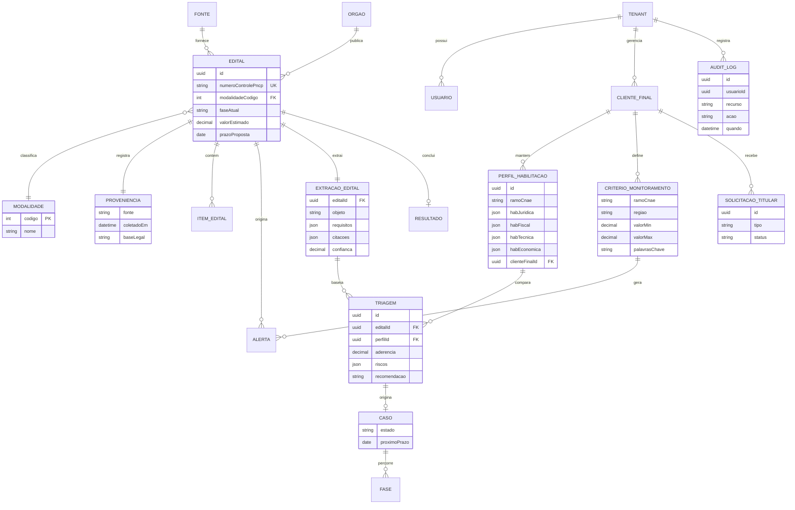

# 12 · Modelo Conceitual de Dados e Requisitos Não-Funcionais

> Alinhamento produto ↔ engenharia **antes** de qualquer schema físico. Consolida as entidades núcleo que aparecem espalhadas nos documentos 03 e 04 e transforma as métricas do documento 08 em requisitos não-funcionais com número. É modelo **conceitual** (o quê e como se relacionam), não desenho de banco. Estágio: **Concepção** — `[A VALIDAR]` onde indicado.

## 1. Entidades núcleo

## 2. Atributos de primeira classe (não são detalhe)

- **Modalidade** como **FK à tabela de domínio `MODALIDADE`** (código do PNCP), não string denormalizada — altera rito e prazos (documento 04, §4).
- **Fase dirigida por dados** — `faseAtual` vem dos dados do edital, nunca de uma ordem fixa em código, por causa da inversão julgamento→habilitação e suas exceções (documento 04, §4).
- **Proveniência** em todo edital — fonte, timestamp e base legal (documento 03, §2); essencial para auditoria e direitos do titular (documento 02, §4).
- **Escopo de cliente nas entidades geradas pelo usuário** (`CRITERIO_MONITORAMENTO`, `ALERTA`, `TRIAGEM`, `CASO`, `PERFIL_HABILITACAO`) via `tenantId`/`clienteFinalId` — isolamento estrutural (documento 05, §3). O **catálogo público** (`EDITAL`, `EXTRACAO_EDITAL`, `RESULTADO`, `MODALIDADE`, `ORGAO`) é **global/compartilhado** — não leva `tenantId`, e é isso que viabiliza o cache de extração e evita duplicar edital por tenant. `[A VALIDAR — clienteFinalId ativado no Next]`
- **Valores parametrizáveis e datados** — faixas que mudam por decreto (documento 02, §2) vivem em tabela de referência versionada, não no edital nem no código.
- **Extração separada da aderência** — `EXTRACAO_EDITAL` (fatos do edital: objeto, requisitos, prazos, citações) é **1 por edital e cacheável**; `TRIAGEM` (aderência da empresa) é **1 por edital × perfil**, pois depende do perfil de habilitação. Unir as duas quebraria o cache (custo) ou a correção (documento 10, §7).

## 3. Requisitos não-funcionais (NFRs / SLAs)

Cada NFR deriva de uma métrica (documento 08) ou de um controle (documento 05). Números são hipóteses de concepção:

| NFR | Requisito | Alvo (hipótese) | Origem |
|-----|-----------|-----------------|--------|
| **Frescor de alerta** | p95 do tempo publicação (PNCP) → alerta | ≤ 30 min `[A VALIDAR]` | 08 §3 |
| **Cobertura PNCP** | % dos editais publicados capturados | ≥ 99% | 08 §3 |
| **Latência de triagem** | tempo por edital no Módulo 2 | ≤ poucos minutos `[A VALIDAR]` | 01 §5 / 10 §7 |
| **Disponibilidade** | uptime do serviço | ≥ 99,5% `[A VALIDAR]` | operação |
| **Isolamento multi-tenant** | vazamentos cross-tenant | **0** (regra dura) | 05 §2 |
| **Auditabilidade** | acessos a dado pessoal logados | 100% | 05 §3 |
| **Retenção** | expurgo conforme política por tipo de dado | conforme 05 §5 `[A VALIDAR]` | 05 §5 |
| **Custo de IA/edital** | custo por triagem abaixo do preço médio | teto `[A VALIDAR]` | 08 §4 / 09 §6 |
| **Rate-limit com fontes** | coleta educada, sem sobrecarregar portais | conforme fonte | 03 §7 |
| **Escalabilidade** | editais/dia e nº de tenants suportados | a dimensionar `[A VALIDAR]` | 09 (consultorias) |

## 4. Relação com os demais documentos

Este modelo é o substrato comum: os **fluxos** (documento 03) movem estas entidades, o **mapeamento legal** (documento 04) define os estados de `EDITAL.faseAtual` e `CASO`, a **segurança** (documento 05) protege `tenantId` e `PROVENIENCIA`, e as **métricas** (documento 08) se calculam sobre `ALERTA` e `TRIAGEM`.

## 5. Pendências

- Validar a lista de entidades e cardinalidades com engenharia antes do schema físico. `[A VALIDAR]`
- Confirmar os números de NFR/SLA (§3) — dependem de arquitetura. `[A VALIDAR]`
- Definir o esquema de eventos de instrumentação (documento 08, §6) sobre estas entidades. `[A VALIDAR]`

Rastreadas no documento **98 · Decisões e pendências**.
