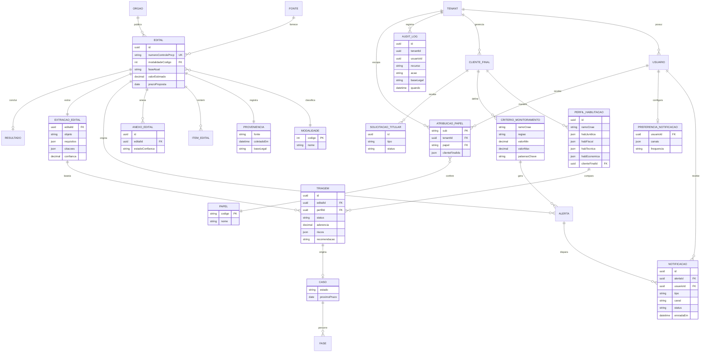

# 12 · Modelo Conceitual de Dados e Requisitos Não-Funcionais

> Alinhamento produto ↔ engenharia **antes** de qualquer schema físico. Consolida as entidades núcleo que aparecem espalhadas nos documentos 03 e 04 e transforma as métricas do documento 08 em requisitos não-funcionais com número. É modelo **conceitual** (o quê e como se relacionam), não desenho de banco. Estágio: **Concepção** — `[A VALIDAR]` onde indicado.

## 1. Entidades núcleo

## 2. Atributos de primeira classe (não são detalhe)

- **Modalidade** como **FK à tabela de domínio `MODALIDADE`** (código do PNCP), não string denormalizada — altera rito e prazos (documento 04, §4).
- **Fase dirigida por dados** — `faseAtual` vem dos dados do edital, nunca de uma ordem fixa em código, por causa da inversão julgamento→habilitação e suas exceções (documento 04, §4).
- **Proveniência** em todo edital — fonte, timestamp e base legal (documento 03, §2); essencial para auditoria e direitos do titular (documento 02, §4).
- **Auditoria append-only** — `AUDIT_LOG` é **imutável e somente-anexação**: registra quem (`usuarioId`), quando (`quando`), o quê (`recurso`, `acao`), sob qual **base legal** (`baseLegal`) e em qual **escopo** (`tenantId`; `clienteFinalId` no *Next*), materializando a auditabilidade 100% (§3) e o princípio 4 de segurança (documento 05, §3). Tentativa de `UPDATE`/`DELETE` é negada no nível de dados e ela mesma auditada; gravação é **fail-closed** (P-61; arquitetura/07 AB13).
- **Escopo de cliente nas entidades geradas pelo usuário** (`CRITERIO_MONITORAMENTO`, `ALERTA`, `TRIAGEM`, `CASO`, `PERFIL_HABILITACAO`, `NOTIFICACAO`, `PREFERENCIA_NOTIFICACAO`) via `tenantId`/`clienteFinalId` — isolamento estrutural (documento 05, §3). O **catálogo público** (`EDITAL`, `EXTRACAO_EDITAL`, `RESULTADO`, `MODALIDADE`, `ORGAO`) é **global/compartilhado** — não leva `tenantId`, e é isso que viabiliza o cache de extração e evita duplicar edital por tenant. `[A VALIDAR — clienteFinalId ativado no Next]`
- **Valores parametrizáveis e datados** — faixas que mudam por decreto (documento 02, §2) vivem em tabela de referência versionada, não no edital nem no código.
- **Representação de valor monetário** — os campos em dinheiro (`valorEstimado`, `valorUnitarioEstimado`, `valorMin`, `valorMax`) são `decimal` no **armazenamento** (coluna `numeric` do Postgres), e a exatidão é preservada na escrita pelo VO `ValorMonetario` (`representacaoDecimal`, string decimal). Em **transporte e comparação** (DTOs, eventos, matching de faixa) a representação é `number` (float64) **deliberadamente**: são valores de **referência/estimativa** (lidos do PNCP/IA, limiares de decreto), comparados com tolerância e nunca somados a um total vinculante — logo não há aritmética de livro-razão que exija decimal fim-a-fim. Promover a um VO `Dinheiro` no `@radar/kernel` só se surgir essa aritmética (documento 98, **P-102**). Distinto de `confianca`/`aderencia`, que são `decimal` no sentido de **razão 0..1**, não dinheiro.
- **Extração separada da aderência** — `EXTRACAO_EDITAL` (fatos do edital: objeto, requisitos, prazos, citações) é **1 por edital e cacheável**; `TRIAGEM` (aderência da empresa) é **1 por edital × perfil**, pois depende do perfil de habilitação. Unir as duas quebraria o cache (custo) ou a correção (documento 10, §7).
- **Notificação separada do Alerta** — `ALERTA` é a **decisão de relevância** (do Matching, barata e estrutural); `NOTIFICACAO` é a **entrega** por canal e preferência (imediata ou agrupada em digest), um bounded context próprio (documento 13, §3; arquitetura/14). São fronteiras distintas: a ordem de preservação sob pressão (arquitetura/04, §6) mantém a notificação de **prazo crítico** intocável mesmo quando a triagem degrada. `PREFERENCIA_NOTIFICACAO` guarda canais e frequência por usuário; o digest agrega vários alertas numa notificação — a junção alerta↔notificação é resolvida no schema físico (arquitetura/06).
- **Anexo com estado de confiança (trust-gating)** — `ANEXO_EDITAL` carrega um `estadoConfianca` (`pendente` → `limpo`/`rejeitado`): o anexo entra em **quarentena** e só é consumível após scan AV assíncrono; a porta de consumo **recusa não-`limpo`** e resolve por objeto de domínio, não por chave de storage crua do cliente. O eixo **confiança** é ortogonal à **temperatura** de retenção (arquitetura/06; P-30). Controle **somado**, não substitui SSRF (P-58) nem injeção (arquitetura/11); documento 05, §4; arquitetura/07 AB14; **P-104**.
- **Cripto de campo na classe crítica** — em `CRITERIO_MONITORAMENTO`, a faixa de valor-alvo (`valorMin`/`valorMax`) é **estratégia comercial do cliente** (classe crítica, documento 05, §9): além do isolamento por `tenantId`/`clienteFinalId`, é **cifrada em nível de aplicação em repouso** (colunas cifradas, chave em KMS por trás de *port*). A cripto **soma-se** à autorização por objeto, nunca a substitui (**P-59**; arquitetura/07).
- **Triagem com ciclo de vida** — `TRIAGEM.status` distingue estados **não-concluídos** (a triagem roda em worker assíncrono disparado por `triagem.solicitada`) da triagem concluída; `aderencia`/`recomendacao` só existem quando **concluída** (nulas antes). Reflete o caminho assíncrono de arquitetura/03, §§1,3 e arquitetura/17.
- **Autorização em duas camadas — RBAC somado à posse do objeto** — o acesso do usuário passa por **dois controles cumulativos**, nenhum substitui o outro e a **ausência de papel nega por padrão**: (a) **RBAC** — a matriz declarativa `podeExecutar(papel, recurso, acao)` (documento 05, §4) responde *"este papel pode tentar esta ação"*; (b) **autorização por objeto** (`tenantId`/`clienteFinalId`, **P-51**/AB1) responde *"este usuário tem posse deste objeto"*. `ATRIBUICAO_PAPEL` é **agregado raiz próprio** de Identidade & Organização (não parte de `TENANT`; o `tenantId` é **referência** de *Shared Kernel* — documento 13, §5 —, não continência) — sua identidade é o **`sub` verificado do IdP** (Cognito), lida em **toda requisição** por `ResolverContextoAutorizacaoUseCase` via `PermissaoRepository` (documento 13, §3; documento 14, §6). Três invariantes: **papel não vem do token** (o JWT carrega só `sub` + `custom:tenantId` verificados; papel e escopo `clienteFinalIds[]` são **dado de domínio**, e o `tenantId` da atribuição tem de **bater** com o claim); **RBAC mora na borda** (middleware de `apps/api` — Matching/Triagem/Notificação **não conhecem `PAPEL`**; o que atravessa para dentro é `clienteFinalIds[]`, já linguagem do domínio); **negação é auditável** (`403` sem vazar existência do objeto, documento 05, §3). `USUARIO` **não é agregado** deste contexto — seu ciclo de vida é do IdP (P-98); o que o contexto possui do usuário é a atribuição de papel e o escopo de `clienteFinalId`. **Conceitual, não físico:** a atribuição é hoje **semeada/provisionada** (config/seed, sem tabela Postgres) e a matriz é **declarativa**; a administração (CRUD de usuários/papéis) é escopo posterior (**P-52**).

## 3. Requisitos não-funcionais (NFRs / SLAs)

Cada NFR deriva de uma métrica (documento 08) ou de um controle (documento 05). Números são hipóteses de concepção:

| NFR | Requisito | Alvo (hipótese) | Origem |
|-----|-----------|-----------------|--------|
| **Frescor de alerta** | p95 do tempo publicação (PNCP) → alerta | ≤ 30 min | 08 §3 |
| **Cobertura PNCP** | % dos editais publicados capturados | ≥ 99% | 08 §3 |
| **Latência de triagem** | p95 do tempo por edital no Módulo 2 (caminho normal) | ≤ 3 min; sob pressão degrada p/ lote ou leitura assistida (arquitetura/04, §6) | 01 §5 / 10 §7 |
| **Disponibilidade** | uptime do caminho crítico ingestão→alerta | ≥ 99,5%/mês; triagem IA pode degradar (arquitetura/04, §6); RTO/RPO → P-60 | operação |
| **Isolamento multi-tenant** | vazamentos cross-tenant | **0** (regra dura) | 05 §2 |
| **Auditabilidade** | acessos a dado pessoal logados (append-only, com base legal e escopo; fail-closed) | 100% | 05 §3 |
| **Retenção** | expurgo conforme política por tipo de dado | conforme matriz de 05 §5 (P-05/P-44 resolvidas) | 05 §5 |
| **Custo de IA/edital** | custo por triagem abaixo do preço médio | teto `[A VALIDAR]` → P-20 | 08 §4 / 09 §6 |
| **Rate-limit com fontes** | coleta educada, sem sobrecarregar portais | conforme fonte | 03 §7 |
| **Escalabilidade** | volume/dia suportado; nº de clientes-finais | ~6k editais + ~15k atualizações/dia útil (P-31); single-tenant no MVP, multi-cliente-final no Next | 09 / P-31 |

## 4. Relação com os demais documentos

Este modelo é o substrato comum: os **fluxos** (documento 03) movem estas entidades, o **mapeamento legal** (documento 04) define os estados de `EDITAL.faseAtual` e `CASO`, a **segurança** (documento 05) protege `tenantId` e `PROVENIENCIA`, e as **métricas** (documento 08) se calculam sobre `ALERTA` e `TRIAGEM`.

## 5. Pendências

- Lista de entidades e cardinalidades validada (Eng) — `NOTIFICACAO`/`PREFERENCIA_NOTIFICACAO` incorporadas ao modelo; núcleo já fechado por P-45–P-50. `Resolvido (P-24, 2026-07-05)`
- Modelo de autorização (RBAC) incorporado ao §1/§2 — `PAPEL`, `ATRIBUICAO_PAPEL` (agregado raiz próprio, identidade = `sub` do IdP) e o controle em duas camadas (RBAC somado à posse do objeto, P-51); espelha documento 13 §3 e documento 14 §6. `Resolvido (P-52, 2026-07-11)`
- NFRs de arquitetura fixados (§3): latência de triagem p95 ≤ 3 min, disponibilidade ≥ 99,5% no caminho crítico, escalabilidade dimensionada por P-31; retenção agora aponta para a matriz de 05 §5 (P-05/P-44 resolvidas). Custo de IA (P-20) segue com seu dono. `Resolvido (P-24, 2026-07-05)`
- Definir o esquema de eventos de instrumentação (documento 08, §6) sobre estas entidades. `[A VALIDAR]`

Rastreadas no documento **98 · Decisões e pendências**.
