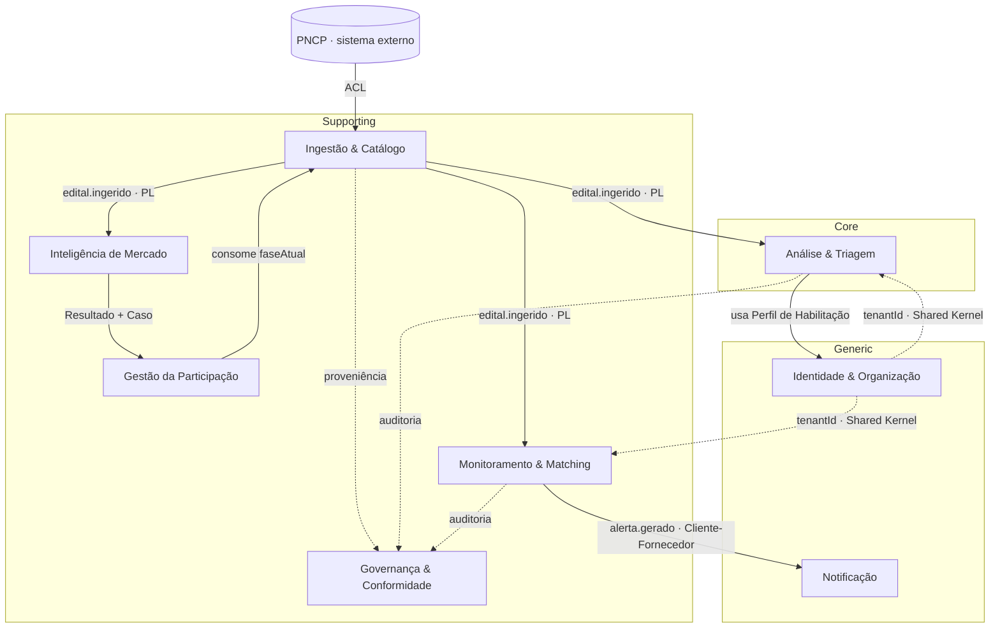

# 13 · Domínios e Bounded Contexts (DDD)

> Desenho **estratégico** de DDD: o domínio, seus subdomínios (core / supporting / generic) e os *bounded contexts* com sua linguagem ubíqua. Serve para orientar times e as fronteiras de serviço à medida que o produto cresce — no MVP, cada contexto é um módulo do monólito modular (arquitetura/01, §2); a quebra futura em serviços segue estas fronteiras, não outras. Estágio: **Concepção**.

## 1. O domínio

O domínio é **a participação de organizações em licitações públicas** — do sinal bruto (edital publicado) à decisão de negócio (participar ou não) e ao acompanhamento. Os 4 módulos (documento 01, §4) são uma leitura funcional; aqui olhamos pela lente de **modelos e linguagem**, que nem sempre coincide 1:1 com os módulos.

## 2. Classificação de subdomínios

Onde investir modelo rico (core) vs. onde comprar/simplificar (generic). O critério de "core" é **onde ganhamos** (documento 09, §4):

| Subdomínio | Tipo | Por quê |
|------------|------|---------|
| **Análise & Triagem** | **Core** | O diferenciador central: transforma "achar edital" em "decidir go/no-go" com citação da fonte (docs 09 §4, 10) |
| **Monitoramento & Matching** | Core secundário | Relevância/recall é diferenciador (docs 09, 11), mas a mecânica é mais replicável que a triagem |
| **Governança & Conformidade** | Supporting (estratégico) | Compliance-by-design é diferenciação **defensável** (doc 09 §4) — merece modelo próprio, não espalhado |
| **Inteligência de Mercado** | Supporting (core no *Later*) | Fecha o ciclo decisão→preço (doc 09); depende de histórico acumulado |
| **Ingestão & Catálogo** | Supporting | Necessário e caro, mas "todo mundo ingere"; a vantagem está na conformidade, não na coleta em si |
| **Gestão da Participação** | Supporting | Valor operacional (o "kanban"), não diferenciação |
| **Identidade & Organização** | Generic | Auth, tenancy, permissões — usar solução pronta |
| **Notificação** | Generic | E-mail/digest — commodity |

Insight de DDD para este projeto: o "princípio transversal" (documento 00 — todo fluxo tem controle e base legal) **não é infraestrutura espalhada; é um subdomínio de suporte** com modelo próprio (proveniência, base legal, direitos do titular, auditoria, retenção). Elevá-lo a um *bounded context* evita que regra de conformidade vaze e se duplique por todos os outros.

## 3. Bounded contexts

| Contexto | Responsabilidade | Linguagem ubíqua | Agregado raiz | Módulo · fase |
|----------|------------------|------------------|---------------|---------------|
| **Ingestão & Catálogo** | Coletar do PNCP, normalizar, versionar o edital | Fonte, Edital, Órgão, Modalidade, Proveniência, `numeroControlePNCP` | **Edital** (itens, lotes) | 1 · Now |
| **Monitoramento & Matching** | Cruzar editais × critérios, pontuar, alertar | Radar/Critério, Aderência, Alerta, Relevância, Feedback | **CritérioDeMonitoramento**, **Alerta** | 1 · Now |
| **Análise & Triagem** | Extrair requisitos, avaliar aderência e risco, sugerir go/no-go | Triagem, Requisito de Habilitação, Risco, Recomendação, Citação, Confiança | **Triagem** | 2 · Now |
| **Gestão da Participação** | Acompanhar cada disputa por fase e prazo | Caso, Fase, Prazo, Checklist, Recurso, Homologação | **Caso** | 3 · Next |
| **Inteligência de Mercado** | Agregar histórico, preços de referência, estatística | Resultado, Preço de Referência, Fornecedor, Taxa de Disputa | *read models* (CQRS) | 4 · Later |
| **Governança & Conformidade** | Base legal, proveniência, direitos do titular, auditoria, retenção | Base Legal, Proveniência, Titular, Trilha de Auditoria, Retenção | **RegistroDeProveniência**, **SolicitaçãoDeTitular** | transversal |
| **Identidade & Organização** | Tenant, usuário, cliente-final, perfil da empresa | Tenant, Usuário, Cliente-final, Perfil de Habilitação | **Tenant**, **PerfilDeHabilitação** | transversal |
| **Notificação** | Entregar alerta/digest por canal e preferência | Notificação, Canal, Digest, Preferência | **Notificação** | 1 · Now |

Nota de fronteira: **Aderência** aparece em dois contextos com significados diferentes — no Matching é "quão relevante para o critério" (barato, estrutural); na Triagem é "quão apto a empresa está" (caro, por IA). Mesmo termo, modelos distintos: é exatamente a fronteira que um *bounded context* protege.

## 4. Context map

Legenda dos padrões: **ACL** = Anti-Corruption Layer; **PL** = Published Language (eventos); **Shared Kernel** = modelo mínimo compartilhado (o `tenantId`).

## 5. Decisões de integração (as que mais importam)

1. **PNCP via Anti-Corruption Layer.** O modelo externo do PNCP (seu JSON, `numeroControlePNCP`, códigos de modalidade) **nunca** vaza para dentro: a Ingestão traduz para o modelo canônico. É o que dá robustez a *schema drift* (arquitetura/02, §5) — a mudança fica contida no ACL.
2. **Eventos como Published Language.** Ingestão publica `edital.ingerido`; Matching, Triagem e Inteligência consomem sem acoplar. Novos consumidores entram sem tocar no núcleo (arquitetura/01, §2).
3. **Governança como Open Host — bounded context separado, não shared kernel.** Todo contexto publica proveniência/auditoria para a Governança, que centraliza base legal, direitos do titular e retenção (documentos 02, 05) — em vez de cada um reimplementar conformidade. O "princípio transversal" (documento 00) descreve essa **relação Open Host** (todos publicam para ela), **não** um kernel compartilhado: o único Shared Kernel do sistema é o `tenantId` (decisão 4). Decidido em P-43.
4. **Identidade como fornecedor upstream — o Perfil de Habilitação vive aqui.** `tenantId` é o Shared Kernel mínimo; o **Perfil de Habilitação pertence a Identidade & Organização** (escopado a `clienteFinal`) e é consumido pela Triagem via Cliente-Fornecedor — não é contexto próprio no MVP. Decidido em P-43.

## 6. Como isto guia a arquitetura e o roadmap

- **MVP (monólito modular):** cada *bounded context* é um módulo de fronteira clara no mesmo deploy (arquitetura/01, §2). Os contextos do Now são Ingestão, Matching, Triagem, Notificação, Governança e Identidade.
- **Evolução:** quando escala/organização exigirem, a quebra em serviços segue **estas fronteiras** — Triagem (core, cara em IA) e Inteligência (analítica, CQRS) são os candidatos naturais a sair primeiro.
- **Roadmap:** Gestão da Participação (contexto próprio) entra no *Next*; Inteligência de Mercado no *Later* (documento 07).

## 7. Pendências

- **Governança & Conformidade é um bounded context separado** — padrão Open Host, não um *shared kernel* de conformidade (§5, decisão 3). `Decidido (P-43, 2026-07-05)`
- **Perfil de Habilitação vive em Identidade & Organização** — escopado a `clienteFinal`, consumido pela Triagem via Cliente-Fornecedor; não é contexto próprio no MVP (§5, decisão 4). `Decidido (P-43, 2026-07-05)`

O restante da linguagem ubíqua evolui junto com o glossário (documento 06); promover o Perfil a contexto próprio só se justifica se ele ganhar ciclo de vida/invariantes próprios (revisitar no *Next*).

Rastreadas no documento [98](98-decisoes-e-pendencias.md).
