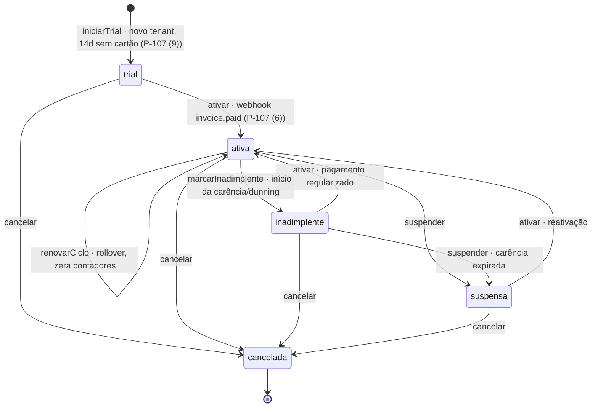
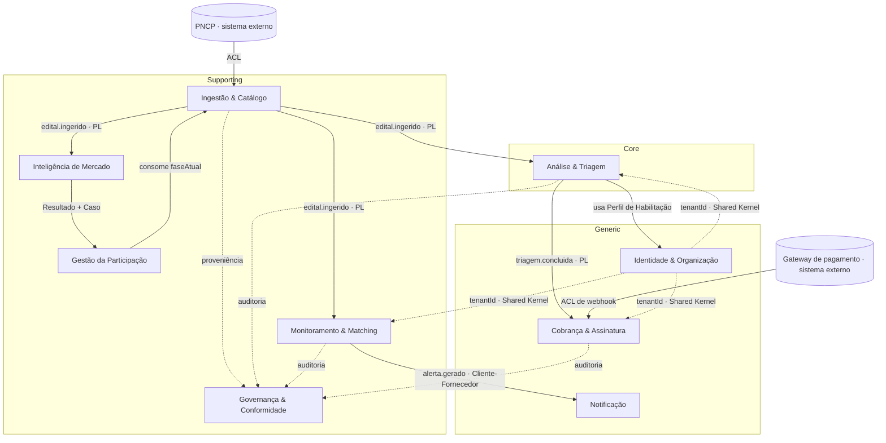

# 13 · Domínios e Bounded Contexts (DDD)

> Desenho **estratégico** de DDD: o domínio, seus subdomínios (core / supporting / generic) e os *bounded contexts* com sua linguagem ubíqua. Serve para orientar times e as fronteiras de serviço à medida que o produto cresce — no MVP, cada contexto é um módulo do monólito modular (arquitetura/01, §2); a quebra futura em serviços segue estas fronteiras, não outras. Estágio: **Concepção**.

## 1. O domínio

O domínio é **a participação de organizações em licitações públicas** — do sinal bruto (edital publicado) à decisão de negócio (participar ou não) e ao acompanhamento. Os 4 módulos (documento 01, §4) são uma leitura funcional; aqui olhamos pela lente de **modelos e linguagem**, que nem sempre coincide 1:1 com os módulos.

## 2. Classificação de subdomínios

Onde investir modelo rico (core) vs. onde comprar/simplificar (generic). O critério de "core" é **onde ganhamos** (documento 09, §4):

| Subdomínio | Tipo | Por quê |
|------------|------|---------|
| **Análise & Triagem** | **Core** | O diferenciador central: transforma "achar edital" em "decidir go/no-go" com citação da fonte (docs 09 §4, 10) |
| **Monitoramento & Matching** | Core secundário | Relevância/recall é diferenciador (docs 09, 11), mas a mecânica é mais replicável que a triagem |
| **Governança & Conformidade** | Supporting (estratégico) | Compliance-by-design é diferenciação **defensável** (doc 09 §4) — merece modelo próprio, não espalhado |
| **Inteligência de Mercado** | Supporting (core no *Later*) | Fecha o ciclo decisão→preço (doc 09); depende de histórico acumulado |
| **Ingestão & Catálogo** | Supporting | Necessário e caro, mas "todo mundo ingere"; a vantagem está na conformidade, não na coleta em si |
| **Gestão da Participação** | Supporting | Valor operacional (o "kanban"), não diferenciação |
| **Identidade & Organização** | Generic | Auth, tenancy, permissões — usar solução pronta |
| **Notificação** | Generic | E-mail/digest — commodity |
| **Cobrança & Assinatura** | Generic | Gateway de pagamento se **compra** (checkout hospedado); mas o **entitlement** (plano + cota) é invariante **nosso**, porque a unidade de consumo — a triagem — é nossa: nenhum gateway sabe contá-la (P-107) |

Insight de DDD para este projeto: o "princípio transversal" (documento 00 — todo fluxo tem controle e base legal) **não é infraestrutura espalhada; é um subdomínio de suporte** com modelo próprio (proveniência, base legal, direitos do titular, auditoria, retenção). Elevá-lo a um *bounded context* evita que regra de conformidade vaze e se duplique por todos os outros.

## 3. Bounded contexts

| Contexto | Responsabilidade | Linguagem ubíqua | Agregado raiz | Módulo · fase |
|----------|------------------|------------------|---------------|---------------|
| **Ingestão & Catálogo** | Coletar do PNCP, normalizar, versionar o edital | Fonte, Edital, Órgão, Modalidade, Proveniência, `numeroControlePNCP` | **Edital** (itens, lotes) | 1 · Now |
| **Monitoramento & Matching** | Cruzar editais × critérios, pontuar, alertar | Radar/Critério, Aderência, Alerta, Relevância, Feedback | **CritérioDeMonitoramento**, **Alerta** | 1 · Now |
| **Análise & Triagem** | Extrair requisitos, avaliar aderência e risco, sugerir go/no-go | Triagem, Requisito de Habilitação, Risco, Recomendação, Citação, Confiança | **Triagem** | 2 · Now |
| **Gestão da Participação** | Acompanhar cada disputa por fase e prazo | Caso, Fase, Prazo, Checklist, Recurso, Homologação | **Caso** | 3 · Next |
| **Inteligência de Mercado** | Agregar histórico, preços de referência, estatística | Resultado, Preço de Referência, Fornecedor, Taxa de Disputa | *read models* (CQRS) | 4 · Later |
| **Governança & Conformidade** | Base legal, proveniência, direitos do titular, auditoria, retenção | Base Legal, Proveniência, Titular, Trilha de Auditoria, Retenção | **RegistroDeProveniência**, **SolicitaçãoDeTitular** | transversal |
| **Identidade & Organização** | Tenant, usuário, cliente-final, perfil da empresa, papel | Tenant, Usuário, Cliente-final, Perfil de Habilitação, Papel, Atribuição de Papel | **Tenant**, **PerfilDeHabilitação**, **AtribuiçãoDePapel** | transversal |
| **Notificação** | Entregar alerta/digest por canal e preferência | Notificação, Canal, Digest, Preferência | **Notificação** | 1 · Now |
| **Cobrança & Assinatura** | Plano e cota do tenant, gate de entitlement, faturamento do SaaS | Assinatura, Plano, Cota, **Reserva**, **RegistroDeUso**, Fatura, Carência | **Assinatura** (chaveada por `tenantId`) | transversal · Next (Pré-GTM) |

Nota de agregado (P-107): **Assinatura** é raiz própria e o entitlement mora nela — mesmo padrão de **Identidade & Organização** (Generic, IdP comprado, mas `Tenant`/`AtribuiçãoDePapel` são agregados *nossos*). O gateway é comprado e trocável, então **a política fica no agregado, não no gateway**: carência, suspensão e "o que conta como assinatura ativa" são regra nossa — delegá-las ao provedor tornaria o port neutro na *forma* e provider-bound no *comportamento*. **MVP: um plano por Tenant.** Cobrança por cliente-final (Consultoria, P-25) é *Next* e entra como **breakdown de uso dentro do agregado** — o `clienteFinalId` chega no payload do evento, não como extensão do Shared Kernel (§5, decisão 4).

Ciclo de vida da Assinatura (P-107): é a **política comercial** que P-107 (6) diz ser *nossa, nunca do gateway* — realizada no agregado `Assinatura` (`modules/cobranca`). Cinco estados; **`cancelada` é terminal** — `ativar`/`suspender`/`cancelar` a partir dela lançam `AssinaturaInativaError`, não são no-op.

Guardas do modelo (o diagrama mostra o *permitido*; estas são as invariantes):

- **`iniciarTrial` é o único ponto de entrada** de tenant novo — trial de 14 dias sem cartão (P-107 (9)), ainda sem `assinaturaExternaId`; `criar` apenas **reconstrói** estado já persistido, não inicia ciclo.
- **`ativar` (→ `ativa`) só no webhook `invoice.paid`**, nunca no retorno do checkout (P-107 (6)); vale de `trial|inadimplente|suspensa` e é onde entra o `assinaturaExternaId` — ID **opaco** do gateway (P-107 (7)), nunca dado do cliente final.
- **`marcarInadimplente` e `renovarCiclo` partem só de `ativa`**; `renovarCiclo` é o rollover do período de cobrança e **zera** `usoReservado`/`usoConfirmado`.
- Os contadores `usoReservado`/`usoConfirmado` são **ortogonais** a este ciclo (tabela Reserva × RegistroDeUso abaixo) — reserva é *gate* síncrono na borda, confirmação é *fatura*; o estado governa só o **ciclo comercial**, não o consumo.

Nota de linguagem (P-107): **"uso" não é um termo desta linguagem** — são **dois conceitos distintos**, e nomeá-los com a mesma palavra é o tipo de ambiguidade que a linguagem ubíqua existe para eliminar (diferente de **Aderência**, §3 nota de fronteira: lá são dois contextos, e a fronteira desambigua; aqui seria um só time e um só modelo).

| | **Reserva** | **RegistroDeUso** |
|---|---|---|
| Quando | **Síncrona**, na borda, *antes* de gastar LLM | **Assíncrono**, derivado de `triagem.concluida` |
| Para quê | **Gate** (barrar quem estourou a cota) | **Fatura** (o que é cobrável) |
| Invariante | `uso_reservado < cota` (`UPDATE … RETURNING`) | `UNIQUE` por chave natural (dedupe) |
| Falha | **Libera a reserva** — falha/timeout/cancelamento não vira fatura (decidido: Priscila, RAD-232) | Não se aplica: triagem que falhou não gera registro |

Ainda em linguagem, três colisões a desambiguar **antes** de o contexto virar código (P-107, entradas pendentes no glossário — documento 06):

- **Assinatura** aqui é **o contrato de SaaS que o cliente tem conosco** — não é a *assinatura de propostas* nos portais (fora de escopo, documento 01 §6), não é a *assinatura do contrato público* (documento 04, fase de Contratação) e não é *assinatura criptográfica*/de função (arq/08, documento 14). Quatro sentidos vivos no corpus; dentro de **Cobrança** só o primeiro existe.
- **Cota** aqui é **o teto de triagens do plano** — não é *cota do provedor* de nuvem (arq/09, P-68) nem a *cota reservada ME/EPP* da Lei 14.133/2021 (art. 48), que é linguagem do domínio de licitações e, se um dia entrar, entra em Matching/Triagem, nunca aqui.
- **RegistroDeUso** (Cobrança) **não é** `RegistroUsoLlm`/`UsoLlmLedger` (Triagem, já em código — RAD-230/P-20/P-38). São **contextos e unidades diferentes**: aqui a unidade é a **triagem concluída, sempre atribuível a um tenant**, e serve para **faturar**; lá é a **chamada de LLM**, com `tenantId` **anulável** de propósito — a pré-extração do catálogo global (P-92) **não é atribuível a tenant** — e serve para **medir custo nosso**. Não se somam, não se reconciliam e nenhum dos dois deriva do outro. Onde o P-107 (alínea b) diz que o excedente depende do *"ledger de uso"*, o ledger é o **de LLM** (custo), não o `RegistroDeUso` (fatura).

Nota de agregado (P-52): **AtribuiçãoDePapel** é raiz própria, não parte do agregado **Tenant**. Sua identidade é o `sub` verificado do IdP (Cognito) — não gerada aqui —, seu ciclo de vida é independente (revogar/reatribuir papel não versiona nem trava o Tenant), ela é lida **em toda requisição** pela borda (`ResolverContextoAutorizacaoUseCase`, documento 14, §6) e tem Repository dedicado (`PermissaoRepository`). Compô-la em Tenant embutiria uma coleção ilimitada (todos os usuários do tenant) num só agregado; aqui o `tenantId` é **referência** (*Shared Kernel*, §5), não continência. Pelo mesmo motivo **Usuário não é agregado** deste contexto: o ciclo de vida do usuário é do IdP (P-98); o que este contexto possui do usuário é a atribuição de papel e escopo de `clienteFinalId`.

Nota de fronteira: **Aderência** aparece em dois contextos com significados diferentes — no Matching é "quão relevante para o critério" (barato, estrutural); na Triagem é "quão apto a empresa está" (caro, por IA). Mesmo termo, modelos distintos: é exatamente a fronteira que um *bounded context* protege.

## 4. Context map

Legenda dos padrões: **ACL** = Anti-Corruption Layer; **PL** = Published Language (eventos); **Shared Kernel** = modelo mínimo compartilhado (o `tenantId`).

⚠️ **A seta de PL é o fluxo do evento — a dependência corre no sentido oposto.** Em `TRI -->|triagem.concluida · PL| COB`, quem depende é o **consumidor** (Cobrança conforma-se ao contrato da Triagem); ler essa seta como "a Triagem depende da Cobrança" inverte o mapa. As setas rotuladas com verbo (`usa…`, `consome…`) são o caso contrário: apontam do consumidor para o provedor.

Nota de direção — **Cobrança é downstream; a Triagem nunca a chama** (P-107). Ela consome `triagem.concluida` como Published Language, igual a qualquer outro consumidor. Duas consequências que a seta sozinha não mostra:

- **O gate de entitlement vive na borda, não na Triagem.** Ele é *middleware* em `apps/api` (irmão do RBAC, que já compõe casos de uso de Identidade sem que a Triagem saiba — P-52), aplicado só nas rotas que consomem cota. Um port `EntitlementGateway` injetado no caso de uso da Triagem faria o **Core depender de um Generic downstream**, invertendo este mapa — não fazer.
- **O gate é uma reserva síncrona, não uma leitura do evento.** `triagem.concluida` chega segundos-a-minutos depois (worker assíncrono, arq/03) — um burst passaria a cota inteira e queimaria LLM antes de o contador subir. Enforcement = reserva atômica na borda; o evento reconcilia a fatura depois.
- **O webhook do gateway é ACL na infra, não port.** O tipo do provedor morre no adapter (como no ACL do PNCP, §5.1), e o `tenantId` sai de **mapeamento interno nosso**, nunca do payload do webhook.

## 5. Decisões de integração (as que mais importam)

1. **PNCP via Anti-Corruption Layer.** O modelo externo do PNCP (seu JSON, `numeroControlePNCP`, códigos de modalidade) **nunca** vaza para dentro: a Ingestão traduz para o modelo canônico. É o que dá robustez a *schema drift* (arquitetura/02, §5) — a mudança fica contida no ACL.
2. **Eventos como Published Language.** Ingestão publica `edital.ingerido`; Matching, Triagem e Inteligência consomem sem acoplar. Novos consumidores entram sem tocar no núcleo (arquitetura/01, §2). Contrato de campo: `orgaoUf` é sempre sigla de 2 letras (ex. "SP"), nunca nome por extenso — drift corrigido no ACL do PNCP em RAD-198 (o filtro `regiaoUf` do Matching compara por igualdade estrita).
3. **Governança como Open Host — bounded context separado, não shared kernel.** Todo contexto publica proveniência/auditoria para a Governança, que centraliza base legal, direitos do titular e retenção (documentos 02, 05) — em vez de cada um reimplementar conformidade. O "princípio transversal" (documento 00) descreve essa **relação Open Host** (todos publicam para ela), **não** um kernel compartilhado: o único Shared Kernel do sistema é o `tenantId` (decisão 4). Decidido em P-43.
4. **Identidade como fornecedor upstream — o Perfil de Habilitação vive aqui.** `tenantId` é o Shared Kernel mínimo; o **Perfil de Habilitação pertence a Identidade & Organização** (escopado a `clienteFinal`) e é consumido pela Triagem via Cliente-Fornecedor — não é contexto próprio no MVP. Decidido em P-43.

## 6. Como isto guia a arquitetura e o roadmap

- **MVP (monólito modular):** cada *bounded context* é um módulo de fronteira clara no mesmo deploy (arquitetura/01, §2). Os contextos do Now são Ingestão, Matching, Triagem, Notificação, Governança e Identidade.
- **Evolução:** quando escala/organização exigirem, a quebra em serviços segue **estas fronteiras** — Triagem (core, cara em IA) e Inteligência (analítica, CQRS) são os candidatos naturais a sair primeiro.
- **Roadmap:** Gestão da Participação (contexto próprio) entra no *Next*; **Cobrança & Assinatura** no *Next*, puxada pelo gate de **GTM/comercial** e não pelo produto (P-107); Inteligência de Mercado no *Later* (documento 07).

## 7. Pendências

- **Governança & Conformidade é um bounded context separado** — padrão Open Host, não um *shared kernel* de conformidade (§5, decisão 3). `Decidido (P-43, 2026-07-05)`
- **Perfil de Habilitação vive em Identidade & Organização** — escopado a `clienteFinal`, consumido pela Triagem via Cliente-Fornecedor; não é contexto próprio no MVP (§5, decisão 4). `Decidido (P-43, 2026-07-05)`
- **Cobrança & Assinatura é bounded context Generic com agregado próprio** — gateway comprado, entitlement nosso; downstream da Triagem via PL; gate na borda por reserva síncrona (§2/§3/§4). `Modelo registrado (P-107); segue Aberto o vendor do gateway` — no gate de GTM: **(a)** **default de GTM é o Asaas** (Produto/Priscila, RAD-232; fallback BR Pagar.me/Iugu, Stripe só fallback técnico), **condicionado ao aceite de Segurança** — fees e **DPA/residência como sub-operador** seguem `[A VALIDAR]`, e esse DPA **não** está coberto por P-54/P-57 (escopados a LLM/e-mail/nuvem): é alínea do próprio P-107; **(b)** modelo de excedente — a **política** já está decidida (opt-in explícito, cap por tenant, alertas em 80%/100%, upgrade/pacote; **nunca** fatura aberta automática — Priscila, RAD-232), mas o **ligamento** depende do ledger de uso (RAD-230/P-20/P-38). ~~**(c)** liberar ou queimar a reserva quando a triagem falha~~ → **Decidido (Priscila, 2026-07-12, RAD-232): falha/timeout/cancelamento LIBERA a reserva e não gera fatura** — reserva é *gate*, `triagem.concluida` é o gatilho faturável (§3, tabela Reserva × RegistroDeUso). Módulo `modules/cobranca` só quando o gate de GTM chegar (§6: um contexto = um módulo).

O restante da linguagem ubíqua evolui junto com o glossário (documento 06); promover o Perfil a contexto próprio só se justifica se ele ganhar ciclo de vida/invariantes próprios (revisitar no *Next*).

Rastreadas no documento [98](98-decisoes-e-pendencias.md).
