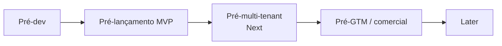

# 98 · Decisões e Pendências

> Registro central dos pontos `[A VALIDAR]` espalhados pela documentação. Cada marcação inline continua no seu documento; aqui ela ganha **dono sugerido**, **gate** (o momento em que precisa estar resolvida) e **status**. Transforma pendência solta em backlog acionável. Estágio: **Concepção**.
>
> Convenção: os itens `[A VALIDAR]` nos demais docs são a fonte da verdade; esta tabela é o índice. Ao resolver um item, atualize o documento de origem **e** o status aqui (a skill `auditar-docs` detecta divergências entre os dois).

## 1. Gates (quando cada coisa precisa estar resolvida)

## 2. Registro

| ID | Pendência | Origem | Tipo | Dono sugerido | Gate | Status |
|----|-----------|--------|------|---------------|------|--------|
| P-01 | Base legal LGPD (legítimo interesse) + LIA | 02 §4 | Jurídico | Jurídico | Pré-lançamento | Aberto |
| P-02 | Base legal e termos de uso por fonte (checklist de 3 perguntas) | 02 §6 | Jurídico+Produto | Jurídico | Por fonte | Aberto |
| P-03 | Encarregado/DPO designado + ROPA + política de privacidade do usuário | 02 §9 | Jurídico | Jurídico | Pré-lançamento | Aberto |
| P-04 | Controles de segurança por camada (validar a tabela proposta) | 05 §4 | Segurança+Eng | Eng | Pré-dev | Resolvido (Segurança+Eng/Artur, 2026-07-05, 05 §4): tabela de controles por camada **decidida como baseline** e separada por gate — **Pré-dev** (autorização por objeto + `tenantId`/`clienteFinalId` em toda entidade, audit log append-only/fail-closed, edital-como-dado, TLS, segredos em cofre, validação de entrada, ambientes separados), **Pré-lançamento** (AuthN/MFA, RBAC, WAF/rate-limit/headers, retenção, cripto de campo, SIEM, verificação de titular, SSRF/egress, saída da IA) e **Next** (isolamento físico RLS, aditivo). Regra dura: RLS **soma-se** à autorização por objeto, nunca a substitui — o baseline lógico vale desde o dia 1. Não afrouxa **AB1/AB10/AB13/A11** (arq/07 §5). P-04 decide **a tabela**; implementação/teste de cada controle seguem em P-51–P-63, P-07 (Abertas); cofre de segredos + IdP já **decididos em P-08** (Resolvido). |
| P-05 | Política de retenção — definir prazos por tipo de dado | 05 §5 | Jurídico+Eng | Eng | Pré-lançamento | Aberto |
| P-06 | Plano de resposta a incidentes | 05 §6 | Segurança+Jurídico | Segurança | Pré-lançamento | Aberto |
| P-07 | Arquitetura de isolamento multi-tenant | 05 §7 | Eng | Eng | Pré-multi-tenant | Aberto |
| P-08 | Cofre de segredos + provedor de identidade | 05 §4,§7 / arq/08 §§3,5 | Eng | Eng | Pré-dev | Resolvido (Eng/Artur, 2026-07-05, 05 §§4,7 + arq/08 §§3,5,11): **cofre = AWS Secrets Manager** (rotação nativa; segredo nunca em código/pipeline, arq/08 §6) e **IdP = Amazon Cognito** (User Pools; OIDC/JWT; `sa-east-1`, P-28), no default AWS de "comprar não operar" (arq/08 §1) e portável pelo padrão OIDC (arq/08 §4). **Invariante (Pré-dev):** a borda valida o JWT e o `tenantId`/`clienteFinalId` vem de **claim verificado**, **nunca de header controlado pelo cliente** — fecha a dimensão de autenticação de P-51 (anti-BOLA) e liga P-55 (gateway/WAF). O `x-tenant-id` que o `apps/api` lê hoje é **placeholder de dev**; trocá-lo por validação de JWT/derivação de tenant é follow-up de código (Bento, sob `apps/api`/RAD-31). Escolha (Pré-dev) formalmente separada da **operação de identidade** — expiração/revogação de sessão, MFA obrigatório, brute-force, recuperação de conta — que segue em **P-53** (Pré-lançamento) sobre este mesmo IdP. |
| P-09 | Classificação de dados (esp. estratégia comercial do cliente) | 05 §9 | Segurança+Produto | Segurança | Pré-dev | Resolvido (Produto/Priscila, 2026-07-05: docs/05 §9 formaliza matriz de classes e manuseio obrigatório — Público, Pessoal de terceiro, Conta do usuário e Estratégia comercial do cliente; classe crítica exige autorização por objeto, isolamento por `tenantId`/`clienteFinalId`, auditoria, não envio ao LLM/logs e exportação só por ação explícita autorizada; retenção, RBAC detalhado, DPA/LLM e criptografia de campo seguem nas pendências próprias P-05/P-52/P-54/P-66/P-59) |
| P-10 | Fase dirigida por dados vs. ordem fixa (inversão julg.→hab.) | 04 §4 | Eng+Produto | Produto | Pré-Módulo 3 | Aberto |
| P-11 | Observabilidade de PCA/plano de contratações (fase preparatória) | 04 §3 | Produto | Produto | Later | Aberto |
| P-12 | Persona primária do MVP (proposta: empresa fornecedora) + prioridade do Órgão público | 01 §3 / 07 §4 | Produto | Produto | Pré-dev | Resolvido (01/07, 2026-07-05: empresa fornecedora = persona primária do MVP; uso interno = campo de prova; consultoria = Next; órgão público = Later consultivo) |
| P-13 | Revisão do escopo excluído (automação de submissão etc.) | 01 §6 | Produto+Jurídico | Produto | Later | Aberto |
| P-14 | Metas numéricas das métricas (frescor, cobertura, precisão) | 08 §3 | Produto+Eng | Produto | Pré-dev | Resolvido (07/08/12, 2026-07-05: cobertura PNCP ≥ 99%; frescor p95 ≤ 30 min; precisão do matching ≥ 60%; ativação/triagem/ganho de tempo fixados como metas de concepção do MVP) |
| P-15 | Esquema de eventos de instrumentação | 08 §6 / 12 §5 | Eng | Eng | Pré-lançamento | Aberto |
| P-16 | Pesquisa primária de concorrentes (features, cobertura, preços) | 09 §2 | Negócio+Produto | Negócio | Pré-GTM | Aberto |
| P-17 | Modelo de pricing, planos e alavanca de cobrança | 09 §6 | Negócio | Negócio | Pré-GTM | Aberto |
| P-18 | Gold set rotulado + metas de qualidade da extração IA | 10 §5 | Produto+Eng | Produto | Pré-lançamento | Especificação proposta (doc 10 §§5.1–5.3, 2026-07-05: cobertura ≥50 editais, matriz modalidade×formato, esquema de rótulo com `is_critico`, protocolo de avaliação; rótulos e metas numéricas `[A VALIDAR]`) |
| P-19 | Limiares de confiança por campo (IA) | 10 §4 | Eng | Eng | Pré-lançamento | Aberto |
| P-20 | Teto de custo de IA por edital (unidade econômica) | 10 §7 / 09 §6 | Eng+Negócio | Eng | Pré-lançamento | Aberto (2026-07-05, RAD-53: as **alavancas** que fazem o custo caber no teto foram decididas — batch na ingestão P-92, tiers de modelo P-93, minimização de input P-94, prompt caching P-95; a medição/imposição via `count_tokens` é **P-94**; o **número** do teto segue `[A VALIDAR]`) |
| P-21 | Limiares de recall/precisão do matching + política de digest | 11 §§2,4 | Produto | Produto | Pré-lançamento | Aberto |
| P-22 | Lista priorizada de fontes além do PNCP | 11 §6 / 07 | Produto | Produto | Pré-Next | Aberto |
| P-23 | Onboarding de cold-start e critérios sugeridos por segmento | 11 §3 | Produto | Produto | Pré-lançamento | Aberto |
| P-24 | Entidades/cardinalidades e números de NFR/SLA | 12 §§1,3 | Produto+Eng | Eng | Pré-dev | Resolvido (12, 2026-07-05: entidades validadas — `NOTIFICACAO`/`PREFERENCIA_NOTIFICACAO` incorporadas ao modelo (§1), núcleo já fechado por P-45–P-50; NFRs de arquitetura fixados (§3) — latência de triagem p95 ≤ 3 min (degrada sob pressão, arq/04 §6), disponibilidade ≥ 99,5%/mês no caminho crítico ingestão→alerta, escalabilidade dimensionada pelo volume medido em P-31; frescor/cobertura via P-14; números remanescentes delegados aos donos — retenção P-05/P-44, custo de IA P-20, cadência de frescor P-29, RTO/RPO P-60) |
| P-25 | Corte single-tenant no MVP vs. expectativa de vender a consultorias cedo | 07 §8 / 09 §5 | Produto+Negócio | Produto | Pré-dev | Resolvido (07/09, 2026-07-05: MVP permanece single-tenant; consultoria pode entrar cedo só como conta single-tenant equivalente a empresa fornecedora, com um cliente-final/empresa acompanhada e sem promessa multi-cliente; plano Consultoria completo fica no Next, condicionado a isolamento e permissões) |
| P-26 | Confirmar contratos da API de Consulta do PNCP (endpoints, parâmetros, códigos de modalidade) no Swagger | arq/02 §§2,3,8 | Eng | Eng | Pré-dev | Resolvido (arq/02 §§2,3,8, 2026-07-05: base `https://pncp.gov.br/api/consulta`; `tamanhoPagina` max=50; `/publicacao` e `/atualizacao` requerem `codigoModalidadeContratacao`; 13 códigos de modalidade mapeados; schema completo do item documentado); **resíduo fechado (Eng, 2026-07-06, RAD-106):** formato de `dataFinal` no `/proposta` = **yyyyMMdd** (sem separador), idêntico a `/publicacao` e `/atualizacao`; o 422 anterior era ausência de `pagina` (obrigatório pelo spec, mas não aparece no Swagger como required); confirmado por chamada real `?dataFinal=20260710&pagina=1&tamanhoPagina=10` → 200 OK / 8.996 registros. P-26 **totalmente resolvido**. |
| P-27 | Confirmar estilo (monólito modular), stack (Postgres, fila, storage, LLM) e **runtime/linguagem** | arq/01 §§2,5,8 / arq/08 §§9,11 | Eng | Eng | Pré-dev | Resolvido (arq/01 §§2,5,8 · arq/08 §§9,11, 2026-07-05): **monólito modular + workers assíncronos**; primitivas **PostgreSQL / fila gerenciada (retry+DLQ) / blob S3-compatível / Claude / e-mail transacional**; **TypeScript linguagem única**, com *seam* p/ **Go** no tier serverless (ingestão/matching) acionado por A09 + P-31, e **Python** só p/ OCR/eval. Vendor/modelo exato fica nas pendências próprias: provedor **P-64**, região **P-28**, LLM direto-vs-nuvem **P-66**, modelo Claude/custo **P-20** |
| P-28 | Região de hospedagem e residência de dados | arq/01 §5 | Eng+Jurídico | Eng | Pré-dev | Resolvido (Eng/Artur, 2026-07-05, arq/08 §7): **Brasil / São Paulo** (`sa-east-1` no default AWS — P-64); dado em repouso e compute na região, latência + residência LGPD dos dados pessoais/estratégicos. Único cruzamento de fronteira = o recorte enviado ao LLM; residência do LLM + DPA de sub-operador seguem em **P-66/P-54/P-80** (Jurídico) e a classe crítica nunca é enviada (A07/A03). |
| P-29 | Cadência de polling do PNCP que atinge frescor ≤ 30 min sem furar rate-limit | arq/02 §3 / 12 §3 | Eng | Eng | Pré-lançamento | Aberto |
| P-30 | Retenção de anexos (editais/PDFs) em object storage | arq/02 §6 / 05 §5 | Jurídico+Eng | Eng | Pré-lançamento | Aberto. **Spike de viabilidade (Artur, 2026-07-06, RAD-121):** recomendação **NÃO** construir SDK de storage com zip+manifesto+restore customizado no MVP. A premissa "custo por objeto" é real (overhead ~40 KB/objeto no Glacier Flexible/Deep Archive = 32 KB Glacier + 8 KB Standard; piso de 128 KB no Standard-IA/Glacier Instant; custo de request de transição), mas o **valor absoluto no volume do MVP é trivial** e o zip **quebra restore e expurgo granular** (restaurar 1 anexo exige reidratar o zip inteiro — 12–48 h no Deep Archive; expurgo LGPD exige restaurar+reescrever+re-arquivar). Direção: **tiering nativo do S3** (Lifecycle rules + Intelligent-Tiering, config de bucket, zero código) + **estender a porta `ObjectStorage`** (`obter`/`deletar`/status-tier) — fica na Ingestão (custódia do documento, docs/13), não em `shared/`. Só esfriar editais **terminais** (nunca os que ainda podem ir à triagem sob demanda — restore é assíncrono); **Glacier Instant Retrieval** (latência ms) é o frio acessível. Expurgo opera por **lifecycle expiration por objeto** (trivial no nativo); anexo é classe **Público** — minimização de PII de terceiro é na ingestão (docs/03 §2), não no tiering. **Remanescente (o que mantém P-30 Aberto):** prazo de retenção por classe é decisão Jurídico via **RAD-100** (feed de P-05/P-44); orquestração do expurgo em **RAD-101** (Bento); port/adaptador S3 reais + tiering nativo fatiados em **RAD-122 (Bento)**. Reavaliar zip só se a contagem de objetos no frio passar de ~dezenas de milhões com perfil "arquivar-e-quase-nunca-restaurar". |
| P-31 | Medir volume/perfil de publicação do PNCP para definir cargas-alvo reais | arq/04 §3 | Eng+Produto | Eng | Pré-dev | Resolvido (arq/04 §3, 2026-07-05: ~5.800–6.000 contratações/dia útil + ~15.000 atualizações/dia; fim de semana ~5–10% do volume útil; 3 modalidades dominantes ≥ 90% do volume; varredura completa = ~120 requests com `tamanhoPagina=50`; cargas-alvo S1/S5 atualizadas em arq/04 §3) |
| P-32 | Mock/fixtures do PNCP para stress test (não estressar a fonte real) | arq/04 §4 | Eng | Eng | Pré-lançamento | Aberto |
| P-33 | Ferramenta de teste de carga + ambiente isolado | arq/04 §4 | Eng | Eng | Pré-lançamento | Aberto |
| P-34 | Alarmes/SLO e limiares dos circuit breakers (fonte, LLM, custo) | arq/04 §§5,7 | Eng | Eng | Pré-lançamento | Aberto |
| P-35 | Runbook ligado ao plano de resposta a incidentes | arq/04 §8 / 05 §6 | Segurança+Eng | Segurança | Pré-lançamento | Aberto |
| P-36 | SLOs de experiência + error budget; SLO duro p/ "alerta de prazo crítico" (0 perdidos) | Validação PM / arq/04 | Produto+Eng | Produto | Pré-lançamento | Aberto |
| P-37 | Plano de comunicação ao usuário em degradação (status page, banner "triagem atrasada") | Validação PM / arq/04 §6 | Produto | Produto | Pré-lançamento | Aberto |
| P-38 | Alarme de custo de IA como guardrail de negócio (teto rígido + quem é acionado) | Validação PM / arq/04 §5 / 10 §7 | Negócio+Eng | Eng | Pré-lançamento | Aberto (2026-07-05, RAD-53: as alavancas de custo que o alarme vigia estão decididas — P-92–P-95; o **teto rígido** e **quem é acionado** seguem `[A VALIDAR]`) |
| P-39 | Estratégia de particionamento do banco (data e/ou tenant) + arquivamento | arq/05 §§3,8 | Eng | Eng | Pré-lançamento | Aberto |
| P-40 | Fan-out reverso do matching em escala (scan vs. percolator) | arq/05 §3 / 11 §5 | Eng | Eng | Pré-Next | Aberto |
| P-41 | Sizing de pool de conexões + statement_timeout/work_mem | arq/05 §6 | Eng | Eng | Pré-lançamento | Aberto |
| P-42 | Quando introduzir réplicas de leitura e o que roteia para elas | arq/05 §6 | Eng | Eng | Pré-Next | Aberto |
| P-43 | Validar limites de bounded context e linguagem ubíqua (Governança contexto vs shared kernel; local do Perfil de Habilitação) | 13 §7 | Produto+Eng | Eng | Pré-dev | Resolvido (13/00, 2026-07-05: Governança = bounded context separado no padrão Open Host, não shared kernel — este é só o `tenantId`; Perfil de Habilitação permanece em Identidade & Organização, escopado a clienteFinal, consumido pela Triagem via Cliente-Fornecedor) |
| P-44 | Retenção/arquivamento das tabelas append-only e de alto crescimento (EDITAL, ALERTA, PROVENIENCIA, AUDIT_LOG) | arq/06 §§3,7 / 05 §5 | Eng+Jurídico | Eng | Pré-lançamento | Aberto |
| P-45 | **TRIAGEM: separar extração do edital (cacheável, 1 por edital) da aderência (por perfil)** | 12 §1 / A03 §§4,6 | Eng+Produto | Eng | Pré-lançamento | Resolvido (12/A03: EXTRACAO_EDITAL + TRIAGEM) |
| P-46 | Modelar `modalidade` como FK à tabela de domínio MODALIDADE (código PNCP), não string denormalizada | 12 §1 / A03 §4 | Eng | Eng | Pré-dev | Resolvido (12/A03: modalidadeCodigo FK) |
| P-47 | Incluir AUDIT_LOG e SolicitacaoDeTitular no modelo canônico (doc 12) — exigidos por 05 §3 e 13 | 12 §1 / 05 §3 / 13 | Eng+Jurídico | Eng | Pré-lançamento | Resolvido (doc 12) |
| P-48 | RESULTADO deve relacionar-se a EDITAL (mercado inteiro), não só a CASO | 12 §1 / 13 / 09 | Produto+Eng | Eng | Pré-Later | Aplicado (RESULTADO → EDITAL) `[A VALIDAR]` |
| P-49 | Segregação por CLIENTE_FINAL (clienteFinalId) além de tenantId, para consultorias | 12 §1 / A03 §4 / 01 §3 | Eng | Eng | Pré-Next | Aplicado no modelo `[A VALIDAR — ativar no Next]` |
| P-50 | Definir os campos do PERFIL_HABILITACAO (insumo do core Triagem) | 12 §1 / 10 §2 | Produto+Eng | Produto | Pré-lançamento | Resolvido (doc 12) |
| P-51 | **Autorização por objeto (anti-IDOR/BOLA): todo acesso confirma posse por tenant/clienteFinal, não só filtro de query — vetor nº1 de vazamento cross-tenant** | Sec / 05 §2 / A03 §8 | Segurança+Eng | Eng | Pré-lançamento | Aberto (critério de teste especificado 2026-07-05: matriz AB1 por recurso × ação em arq/07 §2.1 — leitura e escrita, IDs cruzados; invariante transversal nos use cases disparados pelo usuário em 14 §§2–6; implementação pendente) |
| P-52 | Modelo de autorização (RBAC): papéis (admin consultoria, operador, cliente-final read-only) e matriz de permissões | Sec / 05 §4 / 13 | Segurança+Produto | Produto | Pré-lançamento | Aberto |
| P-53 | Gestão de identidade: sessão/tokens (expiração, revogação), MFA, proteção brute-force, recuperação de conta segura | Sec / 05 §4 | Segurança+Eng | Eng | Pré-lançamento | Aberto (2026-07-05: **assenta sobre o IdP escolhido em P-08 — Amazon Cognito**. A escolha do IdP (Pré-dev) está fechada; esta pendência **configura e testa** as primitivas que o Cognito fornece — expiração/revogação de sessão, MFA obrigatório, anti-brute-force e recuperação de conta segura — provadas por AB3/TC-AB3 (arq/07 §2; arq/16). Escopo: operação de identidade, não a escolha do provedor.) |
| P-54 | **Dados enviados ao LLM: minimizar (não enviar a classe crítica/estratégia comercial), DPA com o provedor como sub-operador, residência** | Sec / 05 §9 / 10 / 02 §9 | Segurança+Jurídico | Segurança | Pré-lançamento | Aberto |
| P-55 | Segurança da API: WAF/gateway, rate-limit por tenant, headers (HSTS/CSP), CORS/CSRF, validação de schema, anti-mass-assignment | Sec / 05 §4 / A01 §7 | Segurança+Eng | Eng | Pré-lançamento | Aberto |
| P-56 | AppSec no CI + supply chain: SAST/DAST, secret scanning, SCA/SBOM, scan de imagem, cadência de pentest | Sec / 05 | Segurança+Eng | Eng | Pré-lançamento | Aberto |
| P-57 | Sub-processadores (contrato de tratamento) com LLM/e-mail/nuvem; e verificação de identidade do titular antes de atender SolicitacaoDeTitular | Sec / 02 §9 / 05 §5 | Jurídico+Segurança | Jurídico | Pré-lançamento | Aberto (2026-07-05: AB10 promovido a teste obrigatório do gate — arq/07 §5; invariante em 14 §5. Contrato de sub-processadores segue com Jurídico) |
| P-58 | Segmentação de rede + egress allowlist + proteção SSRF na busca de anexos/URLs (ingestão) | Sec / 05 §4 / A02 §6 | Segurança+Eng | Eng | Pré-lançamento | Aberto |
| P-59 | Criptografia em nível de campo/aplicação para a classe crítica (estratégia comercial), além do isolamento | Sec / 05 §9 | Segurança+Eng | Eng | Pré-lançamento | Aberto |
| P-60 | Segurança de backup: criptografia, imutabilidade (anti-ransomware), teste de restauração, RTO/RPO | Sec / 05 §6 / A05 §6 | Segurança+Eng | Eng | Pré-lançamento | Aberto |
| P-61 | Higiene de logs (sem PII/segredos) + SIEM/alertas de eventos de segurança + integridade do audit log | Sec / 05 §3 / A04 §8 | Segurança+Eng | Eng | Pré-lançamento | Aberto (2026-07-05: audit log append-only/imutável e fail-closed especificado — AUDIT_LOG com `tenantId`/`baseLegal` em 12 §§1–2; `RegistrarAuditoriaUseCase` com `AuditoriaIndisponivelError` em 14 §5; caso de abuso AB13 em arq/07 §§2,5. Higiene de logs/SIEM pendentes) |
| P-62 | Teste contínuo de isolamento de tenant (autorização) como gate de release, já no MVP single-tenant | Sec / 05 §2 / 07 §6 | Segurança+Eng | Eng | Pré-lançamento | Aberto (2026-07-05: gate de release ampliado — arq/07 §5 agora exige matriz AB1 §2.1, AB5–AB7/AB9 (A11), AB10 e AB13, não só AB1/AB4; **A16 §§5,7 sincronizado** — TC-AB1 vira matriz recurso × ação, novo TC-AB13, gate consolidado e regras duras promovem AB5–AB7/AB9/AB10/AB13. Implementação dos testes segue com Segurança) |
| P-63 | Gate de severidade (bloquear release em crítico/alto) e SLA de correção de vulnerabilidade | Sec / arq/07 §4 | Segurança+Eng | Eng | Pré-lançamento | Aberto |
| P-64 | Modelo de compute por workload (serverless/glue vs container/pool vs gerenciado) confirmado | arq/08 §§2,4 | Eng | Eng | Pré-dev | Resolvido (Eng/Artur, 2026-07-05, arq/08 §2): modelo por workload = tabela de §2 (SPA→CDN; API/BFF+Triagem→container; ingestão/matching/notificação/health→serverless); **provedor default do MVP = AWS** (Fargate/App Runner · Lambda+SQS+EventBridge · RDS+Proxy · S3 · Secrets Manager · Bedrock p/ Claude), primitivas portáveis (§4) como seguro anti-lock-in. |
| P-65 | IaC (Terraform/Pulumi) + ambientes dev/staging/prod + pipeline CI/CD | arq/08 §6 | Eng | Eng | Pré-dev | Resolvido (Eng/Artur, 2026-07-05, arq/08 §6): **Terraform** (não Pulumi — evita acoplar infra a runtime de linguagem; estado remoto S3+DynamoDB c/ lock); ambientes **dev/staging/prod** em contas AWS isoladas; **CI/CD GitHub Actions** com gates build/typecheck/lint(+boundary)→testes→stress→**segurança bloqueante (A07/P-63)**→scan(P-56)→terraform. Implementação delegada em **RAD-34** (scaffold IaC depende de conta AWS provisionada). |
| P-66 | LLM: API direta Anthropic vs via nuvem (Bedrock/Vertex) para residência/DPA (liga P-54) | arq/08 §7 / 05 §9 | Segurança+Eng | Eng | Pré-lançamento | Aberto |
| P-67 | Cold start vs frescor: provisioned concurrency / min instances (trade-off de custo) | arq/09 EL1 | Eng | Eng | Pré-lançamento | Aberto |
| P-68 | Mapear cotas/limites do provedor (concorrência, fila, API GW) + pedidos de aumento | arq/09 EL2 | Eng | Eng | Pré-lançamento | Aberto |
| P-69 | Tooling do monorepo (workspaces, build, imposição de boundary entre camadas/contextos) | arq/10 §§2,7 | Eng | Eng | Pré-dev | Resolvido (Eng/Artur, 2026-07-05, arq/10 §10): pnpm workspaces + Turborepo (já em uso); boundary imposto por **`dependency-cruiser`** — config **`.dependency-cruiser.cjs`** na raiz + script `pnpm boundaries` (domain↛application/infra, application↛infra, núcleo↛tecnologia, contexto↛interior de outro). Roda no gate `lint` do CI (arq/08 §6). Wiring no CI = RAD-34. |
| P-70 | Geração de stubs a partir do proto (contracts) por linguagem no CI | arq/10 §5 | Eng | Eng | Pré-dev | Resolvido (Eng/Artur, 2026-07-05, arq/10 §10): **`buf`** (lint/breaking/codegen) + `protoc-gen-es`/`connect-es` (TS) e `protoc-gen-go` (seam). **Diferido por gatilho**: só quando surgir a 1ª chamada síncrona cross-domain (§5); hoje event-first, `shared/contracts/` vazio. Wiring = RAD-34. |
| P-71 | Padrão de mapeamento DomainError → gRPC/HTTP na borda, sem vazar stack/PII | arq/10 §6 / arq/07 AB11 | Eng+Segurança | Eng | Pré-lançamento | Aberto |
| P-72 | Conjunto de editais adversariais (payloads de prompt injection) + red-team no CI | arq/11 §4 / arq/07 AB4 | Segurança+Eng | Eng | Pré-lançamento | Aberto |
| P-73 | Schema de validação da saída do LLM + sanitização de saída (insecure output handling) | arq/11 §2 / arq/07 AB6 | Eng+Segurança | Eng | Pré-lançamento | Aberto |
| P-74 | Lint/boundary rule: proibir tecnologia no nome de port (application) e impor `<Tech><Port>` no adapter (infra) | arq/10 §8 | Eng | Eng | Pré-dev | Resolvido (Eng/Artur, 2026-07-05, arq/10 §10): lado-**dependência** (núcleo↛pacote de tecnologia) já imposto pela regra `nucleo-sem-tecnologia` do `dependency-cruiser` (P-69); lado-**nome** (`<Tech><Port>` no adapter, port sem tecnologia no nome) = regra ESLint customizada `no-tech-in-port-name`, wiring em RAD-34. |
| P-75 | Repo/package `shared/design-tokens` agnóstico (DTCG + Style Dictionary) + build por framework | arq/12 §3 / arq/13 | Eng | Eng | Pré-Next | Proposta (arq/13, 2026-07-05: estrutura DTCG 3 camadas core/semântico/componente, Style Dictionary 4 saídas CSS/TS/SCSS, dark/light por seletor `[data-theme]`; pendente validação c/ framework P-77 e Figma P-76) |
| P-76 | Figma do zero (Dora): tokens + biblioteca de componentes + páginas + Code Connect Figma↔código | arq/12 §§4,5 | Produto+Eng | Produto | Pré-Next | Aberto |
| P-77 | Framework do front (React/Angular) + `apps/` no monorepo + como consome os tokens | arq/12 §§2,3 | Eng | Eng | Pré-Next | Aberto |
| P-78 | Operações abortáveis (`AbortSignal` em use cases e ports) — front e back; verificar/impor | arq/10 §1 / arq/12 §2 | Eng | Eng | Pré-dev | Resolvido (Eng/Artur, 2026-07-05, arq/10 §10): convenção `executar(input, signal: AbortSignal)` nos exemplos (§§4.4–4.5), ligando AB9/cost-DoS ao cancelamento; imposição = regra ESLint customizada `require-abort-signal` + revisão de código, wiring em RAD-34. **Gap de impl encontrado na revisão de arquitetura do core (2026-07-05, arq/10 §10 "regra do último hop"): os 4 `SqsEventPublisher` descartam o `signal` (o `QueueClient.sendMessage` não o recebe) → pedido abortado ainda enfileira. Correção delegada: triagem (Iara, filho de RAD-30); matching/notificacao/ingestao (Bento). RESOLVIDO (Caio via RAD-57 + RAD-67; revisão `guardiao-arquitetura` do Artur em RAD-58, 2026-07-05):** os 4 adapters propagam o `signal` até o `sendMessage`. **Forma canônica do seam (decisão Artur/RAD-58): options-bag `{ abortSignal }`** — `sendMessage(params, opts: { abortSignal: AbortSignal })` / chamada `{ abortSignal: signal }` — espelhando `@aws-sdk/client-sqs` v3 (`client.send(cmd, { abortSignal })`); **proibido sinal posicional cru**, que convida o wrapper do composition root a `send(cmd, signal)` → SDK ignora o cancelamento em silêncio. Verificado: matching/notificacao unificados + testes `.toEqual({ abortSignal: signal })` verdes; triagem já com o 2º teste (signal abortado corta o envio); ingestao stub com TODO `{ abortSignal }`. Resíduo (não bloqueia): matching/notificacao ainda sem o teste de "abort corta o envio" que a triagem tem — coberto por RAD-69. | 
| P-79 | Front: use cases em pacote próprio importado pela UI (UI nunca acessa infra/API direto) | arq/12 §§2,3 | Eng | Eng | Pré-Next | Proposta (arq/12 §3, 2026-07-05: pacote `application/use-cases` próprio; ports por papel sem tecnologia; `AbortSignal` em todos os ports; mapeamento `GrpcStatus` → `AppError` tipado em `infra/`) |
| P-80 | Provedor de e-mail transacional (SES vs. SendGrid vs. Postmark) + DPA de sub-operador LGPD (docs/02, §9) | arq/14 §11 | Jurídico+Eng | Jurídico | Pré-lançamento | Aberto |
| P-81 | Limiar de criticidade (dias até o prazo que dispara entrega imediata) e cap de alertas no digest (anti-fadiga) | arq/14 §§7,11 / docs/11 §4 | Produto+Eng | Produto | Pré-lançamento | Aberto |
| P-82 | Canal webhook e in-app para Notificação: escopo, adapter e gate de ativação no *Next* | arq/14 §§8,11 | Produto+Eng | Produto | Pré-Next | Aberto |
| P-83 | Port de leitura cross-contexto do Perfil de Habilitação na Triagem: `PerfilRepository` (14 §3 / arq/10 §4.4) vs. gateway dedicado (Cliente-Fornecedor, 13 §5) — coerente com o `IdentidadeGateway` da Governança e a taxonomia de ports (arq/10 §8); alinhar 14 §3 e arq/10 §4.4 | 14 §3 / arq/10 §§4.4,8 / 13 §5 | Eng | Eng | Pré-dev | Resolvido (Eng, 2026-07-05: **`PerfilGateway`** — é Gateway, não Repository, pois a Triagem lê mas não é dona do agregado (taxonomia A10 §8: Repository possui/persiste; Gateway lê outro contexto via ACL/Cliente-Fornecedor). Port *consumer-defined*, distinto do `IdentidadeGateway` da Governança — mesmo padrão, contratos diferentes; só `tenantId` é Shared Kernel. Alinhado em 14 §3, arq/10 §§4.4–4.5 e arq/17 §§ports/DI) |
| P-84 | Protocolo de rotulagem do gold set: quem rotula, critério de desempate entre anotadores, frequência de atualização do gold set ao longo do tempo | arq/16 §2 | Produto+Eng | Produto | Pré-lançamento | Aberto |
| P-85 | Framework de eval para automatizar o gold set no CI (Braintrust, Phoenix, custom — comparar custo, integração, suporte a campo numérico) | arq/16 §2.3 | Eng | Eng | Pré-lançamento | Aberto |
| P-86 | Host do API/BFF após o pivô da SPA (`apps/web` = **Vite/React**, não Next.js co-locado como descrito em RAD-10): onde vivem as rotas REST que a SPA já consome (`/api/triagem/:editalId` etc.) | arq/08 §§(linha API/BFF)+11 / arq/01 §2 | Eng | Eng (Bento) | Pré-dev | Resolvido (Eng/Artur, 2026-07-05): **container `apps/api` TypeScript separado** — monólito modular *container quente* que compõe os módulos (`ingestao`/`matching`/`notificacao`/`triagem`) e serve a SPA de borda via REST+Auth, exatamente a topologia de A08 (SPA edge + API/BFF container gerenciado) e A01 §2. O pivô Vite está **correto** perante A08 (SPA estática/edge); o que faltou foi o container BFF, nunca materializado por RAD-10. Implementação fatiada: **`modules/triagem` (código) → RAD-30 (Iara)**; **`apps/api` BFF → RAD-31 (Bento, bloqueado por RAD-30)**. O `TriagemHttpGateway` da SPA já fixou o contrato de leitura (`GET /api/triagem/:editalId`, `x-tenant-id`, 404/403→null). **Reconciliação de contrato (Artur, 2026-07-05, validação da viabilidade RAD-30):** o shape fixado pelo front/BFF é MAIS RICO que o `riscos[]` das descrições iniciais de RAD-30/31 — é `{editalId, perfilId, aderencia, recomendacao, confiancaIA, paginasEdital, camposAnalise[], checklist[]}` (sem `riscos[]`: as lacunas de habilitação viram `checklist.ok:false`). Fonte da verdade executável: `apps/web/domain/triagem-view-model.ts` + `apps/api/src/routes/triagem.ts::TriagemResponseSchema`. Pinado no blueprint em arq/17 §4.2 (`TriagemLeituraDTO`) + §4.3 (`ConsultarTriagemUseCase`, read path síncrono, authz por objeto/AbortSignal, projeção domínio→DTO) + §3 (novo campo `ExtracaoEdital.paginas`, fonte de `paginasEdital`). RAD-30 deve realizar ESTE contrato, não o `riscos[]` de sua descrição — correção entregue à Iara (RAD-30 child). |
| P-87 | **Orquestração dos testes E2E: Testcontainers-first** (Postgres + schema efêmero) + barramento em memória (substitui SQS no harness); docker-compose só de último caso para dependências não suportadas por Testcontainers. Regra dura: mock/fixture de PNCP e LLM — NUNCA fonte real (A04 §4). Harness em `tests/e2e` (pacote `@radar/e2e`), ligado ao gate de release (docs/07 §6). | A04 §4 / docs/07 §6 | Eng | Eng (Bento) | Pré-lançamento | Resolvido (Eng, 2026-07-05: `tests/e2e` implementado com `testcontainers` + `@testcontainers/postgresql`; 5 cenários E2E passando — CE-01 casamento, CE-02 notificação, CE-03 pipeline fim-a-fim, CE-04 idempotência, CE-05 sem casamento; `InMemoryEventBus` substitui SQS; `InMemoryEditalView` e `InMemoryAlertaView` isolam cross-context reads; `CaptureNotifier` evita SES real). |
| P-88 | Canal **WhatsApp** de notificação: a tela "Configurar Radar" (Figma P-76) oferecia WhatsApp como canal, mas o modelo de Notificação (A14 §2) só define `CanalTipo = EMAIL \| WEBHOOK \| IN_APP` — sem WhatsApp. Opções eram (a) remover da UI ou (b) entrar no roadmap como canal próprio. Levantado na validação do Figma vs. docs (Artur, RAD-25). | arq/14 §2 / Figma P-76 (Configurar Radar) | Produto+Eng | Produto | Pré-Next | Resolvido (Dora/RAD-45, 2026-07-05): **opção (a) — WhatsApp removido do Figma** (tela "Configurar Radar" Light `12:63` e Dark `15:369`); canal de notificação agora exibe somente E-mail e In-app, alinhado com A14 §2. WhatsApp como canal próprio (adapter, consentimento/opt-in LGPD, custo Meta) continua no escopo do *Next* junto com os demais canais de P-82, sem pendência aberta no MVP. |
| P-89 | **Ferramenta BDD** para specs executáveis de comportamentos críticos de domínio (RAD-22): `@cucumber/cucumber` v11 + TypeScript via loader `tsx` vs. `vitest-cucumber` (plugin Vitest que interpreta Gherkin). | docs/14 / arq/16 §5 | Eng | Eng (Quésia) | Pré-lançamento | Resolvido (Eng/Quésia, 2026-07-05): **`@cucumber/cucumber` v11 + `tsx`**. Razões: (1) arquivos `.feature` Gherkin são artefatos de 1ª classe — legíveis por não-técnicos, revisáveis em PR, vinculados a docs/14 via comentário `@UsoCaso`; (2) `@cucumber/cucumber` é o padrão de mercado com melhor suporte de IDE para realce de sintaxe; (3) `tsx` como loader evita todo o overhead de pré-compilação e é compatível com TypeScript ESM NodeNext já adotado no projeto; (4) `vitest-cucumber` (amiceli) exige reescrever os cenários em TS (`defineFeature(...)`) e não gera `.feature` legíveis — não atende o objetivo de specs-como-documentação. Harness em `tests/bdd` (`@radar/bdd`); roda com `cucumber-js`; integrado no CI junto com `@radar/e2e`. Escopo do BDD: **Ingestão** (idempotência por `numeroControlePNCP`, AbortSignal), **Matching** (aderência; postura recall-alto; isolamento multi-tenant), **Triagem** (scaffold `@pending` — go/no-go, confiança insuficiente → leitura assistida, IDOR — executável quando RAD-30 chegar). |
| P-90 | **Resolução do `perfilId` no read path da Triagem:** a URL `GET /api/triagem/:editalId` só traz `editalId` + `x-tenant-id` — o `perfilId` não trafega, mas a resposta o inclui. No MVP single-tenant (P-25) o BFF resolve o perfil ATIVO do cliente antes de chamar `ConsultarTriagemUseCase`. Quando >1 perfil por `clienteFinalId` virar realidade (consultorias, P-49, no *Next*), `perfilId` precisa migrar para query param no contrato REST e no `TriagemHttpGateway`. Levantado na validação da viabilidade RAD-30 (Artur). | arq/17 §4.3 / apps/web triagem-http-gateway.ts | Eng | Eng (Bento) | Pré-dev | **Resolvido (Artur, 2026-07-05)** — surgiu concreto no wiring de RAD-31 (RAD-47): Bento injetou `container.perfilAtivo.resolverParaTenant(tenantId)`, mas ninguém era dono do seam. Decisão de fronteira (DDD): **(1) Dono = BFF (`apps/api`, RAD-31), NÃO `modules/triagem`.** "Qual perfil está ativo para o tenant" é decisão do contexto **Identidade & Organização** (Cliente-Fornecedor), exposta na borda pelo BFF; a Triagem apenas *consome* `perfilId`/`clienteFinalId` como input. O `PerfilGateway` (P-83) de `modules/triagem` **permanece só com `porId(perfilId)`** (uso do worker `TriarEditalUseCase`) — NÃO ganha "resolver ativo", senão a Triagem absorveria uma decisão do Cadastro. **(2) Regra MVP (P-25 single-tenant):** cada `tenantId` → exatamente **1 `clienteFinalId` → 1 `Perfil` ativo** (multi-perfil por cliente adiado ao *Next*, P-49). O resolver devolve esse par único. **(3) Fonte MVP:** como **ainda não existe módulo Identidade & Organização** (só há `modules/{ingestao,matching,notificacao,triagem}`), o resolver do BFF é backed por um **mapa de seed/config** `tenantId → {clienteFinalId, perfilId}` em `apps/api` (sem segredo; provisionado junto do tenant), atrás de um port estável **`PerfilAtivoGateway`**: `resolverParaTenant(tenantId, signal)` devolve `{clienteFinalId, perfilId}` ou `null` (null → 401/404 na borda, nunca vaza motivo — A17 §5.3). Quando o contexto Identidade ganhar módulo/store, troca-se **só o adapter** — o seam não muda. **(4) Contrato REST inalterado:** URL segue `editalId`+`x-tenant-id`; `perfilId` só vira query param no *Next* (>1 perfil/cliente). Handoff da implementação do port+adapter → RAD-31 (Bento). Dependência residual (não bloqueia MVP): materializar o contexto Identidade & Organização como módulo/store → segue como pendência própria quando priorizado. |
| P-91 | **Handshake de autenticação front↔BFF + modo dev/test.** RAD-43 trocou o `x-tenant-id` (placeholder de dev, P-08) por validação de JWT Cognito no BFF — correto — mas os dois lados ficaram **fora de sincronia**: (a) o `apps/web` (`TriagemHttpGateway`) ainda envia só `x-tenant-id` e **não adquire token**, então toda chamada à API → **401**; (b) o `apps/api` exige Cognito real (verificação JWKS + `index.ts` faz `exit(1)` se faltar `COGNITO_USER_POOL_ID`/`CLIENT_ID`) **sem nenhum modo dev**, então não sobe local nem no E2E (P-87) sem um pool provisionado e um emissor de token. Resultado: a tela de Triagem quebra ponta-a-ponta em dev **e** prod. Levantado na verificação de integração pós-RAD-31 (Artur). | RAD-43 / apps/web triagem-http-gateway.ts / apps/api middleware/tenant.ts,index.ts | Eng | Eng (Flávia front + Bento BFF) | Pré-dev | **Decidido (Artur, 2026-07-05); impl. delegada → RAD-50 (front) + RAD-51 (dev mode).** Fecha o loop que P-08 abriu ("x-tenant-id era placeholder de dev"). Decisão: **(1) Handshake:** `apps/web` autentica no Cognito (Hosted UI OIDC ou SDK), obtém o JWT com claim `custom:tenantId` e envia `Authorization: Bearer <jwt>`; **remove o `x-tenant-id`** do gateway (morto/não-autoritativo). UX de login coordenada com Produto/Design. **(2) Modo dev/test (invariante):** `apps/api` ganha auth **gated por env** (ex.: `AUTH_MODE=dev`) que aceita um JWT assinado localmente (JWKS/segredo de dev) ou principal de dev fixo, para rodar local + E2E sem Cognito vivo. **Fail-closed:** em `NODE_ENV=production` o modo dev é **recusado** (processo aborta) — prod SEMPRE valida Cognito real, preservando o invariante P-08/P-51. Mecanismo exato à escolha do Eng. **(3) Operação de identidade** (sessão/MFA/brute-force/recuperação) permanece em **P-53** (Pré-lançamento), fora deste escopo. **Implementação BFF (Bento, 2026-07-05, RAD-51 concluído):** `AUTH_MODE=dev` aceita JWT HS256 assinado com `AUTH_DEV_SECRET`; `resolverConfigAuth` em `middleware/tenant.ts` encapsula o invariante de fail-closed; `index.ts` chama-o antes de aceitar requests e faz `process.exit(1)` em caso de config inválida; token de dev documentado em `.env.example` para Flávia (RAD-49) e harness E2E (P-87). Lado front (`apps/web` adquirir token + remover `x-tenant-id`) segue em **RAD-50** (Flávia). |
| P-92 | **Pré-extração em lote (Message Batches API) na ingestão** — a extração (1/edital, cacheável, NÃO latency-sensitive, P-45) roda assíncrona em `edital.ingerido`, antes de o usuário pedir a triagem, e em lote (~50% de custo) | 10 §7 / A03 §6 / A17 §§5.1,8 / RAD-53 | Eng | Eng (Iara) | Pré-lançamento | **Decidido (Artur, 2026-07-05, RAD-53):** direção arquitetural — migra a extração do caminho síncrono para a **Message Batches API** disparada por `edital.ingerido`; mesmo modelo/prompt/schema → inferência idêntica (**Tier A**, sem gate de gold set, só smoke-test). Casa com o split extração/aderência (P-45): a aderência por perfil fica interativa e barata (extração já pronta). Impl → **RAD-54 (Iara)**. Liga P-20/P-38 (teto/alarme de custo). |
| P-93 | **Router de modelo por dificuldade — 3 tiers (Haiku 4.5 / Sonnet 5 / Opus 4.8)** — hoje `escolherModelo()` só tem 2 tiers por tamanho (>60k→Opus) | 10 §§5.1,7 / A03 §6 / A17 §5.1 / RAD-53 | Eng | Eng (Iara) | Pré-lançamento | **Direção decidida (Artur, 2026-07-05, RAD-53):** Haiku 4.5 ($1/$5) nos editais fáceis (PDF-nativo, item único, modalidade simples — eixos de 10 §5.1), Sonnet 5 no caso comum, Opus 4.8 só nos difíceis. **Muda o modelo que extrai → Tier B: cada tier validado no gold set (recall ≥ 95% / zero alucinação numérica) por modalidade×formato — BLOQUEADO em P-18/P-85** (gold set + harness de eval). Nuance: `effort` não existe em Haiku 4.5. Liga P-66 (LLM), P-20 (custo), 10 §5. |
| P-94 | **Minimização de tokens de entrada (pré-filtro de seções candidatas) + medição/imposição do teto por edital via `count_tokens`** — hoje `montarConteudoUsuario()` envia edital+anexos inteiros | 10 §7 / A11 §2 / RAD-53 | Eng | Eng (Iara) | Pré-lançamento | **Direção decidida (Artur, 2026-07-05, RAD-53):** o input domina o custo; enviar só as seções candidatas (objeto, habilitação, prazos, valores) e medir com `count_tokens` (nunca tiktoken) para impor o teto de custo/edital. **Operacionaliza P-20/P-38** (o teto ganha mecanismo de medição). **Maior risco de recall** (descartar seção pode perder um `Requisito`) → **Tier B, gate duro no gold set (P-18/P-85)**. Invariante A11: reforça o contexto mínimo (camada 2), mas a ligação citação↔fonte (camada 6) valida contra o **texto-fonte completo**, não só o recorte enviado. Liga P-54. |
| P-95 | **Prompt caching do prefixo estável (tools→system) na extração** — condicional a few-shot do gold set | 10 §7 / A17 §5.1 / RAD-53 | Eng | Eng (Iara) | Pré-lançamento | **Avaliado, adiado (Artur, 2026-07-05, RAD-53):** `cache_control` ephemeral só compensa se o prefixo passar do mínimo do modelo (Sonnet 5 ~2048 tok, **Opus 4.8 4096 tok**); hoje `INSTRUCAO_EXTRACAO`+schema estão muito abaixo → **NO-OP**. Só vale quando few-shot do gold set esticar o prefixo estável além do mínimo → **acoplado ao gold set (P-18/P-85)**; verificar `usage.cache_read_input_tokens`. Sem story até o gold set aterrissar. Liga P-20. |
| P-97 | **Leitura cross-contexto Matching→Catálogo via SQL cru — ratificar ou substituir** — `PostgresEditalMatchingView` lê a tabela física `editais` da Ingestão diretamente (RAD-76). Diverge do Published Language `edital.ingerido` (A03 §3): o payload do evento não carrega os atributos normalizados que o Matching precisa (`objeto`, `uf`, `valorEstimado`, `dataPublicacao`), então o adapter contorna via shared-DB sem contrato em compile-time. | A03 §3 / docs/13 §§4-5 / RAD-95 | Eng | Eng (Bento) | Pré-Next | **Resolvido (Eng/Bento, 2026-07-06, RAD-95): opção (1) — PL enriquecido.** `EditalIngerido.payload` recebeu `objeto`, `orgaoUf`, `valorEstimado`, `dataPublicacao` — atributos de negócio pequenos (escalares) que descrevem o edital ingerido e pertencem naturalmente ao Published Language (distintos dos PDFs/bytes de P-96, que ficam como PULL). `PostgresEditalMatchingView` e o port `EditalMatchingView` foram **removidos**; o `MatchingWorker` constrói o `EditalParaMatchingDTO` diretamente do payload do evento e passa `{ edital }` ao `CasarEditalComCriteriosUseCase`. `InMemoryEditalView` (stub de E2E) também removido — o nit de cobertura e2e deixou de ser relevante. `IngerirEditaisUseCase` e `ReconciliarCatalogoUseCase` (Ingestão) atualizados para publicar os novos campos; todos os testes de matching (111 testes) e BDD steps atualizados. Contrato muda: consumidores de `edital.ingerido` (Triagem, Inteligência) recebem campos extras — não é breaking (adição de campos opcionais na leitura). |
| P-96 | **Contrato de hidratação Ingestão→Triagem + ponto de composição dos workers** — wiring em produção do batch de pré-extração (P-92/RAD-54). O `edital.ingerido` só carrega identidade (A17 §8); o `ExtrairEditaisEmLoteUseCase` espera itens **já hidratados** (`texto/temTextoSelecionavel/anexosRefs/paginas`); a Ingestão persiste PDFs de anexo (`storageKey`) mas baixa **sob demanda** e **não tinha read port** para reobter os refs. Levantado no bloqueio de RAD-59 (Iara→Artur). | A17 §8 / A02 §6 / A14 §9 / 10 §6 / RAD-59 | Eng | Eng (Artur decisão; Iara+Bento impl) | Pré-lançamento | **Decidido (Artur, 2026-07-06, RAD-59):** **(1) Hidratação é PULL, não push** — o worker de pré-extração puxa o documento por `editalId` no flush do lote; o evento não engorda (Published Language mínimo, A03 §3). **(2) Fonte dos refs = Ingestão via nova Open-Host read port** `DocumentosDoEditalPort.obterDocumentos(editalId, signal) → AnexosDTO` (nome/storageKey/tipoMime), **idempotente** (materializa o download se ausente; reprocesso de `edital.ingerido` não duplica). Triagem consome via **adapter ACL**, nunca lê a base da Ingestão direto (docs/13 — dependência aponta pra dentro do core); `storageKey` é o handle de Published Language. Sliced → **RAD-94 (Bento)**. **(3) OCR/extração de texto = Triagem, lazy, no pré-extração** — NÃO a Ingestão no ingest (guardrail de custo P-45/P-54: OCR de todo edital ingerido, a maioria nunca triada, queima dinheiro; o batch é a alavanca de cache que se paga). O adapter de hidratação da Triagem lê os bytes por `storageKey` (object storage compartilhado, A02 §6; retenção P-30), extrai `texto/paginas/temTextoSelecionavel` (piso de OCR docs/10 §6) e monta o `ExtrairEditalLoteItem` com `anexosRefs = storageKeys`. Ingestão fica fora de LLM/OCR (docs/13 — Catálogo é custódia de documento, não extração). **(4) Ponto de composição dos workers (refina P-27):** MVP-Now sobe os consumers dentro de `apps/api` via `iniciarWorkers()` gated por env (`WORKERS_ENABLED`), cada bounded context contribuindo seu `composicao().worker` (Matching/RAD-76, Triagem batch, Notificação já existente); web/teste não sobem consumers (espelha auth dev/test P-91/RAD-51). **Next:** extrair `apps/worker` dedicado (12-factor: separar web dyno de consumer dyno) quando escala/backpressure de fila exigir. **(5) Smoke (item 4 de RAD-59) gated em `ANTHROPIC_API_KEY`** — dependência humana/DevOps (P-08 = Secrets Manager em prod). Bloqueio de arquitetura de RAD-59 **resolvido**; itens 1–3 implementáveis contra a interface (mock nos testes). Guardião-arquitetura antes do commit. |
| P-98 | **UX de autenticação = Cognito Managed/Hosted Login, não formulários próprios no app** — o `apps/web` autentica por **Authorization Code + PKCE (OIDC redirect)**: `CognitoOidcGateway.iniciarLogin()` chama `signinRedirect()`, o `AuthPort` só expõe `obterToken`/`iniciarLogin`/`encerrarSessao`/`processarCallback`, e `login-page.tsx` é um botão “Entrar” que redireciona ao Cognito. Um Figma com telas próprias de e-mail+senha, criar-conta e desafio de MFA (E6/RAD-70) **conflita** — essas UIs pertencem à Managed Login do Cognito, não ao app. | docs/14 §6 / apps/web infra/auth / P-08 / P-53 / P-91 / RAD-70 | Produto+Eng | Produto (UX) + Selma (sec) | Pré-dev | **Levantado (Artur, 2026-07-06, validação do Figma E6/RAD-70).** Regra: o app possui só **lançamento/callback/logout**; credencial/signup/MFA são do Cognito Hosted UI (customização = branding da Managed Login, não free-form no Figma). MFA permanece em P-53 (Pré-lançamento). UX de credencial 100% própria exigiria SDK/SRP `InitiateAuth` — **reverteria a direção de P-91** com custo de segurança (SPA manuseando credencial + orquestração de MFA) → decisão **Produto + Selma**, não absorvida no design. Ação: Dora reconcilia o Figma (RAD-104); enquanto não acordado, não se fatia US-14. |
| P-99 | **Perfil de Habilitação: upload de documentos sem casa no back** — o Figma E6 (US-15/RAD-70) prevê upload nas 4 abas, mas `GerenciarPerfilHabilitacaoUseCase` (docs/14 §6) recebe só `{clienteFinalId, habJuridica, habFiscal, habTecnica, habEconomica}`; o agregado `PerfilDeHabilitação` e o `PerfilDTO` **não modelam documentos** e **não há porta ObjectStorage** no contexto Identidade — que sequer é módulo hoje (só ingestao/matching/notificacao/triagem). | docs/14 §6 / arq/03 / RAD-70 | Produto+Eng | Produto (escopo) + Bento (impl) | Pré-dev | **Decidido (a) — MVP sem upload de documentos (Artur, 2026-07-06, ruling RAD-117; coerente com o recorte MVP-Now do épico E6/RAD-66, done).** Só campos estruturados `hab*`; o `PerfilDTO` e o agregado `PerfilDeHabilitação` **não modelam documento/arquivo/URL/ObjectStorage** — zero porta de storage no MVP. `modules/identidade` foi criado como contexto **dono** do Perfil (RAD-109/Bento). Follow-up: Dora remove as áreas de upload das 4 abas do Figma E6 (RAD-104, mesma reconciliação de P-98). Registro das opções avaliadas: **(a)** MVP sem upload (escolhida); **(b)** upload no MVP → estenderia agregado + porta ObjectStorage + caso de uso (adiado ao Next). |
| P-100 | **Superfície MVP-Now da Governança & Conformidade (E5) — Open Host interno, sem portal de UI** — o contexto é transversal/Open Host (docs/13 §5, P-43) e **internal-first**: dos 4 casos de uso (docs/14 §5), 3 são internos (auditoria por todo contexto, proveniência pela ingestão, retenção por scheduler) — **sem endpoint HTTP nem contrato de front**; só `AtenderSolicitacaoTitularUseCase` é disparado por ator externo. | docs/13 §5 / docs/14 §5 / arq/07 §§2,5,6 / RAD-65 / RAD-103 | Eng+Produto | Eng (Artur arq; Bento impl; Selma sec) | Now (código) + Pré-lançamento (jurídico/titular) | **Decidido (Artur, 2026-07-06, RAD-103; consenso UI com Dora em RAD-102).** **(1)** Criar `modules/governanca` p/ Trilha de Auditoria + SolicitaçãoDeTitular (+ shell de Retenção); **proveniência fica na Ingestão** (VO já codado), sem duplicar `ProvenienciaRepository`. **(2) Auditoria (RAD-99) é a única peça de E5 que aterrissa no Now** — invariante transversal `AuditLogPort.registrar` append-only/fail-closed (AB13/P-61), sem dep externa. **(3) Sem portal público de titular no Now** — canal DPO-mediado; `AtenderSolicitacaoTitularUseCase` é contrato operacional/back-office guardado (principal DPO), depende de Identidade mínima (RAD-66) p/ `IdentidadeGateway` (AB10/P-57) → Pré-lançamento. **(4) Retenção (RAD-101) contra interface de política, sem prazo hard-coded** (P-05/RAD-100). **(5) Impacto no front = NENHUM** (o `apps/web` não consome Governança; nenhuma rota pública nova no Now). Blockers jurídicos P-01/P-03/P-05/P-44/P-57 seguem com Jurídico. |
| P-102 | **Representação de valor monetário — VO `ValorMonetario` em `@radar/kernel` vs. `number` com disciplina** — `docs/12 §1` declara `decimal` para `valorEstimado`/`valorUnitario`/`valorMin`/`valorMax`; o código usa `number` em matching/triagem, mas já existe `ValorMonetario` (string-decimal, precisão exata) em `modules/ingestao/domain`; a divergência cruza 3 contextos (Ingestão, Matching, Triagem) e o kernel. `confianca`/`aderencia` (razões 0..1) ficam fora do escopo. | docs/12 §1 / modules/ingestao/src/domain/value-objects/valor-monetario.ts | Eng | Eng (Artur — decide; Bento — impl) | Next | **Aberto (2026-07-06, levantado por Bento).** Recomendação Bento: **(a)** mover `ValorMonetario` de `ingestao/domain` para `@radar/kernel` (é cross-cutting, já bem-projetado, migração mecânica) + alinhar matching/triagem; **(b) alternativa:** aceitar `number` nos contextos downstream com disciplina documentada + nota em docs/12. A opção (a) é preferível: `ingestao` já hedgeou `number \| string \| null` indicando que o risco é real; matching compara faixas e pode derivar percentuais. Gate: Artur decide + registra aqui; se (a), Bento fatia em 3 issues (kernel → ingestao → matching/triagem). |
| P-101 | **Caso de uso de LEITURA do Perfil de Habilitação ausente em docs/14 §6** — a §6 listava só a escrita (`GerenciarPerfilHabilitacaoUseCase`); o DoD do front (US-15/RAD-110: "a tela carrega os campos") exige um GET de conteúdo do perfil, e hoje o BFF só devolve IDs (`PerfilAtivoGateway`, P-90), não o conteúdo, e o `PerfilGateway` da Triagem é interno ao consumidor. | docs/14 §6 / arq/07 §2.1 / RAD-117 / RAD-109 / RAD-110 | Eng | Eng (Artur — dono dos UCs de Identidade, docs/14 §6) | Pré-dev | **Resolvido (Artur, 2026-07-06, ruling RAD-117).** Adicionado **`ConsultarPerfilHabilitacaoUseCase`** (leitura) a docs/14 §6: input `{clienteFinalId}` **da sessão** → `PerfilDTO \| null`, com `AbortSignal` (P-78) e **autorização por objeto** (posse `perfil.clienteFinalId == sessao.clienteFinalId`; violação → indistinguível de "não existe", A17 §5.3; P-51/AB1). Matriz AB1 (arq/07 §2.1) atualizada: linha `PERFIL_HABILITACAO` passa a citar **ler** (`Consultar…`) e **escrever** (`Gerenciar…`). Forma canônica do `PerfilDTO` = coerente **campo-a-campo** com o `PerfilSourceData` do ACL da Triagem (`{id, clienteFinalId, hab*}`) — **sem `tenantId` no DTO** (âncora de autorização = `clienteFinalId`, P-51). Sem upload (P-99 a). Impl → **RAD-109** (Bento); consumo front → **RAD-110** (Flávia). |

> As origens `arq/NN` referem-se à pasta [`arquitetura/`](../arquitetura/00-README.md) (deliverable do arquiteto).

## 3. Como usar este registro

- **Ao resolver:** remova/edite o `[A VALIDAR]` no documento de origem e mova o status aqui para *Resolvido*, com uma linha de decisão (data + o que foi decidido).
- **Ao criar novo `[A VALIDAR]`:** adicione uma linha aqui com origem e gate.
- **Auditoria periódica:** rodar a skill `auditar-docs` para pegar itens resolvidos num doc mas ainda abertos em outro (e vice-versa).
