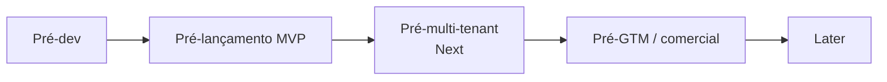

# 98 · Decisões e Pendências

> Registro central dos pontos `[A VALIDAR]` espalhados pela documentação. Cada marcação inline continua no seu documento; aqui ela ganha **dono sugerido**, **gate** (o momento em que precisa estar resolvida) e **status**. Transforma pendência solta em backlog acionável. Estágio: **Concepção**.
>
> Convenção: os itens `[A VALIDAR]` nos demais docs são a fonte da verdade; esta tabela é o índice. Ao resolver um item, atualize o documento de origem **e** o status aqui (a skill `auditar-docs` detecta divergências entre os dois).

## 1. Gates (quando cada coisa precisa estar resolvida)

## 2. Registro

| ID | Pendência | Origem | Tipo | Dono sugerido | Gate | Status |
|----|-----------|--------|------|---------------|------|--------|
| P-01 | Base legal LGPD (legítimo interesse) + LIA | 02 §4 | Jurídico | Jurídico | Pré-lançamento | Aberto |
| P-02 | Base legal e termos de uso por fonte (checklist de 3 perguntas) | 02 §6 | Jurídico+Produto | Jurídico | Por fonte | Aberto |
| P-03 | Encarregado/DPO designado + ROPA + política de privacidade do usuário | 02 §9 | Jurídico | Jurídico | Pré-lançamento | Aberto |
| P-04 | Controles de segurança por camada (validar a tabela proposta) | 05 §4 | Segurança+Eng | Eng | Pré-dev | Aberto |
| P-05 | Política de retenção — definir prazos por tipo de dado | 05 §5 | Jurídico+Eng | Eng | Pré-lançamento | Aberto |
| P-06 | Plano de resposta a incidentes | 05 §6 | Segurança+Jurídico | Segurança | Pré-lançamento | Aberto |
| P-07 | Arquitetura de isolamento multi-tenant | 05 §7 | Eng | Eng | Pré-multi-tenant | Aberto |
| P-08 | Cofre de segredos + provedor de identidade | 05 §7 | Eng | Eng | Pré-dev | Aberto |
| P-09 | Classificação de dados (esp. estratégia comercial do cliente) | 05 §9 | Segurança+Produto | Segurança | Pré-dev | Aberto |
| P-10 | Fase dirigida por dados vs. ordem fixa (inversão julg.→hab.) | 04 §4 | Eng+Produto | Produto | Pré-Módulo 3 | Aberto |
| P-11 | Observabilidade de PCA/plano de contratações (fase preparatória) | 04 §3 | Produto | Produto | Later | Aberto |
| P-12 | Persona primária do MVP (proposta: empresa fornecedora) + prioridade do Órgão público | 01 §3 / 07 §4 | Produto | Produto | Pré-dev | Resolvido (01/07, 2026-07-05: empresa fornecedora = persona primária do MVP; uso interno = campo de prova; consultoria = Next; órgão público = Later consultivo) |
| P-13 | Revisão do escopo excluído (automação de submissão etc.) | 01 §6 | Produto+Jurídico | Produto | Later | Aberto |
| P-14 | Metas numéricas das métricas (frescor, cobertura, precisão) | 08 §3 | Produto+Eng | Produto | Pré-dev | Resolvido (07/08/12, 2026-07-05: cobertura PNCP ≥ 99%; frescor p95 ≤ 30 min; precisão do matching ≥ 60%; ativação/triagem/ganho de tempo fixados como metas de concepção do MVP) |
| P-15 | Esquema de eventos de instrumentação | 08 §6 / 12 §5 | Eng | Eng | Pré-lançamento | Aberto |
| P-16 | Pesquisa primária de concorrentes (features, cobertura, preços) | 09 §2 | Negócio+Produto | Negócio | Pré-GTM | Aberto |
| P-17 | Modelo de pricing, planos e alavanca de cobrança | 09 §6 | Negócio | Negócio | Pré-GTM | Aberto |
| P-18 | Gold set rotulado + metas de qualidade da extração IA | 10 §5 | Produto+Eng | Produto | Pré-lançamento | Especificação proposta (doc 10 §§5.1–5.3, 2026-07-05: cobertura ≥50 editais, matriz modalidade×formato, esquema de rótulo com `is_critico`, protocolo de avaliação; rótulos e metas numéricas `[A VALIDAR]`) |
| P-19 | Limiares de confiança por campo (IA) | 10 §4 | Eng | Eng | Pré-lançamento | Aberto |
| P-20 | Teto de custo de IA por edital (unidade econômica) | 10 §7 / 09 §6 | Eng+Negócio | Eng | Pré-lançamento | Aberto |
| P-21 | Limiares de recall/precisão do matching + política de digest | 11 §§2,4 | Produto | Produto | Pré-lançamento | Aberto |
| P-22 | Lista priorizada de fontes além do PNCP | 11 §6 / 07 | Produto | Produto | Pré-Next | Aberto |
| P-23 | Onboarding de cold-start e critérios sugeridos por segmento | 11 §3 | Produto | Produto | Pré-lançamento | Aberto |
| P-24 | Entidades/cardinalidades e números de NFR/SLA | 12 §§1,3 | Produto+Eng | Eng | Pré-dev | Resolvido (12, 2026-07-05: entidades validadas — `NOTIFICACAO`/`PREFERENCIA_NOTIFICACAO` incorporadas ao modelo (§1), núcleo já fechado por P-45–P-50; NFRs de arquitetura fixados (§3) — latência de triagem p95 ≤ 3 min (degrada sob pressão, arq/04 §6), disponibilidade ≥ 99,5%/mês no caminho crítico ingestão→alerta, escalabilidade dimensionada pelo volume medido em P-31; frescor/cobertura via P-14; números remanescentes delegados aos donos — retenção P-05/P-44, custo de IA P-20, cadência de frescor P-29, RTO/RPO P-60) |
| P-25 | Corte single-tenant no MVP vs. expectativa de vender a consultorias cedo | 07 §8 / 09 §5 | Produto+Negócio | Produto | Pré-dev | Resolvido (07/09, 2026-07-05: MVP permanece single-tenant; consultoria pode entrar cedo só como conta single-tenant equivalente a empresa fornecedora, com um cliente-final/empresa acompanhada e sem promessa multi-cliente; plano Consultoria completo fica no Next, condicionado a isolamento e permissões) |
| P-26 | Confirmar contratos da API de Consulta do PNCP (endpoints, parâmetros, códigos de modalidade) no Swagger | arq/02 §§2,3,8 | Eng | Eng | Pré-dev | Resolvido (arq/02 §§2,3,8, 2026-07-05: base `https://pncp.gov.br/api/consulta`; `tamanhoPagina` max=50; `/publicacao` e `/atualizacao` requerem `codigoModalidadeContratacao`; 13 códigos de modalidade mapeados; schema completo do item documentado; pendência residual: formato de `dataFinal` no `/proposta`) |
| P-27 | Confirmar estilo (monólito modular), stack (Postgres, fila, storage, LLM) e **runtime/linguagem** | arq/01 §§2,5,8 / arq/08 §§9,11 | Eng | Eng | Pré-dev | Resolvido (arq/01 §§2,5,8 · arq/08 §§9,11, 2026-07-05): **monólito modular + workers assíncronos**; primitivas **PostgreSQL / fila gerenciada (retry+DLQ) / blob S3-compatível / Claude / e-mail transacional**; **TypeScript linguagem única**, com *seam* p/ **Go** no tier serverless (ingestão/matching) acionado por A09 + P-31, e **Python** só p/ OCR/eval. Vendor/modelo exato fica nas pendências próprias: provedor **P-64**, região **P-28**, LLM direto-vs-nuvem **P-66**, modelo Claude/custo **P-20** |
| P-28 | Região de hospedagem e residência de dados | arq/01 §5 | Eng+Jurídico | Eng | Pré-dev | Resolvido (Eng/Artur, 2026-07-05, arq/08 §7): **Brasil / São Paulo** (`sa-east-1` no default AWS — P-64); dado em repouso e compute na região, latência + residência LGPD dos dados pessoais/estratégicos. Único cruzamento de fronteira = o recorte enviado ao LLM; residência do LLM + DPA de sub-operador seguem em **P-66/P-54/P-80** (Jurídico) e a classe crítica nunca é enviada (A07/A03). |
| P-29 | Cadência de polling do PNCP que atinge frescor ≤ 30 min sem furar rate-limit | arq/02 §3 / 12 §3 | Eng | Eng | Pré-lançamento | Aberto |
| P-30 | Retenção de anexos (editais/PDFs) em object storage | arq/02 §6 / 05 §5 | Jurídico+Eng | Eng | Pré-lançamento | Aberto |
| P-31 | Medir volume/perfil de publicação do PNCP para definir cargas-alvo reais | arq/04 §3 | Eng+Produto | Eng | Pré-dev | Resolvido (arq/04 §3, 2026-07-05: ~5.800–6.000 contratações/dia útil + ~15.000 atualizações/dia; fim de semana ~5–10% do volume útil; 3 modalidades dominantes ≥ 90% do volume; varredura completa = ~120 requests com `tamanhoPagina=50`; cargas-alvo S1/S5 atualizadas em arq/04 §3) |
| P-32 | Mock/fixtures do PNCP para stress test (não estressar a fonte real) | arq/04 §4 | Eng | Eng | Pré-lançamento | Aberto |
| P-33 | Ferramenta de teste de carga + ambiente isolado | arq/04 §4 | Eng | Eng | Pré-lançamento | Aberto |
| P-34 | Alarmes/SLO e limiares dos circuit breakers (fonte, LLM, custo) | arq/04 §§5,7 | Eng | Eng | Pré-lançamento | Aberto |
| P-35 | Runbook ligado ao plano de resposta a incidentes | arq/04 §8 / 05 §6 | Segurança+Eng | Segurança | Pré-lançamento | Aberto |
| P-36 | SLOs de experiência + error budget; SLO duro p/ "alerta de prazo crítico" (0 perdidos) | Validação PM / arq/04 | Produto+Eng | Produto | Pré-lançamento | Aberto |
| P-37 | Plano de comunicação ao usuário em degradação (status page, banner "triagem atrasada") | Validação PM / arq/04 §6 | Produto | Produto | Pré-lançamento | Aberto |
| P-38 | Alarme de custo de IA como guardrail de negócio (teto rígido + quem é acionado) | Validação PM / arq/04 §5 / 10 §7 | Negócio+Eng | Eng | Pré-lançamento | Aberto |
| P-39 | Estratégia de particionamento do banco (data e/ou tenant) + arquivamento | arq/05 §§3,8 | Eng | Eng | Pré-lançamento | Aberto |
| P-40 | Fan-out reverso do matching em escala (scan vs. percolator) | arq/05 §3 / 11 §5 | Eng | Eng | Pré-Next | Aberto |
| P-41 | Sizing de pool de conexões + statement_timeout/work_mem | arq/05 §6 | Eng | Eng | Pré-lançamento | Aberto |
| P-42 | Quando introduzir réplicas de leitura e o que roteia para elas | arq/05 §6 | Eng | Eng | Pré-Next | Aberto |
| P-43 | Validar limites de bounded context e linguagem ubíqua (Governança contexto vs shared kernel; local do Perfil de Habilitação) | 13 §7 | Produto+Eng | Eng | Pré-dev | Resolvido (13/00, 2026-07-05: Governança = bounded context separado no padrão Open Host, não shared kernel — este é só o `tenantId`; Perfil de Habilitação permanece em Identidade & Organização, escopado a clienteFinal, consumido pela Triagem via Cliente-Fornecedor) |
| P-44 | Retenção/arquivamento das tabelas append-only e de alto crescimento (EDITAL, ALERTA, PROVENIENCIA, AUDIT_LOG) | arq/06 §§3,7 / 05 §5 | Eng+Jurídico | Eng | Pré-lançamento | Aberto |
| P-45 | **TRIAGEM: separar extração do edital (cacheável, 1 por edital) da aderência (por perfil)** | 12 §1 / A03 §§4,6 | Eng+Produto | Eng | Pré-lançamento | Resolvido (12/A03: EXTRACAO_EDITAL + TRIAGEM) |
| P-46 | Modelar `modalidade` como FK à tabela de domínio MODALIDADE (código PNCP), não string denormalizada | 12 §1 / A03 §4 | Eng | Eng | Pré-dev | Resolvido (12/A03: modalidadeCodigo FK) |
| P-47 | Incluir AUDIT_LOG e SolicitacaoDeTitular no modelo canônico (doc 12) — exigidos por 05 §3 e 13 | 12 §1 / 05 §3 / 13 | Eng+Jurídico | Eng | Pré-lançamento | Resolvido (doc 12) |
| P-48 | RESULTADO deve relacionar-se a EDITAL (mercado inteiro), não só a CASO | 12 §1 / 13 / 09 | Produto+Eng | Eng | Pré-Later | Aplicado (RESULTADO → EDITAL) `[A VALIDAR]` |
| P-49 | Segregação por CLIENTE_FINAL (clienteFinalId) além de tenantId, para consultorias | 12 §1 / A03 §4 / 01 §3 | Eng | Eng | Pré-Next | Aplicado no modelo `[A VALIDAR — ativar no Next]` |
| P-50 | Definir os campos do PERFIL_HABILITACAO (insumo do core Triagem) | 12 §1 / 10 §2 | Produto+Eng | Produto | Pré-lançamento | Resolvido (doc 12) |
| P-51 | **Autorização por objeto (anti-IDOR/BOLA): todo acesso confirma posse por tenant/clienteFinal, não só filtro de query — vetor nº1 de vazamento cross-tenant** | Sec / 05 §2 / A03 §8 | Segurança+Eng | Eng | Pré-lançamento | Aberto (critério de teste especificado 2026-07-05: matriz AB1 por recurso × ação em arq/07 §2.1 — leitura e escrita, IDs cruzados; invariante transversal nos use cases disparados pelo usuário em 14 §§2–6; implementação pendente) |
| P-52 | Modelo de autorização (RBAC): papéis (admin consultoria, operador, cliente-final read-only) e matriz de permissões | Sec / 05 §4 / 13 | Segurança+Produto | Produto | Pré-lançamento | Aberto |
| P-53 | Gestão de identidade: sessão/tokens (expiração, revogação), MFA, proteção brute-force, recuperação de conta segura | Sec / 05 §4 | Segurança+Eng | Eng | Pré-lançamento | Aberto |
| P-54 | **Dados enviados ao LLM: minimizar (não enviar a classe crítica/estratégia comercial), DPA com o provedor como sub-operador, residência** | Sec / 05 §9 / 10 / 02 §9 | Segurança+Jurídico | Segurança | Pré-lançamento | Aberto |
| P-55 | Segurança da API: WAF/gateway, rate-limit por tenant, headers (HSTS/CSP), CORS/CSRF, validação de schema, anti-mass-assignment | Sec / 05 §4 / A01 §7 | Segurança+Eng | Eng | Pré-lançamento | Aberto |
| P-56 | AppSec no CI + supply chain: SAST/DAST, secret scanning, SCA/SBOM, scan de imagem, cadência de pentest | Sec / 05 | Segurança+Eng | Eng | Pré-lançamento | Aberto |
| P-57 | Sub-processadores (contrato de tratamento) com LLM/e-mail/nuvem; e verificação de identidade do titular antes de atender SolicitacaoDeTitular | Sec / 02 §9 / 05 §5 | Jurídico+Segurança | Jurídico | Pré-lançamento | Aberto (2026-07-05: AB10 promovido a teste obrigatório do gate — arq/07 §5; invariante em 14 §5. Contrato de sub-processadores segue com Jurídico) |
| P-58 | Segmentação de rede + egress allowlist + proteção SSRF na busca de anexos/URLs (ingestão) | Sec / 05 §4 / A02 §6 | Segurança+Eng | Eng | Pré-lançamento | Aberto |
| P-59 | Criptografia em nível de campo/aplicação para a classe crítica (estratégia comercial), além do isolamento | Sec / 05 §9 | Segurança+Eng | Eng | Pré-lançamento | Aberto |
| P-60 | Segurança de backup: criptografia, imutabilidade (anti-ransomware), teste de restauração, RTO/RPO | Sec / 05 §6 / A05 §6 | Segurança+Eng | Eng | Pré-lançamento | Aberto |
| P-61 | Higiene de logs (sem PII/segredos) + SIEM/alertas de eventos de segurança + integridade do audit log | Sec / 05 §3 / A04 §8 | Segurança+Eng | Eng | Pré-lançamento | Aberto (2026-07-05: audit log append-only/imutável e fail-closed especificado — AUDIT_LOG com `tenantId`/`baseLegal` em 12 §§1–2; `RegistrarAuditoriaUseCase` com `AuditoriaIndisponivelError` em 14 §5; caso de abuso AB13 em arq/07 §§2,5. Higiene de logs/SIEM pendentes) |
| P-62 | Teste contínuo de isolamento de tenant (autorização) como gate de release, já no MVP single-tenant | Sec / 05 §2 / 07 §6 | Segurança+Eng | Eng | Pré-lançamento | Aberto (2026-07-05: gate de release ampliado — arq/07 §5 agora exige matriz AB1 §2.1, AB5–AB7/AB9 (A11), AB10 e AB13, não só AB1/AB4; **A16 §§5,7 sincronizado** — TC-AB1 vira matriz recurso × ação, novo TC-AB13, gate consolidado e regras duras promovem AB5–AB7/AB9/AB10/AB13. Implementação dos testes segue com Segurança) |
| P-63 | Gate de severidade (bloquear release em crítico/alto) e SLA de correção de vulnerabilidade | Sec / arq/07 §4 | Segurança+Eng | Eng | Pré-lançamento | Aberto |
| P-64 | Modelo de compute por workload (serverless/glue vs container/pool vs gerenciado) confirmado | arq/08 §§2,4 | Eng | Eng | Pré-dev | Resolvido (Eng/Artur, 2026-07-05, arq/08 §2): modelo por workload = tabela de §2 (SPA→CDN; API/BFF+Triagem→container; ingestão/matching/notificação/health→serverless); **provedor default do MVP = AWS** (Fargate/App Runner · Lambda+SQS+EventBridge · RDS+Proxy · S3 · Secrets Manager · Bedrock p/ Claude), primitivas portáveis (§4) como seguro anti-lock-in. |
| P-65 | IaC (Terraform/Pulumi) + ambientes dev/staging/prod + pipeline CI/CD | arq/08 §6 | Eng | Eng | Pré-dev | Resolvido (Eng/Artur, 2026-07-05, arq/08 §6): **Terraform** (não Pulumi — evita acoplar infra a runtime de linguagem; estado remoto S3+DynamoDB c/ lock); ambientes **dev/staging/prod** em contas AWS isoladas; **CI/CD GitHub Actions** com gates build/typecheck/lint(+boundary)→testes→stress→**segurança bloqueante (A07/P-63)**→scan(P-56)→terraform. Implementação delegada em **RAD-34** (scaffold IaC depende de conta AWS provisionada). |
| P-66 | LLM: API direta Anthropic vs via nuvem (Bedrock/Vertex) para residência/DPA (liga P-54) | arq/08 §7 / 05 §9 | Segurança+Eng | Eng | Pré-lançamento | Aberto |
| P-67 | Cold start vs frescor: provisioned concurrency / min instances (trade-off de custo) | arq/09 EL1 | Eng | Eng | Pré-lançamento | Aberto |
| P-68 | Mapear cotas/limites do provedor (concorrência, fila, API GW) + pedidos de aumento | arq/09 EL2 | Eng | Eng | Pré-lançamento | Aberto |
| P-69 | Tooling do monorepo (workspaces, build, imposição de boundary entre camadas/contextos) | arq/10 §§2,7 | Eng | Eng | Pré-dev | Resolvido (Eng/Artur, 2026-07-05, arq/10 §10): pnpm workspaces + Turborepo (já em uso); boundary imposto por **`dependency-cruiser`** — config **`.dependency-cruiser.cjs`** na raiz + script `pnpm boundaries` (domain↛application/infra, application↛infra, núcleo↛tecnologia, contexto↛interior de outro). Roda no gate `lint` do CI (arq/08 §6). Wiring no CI = RAD-34. |
| P-70 | Geração de stubs a partir do proto (contracts) por linguagem no CI | arq/10 §5 | Eng | Eng | Pré-dev | Resolvido (Eng/Artur, 2026-07-05, arq/10 §10): **`buf`** (lint/breaking/codegen) + `protoc-gen-es`/`connect-es` (TS) e `protoc-gen-go` (seam). **Diferido por gatilho**: só quando surgir a 1ª chamada síncrona cross-domain (§5); hoje event-first, `shared/contracts/` vazio. Wiring = RAD-34. |
| P-71 | Padrão de mapeamento DomainError → gRPC/HTTP na borda, sem vazar stack/PII | arq/10 §6 / arq/07 AB11 | Eng+Segurança | Eng | Pré-lançamento | Aberto |
| P-72 | Conjunto de editais adversariais (payloads de prompt injection) + red-team no CI | arq/11 §4 / arq/07 AB4 | Segurança+Eng | Eng | Pré-lançamento | Aberto |
| P-73 | Schema de validação da saída do LLM + sanitização de saída (insecure output handling) | arq/11 §2 / arq/07 AB6 | Eng+Segurança | Eng | Pré-lançamento | Aberto |
| P-74 | Lint/boundary rule: proibir tecnologia no nome de port (application) e impor `<Tech><Port>` no adapter (infra) | arq/10 §8 | Eng | Eng | Pré-dev | Resolvido (Eng/Artur, 2026-07-05, arq/10 §10): lado-**dependência** (núcleo↛pacote de tecnologia) já imposto pela regra `nucleo-sem-tecnologia` do `dependency-cruiser` (P-69); lado-**nome** (`<Tech><Port>` no adapter, port sem tecnologia no nome) = regra ESLint customizada `no-tech-in-port-name`, wiring em RAD-34. |
| P-75 | Repo/package `shared/design-tokens` agnóstico (DTCG + Style Dictionary) + build por framework | arq/12 §3 / arq/13 | Eng | Eng | Pré-Next | Proposta (arq/13, 2026-07-05: estrutura DTCG 3 camadas core/semântico/componente, Style Dictionary 4 saídas CSS/TS/SCSS, dark/light por seletor `[data-theme]`; pendente validação c/ framework P-77 e Figma P-76) |
| P-76 | Figma do zero (Dora): tokens + biblioteca de componentes + páginas + Code Connect Figma↔código | arq/12 §§4,5 | Produto+Eng | Produto | Pré-Next | Aberto |
| P-77 | Framework do front (React/Angular) + `apps/` no monorepo + como consome os tokens | arq/12 §§2,3 | Eng | Eng | Pré-Next | Aberto |
| P-78 | Operações abortáveis (`AbortSignal` em use cases e ports) — front e back; verificar/impor | arq/10 §1 / arq/12 §2 | Eng | Eng | Pré-dev | Resolvido (Eng/Artur, 2026-07-05, arq/10 §10): convenção `executar(input, signal: AbortSignal)` nos exemplos (§§4.4–4.5), ligando AB9/cost-DoS ao cancelamento; imposição = regra ESLint customizada `require-abort-signal` + revisão de código, wiring em RAD-34. |
| P-79 | Front: use cases em pacote próprio importado pela UI (UI nunca acessa infra/API direto) | arq/12 §§2,3 | Eng | Eng | Pré-Next | Proposta (arq/12 §3, 2026-07-05: pacote `application/use-cases` próprio; ports por papel sem tecnologia; `AbortSignal` em todos os ports; mapeamento `GrpcStatus` → `AppError` tipado em `infra/`) |
| P-80 | Provedor de e-mail transacional (SES vs. SendGrid vs. Postmark) + DPA de sub-operador LGPD (docs/02, §9) | arq/14 §11 | Jurídico+Eng | Jurídico | Pré-lançamento | Aberto |
| P-81 | Limiar de criticidade (dias até o prazo que dispara entrega imediata) e cap de alertas no digest (anti-fadiga) | arq/14 §§7,11 / docs/11 §4 | Produto+Eng | Produto | Pré-lançamento | Aberto |
| P-82 | Canal webhook e in-app para Notificação: escopo, adapter e gate de ativação no *Next* | arq/14 §§8,11 | Produto+Eng | Produto | Pré-Next | Aberto |
| P-83 | Port de leitura cross-contexto do Perfil de Habilitação na Triagem: `PerfilRepository` (14 §3 / arq/10 §4.4) vs. gateway dedicado (Cliente-Fornecedor, 13 §5) — coerente com o `IdentidadeGateway` da Governança e a taxonomia de ports (arq/10 §8); alinhar 14 §3 e arq/10 §4.4 | 14 §3 / arq/10 §§4.4,8 / 13 §5 | Eng | Eng | Pré-dev | Resolvido (Eng, 2026-07-05: **`PerfilGateway`** — é Gateway, não Repository, pois a Triagem lê mas não é dona do agregado (taxonomia A10 §8: Repository possui/persiste; Gateway lê outro contexto via ACL/Cliente-Fornecedor). Port *consumer-defined*, distinto do `IdentidadeGateway` da Governança — mesmo padrão, contratos diferentes; só `tenantId` é Shared Kernel. Alinhado em 14 §3, arq/10 §§4.4–4.5 e arq/17 §§ports/DI) |
| P-84 | Protocolo de rotulagem do gold set: quem rotula, critério de desempate entre anotadores, frequência de atualização do gold set ao longo do tempo | arq/16 §2 | Produto+Eng | Produto | Pré-lançamento | Aberto |
| P-85 | Framework de eval para automatizar o gold set no CI (Braintrust, Phoenix, custom — comparar custo, integração, suporte a campo numérico) | arq/16 §2.3 | Eng | Eng | Pré-lançamento | Aberto |
| P-86 | Host do API/BFF após o pivô da SPA (`apps/web` = **Vite/React**, não Next.js co-locado como descrito em RAD-10): onde vivem as rotas REST que a SPA já consome (`/api/triagem/:editalId` etc.) | arq/08 §§(linha API/BFF)+11 / arq/01 §2 | Eng | Eng (Bento) | Pré-dev | Resolvido (Eng/Artur, 2026-07-05): **container `apps/api` TypeScript separado** — monólito modular *container quente* que compõe os módulos (`ingestao`/`matching`/`notificacao`/`triagem`) e serve a SPA de borda via REST+Auth, exatamente a topologia de A08 (SPA edge + API/BFF container gerenciado) e A01 §2. O pivô Vite está **correto** perante A08 (SPA estática/edge); o que faltou foi o container BFF, nunca materializado por RAD-10. Implementação fatiada: **`modules/triagem` (código) → RAD-30 (Iara)**; **`apps/api` BFF → RAD-31 (Bento, bloqueado por RAD-30)**. O `TriagemHttpGateway` da SPA já fixou o contrato de leitura (`GET /api/triagem/:editalId`, `x-tenant-id`, 404/403→null). |
| P-87 | **Orquestração dos testes E2E: Testcontainers-first** (Postgres + schema efêmero) + barramento em memória (substitui SQS no harness); docker-compose só de último caso para dependências não suportadas por Testcontainers. Regra dura: mock/fixture de PNCP e LLM — NUNCA fonte real (A04 §4). Harness em `tests/e2e` (pacote `@radar/e2e`), ligado ao gate de release (docs/07 §6). | A04 §4 / docs/07 §6 | Eng | Eng (Bento) | Pré-lançamento | Resolvido (Eng, 2026-07-05: `tests/e2e` implementado com `testcontainers` + `@testcontainers/postgresql`; 5 cenários E2E passando — CE-01 casamento, CE-02 notificação, CE-03 pipeline fim-a-fim, CE-04 idempotência, CE-05 sem casamento; `InMemoryEventBus` substitui SQS; `InMemoryEditalView` e `InMemoryAlertaView` isolam cross-context reads; `CaptureNotifier` evita SES real). |
| P-88 | Canal **WhatsApp** de notificação: a tela "Configurar Radar" (Figma P-76) oferece WhatsApp como canal, mas o modelo de Notificação (A14 §2) só define `CanalTipo = EMAIL \| WEBHOOK \| IN_APP` — sem WhatsApp e sem pendência. Decidir: (a) remover da UI, ou (b) entrar no roadmap como canal próprio (adapter WhatsApp Business API, consentimento/opt-in LGPD, custo por template Meta, gate de ativação) — distinto de WEBHOOK/IN_APP (P-82). Enquanto aberto, WhatsApp na UI fica **[A VALIDAR]**. Levantado na validação do Figma vs. docs (Artur, RAD-25). | arq/14 §2 / Figma P-76 (Configurar Radar) | Produto+Eng | Produto | Pré-Next | Aberto |
| P-89 | **Ferramenta BDD** para specs executáveis de comportamentos críticos de domínio (RAD-22): `@cucumber/cucumber` v11 + TypeScript via loader `tsx` vs. `vitest-cucumber` (plugin Vitest que interpreta Gherkin). | docs/14 / arq/16 §5 | Eng | Eng (Quésia) | Pré-lançamento | Resolvido (Eng/Quésia, 2026-07-05): **`@cucumber/cucumber` v11 + `tsx`**. Razões: (1) arquivos `.feature` Gherkin são artefatos de 1ª classe — legíveis por não-técnicos, revisáveis em PR, vinculados a docs/14 via comentário `@UsoCaso`; (2) `@cucumber/cucumber` é o padrão de mercado com melhor suporte de IDE para realce de sintaxe; (3) `tsx` como loader evita todo o overhead de pré-compilação e é compatível com TypeScript ESM NodeNext já adotado no projeto; (4) `vitest-cucumber` (amiceli) exige reescrever os cenários em TS (`defineFeature(...)`) e não gera `.feature` legíveis — não atende o objetivo de specs-como-documentação. Harness em `tests/bdd` (`@radar/bdd`); roda com `cucumber-js`; integrado no CI junto com `@radar/e2e`. Escopo do BDD: **Ingestão** (idempotência por `numeroControlePNCP`, AbortSignal), **Matching** (aderência; postura recall-alto; isolamento multi-tenant), **Triagem** (scaffold `@pending` — go/no-go, confiança insuficiente → leitura assistida, IDOR — executável quando RAD-30 chegar). |

> As origens `arq/NN` referem-se à pasta [`arquitetura/`](../arquitetura/00-README.md) (deliverable do arquiteto).

## 3. Como usar este registro

- **Ao resolver:** remova/edite o `[A VALIDAR]` no documento de origem e mova o status aqui para *Resolvido*, com uma linha de decisão (data + o que foi decidido).
- **Ao criar novo `[A VALIDAR]`:** adicione uma linha aqui com origem e gate.
- **Auditoria periódica:** rodar a skill `auditar-docs` para pegar itens resolvidos num doc mas ainda abertos em outro (e vice-versa).
