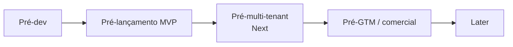

# 98 · Decisões e Pendências

> Registro central dos pontos `[A VALIDAR]` espalhados pela documentação. Cada marcação inline continua no seu documento; aqui ela ganha **dono sugerido**, **gate** (o momento em que precisa estar resolvida) e **status**. Transforma pendência solta em backlog acionável. Estágio: **Concepção**.
>
> Convenção: os itens `[A VALIDAR]` nos demais docs são a fonte da verdade; esta tabela é o índice. Ao resolver um item, atualize o documento de origem **e** o status aqui (a skill `auditar-docs` detecta divergências entre os dois).

## 1. Gates (quando cada coisa precisa estar resolvida)

## 2. Registro

| ID | Pendência | Origem | Tipo | Dono sugerido | Gate | Status |
|----|-----------|--------|------|---------------|------|--------|
| P-01 | Base legal LGPD (legítimo interesse) + LIA | 02 §4 | Jurídico | Jurídico | Pré-lançamento | Resolvido (Jurídico+Produto/Priscila, 2026-07-07, 02 §4): para o recorte **PNCP-only** do MVP, a base adotada para dado pessoal de terceiro incidental em edital/anexo é **legítimo interesse** (LGPD art. 7º, IX), condicionada a LIA documentada antes do go-live. Salvaguardas obrigatórias: fonte oficial preferencial, finalidade limitada a monitorar/triagem de licitações, minimização antes da persistência, proveniência/base legal por registro, sem mailing/scoring/revenda de contato e canal DPO-mediado para direitos do titular. Dado pessoal sensível incidental não entra nessa base: descartar/anonimizar salvo parecer específico para hipótese do art. 11. Fonte nova ou scraping HTML reabre o checklist de 02 §6/P-02. |
| P-02 | Base legal e termos de uso por fonte (checklist de 3 perguntas) | 02 §6 | Jurídico+Produto | Jurídico | Por fonte | Aberto |
| P-03 | Encarregado/DPO designado + ROPA + política de privacidade do usuário | 02 §9 | Jurídico | Jurídico | Pré-lançamento | Resolvido quanto à decisão (Jurídico+Produto/Priscila, 2026-07-07, 02 §9 / 05 §5): go-live fica bloqueado sem encarregado formalmente designado, substituto operacional, canal público funcional, ROPA vivo e Política de Privacidade/Termos de Uso publicados. O ROPA cobre dado de terceiro, conta do usuário, estratégia comercial, auditoria, notificação, LLM/e-mail/nuvem e retenção/eliminação. A designação nominal e publicação do canal são execução operacional pré-lançamento, não decisão de modelo. |
| P-04 | Controles de segurança por camada (validar a tabela proposta) | 05 §4 | Segurança+Eng | Eng | Pré-dev | Resolvido (Segurança+Eng/Artur, 2026-07-05, 05 §4): tabela de controles por camada **decidida como baseline** e separada por gate — **Pré-dev** (autorização por objeto + `tenantId`/`clienteFinalId` em toda entidade, audit log append-only/fail-closed, edital-como-dado, TLS, segredos em cofre, validação de entrada, ambientes separados), **Pré-lançamento** (AuthN/MFA, RBAC, WAF/rate-limit/headers, retenção, cripto de campo, SIEM, verificação de titular, SSRF/egress, saída da IA) e **Next** (isolamento físico RLS, aditivo). Regra dura: RLS **soma-se** à autorização por objeto, nunca a substitui — o baseline lógico vale desde o dia 1. Não afrouxa **AB1/AB10/AB13/A11** (arq/07 §5). P-04 decide **a tabela**; implementação/teste de cada controle seguem nas pendências próprias P-51–P-63/P-07, conforme status individual; cofre de segredos + IdP já **decididos em P-08** (Resolvido). |
| P-05 | Política de retenção — definir prazos por tipo de dado | 05 §5 | Jurídico+Eng | Eng | Pré-lançamento | Resolvido (Jurídico+Produto/Priscila, 2026-07-07, 05 §5): matriz-base do MVP **PNCP-only** definida por finalidade/necessidade/término do tratamento (LGPD arts. 6º, 15, 16, 18 e 37). Prazos: catálogo público/anexos ativos até encerramento + 24 meses e arquivo frio até 5 anos; pessoal de terceiro só se necessário e no máximo encerramento + 24 meses; conta do usuário ativa + 5 anos; estratégia comercial ativa + 24 meses; notificações 180 dias; proveniência como *tombstone* mínimo por 5 anos; `AUDIT_LOG`/`SolicitaçãoDeTitular` hot 12 meses e frio até 5 anos. Expurgo automático versionado e auditado; *legal hold* suspende apenas no escopo necessário; prazo maior exige aprovação do encarregado e ROPA atualizado. |
| P-06 | Plano de resposta a incidentes | 05 §6 | Segurança+Jurídico | Segurança | Pré-lançamento | Aberto |
| P-07 | Arquitetura de isolamento multi-tenant | 05 §7 | Eng | Eng | Pré-multi-tenant | Aberto |
| P-08 | Cofre de segredos + provedor de identidade | 05 §4,§7 / arq/08 §§3,5 | Eng | Eng | Pré-dev | Resolvido (Eng/Artur, 2026-07-05, 05 §§4,7 + arq/08 §§3,5,11): **cofre = AWS Secrets Manager** (rotação nativa; segredo nunca em código/pipeline, arq/08 §6) e **IdP = Amazon Cognito** (User Pools; OIDC/JWT; `sa-east-1`, P-28), no default AWS de "comprar não operar" (arq/08 §1) e portável pelo padrão OIDC (arq/08 §4). **Invariante (Pré-dev):** a borda valida o JWT e o `tenantId`/`clienteFinalId` vem de **claim verificado**, **nunca de header controlado pelo cliente** — fecha a dimensão de autenticação de P-51 (anti-BOLA) e liga P-55 (gateway/WAF). O `x-tenant-id` que o `apps/api` lê hoje é **placeholder de dev**; trocá-lo por validação de JWT/derivação de tenant é follow-up de código (Bento, sob `apps/api`/RAD-31). Escolha (Pré-dev) formalmente separada da **operação de identidade** — expiração/revogação de sessão, MFA obrigatório, brute-force, recuperação de conta — que segue em **P-53** (Pré-lançamento) sobre este mesmo IdP. |
| P-09 | Classificação de dados (esp. estratégia comercial do cliente) | 05 §9 | Segurança+Produto | Segurança | Pré-dev | Resolvido (Produto/Priscila, 2026-07-05: docs/05 §9 formaliza matriz de classes e manuseio obrigatório — Público, Pessoal de terceiro, Conta do usuário e Estratégia comercial do cliente; classe crítica exige autorização por objeto, isolamento por `tenantId`/`clienteFinalId`, auditoria, não envio ao LLM/logs e exportação só por ação explícita autorizada; retenção resolvida em P-05/P-44; RBAC detalhado resolvido em P-52; DPA/LLM e criptografia de campo seguem nas pendências próprias P-54/P-66/P-59) |
| P-10 | Fase dirigida por dados vs. ordem fixa (inversão julg.→hab.) | 04 §4 / 03 §5 / RAD-335 | Eng+Produto | Produto | Pré-Módulo 3 | **Resolvido (Produto/Priscila, 2026-07-12, RAD-335).** Decisão: o Radar não codifica uma ordem fixa imutável de fases. A ordem padrão da Lei 14.133/2021 é julgamento → habilitação, e o produto não deve antecipar "habilitação" antes de "julgamento" quando a fonte segue o rito padrão; mas, quando o edital/fonte informar inversão motivada, o estado deve acompanhar os dados. Isso vale para o futuro Módulo 3 (Gestão da participação); o MVP Now continua limitado à esteira PNCP → matching → alerta → triagem. |
| P-11 | Observabilidade de PCA/plano de contratações (fase preparatória) | 04 §3 | Produto | Produto | Later | Aberto |
| P-12 | Persona primária do MVP (proposta: empresa fornecedora) + prioridade do Órgão público | 01 §3 / 07 §4 | Produto | Produto | Pré-dev | Resolvido (01/07, 2026-07-05: empresa fornecedora = persona primária do MVP; uso interno = campo de prova; consultoria = Next; órgão público = Later consultivo) |
| P-13 | Revisão do escopo excluído (automação de submissão etc.) | 01 §6 | Produto+Jurídico | Produto | Later | Aberto |
| P-14 | Metas numéricas das métricas (frescor, cobertura, precisão) | 08 §3 | Produto+Eng | Produto | Pré-dev | Resolvido (07/08/12, 2026-07-05: cobertura PNCP ≥ 99%; frescor p95 ≤ 30 min; precisão do matching ≥ 60%; ativação/triagem/ganho de tempo fixados como metas de concepção do MVP) |
| P-15 | Esquema de eventos de instrumentação | 08 §6 / 12 §5 | Eng | Eng | Pré-lançamento | **Resolvido (Eng/Bento, 2026-07-10, RAD-167):** schema versionado (`schemaVersion: '1.0'`) implementado em `modules/ingestao/src/application/events.ts`. Dois novos eventos: **(1) `pipeline.ciclo.concluido`** — emitido após cada ciclo de polling (regime, modalidades, janela, ingeridos/atualizados/erros, duracaoMs, breakerAberto); cobre frescor e cobertura (docs/08 §3 — p95 publicação→alerta e recall). **(2) `pipeline.breaker.estado-mudou`** — emitido em toda transição de estado do circuit breaker (P-34); cobre saúde da fonte. Eventos existentes `EditalIngerido`/`EditalFaseMudou` já registram `dataPublicacao`/`dataAtualizacao` para medir latência de triagem e feedback de relevância (via Matching/Notificação). Schema evolui sem quebra: novos campos opcionais; versão incrementada a cada mudança incompatível. |
| P-16 | Pesquisa primária de concorrentes (features, cobertura, preços) | 09 §2 | Negócio+Produto | Negócio | Pré-GTM | Aberto (2026-07-11: **levantamento desk** inicial de preços registrado em 09 §6.2 — base do mercado R$39–165/mês, incumbente ConLicitação sob consulta, **nenhum player cobra IA/triagem como linha explícita**; pesquisa **primária** confirmatória por player segue `[A VALIDAR]`) |
| P-17 | Modelo de pricing, planos e alavanca de cobrança | 09 §6 | Negócio | Negócio | Pré-GTM | Aberto (2026-07-11: **proposta** de planos/faixas/alavanca em 09 §6.1 — alavanca principal = **triagens/mês**, secundária = **cliente-final** na Consultoria; faixas Starter R$129–169, Pro R$399–549, Consultoria R$890–1.290+ (Next). Revisão de arquitetura delegada **RAD-227** (Artur) e de segurança **RAD-228** (Selma); ratificação de **Negócio** e validação de WTP (09 §6.3, campo) seguem `[A VALIDAR]`) |
| P-18 | Gold set rotulado + metas de qualidade da extração IA | 10 §5 | Produto+Eng | Produto | Pré-lançamento | Especificação proposta (doc 10 §§5.1–5.3, 2026-07-05: cobertura ≥50 editais, matriz modalidade×formato, esquema de rótulo com `is_critico`, protocolo de avaliação; rótulos e metas numéricas `[A VALIDAR]`) |
| P-19 | Limiares de confiança por campo (IA) | 10 §4 | Eng | Eng | Pré-lançamento | **Decidido (QA/Quésia, RAD-139, 2026-07-08):** `LIMIAR_CONFIANCA_PADRAO = 0,70` — calibrado pelo protocolo A16 §2.4 com gold set sintético de 30 editais (`scripts/calibrar-limiar-gold-set.ts`): recall@0,70 = 95,1% ✓, recall@0,71 = 92,2% ✗, zero alucinação numérica ✓. Sem corte separado por classe numérica necessário. *(Números atualizados em RAD-218 ao estender o fixture com `habilitação`/`dataSessao`; conclusão não mudou.)* **Recalibrar** ao resolver P-18/P-84/P-85 (gold set real ≥ 50 editais + rotulagem + eval framework) via `pnpm --filter @radar/triagem calibrar:limiar`. |
| P-20 | Orçamento de custo de IA (unidade econômica) | 10 §7 / 09 §6 / 08 §4 | Eng+Negócio | Eng | Pré-lançamento | Aberto (2026-07-05, RAD-53: as **alavancas** de custo foram decididas — batch na ingestão P-92, tiers de modelo P-93, minimização de input P-94, prompt caching P-95; a medição/imposição parcial via `count_tokens` é P-94; o número seguia `[A VALIDAR]`). **Proposta anterior (2026-07-11, 09 §6.4) de teto ~R$0,60/edital processado foi reprovada em RAD-227 e descartada em RAD-229.** Correção de unidade: custo de IA tem **duas unidades** — **extração** (1×/edital ingerido, global, antes de demanda, escala com volume PNCP/P-31) e **aderência por perfil** (1× por `edital × perfil`, reusa a extração e conversa com a alavanca vendida em 09 §6). Correção numérica de RAD-227: com preços verificados no catálogo e câmbio R$5,50, uma extração pós-P-94 (~8k in / 3k out) custa **R$0,13 (Haiku) · R$0,38 (Sonnet) · R$0,63 (Opus)**; edital grande no tier de topo (~25k in / 6k out) = **R$1,51**; hoje, sem P-94, ≈ **R$1,93**. Logo R$0,60 não governa os editais difíceis e desligaria na prática o tier de topo. Correção de forma: substituir *hard ceiling* por item por **orçamento acumulado por janela** (global + tenant/plano); item individual se controla por **admission control** (`count_tokens` no input + `max_tokens` no output) e fallback/degradação. Nuance: `count_tokens` mede só input; com P-94, output pode dominar o custo. Próximos: medição/ledger → **RAD-230**; batch×Bedrock resolvido em **RAD-231**; valores de orçamento, limites por plano e política de acionamento seguem `[A VALIDAR]` por Eng+Negócio. **✅ Correção numérica (Eng/Artur, 2026-07-11, RAD-231): o −50% do batch VOLTA ao cálculo da extração.** A premissa "Bedrock sem batch" (usada na proposta de 09 §6.4 e nos números acima) é **falsa**: o Bedrock não serve a *Message Batches API*, mas serve **batch inference nativo a 50% do on-demand** (P-92/P-66). Como a extração roda em lote por construção (não é latency-sensitive, P-45), o componente dominante do custo cai pela metade: **R$0,07 (Haiku 4.5) · R$0,19 (Sonnet 4.6) · ~R$0,32 (Opus 4.6)** pós-P-94 — *desde que* o tier esteja na matriz de batch do Bedrock (P-93: Sonnet 5/Opus 4.8 **não** estão). A **aderência por perfil** (interativa) segue **sem** desconto. As correções de **unidade** e de **forma** permanecem de pé — muda só a **magnitude**. **Aplicado por RAD-238 (Produto/Priscila, 2026-07-11): 09 §6.4 recalculado com tabela de referência e separação explícita entre extração batch e aderência sem desconto.** **✅ Mecanismo de imposição implementado (Eng/Bento, 2026-07-11, RAD-243):** `PoliticaOrcamento` (`modules/triagem/src/application/politica-orcamento.ts`) — orçamento acumulado por janela (global + por tenant, lido do ledger RAD-230 via `gastoUsdNaJanela`) e admission control de input via `count_tokens` (grátis) contra teto de sanidade (`MAX_INPUT_TOKENS_ADMISSAO=200k`, outliers). Ambos ANTES da chamada paga, zero custo se rejeitarem (`OrcamentoDeCustoExcedidoError`/`EntradaExcedeTetoDeAdmissaoError`). Default sem teto (`Number.POSITIVE_INFINITY`) — **o NÚMERO em USD segue `[A VALIDAR]` por Eng+Negócio**, mas não bloqueia mais o código: é parâmetro injetável na composição-root. ⚠️ **Dimensão que falta (P-109, Artur, 2026-07-12, RAD-268): o orçamento não conhece PLANO.** Só existem os escopos *global* e *por tenant* (um único `orcamentoPorTenantUsd` para todos) — logo o consumo de LLM do **coorte trial** soma no **mesmo teto global** dos pagantes, e um abuso de trial multi-conta (Sybil) derruba a IA de quem paga (denial-of-wallet → DoS do pagante, contra o bulkhead de P-41 e A04 §6). O anti-abuso de trial **é** uma alínea desta pendência: falta um **teto de janela por coorte** (`trial`) e o número correspondente. Implementação em **RAD-271**. |
| P-21 | Limiares de recall/precisão do matching + política de digest | 11 §§2,4 | Produto | Produto | Pré-lançamento | Resolvido quanto à decisão de Produto (Produto/Priscila, 2026-07-11, RAD-200; 11 §§2,4 / 08 §§3-4 / 07 §6): barra MVP = recall de matching ≥ 90% no conjunto de controle PNCP relevante ao ICP + precisão ≥ 60% dos alertas avaliados por contas ativas; se precisão ficar < 60% por duas semanas, ajustar ranking, agrupamento, digest e onboarding antes de cortar recall. Guardrail de fadiga = ≤ 10 alertas marcados como não relevantes por conta ativa/semana, fora da calibração inicial de 14 dias. Política de digest: crítico/imediato por prazo ou alta aderência; demais alertas agrupados no digest configurável, com cap padrão documentado em P-81. |
| P-22 | Lista priorizada de fontes além do PNCP | 11 §6 / 07 | Produto | Produto | Pré-Next | Aberto |
| P-23 | Onboarding de cold-start e critérios sugeridos por segmento | 11 §§3, 3.1, 3.2 | Produto | Produto | Pré-lançamento | **RESOLVIDO (Produto/Priscila + Artur, 2026-07-12, RAD-201/RAD-295; registrado em `11 §§3.1-3.2`).** **Decisão final de Produto:** seis segmentos do ICP, cada um pré-populando **2 palavras-chave** — TI e software (`software`, `sistema`); Equipamentos de informática (`computador`, `notebook`); Limpeza e conservação (`limpeza`, `conservação`); Segurança e vigilância (`vigilância`, `segurança`); Saúde e insumos hospitalares (`medicamento`, `hospitalar`); Obras e manutenção predial (`obra`, `reforma`). O **segmento é atalho visual, não dado de domínio** — não se persiste; salva-se só o critério efetivo (palavras-chave + UF + faixa), e as palavras entram **editáveis**. **UF:** pré-selecionar a do CNPJ do tenant quando disponível, senão exigir escolha explícita (nunca inferir por IP); sendo `regiaoUf` escalar, multi-UF ⇒ o front cria **N critérios**. **Faixa de valor:** default **aberto**, nunca obrigatória no onboarding (valor estimado falta/varia no PNCP; exigir faixa corta recall antes do primeiro alerta). **Duas palavras, não uma** (ajuste do Artur sobre a 1ª proposta de Produto, que pedia 1 termo para escapar do AND tudo-ou-nada): com o score já **proporcional** (RAD-292), 1 termo só produz 0 ou 1 ⇒ **todo** casamento vira alta aderência e crítico no digest, reintroduzindo fadiga de alerta (11 §4); 2 termos dão gradação (um bate ⇒ 0,5, alerta; os dois ⇒ 1,0, alta aderência). **Entregue:** RAD-292 (Eng — filtro morto + score proporcional + invariante, `done`), RAD-296 (Front — campo CNAE fora da tela, `done`), RAD-295 (Produto — a lista, `done`), RAD-297 (Dora — Figma: estado vazio + tela de segmento + campo CNAE removido). **⚠️ Resíduo aberto (RAD-306, Eng/@Caio, não bloqueia esta decisão):** o casamento **não dobra acento** (`includes` cru; `PalavrasChave.criar` só faz `toLowerCase`) e o `objetoCompra` do PNCP vem muito em caixa alta **sem** acento ⇒ `conservação` **não casa** com `CONSERVACAO` e 2 dos 6 segmentos perdem editais **em silêncio**. Fix = `normalize('NFD')` nos dois lados. **A checagem de CNPJ ativo na Receita, antes anotada aqui (RAD-268), foi desmembrada para P-112** e agora está resolvida em RAD-334: não consultar Receita/base derivada no MVP; manter DV + unicidade no onboarding. **Ruling de viabilidade (Artur, 2026-07-12, RAD-201): o onboarding de `11 §3`, como desenhado, entrega ZERO alerta — e o pedido de Produto muda de forma.** Dois defeitos vivos no BC Matching, verificados no código: **(1) `ramoCnae` é um filtro MORTO — preencher = silenciar a conta.** O PNCP **não traz CNAE na contratação** (`pncp-http-gateway.ts:233-242`: só `modalidadeId`, `objetoCompra`, `valorTotalEstimado`, `unidadeOrgao.{ufSigla,municipioNome}`); o evento `edital.ingerido` não tem o campo; `matching-worker.ts:42` fixa `cnae: null`; e `criterio-de-monitoramento.ts:79` descarta o edital quando `criterio.ramoCnae !== edital.cnae` ⇒ **todo critério com CNAE preenchido casa com zero editais, para sempre** — e o campo **já está aberto ao usuário** (`configurar-page.tsx:63` → `routes/matching.ts:52`), sem aviso. `11 §3` põe ramo/CNAE como **primeira pergunta** ⇒ cold-start viraria cold-forever. **(2) o score de palavras-chave é AND tudo-ou-nada** (`encontrados === termos.length ? 1 : 0`; sem termos → 0,5 fixo; `superaLimiar` ≥ 0,3; `ehAlta` ≥ 0,8 de P-81) ⇒ a "lista pré-populada por segmento" que esta pendência pedia é **contraproducente**: 5–6 termos dão score 0 em todo edital (nenhum objeto contém todos) ⇒ **nenhum alerta**; e quem é onboardado **sem** palavras-chave trava em 0,5 ⇒ **nunca** atinge alta aderência ⇒ nunca é crítico por aderência no digest. Resíduo da troca `ts_rank`→substring de RAD-172/RAD-177, cuja ressalva ficou registrada em P-59 e cujo ticket (RAD-173) foi **cancelado sem comentário** — contra a barra de **recall ≥ 90%** de P-21, um critério multi-palavra tem hoje recall ≈ 0. **Decisões:** (a) o onboarding **nunca escreve `ramoCnae`** — "segmento" sobrevive só como rótulo de produto que **sugere palavras-chave**, jamais como filtro estrutural, e o campo sai da superfície de escrita (UC/zod/form/ports); (b) o score passa a ser **proporcional** (`encontrados / termos.length`) — mantém 0,3 como piso e torna o corte 0,8 de P-81 significativo (≥80% dos termos); (c) o invariante de `criar()` deixa de citar CNAE e passa a exigir **ao menos um filtro efetivo** (palavras-chave **ou** UF **ou** faixa), senão o critério casa com tudo a 0,5 (firehose); (d) `ramoCnae`/`regiaoUf` são **escalares** — multi-select de UF/segmento no Figma ⇒ o front cria **N critérios** (produto cartesiano), restrição de contrato a respeitar antes de desenhar (@Dora). **Pedido a Produto, reduzido (RAD-295):** ~6 segmentos do ICP × **1–2 palavras-chave** cada (sem CNAE, sem lista longa); default de UF (a do CNPJ do tenant ou escolha explícita?); faixa de valor default aberta ou obrigatória?; o rótulo do segmento **não** se persiste no MVP (não há campo — seria dado novo). **Fatiado:** RAD-292 (Eng/@Caio — filtro morto + score proporcional + invariante), RAD-296 (Front/@Flávia — tirar o campo CNAE da tela Configurar), RAD-295 (Produto/@Priscila — a lista acima). Os defeitos de Eng **não dependem** de Produto e andam já. **Nota de rastreio:** dois runs paralelos do mesmo wake fatiaram o RAD-201 em duplicata — **RAD-293/RAD-294 são duplicatas mortas** de RAD-296/RAD-295 e devem ser canceladas pelo board (fora da fronteira de autorização do Artur, 403). As issues vivas são as citadas acima. **Validação de viabilidade do Figma (Artur, 2026-07-12, RAD-295 — o design entregue em RAD-297 promete duas coisas que o back não entrega, e uma terceira que contradiz esta decisão; correções em RAD-308/@Dora):** **(i) o pré-preenchimento "UF do CNPJ" não existe** — `OrganizacaoDTO` = `{tenantId, cnpj, razaoSocial, papel}` (`modules/identidade/src/application/dtos.ts`), sem UF nem endereço, e **CNPJ não codifica UF** (quem codifica região é o CPF) ⇒ o "SP — São Paulo pré-preenchido do CNPJ" do frame `12:2` não tem fonte; derivar UF do CNPJ exigiria consulta/enriquecimento externo, rejeitado para o MVP em **P-112**. Cai no ramo que a própria decisão previu: **escolha explícita + "Brasil inteiro"**. Se Produto quiser o prefill, o caminho barato é **perguntar a UF no provisionamento** e persistir no `Tenant` (aditivo), nunca derivar do CNPJ. **(ii) a faixa de valor não é min/máx livre** — a borda aceita `faixaValorCodigo`, chave da tabela de referência datada (`FaixaValorReferencia.faixasVigentes`, `apps/api/src/routes/matching.ts:51-53`), e **não há endpoint que liste as faixas vigentes** ⇒ os inputs "Sem mínimo/Sem máximo" não são implementáveis como números livres; o default aberto (**omitir**) é o único comportamento possível — e é o decidido. Um seletor de faixa, se um dia entrar, exige antes um `GET` de faixas vigentes. **(iii) os cards de onboarding do Figma (`258:62`) trazem 1 termo por segmento e outra taxonomia** (TI→`software`, Engenharia→`obra`, Saúde→`medicamento`, Alimentação→`alimento`, Limpeza→`limpeza`, Papelaria→`expediente`) — é a **1ª proposta de Produto, superada**: 1 termo só produz score 0 ou 1 ⇒ todo casamento vira alta aderência e crítico no digest (fadiga de alerta, 11 §4). Vale a tabela canônica de **6 segmentos × 2 palavras** acima, confirmada por Produto/Priscila. **Confirmado no código (working tree, RAD-292):** score proporcional (`encontrados / termos.length`), `casaCom` sem CNAE, `criar()` forçando `ramoCnae = null`, `CriterioDTO` sem o campo e a rota descartando `ramoCnae` do body; o *folding* de acento de RAD-306 já está no `casaCom` (`normalize('NFD')` nos dois lados), pendente de fechamento pelo dono do ticket. **Cruza:** P-21 (recall/limiares), P-59 (ressalva do score pós-cripto — fechada aqui), P-14, P-112 (CNPJ na Receita — de onde viria a UF, se viesse). |
| P-24 | Entidades/cardinalidades e números de NFR/SLA | 12 §§1,3 | Produto+Eng | Eng | Pré-dev | Resolvido (12, 2026-07-05: entidades validadas — `NOTIFICACAO`/`PREFERENCIA_NOTIFICACAO` incorporadas ao modelo (§1), núcleo já fechado por P-45–P-50; NFRs de arquitetura fixados (§3) — latência de triagem p95 ≤ 3 min (degrada sob pressão, arq/04 §6), disponibilidade ≥ 99,5%/mês no caminho crítico ingestão→alerta, escalabilidade dimensionada pelo volume medido em P-31; frescor/cobertura via P-14; retenção resolvida em P-05/P-44; números remanescentes delegados aos donos — custo de IA P-20, cadência de frescor P-29, RTO/RPO P-60) |
| P-25 | Corte single-tenant no MVP vs. expectativa de vender a consultorias cedo | 07 §8 / 09 §5 | Produto+Negócio | Produto | Pré-dev | Resolvido (07/09, 2026-07-05: MVP permanece single-tenant; consultoria pode entrar cedo só como conta single-tenant equivalente a empresa fornecedora, com um cliente-final/empresa acompanhada e sem promessa multi-cliente; plano Consultoria completo fica no Next, condicionado a isolamento e permissões) |
| P-26 | Confirmar contratos da API de Consulta do PNCP (endpoints, parâmetros, códigos de modalidade) no Swagger | arq/02 §§2,3,8 | Eng | Eng | Pré-dev | Resolvido (arq/02 §§2,3,8, 2026-07-05: base `https://pncp.gov.br/api/consulta`; `tamanhoPagina` max=50; `/publicacao` e `/atualizacao` requerem `codigoModalidadeContratacao`; 13 códigos de modalidade mapeados; schema completo do item documentado); **resíduo fechado (Eng, 2026-07-06, RAD-106):** formato de `dataFinal` no `/proposta` = **yyyyMMdd** (sem separador), idêntico a `/publicacao` e `/atualizacao`; o 422 anterior era ausência de `pagina` (obrigatório pelo spec, mas não aparece no Swagger como required); confirmado por chamada real `?dataFinal=20260710&pagina=1&tamanhoPagina=10` → 200 OK / 8.996 registros. P-26 **totalmente resolvido**. |
| P-27 | Confirmar estilo (monólito modular), stack (Postgres, fila, storage, LLM) e **runtime/linguagem** | arq/01 §§2,5,8 / arq/08 §§9,11 | Eng | Eng | Pré-dev | Resolvido (arq/01 §§2,5,8 · arq/08 §§9,11, 2026-07-05): **monólito modular + workers assíncronos**; primitivas **PostgreSQL / fila gerenciada (retry+DLQ) / blob S3-compatível / Claude / e-mail transacional**; **TypeScript linguagem única**, com *seam* p/ **Go** no tier serverless (ingestão/matching) acionado por A09 + P-31, e **Python** só p/ OCR/eval. Vendor/modelo exato fica nas pendências próprias: provedor **P-64**, região **P-28**, LLM direto-vs-nuvem **P-66**, modelo Claude/custo **P-20** |
| P-28 | Região de hospedagem e residência de dados | arq/01 §5 | Eng+Jurídico | Eng | Pré-dev | Resolvido (Eng/Artur, 2026-07-05, arq/08 §7): **Brasil / São Paulo** (`sa-east-1` no default AWS — P-64); dado em repouso e compute na região, latência + residência LGPD dos dados pessoais/estratégicos. Único cruzamento de fronteira = o recorte enviado ao LLM; residência do LLM + DPA de sub-operador seguem em **P-66/P-54/P-80** (Jurídico) e a classe crítica nunca é enviada (A07/A03). |
| P-29 | Cadência de polling do PNCP que atinge frescor ≤ 30 min sem furar rate-limit | arq/02 §3 / 12 §3 | Eng | Eng | Pré-lançamento | **Resolvido (Eng/Bento, 2026-07-10, RAD-167):** estratégia definida e codificada em `PncpPollingScheduler` + `IngerirAtualizacoesUseCase`. Dois regimes complementares, injetados via config (valores recomendados abaixo, confirmam no ar): **(1) Regime `publicacao`** — `intervaloMs: 5 min`, `tamanhoJanelaMs: 35 min`, modalidades MVP `[6, 8, 9]` (≥ 90 % do volume); ~6 req/ciclo (3 mod × ~2 páginas); janela de 35 min garante sobreposição de 5 min, eliminando lacunas entre ciclos. **(2) Regime `atualizacao`** — `intervaloMs: 5 min`, `tamanhoJanelaMs: 35 min`, sem filtro de modalidade; endpoint `/atualizacao` cobre mudanças de fase/prazo cross-modalidade (~10 req/ciclo); implementado via `IngerirAtualizacoesUseCase`. Consumo total: ~16 req/5 min = ~192 req/hora — margem confortável face ao rate-limit educado (arq/02 §5) e ao pico estimado de ~120 req/varredura (P-31). Frescor: ciclo de 5 min + janela 35 min garante que qualquer edital publicado seja visto em no máximo 5 min (bem abaixo do p95 ≤ 30 min). Reconciliação diária independente (24 h, janela ampla, todas as modalidades) garante cobertura ≥ 99 %. Backoff já presente no `PncpHttpGateway` (exponencial com 3 tentativas). Números exatos de intervalo/janela confirmatórios serão ajustados por observabilidade em produção (P-15). |
| P-30 | Retenção de anexos (editais/PDFs) em object storage | arq/02 §6 / 05 §5 | Jurídico+Eng | Eng | Pré-lançamento | Aberto. **Spike de viabilidade (Artur, 2026-07-06, RAD-121):** recomendação **NÃO** construir SDK de storage com zip+manifesto+restore customizado no MVP. A premissa "custo por objeto" é real (overhead ~40 KB/objeto no Glacier Flexible/Deep Archive = 32 KB Glacier + 8 KB Standard; piso de 128 KB no Standard-IA/Glacier Instant; custo de request de transição), mas o **valor absoluto no volume do MVP é trivial** e o zip **quebra restore e expurgo granular** (restaurar 1 anexo exige reidratar o zip inteiro — 12–48 h no Deep Archive; expurgo LGPD exige restaurar+reescrever+re-arquivar). Direção: **tiering nativo do S3** (Lifecycle rules + Intelligent-Tiering, config de bucket, zero código) + **estender a porta `ObjectStorage`** (`obter`/`deletar`/status-tier) — fica na Ingestão (custódia do documento, docs/13), não em `shared/`. Só esfriar editais **terminais** (nunca os que ainda podem ir à triagem sob demanda — restore é assíncrono); **Glacier Instant Retrieval** (latência ms) é o frio acessível. Expurgo opera por **lifecycle expiration por objeto** (trivial no nativo); anexo é classe **Público** — minimização de PII de terceiro é na ingestão (docs/03 §2), não no tiering. **Remanescente (o que mantém P-30 Aberto):** prazos vêm da matriz de 05 §5 (P-05/P-44 resolvidas); orquestração do expurgo em **RAD-101** (Bento); port/adaptador S3 reais + tiering nativo fatiados em **RAD-122 (Bento)**. Reavaliar zip só se a contagem de objetos no frio passar de ~dezenas de milhões com perfil "arquivar-e-quase-nunca-restaurar". |
| P-31 | Medir volume/perfil de publicação do PNCP para definir cargas-alvo reais | arq/04 §3 | Eng+Produto | Eng | Pré-dev | Resolvido (arq/04 §3, 2026-07-05: ~5.800–6.000 contratações/dia útil + ~15.000 atualizações/dia; fim de semana ~5–10% do volume útil; 3 modalidades dominantes ≥ 90% do volume; varredura completa = ~120 requests com `tamanhoPagina=50`; cargas-alvo S1/S5 atualizadas em arq/04 §3) |
| P-32 | Mock/fixtures do PNCP para stress test (não estressar a fonte real) | arq/04 §4 | Eng | Eng | Pré-lançamento | **Resolvido (QA/Quésia, 2026-07-10, RAD-166): `@radar/pncp-mock` em `tools/pncp-mock/`** — zero chamadas à API pública (A04 §4). Entregues: **(1) `MockPncpGateway`** — implementação in-process de `PncpGateway` (substitui `PncpHttpGateway` nos harnesses); geração lazy, 5.000 itens em ~27 ms; **(2) `PncpMockServer`** — servidor HTTP leve (Node `http`) servindo respostas no wire format exato do PNCP (`PncpPaginaRaw`), usado para testar o próprio adaptador HTTP; **(3) Perfil P-31 embutido:** `PERFIL_DIA_UTIL_PUBLICACAO` (~5.799 publicações/dia, modalidades 6/8/9 ≥ 90 %) + `VOLUME_ATUALIZACOES_DIA_UTIL = 15.000`; paginação `tamanhoPagina=50` (máx confirmado P-26); **(4) Edge cases:** página vazia (`paginasRestantes=0, data:[]`), 422 quando `pagina` ausente (comportamento real P-26), 429 configurável por endpoint/página/modalidade, campos sigilosos (`valorTotalEstimado=null`, `dataEncerramentoProposta=null`); **(5) Schema P-26 completo:** todos os campos confirmados (`numeroControlePNCP`, datas ISO 8601, `orgaoEntidade`, `unidadeOrgao`, `amparoLegal`, `itens`); **(6) Factories de conveniência:** `criarGatewayDiaUtil()`, `criarGatewaySmoke()`, `criarServidorMock()`; **(7) 33 testes de validação** (MG-01…12, MS-01…12) passando: volumes, paginação, sigiloso, erros 422/429, AbortSignal, stress 300 requests em 730 ms. Pronto para consumo pelo RAD-162. |
| P-33 | Ferramenta de teste de carga + ambiente isolado | arq/04 §4 | Eng | Eng | Pré-lançamento | Aberto |
| P-34 | Alarmes/SLO e limiares dos circuit breakers (fonte, LLM, custo) | arq/04 §§5,7 | Eng | Eng | Pré-lançamento | **Resolvido (Eng/Bento, 2026-07-10, RAD-167):** `CircuitBreaker` genérico implementado em `modules/ingestao/src/infra/adapters/circuit-breaker.ts`. Estados: `FECHADO → ABERTO → MEIO_ABERTO → FECHADO` (arq/04 §7). Config injetável (`limiarFalhas`, `timeoutAberturaMs`, `limiarSucessosSonda`) — limiares fine-tuning confirmatórios via P-15 em produção. Degradação graciosa: breaker aberto lança `BreakerAbertoError`; o `PncpPollingScheduler` captura e pula o ciclo sem derrubar o produto (arq/04 §6). Emite `pipeline.breaker.estado-mudou` (P-15) em toda transição para o Source-Health Monitor. **Limiares recomendados (Eng):** PNCP — `limiarFalhas: 5`, `timeoutAberturaMs: 2 min`, `limiarSucessosSonda: 2`; LLM — `limiarFalhas: 3`, `timeoutAberturaMs: 5 min`, `limiarSucessosSonda: 1` (aplicar no `AnthropicBatchLlmGateway` do módulo Triagem); CUSTO — não é breaker de falha: implementar medição/ledger e alarme de orçamento acumulado (P-20/P-38/RAD-230). **Breakers LLM e CUSTO:** abstração pronta para falhas; orçamento de custo fica fora do escopo Bento. 13 testes de disparo automatizados (`__tests__/infra/circuit-breaker.test.ts`), todos passando. Alarmes/exportação a ferramenta gerenciada: infra, à parte (P-36). |
| P-35 | Runbook ligado ao plano de resposta a incidentes | arq/04 §8 / 05 §6 | Segurança+Eng | Segurança | Pré-lançamento | Aberto |
| P-36 | SLOs de experiência + error budget; SLO duro p/ "alerta de prazo crítico" (0 perdidos) | Validação PM / arq/04 | Produto+Eng | Produto | Pré-lançamento | Resolvido (Produto/Priscila, 2026-07-11, RAD-208; docs/06 Glossário / 07 §6 / 08 §4.1): SLOs de experiência do MVP definidos com janela mensal padrão: frescor do alerta padrão p95 publicação PNCP → `alerta.gerado` ≤ 30 min (budget 5%); entrega imediata p95 `alerta.gerado` → `notificacao.enviada` ≤ 5 min (budget 5% só para imediatos por alta aderência); triagem p95 ≤ 3 min ou fallback de leitura assistida (budget 5%); caminho crítico ingestão → alerta ≥ 99,5%/mês (budget 0,5%). Regra dura: **alerta de prazo crítico** = edital PNCP capturado, casado com critério do usuário e com prazo final conhecido em até 3 dias corridos (P-81); deve gerar alerta imediato e notificação antes do prazo final, sem cair em digest. **Error budget = 0**; qualquer perda bloqueia release externo/expansão até RCA, correção e replay/reconciliação comprovados. P-37 permanece aberto para comunicação ao usuário em degradação; P-38 permanece aberto para alarme de custo de IA. |
| P-37 | Plano de comunicação ao usuário em degradação (status page, banner "triagem atrasada") | Validação PM / arq/04 §6 | Produto | Produto | Pré-lançamento | Aberto |
| P-38 | Alarme de custo de IA como guardrail de negócio (orçamento acumulado + acionamento) | Validação PM / arq/04 §5 / 10 §7 / 09 §6.4 | Negócio+Eng | Eng | Pré-lançamento | Aberto (2026-07-05, RAD-53: as alavancas de custo que o alarme vigia estão decididas — P-92–P-95; o **orçamento acumulado**, os limites por janela e **quem é acionado** seguem `[A VALIDAR]`). **Correção de fato (Eng/Artur, 2026-07-11, RAD-227):** o breaker de **CUSTO** **NÃO está implementado** — RAD-167/P-34 entregou o `CircuitBreaker` **genérico** (`modules/ingestao/.../circuit-breaker.ts`) e registra que a aplicação em CUSTO fica na Triagem; ela não existe. Mais: **`CircuitBreaker` é a primitiva errada** para orçamento de custo — breaker conta *falhas*, orçamento é *acumulador*. Faltam duas peças, nenhuma existe hoje: **(a) medição** — o port `LlmGateway.extrair()` devolve só `ExtracaoEdital`, **sem `usage`** (input/output/cache_read), logo **não há como contabilizar custo por execução nem por tenant**; **(b) ledger de uso append-only** — a tabela `triagem` tem `UNIQUE (tenant_id, edital_id, perfil_id)` com `ON CONFLICT DO UPDATE`, então `COUNT(*)` conta *agregados distintos*, **não execuções**: re-triar o mesmo (edital, perfil) sobrescreve a linha e some do faturamento. Impl → **RAD-230** (Iara). **✅ Terceira peça (o acionamento em si) implementada (Eng/Bento, 2026-07-11, RAD-243):** `PoliticaOrcamento`/`excedeOrcamento`/`excedeTetoDeAdmissao` (`modules/triagem/src/application/politica-orcamento.ts`) — o acumulador correto (soma de `custo_usd` por janela via `UsoLlmLedger.gastoUsdNaJanela`, não um `CircuitBreaker` de falhas) checado ANTES de cada chamada paga em `ExtrairEditalUseCase`/`TriarEditalUseCase`, com kill-switch (`OrcamentoDeCustoExcedidoError`). **Quem é acionado** quando o teto estoura segue `[A VALIDAR]` (o mecanismo lança um erro de domínio — 429 na borda —, mas alarme/notificação a um humano ainda não existe). GAP relacionado fechado no mesmo commit: recusa/truncamento (`max_tokens`) agora registram o custo real no ledger via `usoParcial` no erro (antes, esse gasto "desaparecia" — RAD-230 follow-up). |
| P-39 | Estratégia de particionamento do banco (data e/ou tenant) + arquivamento | arq/05 §§3,8 | Eng | Eng | Pré-lançamento | Resolvido (Eng/Artur, 2026-07-10, arq/05 §3, RAD-165): particionamento **nativo declarativo por RANGE de data mensal** em `EDITAL`(`dataPublicacao`), `ALERTA`(`criadoEm`), `PROVENIENCIA` e `AUDIT_LOG`(timestamp do evento); `EXTRACAO_EDITAL`/`TRIAGEM`/`CRITERIO` **não** particionadas no MVP; particionamento **por tenant adiado p/ o Next** (isolamento sai do índice composto + RLS/DB7). Purga por `DROP`/`DETACH PARTITION` (nunca `DELETE`), amarrada à retenção P-05/P-44; job pré-cria a partição do mês seguinte e arquiva (mesmo scheduler da RAD-101). Números passados p/ Quésia fechar DB6 (RAD-162). |
| P-40 | Fan-out reverso do matching em escala (scan vs. percolator) | arq/05 §3 / 11 §5 | Eng | Eng | Pré-Next | Aberto — ⚠️ tensão com P-59 registrada (Artur/RAD-171/RAD-170, 2026-07-10): a cripto de campo da classe crítica cifra os próprios campos de filtro do critério (ramo/CNAE, UF, palavras-chave, faixa) com IV aleatório, o que elimina índice/filtro server-side e **inviabiliza o percolator** (não indexa ciphertext). Hoje `casarComEdital` faz full-scan + decifra tudo em memória por edital — O(N) decrypt por edital, aceitável só no MVP single-tenant com poucos critérios. Ao escalar, decidir uma de: re-escopar quais campos são cifrados (manter índice nos não-críticos e cifrar só a estratégia sensível), searchable-encryption/blind-index, ou enclave de confiança. Ver P-59. |
| P-41 | Sizing de pool de conexões + statement_timeout/work_mem | arq/05 §6 | Eng | Eng | Pré-lançamento | Resolvido (Eng/Artur, 2026-07-10, arq/05 §6, RAD-165): **pooler em modo transação** (RDS Proxy/pgbouncer) obrigatório; `max_connections=200`; **bulkheads por workload** — Ingestão 15 / Matching 10 / Triagem-API 10 / Analítico 5 / Jobs 5 *backends* — cada um com `statement_timeout` próprio (30/10/5/60/300 s); `lock_timeout=3 s` e `idle_in_transaction=30 s` nos pools quentes; `work_mem=16 MB` global (analítico sobe local p/ 128 MB); `maintenance_work_mem` 512 MB–1 GB; autovacuum agressivo em `EDITAL`/`ALERTA`. **Valores de partida** — tuning fino sob carga (A09/RAD-162). Números passados p/ Quésia (DB3b/DB5b). **IaC materializada e validada** (RAD-180, Artur, 2026-07-10): módulos Terraform `db_proxy` (RDS Proxy modo transação, **1 proxy por pool = bulkhead físico**, alarme de `DatabaseConnectionsCurrentlySessionPinned`), `database` (parameter group com os pisos: `max_connections=200`/`work_mem=16MB`/`idle_in_transaction=30s`/backstop `statement_timeout=300s`) e `serverless` (reserved concurrency dos workers = teto de conexões, seam P-27 gated off); timeout POR pool via `SET LOCAL` (pin-safe) ou role+secret por pool; banco **proxy-only na rede** (sem ingress amplo). `tofu validate` verde em dev/staging/prod. Revisão guardião-arquitetura corrigiu apply-blocker (`max_idle` > percent do pool) + 6 hardenings. **apply + evidência BLOQUEADOS no unblock de AWS** (RAD-134, owner DevOps/Segurança — conta Radar + state backend), mesma frente do Cognito. Runbook: `infra/terraform/scripts/apply-db-pool-runbook.md`. **Tuning por-tabela e por-role MATERIALIZADO em SQL executável** (RAD-191, Eng/Bento, 2026-07-11 — antes só existia na IaC global/no comentário do parameter group e em prosa no runbook): autovacuum agressivo (`autovacuum_vacuum_scale_factor`/`analyze_scale_factor=0.02`) + `fillfactor=90` em `EDITAL` (`modules/ingestao/src/infra/migrations/003_autovacuum_edital.sql`); mesmo autovacuum sem fillfactor em `ALERTA` (`modules/matching/src/infra/migrations/004_autovacuum_alerta.sql`); `toast_tuple_target=128` + índice GIN/tsvector do `objeto` (`fastupdate`/`gin_pending_list_limit=2048`, documento 11 §5) em `EXTRACAO_EDITAL` (`modules/triagem/src/infra/migrations/002_extracao_edital_toast_gin.sql`); bootstrap executável de roles + `ALTER ROLE ... SET statement_timeout/lock_timeout` (mecanismo B) em `infra/terraform/scripts/bootstrap-db-roles.sql`. Descoberta verificada em Postgres 16 real (Docker): storage parameters (fillfactor/autovacuum/toast) **não podem ser setados na tabela-pai particionada** ("cannot specify storage parameters for a partitioned table") — as migrações de `EDITAL`/`ALERTA` detectam via `pg_partitioned_table`/`pg_inherits` e aplicam em cada partição-folha. Testado no Testcontainers de `tests/db-stress` (`db-tuning.test.ts`, 19 casos: reloptions aplicados, índice GIN funcional via `EXPLAIN`, roles com timeout herdado no `CONNECT`) + suíte completa (36/36 verde) + migrações validadas idempotentes (2×) contra os schemas particionado e não-particionado. Revisão guardião-arquitetura: aprovado com ressalvas (índice GIN ainda sem consumidor de aplicação — é tuning físico antecipado pedido pelo escopo de RAD-191; quando a camada semântica do matching existir, o acesso deve ir por port/evento de triagem, nunca SQL cru cross-módulo). **Pendência remanescente:** o job de pré-criação de partição mensal (arquitetura/05 §3) ainda não existe em código — quando existir, precisa repetir o `ALTER TABLE ... SET (...)` na partição nova (não há herança retroativa de storage parameters a partir do pai). Números finos seguem sob carga real em A09/RAD-162 (mesma ressalva de sempre — valores de partida). |
| P-42 | Quando introduzir réplicas de leitura e o que roteia para elas | arq/05 §6 | Eng | Eng | Pré-Next | Aberto |
| P-43 | Validar limites de bounded context e linguagem ubíqua (Governança contexto vs shared kernel; local do Perfil de Habilitação) | 13 §7 | Produto+Eng | Eng | Pré-dev | Resolvido (13/00, 2026-07-05: Governança = bounded context separado no padrão Open Host, não shared kernel — este é só o `tenantId`; Perfil de Habilitação permanece em Identidade & Organização, escopado a clienteFinal, consumido pela Triagem via Cliente-Fornecedor) |
| P-44 | Retenção/arquivamento das tabelas append-only e de alto crescimento (EDITAL, ALERTA, PROVENIENCIA, AUDIT_LOG) | arq/06 §§3,7 / 05 §5 | Eng+Jurídico | Eng | Pré-lançamento | Resolvido quanto à decisão Produto/Jurídico (Priscila, 2026-07-07, 05 §5 / 12 §3): `EDITAL` segue a política do catálogo público (ativo até encerramento + 24 meses; frio até 5 anos; depois agregado/anonimizado se necessário à inteligência); `ALERTA` segue estratégia comercial do cliente (conta ativa + 24 meses); `PROVENIENCIA` vira *tombstone* mínimo por 5 anos após expurgo do dado; `AUDIT_LOG` fica hot 12 meses e frio até 5 anos, append-only/fail-closed. Implementação técnica de particionamento, lifecycle e jobs continua em P-39/P-30/RAD-101, sem prazo hard-coded. |
| P-45 | **TRIAGEM: separar extração do edital (cacheável, 1 por edital) da aderência (por perfil)** | 12 §1 / A03 §§4,6 | Eng+Produto | Eng | Pré-lançamento | Resolvido (12/A03: EXTRACAO_EDITAL + TRIAGEM) |
| P-46 | Modelar `modalidade` como FK à tabela de domínio MODALIDADE (código PNCP), não string denormalizada | 12 §1 / A03 §4 | Eng | Eng | Pré-dev | Resolvido (12/A03: modalidadeCodigo FK) |
| P-47 | Incluir AUDIT_LOG e SolicitacaoDeTitular no modelo canônico (doc 12) — exigidos por 05 §3 e 13 | 12 §1 / 05 §3 / 13 | Eng+Jurídico | Eng | Pré-lançamento | Resolvido (doc 12) |
| P-48 | RESULTADO deve relacionar-se a EDITAL (mercado inteiro), não só a CASO | 12 §1 / 13 / 09 | Produto+Eng | Eng | Pré-Later | Aplicado (RESULTADO → EDITAL) `[A VALIDAR]` |
| P-49 | Segregação por CLIENTE_FINAL (clienteFinalId) além de tenantId, para consultorias | 12 §1 / A03 §4 / 01 §3 | Eng | Eng | Pré-Next | Aplicado no modelo `[A VALIDAR — ativar no Next]` |
| P-50 | Definir os campos do PERFIL_HABILITACAO (insumo do core Triagem) | 12 §1 / 10 §2 | Produto+Eng | Produto | Pré-lançamento | Resolvido (doc 12) |
| P-51 | **Autorização por objeto (anti-IDOR/BOLA): todo acesso confirma posse por tenant/clienteFinal, não só filtro de query — vetor nº1 de vazamento cross-tenant** | Sec / 05 §2 / A03 §8 | Segurança+Eng | Eng | Pré-lançamento | **Resolvido** (Segurança/Selma, 2026-07-10, RAD-163): matriz AB1 executável em `tests/security` (`@radar/security-gates`) cobre os use cases disparados pelo usuário com ID/escopo controlável: critério criado no escopo autenticado, alerta feedback, triagem escrever/disparar/ler/feedback-decisão, preferência de notificação, perfil de habilitação ler/escrever e solicitação de titular. O gate usa IDs cruzados de `tenantId`/`clienteFinalId` e exige `AcessoNegadoError` ou recusa equivalente antes de mutação, evento, LLM ou retorno de dado. |
| P-52 | Modelo de autorização (RBAC): papéis (admin consultoria, operador, cliente-final read-only) e matriz de permissões | Sec / 05 §4 / 13 | Segurança+Produto | Produto | Pré-lançamento | **Resolvido (Produto+Segurança/Priscila, 2026-07-11, RAD-203; 05 §4 / 13 §5 / 14 §6):** papéis decididos como controle **somado** à autorização por objeto (P-51/AB1), nunca substituto. RBAC responde "o papel pode tentar esta ação"; AB1 confirma posse por `tenantId`/`clienteFinalId`; ambos precisam passar e ausência de papel nega por padrão. Matriz decidida: **Admin consultoria** gerencia usuários/papéis, critérios, triagens, feedback/decisão, perfil de habilitação e preferências no próprio tenant/clienteFinal autorizado; **Operador** lê e escreve fluxo operacional nos `clienteFinalId` atribuídos, incluindo critérios, feedback, triagem e perfil de habilitação, mas não administra usuários/papéis nem audit log amplo; **Cliente-final read-only** lê alertas, triagens, critérios expostos e perfil do próprio `clienteFinalId`, podendo editar só preferências próprias; **DPO/Compliance interno** acessa `AUDIT_LOG` e `SOLICITACAO_TITULAR` no mínimo necessário, atende solicitação de titular apenas após identidade verificada e não altera estratégia comercial. AB2 vira matriz testável: operador não vira admin; read-only não escreve domínio; sem papel não acessa; papel em um `clienteFinalId` não atravessa outro; `AUDIT_LOG`/`SOLICITACAO_TITULAR` ficam restritos e auditados. Próximo passo de Eng é implementar a checagem de papel na borda/use case de autorização, preservando P-51. **Refinamento de modelo (Artur, 2026-07-11, RAD-215):** **AtribuiçãoDePapel** é **agregado raiz próprio** de Identidade & Organização — identidade = `sub` do IdP, ciclo de vida independente do Tenant, Repository dedicado (`PermissaoRepository`), lida em toda requisição; registrado em 13 §3, no cabeçalho de 14 §6 e no modelo de dados 12 §1–§2. Usuário **não** é agregado deste contexto (ciclo de vida no IdP). |
| P-53 | Gestão de identidade: sessão/tokens (expiração, revogação), MFA, proteção brute-force, recuperação de conta segura | Sec / 05 §4 | Segurança+Eng | Eng | Pré-lançamento | Aberto (2026-07-05: **assenta sobre o IdP escolhido em P-08 — Amazon Cognito**. A escolha do IdP (Pré-dev) está fechada; esta pendência **configura e testa** as primitivas que o Cognito fornece — expiração/revogação de sessão, MFA obrigatório, anti-brute-force e recuperação de conta segura — provadas por AB3/TC-AB3 (arq/07 §2; arq/16). Escopo: operação de identidade, não a escolha do provedor.) |
| P-54 | **Dados enviados ao LLM: minimizar (não enviar a classe crítica/estratégia comercial), DPA com o provedor como sub-operador, residência** | Sec / 05 §9 / 10 / 02 §9 | Segurança+Jurídico | Segurança | Pré-lançamento | **Direção jurídica dada (Selma, 2026-07-10, RAD-156; aplicado docs RAD-158, 2026-07-09). Pendente operacionalização.** **Contexto técnico (Eng/Artur, 2026-07-09, P-66/RAD-156):** caminho técnico do LLM decidido = **Amazon Bedrock** → sub-operador **operacional = AWS** (Bedrock: o provedor de modelo **não acessa prompts/completions** segundo a doc AWS), com o **Anthropic DPA incorporado** aos termos Bedrock — contrato/DPA **a validar no pacote AWS + termos Anthropic** (não "DPA único/AWS-only"), não a Anthropic direta. Fatos: (a) único cross-border = o **recorte minimizado**, com dado pessoal de terceiro (edital PNCP, camada 2/P-94 — não é puramente público); (b) **classe crítica nunca vai ao LLM** (A07/A03/AB5); (c) **Bedrock não serve `sa-east-1`** → recorte processa **fora do Brasil** em qualquer caminho. **Ruling jurídico (Selma, 2026-07-10, RAD-156):** **(a) Caminho default = região UE** quando o modelo/perfil suportar: ANPD reconheceu a UE como adequada (**Resolução ANPD nº 32/2026**) — nenhum mecanismo adicional exigido para a UE; **(b) Caminho US/global = NÃO release-ready** sem mecanismo LGPD art. 33 II explícito: CPCs da ANPD (**Res. CD/ANPD nº 19/2024**) incorporadas sem modificação, ou cláusulas equivalentes/instrumento aprovado pela ANPD — EU SCCs do DPA AWS **não bastam sozinhas** para a LGPD; **(c) Configs Bedrock obrigatórias:** `data_retention_mode=none`/retenção zero, sem `provider_data_share`, bloquear perfis/modelos que exijam retenção ou compartilhamento incompatível, logs sem prompt/output bruto nem PII desnecessária; **(d) ROPA + Política de Privacidade:** registrar AWS Bedrock como sub-operador, transferência internacional, finalidade de triagem, categorias de dados do recorte minimizado, base legal, mecanismo de transferência e salvaguardas. **Pendente (Jurídico):** (1) confirmar/selecionar região UE disponível no Bedrock para os modelos do router P-93; (2) se US/global necessário: firmar mecanismo art. 33 II com o Jurídico; (3) atualizar ROPA e Política de Privacidade com os itens (d); (4) validar pacote AWS + termos Anthropic do Bedrock. Liga P-66 (técnico), P-80 (e-mail/sub-operador). |
| P-55 | Segurança da API: WAF/gateway, rate-limit por tenant, headers (HSTS/CSP), CORS/CSRF, validação de schema, anti-mass-assignment | Sec / 05 §4 / A01 §7 | Segurança+Eng | Eng | Pré-lançamento | Parcialmente implementado — **código** concluído em RAD-160 (Bento, 2026-07-10): security headers (HSTS, CSP, X-Content-Type-Options, Referrer-Policy, frame-ancestors), CORS restrito, CSRF dupla-chave, validação de schema Zod com sanitização, anti-mass-assignment por tipagem estrita; middleware central `apps/api/src/security.ts`. **Borda DECIDIDA (Eng/Artur, 2026-07-11, RAD-199, arq/08 §5): ALB + AWS WAF — não API Gateway.** Três razões, nesta ordem: (1) o serviço roda em **sub-rede privada**, e API Gateway com integração privada exige **VPC Link + balanceador atrás dele de qualquer jeito** — seria custo **somado**, não alternativa; (2) o **WAF que esta pendência pede não anexa em HTTP API (v2)** — sobraria REST API (mais caro por requisição) + VPC Link + NLB para chegar onde o ALB chega sozinho; (3) o que o gateway tem de único (*authorizer* JWT nativo, *usage plan* por API key) o Radar **não usa** — o JWT é validado na aplicação (`jose`, P-91) e o rate-limit por tenant depende do claim já verificado. Bônus: destrava o seam `request_scaling_target_ref` do módulo `compute` (escala por `ALBRequestCountPerTarget`, RAD-192/P-67), que só existia nulo por falta desta decisão. **IaC escrita e validada** (`tofu fmt`+`validate` verdes nos 3 stacks): módulos novos `edge` (ALB + SG + target group + listeners + TLS obrigatório em prod por `precondition`) e `waf` (WAFv2 REGIONAL: CommonRuleSet + KnownBadInputs + rate-based por IP), primitivas irmãs — a associação ACL↔borda é composta no stack. Ingresso na task é **SG→SG** (só a borda alcança a porta 3000); egress da borda escopado na porta do container dentro do CIDR da rede. **Limite registrado:** o rate-limit **por tenant** NÃO é implementável no WAF — o `tenantId` vem de **claim verificado** (P-08) e o WAF não valida assinatura de token (agregar pelo header `Authorization` não serve: o token roda a cada sessão). O WAF entrega o bulkhead **grosso por IP**, antes da app; **o teto por tenant fica na aplicação** — follow-up de código (Bento), não de IaC. **Reabre** se entrar monetização por API key, throttling por plano contratado ou API pública a terceiros. **Access log do balanceador** fica com a frente de observabilidade/SIEM (P-62). `apply` + evidência seguem **bloqueados** no unblock de AWS (RAD-134). **Teto por tenant IMPLEMENTADO (Bento, 2026-07-11, RAD-209):** `rateLimitPorTenantMiddleware` em `apps/api/src/security.ts`, montado em cada rota autenticada **depois** de `autenticarMiddleware` (nunca antes — o teto depende do `tenantId` já derivado do claim verificado, jamais de header do cliente). Contador em memória de processo por tenant, janela fixa (`RATE_LIMIT_TENANT_JANELA_MS`, padrão 60s); 429 com `Retry-After` em segundos, corpo sem PII/stack (mesma disciplina de `errors.ts`). Calibração (a) do escopo da issue — sem Redis na IaC hoje: o teto global por tenant (`RATE_LIMIT_TENANT_TETO_GLOBAL`, padrão 600/janela) é dividido pelo maior `max_capacity` entre os stacks (`RATE_LIMIT_TENANT_MAX_TASKS`, padrão 6 = prod, `infra/terraform/stacks/prod/main.tf`) e aplicado **em cada task**; no regime de scale-out completo o agregado converge para o teto pretendido, e fora do pico (menos tasks ativas) o teto efetivo fica mais apertado que o pretendido — folga aceita no MVP-Now, registrada aqui em vez de pedir contador compartilhado agora. Teste de isolamento entre tenants (`apps/api/src/__tests__/rate-limit-tenant.test.ts`): um tenant estourando o teto não afeta outro tenant no mesmo processo. |
| P-56 | AppSec no CI + supply chain: SAST/DAST, secret scanning, SCA/SBOM, scan de imagem, cadência de pentest | Sec / 05 | Segurança+Eng | Eng | Pré-lançamento | Implementado em RAD-164 (Caio, 2026-07-10; aguardando revisão Artur/RAD-171): CI ampliado com Gitleaks secret scanning, Semgrep SAST (`.semgrep.yml` + OWASP/secrets), Trivy FS para SCA/secret/misconfig com `CRITICAL,HIGH` bloqueante, SBOM CycloneDX como artefato, ZAP baseline condicionado a `DAST_TARGET_URL`, e scan Trivy de imagem quando houver `apps/api/Dockerfile` (hoje ausente, step preparado e explicitamente pulado). Cadência de pentest segue como política de Sec/Eng fora do pipeline. |
| P-57 | Sub-processadores (contrato de tratamento) com LLM/e-mail/nuvem; e verificação de identidade do titular antes de atender SolicitacaoDeTitular | Sec / 02 §9 / 05 §5 | Jurídico+Segurança | Jurídico | Pré-lançamento | Resolvido quanto à decisão (Jurídico+Produto/Priscila, 2026-07-07, 02 §9 / 05 §5 / 14 §5): `SolicitaçãoDeTitular` é canal DPO-mediado no MVP, sem portal público (P-100), com verificação de identidade antes de qualquer revelação/alteração, auditoria append-only e falha fechada em identidade insuficiente (AB10). LLM, e-mail, nuvem e demais prestadores só entram em produção com contrato de tratamento/DPA, instruções documentadas, segurança/confidencialidade, retenção/eliminação, cooperação em direitos do titular e incidente. Provedor/residência/DPA específico seguem nas pendências próprias P-54/P-66/P-80. |
| P-58 | Segmentação de rede + egress allowlist + proteção SSRF na busca de anexos/URLs (ingestão) | Sec / 05 §4 / A02 §6 | Segurança+Eng | Eng | Pré-lançamento | **Resolvido** (Bento, 2026-07-09, RAD-159): guarda SSRF implementada na camada Infra da Ingestão. `SsrfGuard` (`infra/adapters/ssrf-guard.ts`) aplicado em `PncpHttpGateway.downloadArquivo()` — único ponto de fetch com URL não confiável do PNCP. Controles: (1) **scheme** — somente `http`/`https`; (2) **IP literal** — rejeita todo IP privado/loopback/link-local/metadata (10/8, 172.16/12, 192.168/16, 127/8, 169.254/16, 0/8, 100.64/10 e outros reservados RFC 5737/6598, broadcast, IPv6 ::1/fe80/fc/fd); (3) **allowlist de egress** (fail-closed) — host não listado = bloqueado; `DEFAULT_ALLOWED_HOSTS = ['pncp.gov.br']`, extensível via config; (4) **DNS rebinding** — após allowlist, hostname resolvido via `dns.promises.lookup` e IP verificado contra ranges bloqueados; falha DNS = fail-closed; (5) **redirects manuais** — `redirect: 'manual'`, cada hop revalida destino (scheme+IP+allowlist+DNS); limite configurável (default 5). `UrlBloqueadaPorSsrfError` (code `URL_BLOQUEADA_SSRF`) em erros de domínio. 26 testes: loopback, metadata 169.254.169.254, RFC 1918, IPv6 ::1/fe80, allowlist fail-closed, bypass de sufixo, DNS rebinding, DNS falha (fail-closed), redirect para interno, redirect acima do limite, redirect legítimo, happy path. Segmentação de rede AWS (egress rule/SG) é complementar — não substitui o controle no código. **Nota de rede (Artur, 2026-07-11, RAD-199 — não reabre P-58):** a sub-rede privada ganhou saída por **NAT** (antes não tinha rota nenhuma). NAT é **obrigatório**, não uma escolha contra VPC endpoints: o polling do PNCP (`pncp.gov.br`) e a chamada ao LLM são **destinos públicos, sem PrivateLink** — endpoint de interface sozinho deixaria a ingestão sem fonte. Consequência para esta pendência: **a saída pública continua aberta na rede**, então quem sustenta a allowlist é o `SsrfGuard` no código (acima). O complemento de rede de verdade — *egress firewall* com allowlist de domínio (AWS Network Firewall) ou proxy de saída — fica como **hardening futuro** (custo ~US$ 300/mês; sem gate hoje). Os IPs de saída são **fixos** (EIP do NAT, exportados em `egress_public_ips`), o que dá origem allowlistável do lado de fora. |
| P-59 | Criptografia em nível de campo/aplicação para a classe crítica (estratégia comercial), além do isolamento | Sec / 05 §9 | Segurança+Eng | Eng | Pré-lançamento | Implementado em RAD-164 (Caio, 2026-07-10; revisão Artur concluída em RAD-171/RAD-170, aprovada com ressalvas endereçadas): `FieldCryptoProvider` em `modules/matching/src/application/ports.ts`, adapter infra `AesGcmFieldCryptoProvider` com AES-256-GCM e `FIELD_CRYPTO_KEY` obrigatório sem default, e `PostgresCriterioRepository` cifrando antes de persistir critério de monitoramento (ramo/CNAE, UF, palavras-chave e faixa de valor min/max em colunas `*_cripto`). Migração `003_criterio_field_crypto.sql` adiciona colunas cifradas de faixa e mantém leitura legacy das colunas numéricas antigas para compatibilidade. **Revisão arquitetural (RAD-171/RAD-170):** núcleo cripto aprovado (fail-closed, sem chave default, AAD ligando tenant/cliente/id/campo); ressalvas endereçadas — regra de match/score movida do adapter para o domínio (RAD-172/RAD-177), migração base de `criterio_monitoramento` garantida com colunas largas o bastante p/ ciphertext (RAD-175) e gate AppSec endurecido (RAD-176); a troca de score `ts_rank`→substring muda volume de alerta e exige validação de produto (P-21/P-14); tensão de escala com o percolator registrada em P-40. |
| P-60 | Segurança de backup: criptografia, imutabilidade (anti-ransomware), teste de restauração, RTO/RPO | Sec / 05 §6 / A05 §6 | Segurança+Eng | Eng | Pré-lançamento | Aberto |
| P-61 | Higiene de logs (sem PII/segredos) + SIEM/alertas de eventos de segurança + integridade do audit log | Sec / 05 §3 / A04 §8 | Segurança+Eng | Eng | Pré-lançamento | Aberto (2026-07-05: audit log append-only/imutável e fail-closed especificado — AUDIT_LOG com `tenantId`/`baseLegal` em 12 §§1–2; `RegistrarAuditoriaUseCase` com `AuditoriaIndisponivelError` em 14 §5; caso de abuso AB13 em arq/07 §§2,5. **Higiene de logs em código implementada** em 2026-07-10 / RAD-161: redator central na API para URL, `Error` e objetos estruturados; substituído `hono/logger`; logs de erro da API/workers não emitem `message`, stack, query value, CPF/e-mail/token/segredo; testes cobrem CPF/e-mail/token e erro com segredo. **Pendentes:** SIEM/alertas e integridade operacional do audit log) |
| P-62 | Teste contínuo de isolamento de tenant (autorização) como gate de release, já no MVP single-tenant | Sec / 05 §2 / 07 §6 | Segurança+Eng | Eng | Pré-lançamento | **Resolvido** (Segurança/Selma, 2026-07-10, RAD-163): CI chama explicitamente `pnpm --filter @radar/security-gates test` no Gate 4 como etapa bloqueante AB1/AB10/AB13/AB14, além do `turbo test` geral; `@radar/db-stress` também passou a rodar explicitamente no Gate 5. O gate de segurança valida AB1/P-51, AB10 (titular não verificado e titular sem vínculo com `clienteFinalId`), AB13 lógico (fail-closed + repositório append-only de contrato) e AB14 (quarentena/trust-gating e storageKey resolvido por objeto de domínio). Integridade operacional/imutabilidade física do `AUDIT_LOG` segue em P-61. |
| P-63 | Gate de severidade (bloquear release em crítico/alto) e SLA de correção de vulnerabilidade | Sec / arq/07 §4 | Segurança+Eng | Eng | Pré-lançamento | Implementado em RAD-164 (Caio, 2026-07-10; aguardando revisão Artur/RAD-171): gate de segurança do CI bloqueia `CRITICAL,HIGH` no Trivy FS/imagem e bloqueia achados Semgrep/Gitleaks; SARIF sobe para GitHub Security e SBOM CycloneDX é publicado. SLA operacional de correção por severidade permanece como procedimento Sec/Eng a executar fora do código. |
| P-64 | Modelo de compute por workload (serverless/glue vs container/pool vs gerenciado) confirmado | arq/08 §§2,4 | Eng | Eng | Pré-dev | Resolvido (Eng/Artur, 2026-07-05, arq/08 §2): modelo por workload = tabela de §2 (SPA→CDN; API/BFF+Triagem→container; ingestão/matching/notificação/health→serverless); **provedor default do MVP = AWS** (Fargate/App Runner · Lambda+SQS+EventBridge · RDS+Proxy · S3 · Secrets Manager · Bedrock p/ Claude), primitivas portáveis (§4) como seguro anti-lock-in. |
| P-65 | IaC (Terraform/Pulumi) + ambientes dev/staging/prod + pipeline CI/CD | arq/08 §6 | Eng | Eng | Pré-dev | Resolvido (Eng/Artur, 2026-07-05, arq/08 §6): **Terraform** (não Pulumi — evita acoplar infra a runtime de linguagem; estado remoto S3+DynamoDB c/ lock); ambientes **dev/staging/prod** em contas AWS isoladas; **CI/CD GitHub Actions** com gates build/typecheck/lint(+boundary)→testes→stress→**segurança bloqueante (A07/P-63)**→scan(P-56)→terraform. Implementação delegada em **RAD-34** (scaffold IaC depende de conta AWS provisionada). |
| P-66 | LLM: API direta Anthropic vs via nuvem (Bedrock/Vertex) para residência/DPA (liga P-54) | arq/08 §7,§11 / 05 §9 / RAD-156 | Segurança+Eng | Eng | Pré-lançamento | **Direção técnica decidida (Eng/Artur, 2026-07-09, RAD-156, arq/08 §7,§11): default = Amazon Bedrock** (não a API direta da Anthropic; **Vertex fora** — multi-cloud contra §10, só se P-64 mudar). **Motivo:** o Bedrock **centraliza controle operacional e billing na AWS** — o recorte sai pela **rede/VPC da AWS** (egress allowlist + A07/§7), não por chamada pública a `api.anthropic.com`; auth IAM/SigV4, billing no Marketplace; e, segundo a doc AWS ([Bedrock data protection](https://docs.aws.amazon.com/bedrock/latest/userguide/data-protection.html)), o **provedor de modelo não acessa prompts/completions**, com retenção configurável (zero-retention por policy). **Ressalva contratual (ajuste pós-parecer Selma, 2026-07-10):** isso **não é "um DPA único/AWS-only"** — os termos oficiais dos modelos Anthropic no Bedrock **incorporam o Anthropic DPA** ([Bedrock third-party model terms](https://aws.amazon.com/legal/bedrock/third-party-models/)); logo o contrato/DPA fica **a validar no pacote AWS + termos Anthropic do Bedrock**, não "um contrato e pronto" (liga P-54/P-57). **Porta de saída:** port `AnthropicLlmGateway` (A10 §4.6) provider-agnóstico → Bedrock↔API-direta é swap de adapter (§4, primitivas portáveis). **Trade-offs registrados:** (1) **residência real** — Bedrock serve os Claude atuais por *cross-region inference* e **`sa-east-1`/Brasil não é região-fonte**, logo **o recorte cruza a fronteira (US/outra região) em qualquer caminho**, igual à API direta — consistente com §7 ("recorte sai do país"); **nenhum caminho mantém a inferência no Brasil hoje**; (2) **modelos** — Bedrock atrasa lançamentos e usa IDs com prefixo `anthropic.`; o router P-93 (Haiku 4.5/Sonnet 5/Opus 4.8) precisa ser validado no build contra o que o Bedrock serve na região; (3) **features** — Bedrock não tem cache automático/Batches/Files/web-tools, mas a Triagem é messages+tools com **`cache_control` manual (suportado no Bedrock)** e `count_tokens` — o admission control de input P-94 sobrevive, mas o orçamento acumulado P-20/P-38 ainda depende de ledger; Batches (−50%) é lever só da API direta, reavaliar se a pré-extração em lote (P-92/P-96) virar gargalo. **Invariante mantido:** classe crítica/estratégia comercial **nunca** vai ao LLM em nenhum caminho (A07/A03/AB5); o recorte é conteúdo de edital **minimizado e majoritariamente público** (PNCP, camada 2/P-94). **Parecer jurídico/segurança recebido (Selma, 2026-07-10, RAD-156; aplicado docs RAD-158, 2026-07-09):** Bedrock **aprovado como default**, condicionado a — (a) escolher perfil/região que minimize a transferência, **preferindo região UE** quando `sa-east-1` é indisponível — ANPD reconheceu a UE como adequada: **Resolução ANPD nº 32/2026** (sem CPCs adicionais para a UE); se **US/global**, caminho **não-release-ready** sem mecanismo LGPD art. 33 II: **CPCs da ANPD (Res. CD/ANPD nº 19/2024)** incorporadas sem modificação, ou cláusulas equivalentes/instrumento aprovado — EU SCCs do DPA AWS **não bastam sozinhas** p/ a LGPD; (b) **`data_retention_mode=none`** (retenção zero) e sem **`provider_data_share`** por policy/IAM; (c) **bloquear** modelos/perfis que exijam retenção/compartilhamento incompatível; (d) **logs sem prompt/output bruto nem PII** desnecessária; (e) registrar no **ROPA e na Política de Privacidade**: AWS Bedrock como sub-operador, transferência internacional, finalidade de triagem, recorte minimizado, base legal, mecanismo de transferência e salvaguardas. **Direção técnica = done; a operacionalização jurídica (seleção de região UE ou mecanismo art. 33 II + ROPA/política + validação pacote AWS/Anthropic) segue com a Segurança/Jurídico em P-54** — Eng aponta a dependência, **não decide por ela**. **✅ Reabertura de RAD-227 FECHADA — Bedrock CONFIRMADO como default, sem tocar no jurídico (Eng/Artur, 2026-07-11, RAD-231).** Correção do trade-off (3) acima: *"Batches (−50%) é lever só da API direta"* está **errado como custo** e certo só como **transporte**. O Bedrock não serve a **Message Batches API**, mas serve **batch inference nativo a −50%** (`CreateModelInvocationJob`, JSONL/S3, 24h — [AWS Bedrock pricing](https://aws.amazon.com/bedrock/pricing/)). Logo a lever de custo de **P-92 não depende de trocar de provedor**: troca-se o **adapter** (`AnthropicBatchLlmGateway` → `BedrockBatchLlmGateway`), o port `LlmLoteGateway` fica — é exatamente a *porta de saída* que este item já previa. **Claude Platform on AWS = alternativa arquivada, não descartada por mérito** (Anthropic-operated sobre infra AWS: SigV4/IAM, billing no Marketplace, paridade same-day, Message Batches nativo): **trocaria o sub-operador** (Anthropic opera; deixa de ser "AWS com o Anthropic DPA incorporado nos termos Bedrock") → **reabriria P-54/P-57**, e dependeria da região servida (`aws-external-anthropic.{region}.api.aws`, `sa-east-1` a confirmar). Como o Bedrock entrega o **mesmo −50%**, não há motivo para pagar esse custo — **o parecer da Selma (RAD-156) segue válido, sem reabertura**. Reavaliar só se a matriz de modelos do Bedrock em batch travar o router (abaixo). **Ressalva de modelo (→ P-93):** a matriz de **batch** do Bedrock cobre **Haiku 4.5 · Sonnet 4.6 · Opus 4.5/4.6** (com `sa-east-1` como região de submissão via *cross-region inference profile*) e **não** cobre **Sonnet 5 / Opus 4.8** — o router da **extração** tem de ser pinado ao conjunto batch-capable. `count_tokens` e `cache_control` manual seguem disponíveis no Bedrock (P-94/P-95 sobrevivem). |
| P-67 | Cold start vs frescor: provisioned concurrency / min instances (trade-off de custo) | arq/09 EL1 | Eng | Eng | Pré-lançamento | **Reenquadrado + pisos escritos** (Artur, 2026-07-11, RAD-192). P-67 nasceu como *cold start de função* (provisioned concurrency), mas **o seam serverless está gated off** (P-96: workers coabitam o Fargate) — **não existe cold start de Lambda no MVP-Now**. A tensão reaparece em **dois** lugares, e ambos ganharam piso na IaC: **(1) Aurora Serverless v2** — piso de 0,5 ACU (1 GB) não segura o *working set* do fan-out (1–5 mil critérios); sob rajada o cache frio vira seq scan, o `statement_timeout` de 10 s do pool `matching` (P-41) mata a query, o retry reentrega e o frescor p95 ≤ 30 min (P-14) fura → **prod min_capacity = 2 ACU** (dev/staging seguem 0,5). **(2) ECS/Fargate** — o tier sempre-ligado não tinha `aws_ecs_service` nem autoscaling; agora tem *target tracking* de CPU/memória com `min_capacity` como absorvedor do degrau de scale-out (A09 EL3). Ambos são **pisos de partida**: o número sai da **medição no unblock** (A09 EL1/EL3, RAD-162) — só aí P-67 fecha. Custo: o piso de ACU é cobrado 24/7 **por instância** e prod passa a ter 2 (HA, ver P-108). |
| P-108 | HA de prod do banco: Multi-AZ (reader de failover) vs instância única (**ex-P-101** — ID renumerado na RAD-244: colidia com o P-101 do caso de uso de leitura do Perfil de Habilitação) | arq/08 §3 / RAD-192 | Eng | Eng | Pré-lançamento | **Decidido — prod = 2 instâncias** (Artur, 2026-07-11, RAD-192). O módulo `database` **anunciava "Multi-AZ prod" no cabeçalho com UMA instância declarada** — o comentário mentia. Em Aurora, "Multi-AZ" não é flag: é ter ≥2 instâncias, que o cluster distribui por AZs distintas. Com 1 instância o failover obriga a AWS a **reconstruir** o writer (minutos, sem SLA); com reader em outra AZ a promoção é ~30–60 s. A04 §6 é explícito — "Ingestão + matching + alerta **NUNCA sacrificar**" — daí o reader. **O motivo é failover, não read-scaling**: ninguém lê da réplica no MVP (o pool analítico só migra pra réplica quando **P-42** for decidido). Materializado como `instance_count` (prod=2, dev/staging=1). Custo: dobra o piso de ACU de prod (2 instâncias × 2 ACU = 4 ACU-h 24/7) — número a confirmar na medição (RAD-162). |
| P-68 | Mapear cotas/limites do provedor (concorrência, fila, API GW) + pedidos de aumento | arq/09 EL2 | Eng | Eng | Pré-lançamento | Aberto |
| P-69 | Tooling do monorepo (workspaces, build, imposição de boundary entre camadas/contextos) | arq/10 §§2,7 | Eng | Eng | Pré-dev | Resolvido (Eng/Artur, 2026-07-05, arq/10 §10): pnpm workspaces + Turborepo (já em uso); boundary imposto por **`dependency-cruiser`** — config **`.dependency-cruiser.cjs`** na raiz + script `pnpm boundaries` (domain↛application/infra, application↛infra, núcleo↛tecnologia, contexto↛interior de outro). Roda no gate `lint` do CI (arq/08 §6). Wiring no CI = RAD-34. |
| P-70 | Geração de stubs a partir do proto (contracts) por linguagem no CI | arq/10 §5 | Eng | Eng | Pré-dev | Resolvido (Eng/Artur, 2026-07-05, arq/10 §10): **`buf`** (lint/breaking/codegen) + `protoc-gen-es`/`connect-es` (TS) e `protoc-gen-go` (seam). **Diferido por gatilho**: só quando surgir a 1ª chamada síncrona cross-domain (§5); hoje event-first, `shared/contracts/` vazio. Wiring = RAD-34. |
| P-71 | Padrão de mapeamento DomainError → gRPC/HTTP na borda, sem vazar stack/PII | arq/10 §6 / arq/07 AB11 | Eng+Segurança | Eng | Pré-lançamento | Resolvido (Eng/Caio, 2026-07-09, RAD-153): na borda HTTP do BFF (`apps/api/src/errors.ts`), `DomainError` é mapeado por `code` estável para status HTTP e payload `{ code, mensagem }` com mensagem genérica; `message`/stack/detalhes internos nunca são enviados ao cliente, inclusive em dev; erros de autorização/cross-tenant colapsam em `ACESSO_NEGADO`/403. Falhas inesperadas retornam `ERRO_INTERNO`/500 genérico; `onError` global usa o mesmo helper e log sanitizado. gRPC segue o mesmo princípio de A10 §4.6 quando surgir a primeira borda síncrona. |
| P-72 | Conjunto de editais adversariais (payloads de prompt injection) + red-team no CI | arq/11 §4 / arq/07 AB4 | Segurança+Eng | Eng | Pré-lançamento | Resolvido (Eng+Segurança/Iara, 2026-07-09, RAD-155 / arq/11 §4 / TC-AB4–AB6/AB8): **corpus de editais adversariais** (`modules/triagem/src/infra/red-team/corpus-injecao.ts`, `CORPUS_ADVERSARIAL`) — o edital é dado NÃO-confiável (A11 §1). Cobre injeção **indireta** (payload no corpo/anexo — vetor principal) e **direta** (payload que se dirige ao modelo como operador: falso turno System/Assistant, modo admin, quebra de delimitador), atacando ignorar-instrução (AB4), exfiltração (AB5), XSS armazenado (AB6), texto em campo numérico/SQLi (AB8) e **forçar a decisão go/no-go**. O harness `avaliarCasoAdversarial` roda cada caso contra a defesa REAL (`AnthropicLlmGateway` camadas 1–6 + `Triagem.avaliar`) e reprova o build se subverter, checando as **3 invariantes do DoD**: (INV-1) a recomendação go/no-go vem do **domínio** (`Triagem.avaliar × perfil`), imune à injeção — a extração sequer tem campo de recomendação; (INV-2) **citação obrigatória** — conteúdo inventado não casa com a fonte → perde a citação (camada 6) e vira "verificar", não fato; (INV-3) **classe crítica nunca vaza** — o request é EXATAMENTE o edital+anexos+instrução fixa (contexto mínimo, camada 2), sem canal para estratégia comercial. **Red-team no CI:** teste vitest `__tests__/infra/red-team-injecao.test.ts` roda no **Gate 4** (`pnpm turbo test`) — verde hoje, sem depender do runner de eval. **Alinhamento P-85 (RAD-157, Quésia):** corpus+harness exportados pelo barril `@radar/triagem/infra` (mesmo caminho boundary-clean do `RecordReplayLlmClient`) → o runner `tests/eval` (`@radar/eval`) importa o MESMO corpus e emite o resultado adversarial no `eval-results.json`, sem duplicação. Verificado: typecheck + 227 testes + eslint + boundaries verdes. **Par com P-73** (lado da SAÍDA, resolvido RAD-154). |
| P-73 | Schema de validação da saída do LLM + sanitização de saída (insecure output handling) | arq/11 §2 / arq/07 AB6 | Eng+Segurança | Eng | Pré-lançamento | Resolvido (Eng+Segurança/Iara, 2026-07-09, RAD-154 / arq/11 §2 camadas 3–4): a saída da IA é tratada como **dado NÃO-confiável** ("mesmo vinda do nosso LLM", A11 §5) no `AnthropicLlmGateway` (`interpretarSaidaExtracao`), compartilhado pelos transportes **síncrono e lote** (mesma inferência). **Camada 3** — schema estrito hand-rolled (`validarSaidaExtracao`): valida campos/tipos/**faixas** (confiança ∈ [0,1], página inteira) e **enums** (`CATEGORIAS`/`SEVERIDADES`, fonte única com o tool schema `FERRAMENTA_SCHEMA` `strict:true`); o que foge é **rejeitado** (`SaidaLlmInvalidaError`), nunca "consertado". Sem Zod no módulo (mantém `@radar/triagem` sem dependência — arq/11 cita Zod só como exemplo; o par validador-puro + `strict:true` na borda cumpre o mesmo controle). **Camada 4** — `sanitizar` remove marcação/controles antes de render/persistência (anti-XSS armazenado, AB6); **só o agregado saneado é persistido**, nunca a saída bruta. **Camada 6** reforça: citação sem trecho que casa com a fonte é descartada (injeção indireta/alucinação → "verificar"). Fechamento RAD-154: suíte `insecure-output-handling.test.ts` — 23 fixtures de saídas **gravadas** via `RecordReplayLlmClient` (sem LLM real): malformada rejeitada, adversária schema-válida sanitizada, citação fabricada descartada, válida passa. `guardiao-seguranca` verde. **Par com P-72** (lado de ENTRADA/red-team, segue Aberto). |
| P-74 | Lint/boundary rule: proibir tecnologia no nome de port (application) e impor `<Tech><Port>` no adapter (infra) | arq/10 §8 | Eng | Eng | Pré-dev | Resolvido (Eng/Artur, 2026-07-05, arq/10 §10): lado-**dependência** (núcleo↛pacote de tecnologia) já imposto pela regra `nucleo-sem-tecnologia` do `dependency-cruiser` (P-69); lado-**nome** (`<Tech><Port>` no adapter, port sem tecnologia no nome) = regra ESLint customizada `no-tech-in-port-name`, wiring em RAD-34. |
| P-75 | Repo/package `shared/design-tokens` agnóstico (DTCG + Style Dictionary) + build por framework | arq/12 §3 / arq/13 | Eng | Eng | Pré-Next | Proposta (arq/13, 2026-07-05: estrutura DTCG 3 camadas core/semântico/componente, Style Dictionary 4 saídas CSS/TS/SCSS, dark/light por seletor `[data-theme]`; pendente validação c/ framework P-77 e Figma P-76) |
| P-76 | Figma do zero (Dora): tokens + biblioteca de componentes + páginas + Code Connect Figma↔código | arq/12 §§4,5 | Produto+Eng | Produto | Pré-Next | Aberto |
| P-77 | Framework do front (React/Angular) + `apps/` no monorepo + como consome os tokens | arq/12 §§2,3 | Eng | Eng | Pré-Next | **Resolvido** (Eng/Flávia, 2026-07-10, arq/12 §§1–3): **React 19 + Vite 6**. `apps/web` em produção com Clean Arch `domain/application/infra/ui`; tokens agnósticos (`@radar/design-tokens`) consumidos via `@import '@radar/design-tokens/tokens.css'` em `globals.css` (CSS custom properties `var(--radar-color-*)`); use cases injetados por `UseCasesContext` (React Context Provider em `src/main.tsx`); container DI em `infra/container.ts`; `AbortSignal` via `AbortController` no `useEffect` cleanup (P-78). `apps/` no monorepo confirmado. Código é a fonte da verdade — arq/12 §§1–3 atualizados. |
| P-78 | Operações abortáveis (`AbortSignal` em use cases e ports) — front e back; verificar/impor | arq/10 §1 / arq/12 §2 | Eng | Eng | Pré-dev | Resolvido (Eng/Artur, 2026-07-05, arq/10 §10): convenção `executar(input, signal: AbortSignal)` nos exemplos (§§4.4–4.5), ligando AB9/cost-DoS ao cancelamento; imposição = regra ESLint customizada `require-abort-signal` + revisão de código, wiring em RAD-34. **Gap de impl encontrado na revisão de arquitetura do core (2026-07-05, arq/10 §10 "regra do último hop"): os 4 `SqsEventPublisher` descartam o `signal` (o `QueueClient.sendMessage` não o recebe) → pedido abortado ainda enfileira. Correção delegada: triagem (Iara, filho de RAD-30); matching/notificacao/ingestao (Bento). RESOLVIDO (Caio via RAD-57 + RAD-67; revisão `guardiao-arquitetura` do Artur em RAD-58, 2026-07-05):** os 4 adapters propagam o `signal` até o `sendMessage`. **Forma canônica do seam (decisão Artur/RAD-58): options-bag `{ abortSignal }`** — `sendMessage(params, opts: { abortSignal: AbortSignal })` / chamada `{ abortSignal: signal }` — espelhando `@aws-sdk/client-sqs` v3 (`client.send(cmd, { abortSignal })`); **proibido sinal posicional cru**, que convida o wrapper do composition root a `send(cmd, signal)` → SDK ignora o cancelamento em silêncio. Verificado: matching/notificacao unificados + testes `.toEqual({ abortSignal: signal })` verdes; triagem já com o 2º teste (signal abortado corta o envio); ingestao stub com TODO `{ abortSignal }`. Resíduo (não bloqueia): matching/notificacao ainda sem o teste de "abort corta o envio" que a triagem tem — coberto por RAD-69. | 
| P-79 | Front: use cases em pacote próprio importado pela UI (UI nunca acessa infra/API direto) | arq/12 §§2,3 | Eng | Eng | Pré-Next | Proposta (arq/12 §3, 2026-07-05: pacote `application/use-cases` próprio; ports por papel sem tecnologia; `AbortSignal` em todos os ports; mapeamento `GrpcStatus` → `AppError` tipado em `infra/`) |
| P-80 | Provedor de e-mail transacional (SES vs. SendGrid vs. Postmark) + DPA de sub-operador LGPD (docs/02, §9) | arq/14 §11 | Jurídico+Eng | Jurídico | Pré-lançamento | Aberto. **Cross-ref (2026-07-09, P-66/RAD-156; atualizado RAD-158, 2026-07-09):** para o **sub-operador do LLM**, caminho técnico = **Amazon Bedrock** → sub-operador = **AWS** (mesmo fornecedor/DPA de P-64); o parecer de residência/DPA/mecanismo art. 33 desse recorte foi dado pela Selma (RAD-156) e está operacionalizado em **P-54** (não neste item, que é e-mail). Se o e-mail default cair em **SES**, e-mail e LLM compartilham o mesmo sub-operador **operacional** AWS — **pacote/DPA AWS comum** (+ os termos Anthropic do Bedrock p/ o LLM) — mas são **fluxos de dados distintos** e o e-mail não tem a questão de transferência internacional do recorte de edital (P-54): o e-mail transacional pode processar no BR (SES `sa-east-1`). A decisão de provedor de e-mail + DPA correspondente segue pendente com o Jurídico. |
| P-81 | Limiar de criticidade (dias até o prazo que dispara entrega imediata) e cap de alertas no digest (anti-fadiga) | arq/14 §§7,11 / docs/11 §4 | Produto+Eng | Produto | Pré-lançamento | Resolvido quanto à decisão de Produto (Produto/Priscila, 2026-07-11, RAD-200; docs/11 §4): alerta imediato quando houver prazo final em até 3 dias corridos ou aderência ≥ 0,80; demais alertas entram em digest diário por padrão, configurável para semanal. Cap padrão: 10 itens no digest diário e 25 no semanal por usuário, ordenados por prazo e aderência; excedentes são agrupados por critério/órgão e ficam acessíveis no produto. Alertas críticos não esperam digest nem contam para o cap. Alinhamento fino em arq/14 delegado para Artur/Eng em RAD-206, sem alterar a decisão de Produto. **Alinhamento arquitetural concluído (Arquitetura/Artur, 2026-07-11, RAD-206):** arq/14 §§2.1, 3, 4.2, 4.3, 7, 10, 11 (criticidade = prazo **ou** aderência; cap por frequência; excedente agregado por critério/órgão; crítico sai do pool do digest e por isso não ocupa cap; ordem de preservação sob pressão), arq/15 §2 (`ehAlta` = 0,80 — mesmo corte de "alta aderência" de P-81; a `Aderencia` de Triagem segue em 0,7, outro conceito) e arq/04 §§3-4 (fan-out S4). Os quatro números (3 dias, 0,80, 10, 25) são config injetada, não literais no código. Delta de implementação em `modules/notificacao` e `modules/matching` → Eng (RAD-207). |
| P-82 | Canal webhook e in-app para Notificação: escopo, adapter e gate de ativação no *Next* | arq/14 §§8,11 | Produto+Eng | Produto | Pré-Next | Aberto |
| P-83 | Port de leitura cross-contexto do Perfil de Habilitação na Triagem: `PerfilRepository` (14 §3 / arq/10 §4.4) vs. gateway dedicado (Cliente-Fornecedor, 13 §5) — coerente com o `IdentidadeGateway` da Governança e a taxonomia de ports (arq/10 §8); alinhar 14 §3 e arq/10 §4.4 | 14 §3 / arq/10 §§4.4,8 / 13 §5 | Eng | Eng | Pré-dev | Resolvido (Eng, 2026-07-05: **`PerfilGateway`** — é Gateway, não Repository, pois a Triagem lê mas não é dona do agregado (taxonomia A10 §8: Repository possui/persiste; Gateway lê outro contexto via ACL/Cliente-Fornecedor). Port *consumer-defined*, distinto do `IdentidadeGateway` da Governança — mesmo padrão, contratos diferentes; só `tenantId` é Shared Kernel. Alinhado em 14 §3, arq/10 §§4.4–4.5 e arq/17 §§ports/DI) |
| P-84 | Protocolo de rotulagem do gold set: quem rotula, critério de desempate entre anotadores, frequência de atualização do gold set ao longo do tempo | arq/16 §2 | Produto+Eng | Produto | Pré-lançamento | **Decidido (Artur, RAD-202, 2026-07-11):** protocolo em docs/10 §5.4. **Quem:** primário = Produto; revisor = Eng (Iara); árbitro = CTO (Artur). **Dupla anotação:** ≥20% da amostra (mín. 10 editais) anotada às cegas pelo revisor; discordância > 10% nos críticos ⇒ o *esquema* está ambíguo (não o anotador) → suspender, corrigir §5.2, rerotular a amostra. **Desempate** (procedimental, na planilha, antes de virar rótulo): não-crítico → primário prevalece; crítico → prevalece quem ancora em trecho literal; ambos ancorados em trechos que se contradizem → árbitro; nenhum ancora → `rotuloPresente: false` (o `varreLimiar()` já exclui do denominador — **não existe nem é preciso um estado `indeterminado`**). **Cadência:** ≥50 editais antes do Gate 4; a cada mudança de prompt/modelo/pipeline, adicionar editais reais do eixo (modalidade×formato) onde o recall cair — sem cota fixa, a métrica manda; reamostragem trimestral contra o PNCP; rerotular + recalibrar limiar (P-19) ao fechar P-93/94/95. **Artefato:** arquivo único `GoldSet` tipado em `modules/triagem/scripts/fixtures/gold-set-rotulado-real.json` (`meta.tipo: 'real'`); versionamento é `meta.versao` + git, não CHANGELOG paralelo; o sintético de 30 editais permanece como teste do harness. ✅ **RAD-218 resolvido (Eng/Bento, 2026-07-11): P-18 desbloqueado.** `EditalRotulado.campos` agora inclui `dataSessao` e `habilitacao: { juridica, fiscal, tecnica, economica }` — cada categoria uma **lista de `CampoRotulado`** (um por requisito), expressando recall parcial (ex.: 7 de 9 requisitos corretos) em vez do booleano por campo de antes. `varreLimiar()`/`calibrar()` (`calibracao-limiar.ts`) agregam os itens de habilitação no mesmo pool dos escalares, sem agregação especial — testados em `calibrar-limiar.test.ts`. Fixture sintético estendido; `LIMIAR_CONFIANCA_PADRAO = 0,70` (P-19) confirmado com o novo denominador, sem recalibração. Detalhe em 10 §5.2 e §5.4. |
| P-85 | Framework de eval para automatizar o gold set no CI (Braintrust, Phoenix, custom — comparar custo, integração, suporte a campo numérico) | arq/16 §2.3 | Eng | Eng | Pré-lançamento | **Decidido (QA/Quésia, RAD-157, 2026-07-09): custom runner vitest/TypeScript em `tests/eval/` (`@radar/eval`)** — zero novas dependências; integra-se ao Gate 4 do CI. Racional da comparação: **(1) Braintrust** — SDK TS nativo, bom suporte a campos numéricos e CI, mas envia dados ao SaaS externo (risco de soberania de dados de licitação pública brasileira — P-54/P-66); custo variável; overhead desproporcional para gold set sintético de 30 editais. **(2) Phoenix/Arize** — Python-first (conflita com stack TS-exclusivo de P-27); exige servidor ou env Python separado no CI; sem integração nativa com vitest; esforço de manutenção alto. **(3) Custom** — reutiliza o substrato já existente: `RecordReplayLlmClient` (REPLAY = determinístico, sem rede, sem custo), tipos `GoldSet`/`CampoRotulado`/`EditalRotulado`, e as funções `calibrar()`/`varreLimiar()` de `calibracao-limiar.ts`; o runner é um único arquivo vitest. **Estrutura:** `tests/eval/` com fixtures REPLAY de `gravar-fixtures-gold-set.ts`; gates duros: `recall_critico ≥ 0,95`, `alucinacoesNumericas === 0` (quebra o CI imediatamente), `precisao ≥ 0,90`; faithfulness: proxy estrutural (% de campos críticos com `citacao !== null` — suficiente até P-18 entregar editais reais com fonte verificável). Adversariais (P-72/TC-AB4): rodar com fixtures de editais com injection e assertar que a saída não executou instrução nem vazou system prompt. **Migração para Braintrust (quando P-18 ≥ 50 editais reais e P-93 comparação multi-modelo):** o runner emite `eval-results.json`; migrar = substituir o arquivo vitest por chamada `braintrust eval` sem mudar o seam `RecordReplayLlmClient`. P-93/P-94 (Tier B) continuam BLOQUEADOS em P-18 (gold set real). |
| P-86 | Host do API/BFF após o pivô da SPA (`apps/web` = **Vite/React**, não Next.js co-locado como descrito em RAD-10): onde vivem as rotas REST que a SPA já consome (`/api/triagem/:editalId` etc.) | arq/08 §§(linha API/BFF)+11 / arq/01 §2 | Eng | Eng (Bento) | Pré-dev | Resolvido (Eng/Artur, 2026-07-05): **container `apps/api` TypeScript separado** — monólito modular *container quente* que compõe os módulos (`ingestao`/`matching`/`notificacao`/`triagem`) e serve a SPA de borda via REST+Auth, exatamente a topologia de A08 (SPA edge + API/BFF container gerenciado) e A01 §2. O pivô Vite está **correto** perante A08 (SPA estática/edge); o que faltou foi o container BFF, nunca materializado por RAD-10. Implementação fatiada: **`modules/triagem` (código) → RAD-30 (Iara)**; **`apps/api` BFF → RAD-31 (Bento, bloqueado por RAD-30)**. O `TriagemHttpGateway` da SPA já fixou o contrato de leitura (`GET /api/triagem/:editalId`, `x-tenant-id`, 404/403→null). **Reconciliação de contrato (Artur, 2026-07-05, validação da viabilidade RAD-30):** o shape fixado pelo front/BFF é MAIS RICO que o `riscos[]` das descrições iniciais de RAD-30/31 — é `{editalId, perfilId, aderencia, recomendacao, confiancaIA, paginasEdital, camposAnalise[], checklist[]}` (sem `riscos[]`: as lacunas de habilitação viram `checklist.ok:false`). Fonte da verdade executável: `apps/web/domain/triagem-view-model.ts` + `apps/api/src/routes/triagem.ts::TriagemResponseSchema`. Pinado no blueprint em arq/17 §4.2 (`TriagemLeituraDTO`) + §4.3 (`ConsultarTriagemUseCase`, read path síncrono, authz por objeto/AbortSignal, projeção domínio→DTO) + §3 (novo campo `ExtracaoEdital.paginas`, fonte de `paginasEdital`). RAD-30 deve realizar ESTE contrato, não o `riscos[]` de sua descrição — correção entregue à Iara (RAD-30 child). |
| P-87 | **Orquestração dos testes E2E: Testcontainers-first** (Postgres + schema efêmero) + barramento em memória (substitui SQS no harness); docker-compose só de último caso para dependências não suportadas por Testcontainers. Regra dura: mock/fixture de PNCP e LLM — NUNCA fonte real (A04 §4). Harness em `tests/e2e` (pacote `@radar/e2e`), ligado ao gate de release (docs/07 §6). | A04 §4 / docs/07 §6 | Eng | Eng (Bento) | Pré-lançamento | Resolvido (Eng, 2026-07-05: `tests/e2e` implementado com `testcontainers` + `@testcontainers/postgresql`; 5 cenários E2E passando — CE-01 casamento, CE-02 notificação, CE-03 pipeline fim-a-fim, CE-04 idempotência, CE-05 sem casamento; `InMemoryEventBus` substitui SQS; `InMemoryEditalView` e `InMemoryAlertaView` isolam cross-context reads; `CaptureNotifier` evita SES real). |
| P-88 | Canal **WhatsApp** de notificação: a tela "Configurar Radar" (Figma P-76) oferecia WhatsApp como canal, mas o modelo de Notificação (A14 §2) só define `CanalTipo = EMAIL \| WEBHOOK \| IN_APP` — sem WhatsApp. Opções eram (a) remover da UI ou (b) entrar no roadmap como canal próprio. Levantado na validação do Figma vs. docs (Artur, RAD-25). | arq/14 §2 / Figma P-76 (Configurar Radar) | Produto+Eng | Produto | Pré-Next | Resolvido (Dora/RAD-45, 2026-07-05): **opção (a) — WhatsApp removido do Figma** (tela "Configurar Radar" Light `12:63` e Dark `15:369`); canal de notificação agora exibe somente E-mail e In-app, alinhado com A14 §2. WhatsApp como canal próprio (adapter, consentimento/opt-in LGPD, custo Meta) continua no escopo do *Next* junto com os demais canais de P-82, sem pendência aberta no MVP. |
| P-89 | **Ferramenta BDD** para specs executáveis de comportamentos críticos de domínio (RAD-22): `@cucumber/cucumber` v11 + TypeScript via loader `tsx` vs. `vitest-cucumber` (plugin Vitest que interpreta Gherkin). | docs/14 / arq/16 §5 | Eng | Eng (Quésia) | Pré-lançamento | Resolvido (Eng/Quésia, 2026-07-05): **`@cucumber/cucumber` v11 + `tsx`**. Razões: (1) arquivos `.feature` Gherkin são artefatos de 1ª classe — legíveis por não-técnicos, revisáveis em PR, vinculados a docs/14 via comentário `@UsoCaso`; (2) `@cucumber/cucumber` é o padrão de mercado com melhor suporte de IDE para realce de sintaxe; (3) `tsx` como loader evita todo o overhead de pré-compilação e é compatível com TypeScript ESM NodeNext já adotado no projeto; (4) `vitest-cucumber` (amiceli) exige reescrever os cenários em TS (`defineFeature(...)`) e não gera `.feature` legíveis — não atende o objetivo de specs-como-documentação. Harness em `tests/bdd` (`@radar/bdd`); roda com `cucumber-js`; integrado no CI junto com `@radar/e2e`. Escopo do BDD: **Ingestão** (idempotência por `numeroControlePNCP`, AbortSignal), **Matching** (aderência; postura recall-alto; isolamento multi-tenant), **Triagem** (scaffold `@pending` — go/no-go, confiança insuficiente → leitura assistida, IDOR — executável quando RAD-30 chegar). |
| P-90 | **Resolução do `perfilId` no read path da Triagem:** a URL `GET /api/triagem/:editalId` só traz `editalId` + `x-tenant-id` — o `perfilId` não trafega, mas a resposta o inclui. No MVP single-tenant (P-25) o BFF resolve o perfil ATIVO do cliente antes de chamar `ConsultarTriagemUseCase`. Quando >1 perfil por `clienteFinalId` virar realidade (consultorias, P-49, no *Next*), `perfilId` precisa migrar para query param no contrato REST e no `TriagemHttpGateway`. Levantado na validação da viabilidade RAD-30 (Artur). | arq/17 §4.3 / apps/web triagem-http-gateway.ts | Eng | Eng (Bento) | Pré-dev | **Resolvido (Artur, 2026-07-05)** — surgiu concreto no wiring de RAD-31 (RAD-47): Bento injetou `container.perfilAtivo.resolverParaTenant(tenantId)`, mas ninguém era dono do seam. Decisão de fronteira (DDD): **(1) Dono = BFF (`apps/api`, RAD-31), NÃO `modules/triagem`.** "Qual perfil está ativo para o tenant" é decisão do contexto **Identidade & Organização** (Cliente-Fornecedor), exposta na borda pelo BFF; a Triagem apenas *consome* `perfilId`/`clienteFinalId` como input. O `PerfilGateway` (P-83) de `modules/triagem` **permanece só com `porId(perfilId)`** (uso do worker `TriarEditalUseCase`) — NÃO ganha "resolver ativo", senão a Triagem absorveria uma decisão do Cadastro. **(2) Regra MVP (P-25 single-tenant):** cada `tenantId` → exatamente **1 `clienteFinalId` → 1 `Perfil` ativo** (multi-perfil por cliente adiado ao *Next*, P-49). O resolver devolve esse par único. **(3) Fonte MVP:** como **ainda não existe módulo Identidade & Organização** (só há `modules/{ingestao,matching,notificacao,triagem}`), o resolver do BFF é backed por um **mapa de seed/config** `tenantId → {clienteFinalId, perfilId}` em `apps/api` (sem segredo; provisionado junto do tenant), atrás de um port estável **`PerfilAtivoGateway`**: `resolverParaTenant(tenantId, signal)` devolve `{clienteFinalId, perfilId}` ou `null` (null → 401/404 na borda, nunca vaza motivo — A17 §5.3). Quando o contexto Identidade ganhar módulo/store, troca-se **só o adapter** — o seam não muda. **(4) Contrato REST inalterado:** URL segue `editalId`+`x-tenant-id`; `perfilId` só vira query param no *Next* (>1 perfil/cliente). Handoff da implementação do port+adapter → RAD-31 (Bento). Dependência residual (não bloqueia MVP): materializar o contexto Identidade & Organização como módulo/store → segue como pendência própria quando priorizado. |
| P-91 | **Handshake de autenticação front↔BFF + modo dev/test.** RAD-43 trocou o `x-tenant-id` (placeholder de dev, P-08) por validação de JWT Cognito no BFF — correto — mas os dois lados ficaram **fora de sincronia**: (a) o `apps/web` (`TriagemHttpGateway`) ainda envia só `x-tenant-id` e **não adquire token**, então toda chamada à API → **401**; (b) o `apps/api` exige Cognito real (verificação JWKS + `index.ts` faz `exit(1)` se faltar `COGNITO_USER_POOL_ID`/`CLIENT_ID`) **sem nenhum modo dev**, então não sobe local nem no E2E (P-87) sem um pool provisionado e um emissor de token. Resultado: a tela de Triagem quebra ponta-a-ponta em dev **e** prod. Levantado na verificação de integração pós-RAD-31 (Artur). | RAD-43 / apps/web triagem-http-gateway.ts / apps/api middleware/tenant.ts,index.ts | Eng | Eng (Flávia front + Bento BFF) | Pré-dev | **Decidido (Artur, 2026-07-05); impl. delegada → RAD-50 (front) + RAD-51 (dev mode).** Fecha o loop que P-08 abriu ("x-tenant-id era placeholder de dev"). Decisão: **(1) Handshake:** `apps/web` autentica no Cognito (Hosted UI OIDC ou SDK), obtém o JWT com claim `custom:tenantId` e envia `Authorization: Bearer <jwt>`; **remove o `x-tenant-id`** do gateway (morto/não-autoritativo). UX de login coordenada com Produto/Design. **(2) Modo dev/test (invariante):** `apps/api` ganha auth **gated por env** (ex.: `AUTH_MODE=dev`) que aceita um JWT assinado localmente (JWKS/segredo de dev) ou principal de dev fixo, para rodar local + E2E sem Cognito vivo. **Fail-closed:** em `NODE_ENV=production` o modo dev é **recusado** (processo aborta) — prod SEMPRE valida Cognito real, preservando o invariante P-08/P-51. Mecanismo exato à escolha do Eng. **(3) Operação de identidade** (sessão/MFA/brute-force/recuperação) permanece em **P-53** (Pré-lançamento), fora deste escopo. **Implementação BFF (Bento, 2026-07-05, RAD-51 concluído):** `AUTH_MODE=dev` aceita JWT HS256 assinado com `AUTH_DEV_SECRET`; `resolverConfigAuth` em `middleware/tenant.ts` encapsula o invariante de fail-closed; `index.ts` chama-o antes de aceitar requests e faz `process.exit(1)` em caso de config inválida; token de dev documentado em `.env.example` para Flávia (RAD-49) e harness E2E (P-87). Lado front (`apps/web` adquirir token + remover `x-tenant-id`) segue em **RAD-50** (Flávia). |
| P-92 | **Pré-extração em lote (batch inference) na ingestão** — a extração (1/edital, cacheável, NÃO latency-sensitive, P-45) roda assíncrona em `edital.ingerido`, antes de o usuário pedir a triagem, e em lote (−50% de custo) | 10 §7 / A03 §6 / A17 §§5.1,8 / RAD-53 / RAD-231 | Eng | Eng (Iara) | Pré-lançamento | **Decidido (Artur, 2026-07-05, RAD-53):** direção arquitetural — migra a extração do caminho síncrono para a **Message Batches API** disparada por `edital.ingerido`; mesmo modelo/prompt/schema → inferência idêntica (**Tier A**, sem gate de gold set, só smoke-test). Casa com o split extração/aderência (P-45): a aderência por perfil fica interativa e barata (extração já pronta). Impl → **RAD-54 (Iara)**. Liga P-20/P-38 (teto/alarme de custo). **✅ Conflito com P-66 (levantado em RAD-227) RESOLVIDO — saída (c), nem (a) nem (b) (Eng/Artur, 2026-07-11, RAD-231).** O fato levantado é verdadeiro **como transporte, não como custo**: a **Message Batches API** (`/v1/messages/batches`, `custom_id`) **não é servida pelo Bedrock** (matriz de disponibilidade por plataforma: 1P e *Claude Platform on AWS* apenas) — **mas o −50% NÃO caiu**: o Bedrock tem **batch inference nativo** (`CreateModelInvocationJob`: JSONL de entrada e saída em **S3**, assíncrono, SLA de 24h) a **50% do preço on-demand** ([AWS Bedrock pricing](https://aws.amazon.com/bedrock/pricing/): *"select foundation models … from Anthropic … for batch inference at a 50% lower price"*). **Decisão: mantém-se o Bedrock (P-66 intacto) E mantém-se a Lever 1 — troca-se o adapter, não o provedor.** O port **`LlmLoteGateway` sobrevive sem mudança** (é provider-agnóstico, A10 §4.6); o que muda é o adapter: `AnthropicBatchLlmGateway` (Message Batches) → **`BedrockBatchLlmGateway`** (S3/JSONL + `CreateModelInvocationJob` + polling do job). O `AnthropicBatchLlmGateway` **não é caminho morto**: continua válido como adapter da **API 1P direta** (porta de saída de P-66). **Claude Platform on AWS = alternativa arquivada** (viável, não descartada por mérito): traria Message Batches nativo + paridade same-day, mas **trocaria o sub-operador** (Anthropic opera) → **reabriria P-54/P-57**; como o Bedrock entrega o mesmo −50%, **não se paga esse custo jurídico agora**. **Constraint novo de modelo (→ P-93):** a matriz de batch do Bedrock cobre **Haiku 4.5 · Sonnet 4.6 · Opus 4.5/4.6** (todos com `sa-east-1` entre as regiões de submissão, via *cross-region inference profile*) e **não** cobre **Sonnet 5 / Opus 4.8**. **`[A VALIDAR]` operacional (Iara, na impl):** o **mínimo de registros por job** (Service Quotas: *Minimum number of records per batch inference job*) governa a política de flush do acumulador — em dia de ingestão magra o lote pode não fechar → flush por janela + fallback on-demand. Limites duros já confirmados: **1 GB por arquivo de entrada** e **5 GB por job** (não ajustáveis). Impl → **RAD-237** (adapter `BedrockBatchLlmGateway`, Iara) + **RAD-236** (bucket S3 + IAM role do job, Otávio/IaC). |
| P-93 | **Router de modelo por dificuldade — 3 tiers (Haiku 4.5 / Sonnet 5 / Opus 4.8)** — hoje `escolherModelo()` só tem 2 tiers por tamanho (>60k→Opus) | 10 §§5.1,7 / A03 §6 / A17 §5.1 / RAD-53 | Eng | Eng (Iara) | Pré-lançamento | **Direção decidida (Artur, 2026-07-05, RAD-53):** Haiku 4.5 ($1/$5) nos editais fáceis (PDF-nativo, item único, modalidade simples — eixos de 10 §5.1), Sonnet 5 no caso comum, Opus 4.8 só nos difíceis. **Muda o modelo que extrai → Tier B: cada tier validado no gold set (recall ≥ 95% / zero alucinação numérica) por modalidade×formato — BLOQUEADO em P-18/P-85** (gold set + harness de eval). Nuance: `effort` não existe em Haiku 4.5. Liga P-66 (LLM), P-20 (custo), 10 §5. **⚠️ Constraint novo (Eng/Artur, 2026-07-11, RAD-231): na EXTRAÇÃO, o tier tem de ser batch-capable no Bedrock.** A pré-extração roda em lote por construção (P-92) para capturar o −50%, e a matriz de **batch inference** do Bedrock serve **Haiku 4.5** (`anthropic.claude-haiku-4-5-20251001-v1:0`), **Sonnet 4.6** (`anthropic.claude-sonnet-4-6`) e **Opus 4.5/4.6** — todos com `sa-east-1` entre as regiões de submissão (via *cross-region inference profile*) — e **NÃO serve Sonnet 5 nem Opus 4.8**. Logo os 3 tiers **da extração** passam a ser **Haiku 4.5 / Sonnet 4.6 / Opus 4.6**; usar Sonnet 5/Opus 4.8 aí significa on-demand (sem desconto) e deve ser decisão explícita. A **aderência por perfil** (síncrona, sem batch) fica livre para os modelos mais novos. A matriz muda com o tempo — **revalidar no build** antes de fixar o tier (RAD-237). **Eval formal N=5 rodado (Eng/Iara, 2026-07-12, RAD-337) sobre o gold set de bootstrap (P-18) — recall/precisão 100% e zero alucinação numérica em AMBOS os pares testados** (`claude-sonnet-5`/`claude-opus-4-8`, o par hoje em `escolherModelo()`; e `claude-sonnet-4-6`/`claude-opus-4-6`, o par realmente batch-capable no Bedrock por este mesmo item). **Achado central: o bootstrap de 5 editais hand-authored tem efeito-teto — não discrimina os tiers em acurácia** (casos inequívocos, nenhum reproduz a ambiguidade do caso real do experimento manual N=3 citado no relato de RAD-337, ex. valor "sigiloso" contraditado pelo TR). A única diferença mensurável foi **calibração de confiança** (Opus consistentemente mais confiante: `confiancaGlobal` média +21,8pp no par 5/4.8, +14,6pp no par 4-6/4-6) — ainda não se sabe se essa diferença se traduz em recall pior no caso difícil, porque o dataset atual não tem caso difícil. **Confirma empiricamente o que P-85 já registrava: P-93 (Tier B) segue BLOQUEADO em P-18** — validação em escala requer editais reais ambíguos, não mais réplicas do bootstrap fácil. **Gap novo achado:** `PRECOS_USD_POR_MILHAO_TOKENS` (`precificacao-llm.ts`) não tem entrada para `claude-sonnet-4-6`/`claude-opus-4-6` — custo calculado com esses IDs cai no fallback de Opus (`PRECO_DESCONHECIDO`), tornando enganosa qualquer comparação de custo com o par batch-capable real até a tabela ganhar preços verificados (ação: `pesquisar-fonte` no catálogo Anthropic, liga P-20). **Ferramenta entregue:** `modules/triagem/scripts/avaliar-gold-set-vivo-modelo.ts` (comparativo parametrizado por env `MODELO_A`/`MODELO_B`) — pronta para re-rodar quando P-18 entregar editais reais/ambíguos. **Recomendação interina: não trocar `escolherModelo()` agora** — a direção observada (custo Sonnet ~40% menor via API 1P, acurácia idêntica) é consistente com Sonnet-first+escalada, mas decidir tiering com um dataset sem caso difícil arriscaria justamente o cenário (baixa confiança em edital ambíguo) em que a escolha de modelo mais importa. Detalhe completo no comentário de RAD-337. |
| P-94 | **Minimização de tokens de entrada (pré-filtro de seções candidatas) + admission control por item via `count_tokens`** — hoje `montarConteudoUsuario()` envia edital+anexos inteiros | 10 §7 / A11 §2 / RAD-53 | Eng | Eng (Iara) | Pré-lançamento | **Direção decidida (Artur, 2026-07-05, RAD-53):** o input é a parte controlável antes da chamada; enviar só as seções candidatas (objeto, habilitação, prazos, valores) e medir com `count_tokens` (nunca tiktoken) para admission control do input. **Operacionaliza a parte por-item de P-20/P-38**, mas não substitui ledger de uso/output (RAD-230). **Maior risco de recall** (descartar seção pode perder um `Requisito`) → **Tier B, gate duro no gold set (P-18/P-85)**. Invariante A11: reforça o contexto mínimo (camada 2), mas a ligação citação↔fonte (camada 6) valida contra o **texto-fonte completo**, não só o recorte enviado. Liga P-54. |
| P-95 | **Prompt caching do prefixo estável (tools→system) na extração** — condicional a few-shot do gold set | 10 §7 / A17 §5.1 / RAD-53 | Eng | Eng (Iara) | Pré-lançamento | **Avaliado, adiado (Artur, 2026-07-05, RAD-53):** `cache_control` ephemeral só compensa se o prefixo passar do mínimo do modelo (Sonnet 5 ~2048 tok, **Opus 4.8 4096 tok**); hoje `INSTRUCAO_EXTRACAO`+schema estão muito abaixo → **NO-OP**. Só vale quando few-shot do gold set esticar o prefixo estável além do mínimo → **acoplado ao gold set (P-18/P-85)**; verificar `usage.cache_read_input_tokens`. Sem story até o gold set aterrissar. Liga P-20. |
| P-97 | **Leitura cross-contexto Matching→Catálogo via SQL cru — ratificar ou substituir** — `PostgresEditalMatchingView` lê a tabela física `editais` da Ingestão diretamente (RAD-76). Diverge do Published Language `edital.ingerido` (A03 §3): o payload do evento não carrega os atributos normalizados que o Matching precisa (`objeto`, `uf`, `valorEstimado`, `dataPublicacao`), então o adapter contorna via shared-DB sem contrato em compile-time. | A03 §3 / docs/13 §§4-5 / RAD-95 | Eng | Eng (Bento) | Pré-Next | **Resolvido (Eng/Bento, 2026-07-06, RAD-95): opção (1) — PL enriquecido.** `EditalIngerido.payload` recebeu `objeto`, `orgaoUf`, `valorEstimado`, `dataPublicacao` — atributos de negócio pequenos (escalares) que descrevem o edital ingerido e pertencem naturalmente ao Published Language (distintos dos PDFs/bytes de P-96, que ficam como PULL). `PostgresEditalMatchingView` e o port `EditalMatchingView` foram **removidos**; o `MatchingWorker` constrói o `EditalParaMatchingDTO` diretamente do payload do evento e passa `{ edital }` ao `CasarEditalComCriteriosUseCase`. `InMemoryEditalView` (stub de E2E) também removido — o nit de cobertura e2e deixou de ser relevante. `IngerirEditaisUseCase` e `ReconciliarCatalogoUseCase` (Ingestão) atualizados para publicar os novos campos; todos os testes de matching (111 testes) e BDD steps atualizados. Contrato muda: consumidores de `edital.ingerido` (Triagem, Inteligência) recebem campos extras — não é breaking (adição de campos opcionais na leitura). |
| P-96 | **Contrato de hidratação Ingestão→Triagem + ponto de composição dos workers** — wiring em produção do batch de pré-extração (P-92/RAD-54). O `edital.ingerido` só carrega identidade (A17 §8); o `ExtrairEditaisEmLoteUseCase` espera itens **já hidratados** (`texto/temTextoSelecionavel/anexosRefs/paginas`); a Ingestão persiste PDFs de anexo (`storageKey`) mas baixa **sob demanda** e **não tinha read port** para reobter os refs. Levantado no bloqueio de RAD-59 (Iara→Artur). | A17 §8 / A02 §6 / A14 §9 / 10 §6 / RAD-59 | Eng | Eng (Artur decisão; Iara+Bento impl) | Pré-lançamento | **Decidido (Artur, 2026-07-06, RAD-59):** **(1) Hidratação é PULL, não push** — o worker de pré-extração puxa o documento por `editalId` no flush do lote; o evento não engorda (Published Language mínimo, A03 §3). **(2) Fonte dos refs = Ingestão via nova Open-Host read port** `DocumentosDoEditalPort.obterDocumentos(editalId, signal) → AnexosDTO` (nome/storageKey/tipoMime), **idempotente** (materializa o download se ausente; reprocesso de `edital.ingerido` não duplica). Triagem consome via **adapter ACL**, nunca lê a base da Ingestão direto (docs/13 — dependência aponta pra dentro do core); `storageKey` é o handle de Published Language. Sliced → **RAD-94 (Bento)**. **(3) OCR/extração de texto = Triagem, lazy, no pré-extração** — NÃO a Ingestão no ingest (guardrail de custo P-45/P-54: OCR de todo edital ingerido, a maioria nunca triada, queima dinheiro; o batch é a alavanca de cache que se paga). O adapter de hidratação da Triagem lê os bytes por `storageKey` (object storage compartilhado, A02 §6; retenção P-30), extrai `texto/paginas/temTextoSelecionavel` (piso de OCR docs/10 §6) e monta o `ExtrairEditalLoteItem` com `anexosRefs = storageKeys`. Ingestão fica fora de LLM/OCR (docs/13 — Catálogo é custódia de documento, não extração). **(4) Ponto de composição dos workers (refina P-27):** MVP-Now sobe os consumers dentro de `apps/api` via `iniciarWorkers()` gated por env (`WORKERS_ENABLED`), cada bounded context contribuindo seu `composicao().worker` (Matching/RAD-76, Triagem batch, Notificação já existente); web/teste não sobem consumers (espelha auth dev/test P-91/RAD-51). **Correção (Bento, 2026-07-12, RAD-316):** "Notificação já existente" estava **errado** no momento em que foi escrito — `apps/api/src/workers.ts` nunca construía `NotificarAlertaUseCase`/`EnviarDigestUseCase`/`NotificacaoWorker`; corrigido em RAD-316 (agora construídos com os mesmos stubs no-op do resto do arquivo). **Matching (RAD-76) segue sem esse wiring** — `criarMatchingComposicao` exige `DbClient`/`SqsClient` reais (sem variante stub) e só é chamado hoje por `tools/pipeline-local` (script de dev), nunca por `apps/api`. E **nenhum módulo tem um loop real de consumo de fila** rodando em produção — `iniciarWorkers()` só constrói os objetos; `.processar()` nunca é invocado a partir de um poll SQS de verdade. Gap remanescente (transporte real + composition root do pipeline de Ingestão) tratado em **P-113**. **Next:** extrair `apps/worker` dedicado (12-factor: separar web dyno de consumer dyno) quando escala/backpressure de fila exigir. **(5) Smoke (item 4 de RAD-59) gated em `ANTHROPIC_API_KEY`** — dependência humana/DevOps (P-08 = Secrets Manager em prod). Bloqueio de arquitetura de RAD-59 **resolvido**; itens 1–3 implementáveis contra a interface (mock nos testes). Guardião-arquitetura antes do commit. |
| P-98 | **UX de autenticação = Cognito Managed/Hosted Login, não formulários próprios no app** — o `apps/web` autentica por **Authorization Code + PKCE (OIDC redirect)**: `CognitoOidcGateway.iniciarLogin()` chama `signinRedirect()`, o `AuthPort` só expõe `obterToken`/`iniciarLogin`/`encerrarSessao`/`processarCallback`, e `login-page.tsx` é um botão “Entrar” que redireciona ao Cognito. Um Figma com telas próprias de e-mail+senha, criar-conta e desafio de MFA (E6/RAD-70) **conflita** — essas UIs pertencem à Managed Login do Cognito, não ao app. | docs/14 §6 / apps/web infra/auth / P-08 / P-53 / P-91 / RAD-70 | Produto+Eng | Produto (UX) + Selma (sec) | Pré-dev | **Levantado (Artur, 2026-07-06, validação do Figma E6/RAD-70).** Regra: o app possui só **lançamento/callback/logout**; credencial/signup/MFA são do Cognito Hosted UI (customização = branding da Managed Login, não free-form no Figma). MFA permanece em P-53 (Pré-lançamento). UX de credencial 100% própria exigiria SDK/SRP `InitiateAuth` — **reverteria a direção de P-91** com custo de segurança (SPA manuseando credencial + orquestração de MFA) → decisão **Produto + Selma**, não absorvida no design. Ação: Dora reconcilia o Figma (RAD-104); enquanto não acordado, não se fatia US-14. |
| P-99 | **Perfil de Habilitação: upload de documentos sem casa no back** — o Figma E6 (US-15/RAD-70) prevê upload nas 4 abas, mas `GerenciarPerfilHabilitacaoUseCase` (docs/14 §6) recebe só `{clienteFinalId, habJuridica, habFiscal, habTecnica, habEconomica}`; o agregado `PerfilDeHabilitação` e o `PerfilDTO` **não modelam documentos** e **não há porta ObjectStorage** no contexto Identidade — que sequer é módulo hoje (só ingestao/matching/notificacao/triagem). | docs/14 §6 / arq/03 / RAD-70 | Produto+Eng | Produto (escopo) + Bento (impl) | Pré-dev | **Decidido (a) — MVP sem upload de documentos (Artur, 2026-07-06, ruling RAD-117; coerente com o recorte MVP-Now do épico E6/RAD-66, done).** Só campos estruturados `hab*`; o `PerfilDTO` e o agregado `PerfilDeHabilitação` **não modelam documento/arquivo/URL/ObjectStorage** — zero porta de storage no MVP. `modules/identidade` foi criado como contexto **dono** do Perfil (RAD-109/Bento). Follow-up: Dora remove as áreas de upload das 4 abas do Figma E6 (RAD-104, mesma reconciliação de P-98). Registro das opções avaliadas: **(a)** MVP sem upload (escolhida); **(b)** upload no MVP → estenderia agregado + porta ObjectStorage + caso de uso (adiado ao Next). |
| P-100 | **Superfície MVP-Now da Governança & Conformidade (E5) — Open Host interno, sem portal de UI** — o contexto é transversal/Open Host (docs/13 §5, P-43) e **internal-first**: dos 4 casos de uso (docs/14 §5), 3 são internos (auditoria por todo contexto, proveniência pela ingestão, retenção por scheduler) — **sem endpoint HTTP nem contrato de front**; só `AtenderSolicitacaoTitularUseCase` é disparado por ator externo. | docs/13 §5 / docs/14 §5 / arq/07 §§2,5,6 / RAD-65 / RAD-103 | Eng+Produto | Eng (Artur arq; Bento impl; Selma sec) | Now (código) + Pré-lançamento (jurídico/titular) | **Decidido (Artur, 2026-07-06, RAD-103; consenso UI com Dora em RAD-102).** **(1)** Criar `modules/governanca` p/ Trilha de Auditoria + SolicitaçãoDeTitular (+ shell de Retenção); **proveniência fica na Ingestão** (VO já codado), sem duplicar `ProvenienciaRepository`. **(2) Auditoria (RAD-99) é a única peça de E5 que aterrissa no Now** — invariante transversal `AuditLogPort.registrar` append-only/fail-closed (AB13/P-61), sem dep externa. **(3) Sem portal público de titular no Now** — canal DPO-mediado; `AtenderSolicitacaoTitularUseCase` é contrato operacional/back-office guardado (principal DPO), depende de Identidade mínima (RAD-66) p/ `IdentidadeGateway` (AB10/P-57) → Pré-lançamento. **(4) Retenção (RAD-101) contra matriz versionada de 05 §5, sem prazo hard-coded** (P-05/P-44 resolvidas). **(5) Impacto no front = NENHUM** (o `apps/web` não consome Governança; nenhuma rota pública nova no Now). Parecer LGPD para P-01/P-03/P-05/P-44/P-57 decidido em 2026-07-07; pendências jurídicas remanescentes para esse eixo: contratos/provedores específicos P-54/P-66/P-80. |
| P-102 | **Representação de valor monetário — VO `ValorMonetario` em `@radar/kernel` vs. `number` com disciplina** — `docs/12 §1` declara `decimal` para `valorEstimado`/`valorUnitario`/`valorMin`/`valorMax`; o código usa `number` em matching/triagem, mas já existe `ValorMonetario` (string-decimal, precisão exata) em `modules/ingestao/domain`; a divergência cruza 3 contextos (Ingestão, Matching, Triagem) e o kernel. `confianca`/`aderencia` (razões 0..1) ficam fora do escopo. | docs/12 §1 / modules/ingestao/src/domain/value-objects/valor-monetario.ts | Eng | Eng (Artur — decide; Bento — impl) | Pré-dev | **Decidido (Artur, 2026-07-06, ruling RAD-123): opção (b) afiada — `number` no transporte/comparação, decimal exato SÓ na persistência via `ValorMonetario` (que fica em Ingestão), SEM promover ao kernel e SEM migração.** Diagnóstico: dinheiro no Radar é **valor de referência/estimativa**, não de **livro-razão** — os 4 campos são estimativas do PNCP/IA e limiares de decreto, comparados **com tolerância**, nunca somados a um total vinculante. A origem já é `number` (JSON do PNCP / saída do LLM): **não há precisão a recuperar** promovendo VO downstream. A única fronteira onde a exatidão importa — round-trip para a coluna `numeric` do Postgres — **já é honrada**: `Edital.valorEstimado: ValorMonetario \| null` grava `representacaoDecimal` (string decimal exata) = o `decimal` de docs/12 §1 na camada de **armazenamento**; o `number` no código é a camada de **transporte/computação**, distinta — não contradição. Ruling: **(1)** `number` em DTO/evento/comparação; decimal exato só na escrita ao Postgres via `ValorMonetario`. `FaixaValor.abrange` (Matching) fica `number` — limiares de decreto são inteiros exatos em float64 e a incerteza da estimativa ≫ epsilon do float; flip de borda é irrelevante para um **alerta** (não é determinação legal). **(2)** `ValorMonetario` **permanece em `ingestao/domain`** (ACL de custódia: PNCP-float / pg-string → decimal exato), **não sobe ao `@radar/kernel`** — kernel mínimo por invariante ("Shared Kernel só do `tenantId`"), e o VO **não é vocabulário compartilhado em uso** (Matching/Triagem consomem `number`, não o decimal). `FaixaValor` (comparação, `number`) e `ValorMonetario` (persistência, decimal) são **intencionalmente distintos** — não unificar. **(3)** docs/12 §1 está **correto e honrado** (coluna `numeric`); adicionada nota em §2 mapeando as camadas (conceitual `decimal` → armazenamento `numeric` → transporte `number`) e apontando P-102. **(4) Gatilho de reversão (documentado):** promover `ValorMonetario` → `Dinheiro` no kernel + migrar os contextos **só se/quando** surgir aritmética de livro-razão — soma de valores a um total vinculante, percentual monetário exato, ou dinheiro como chave de igualdade de negócio. Até lá, YAGNI. Semente do futuro **doc de convenções de dados** (citado pelo `guardiao-arquitetura`; destravaria o `migration-reviewer`) — quando existir, este ruling migra pra lá. **Recomendação de Bento avaliada e NÃO escolhida:** opção (a) (mover o VO ao kernel + migrar 3 contextos) recusada porque (i) a origem já é `number` — migrar garantiria exatidão sobre dados intrinsecamente aproximados, sem ganho real; (ii) o hedge `number \| string \| null` no `ingestao` é o **ACL aceitando as duas origens** (float do PNCP / string do pg) e normalizando, não cicatriz de precisão; (iii) Matching não deriva percentual hoje (só `abrange` booleano); (iv) inflar o kernel especulativamente fere o minimalismo. Fora de escopo: `confianca`/`aderencia` (razões 0..1, `decimal`=fracionário ≠ dinheiro; já têm `Confianca`). **Sem issues de migração** (o ramo "se VO, fatiar" não disparou) — o código já conforma; entregável = decisão + alinhamento de docs. revisar-ddd + auditar-docs antes do commit. |
| P-101 | **Caso de uso de LEITURA do Perfil de Habilitação ausente em docs/14 §6** — a §6 listava só a escrita (`GerenciarPerfilHabilitacaoUseCase`); o DoD do front (US-15/RAD-110: "a tela carrega os campos") exige um GET de conteúdo do perfil, e hoje o BFF só devolve IDs (`PerfilAtivoGateway`, P-90), não o conteúdo, e o `PerfilGateway` da Triagem é interno ao consumidor. | docs/14 §6 / arq/07 §2.1 / RAD-117 / RAD-109 / RAD-110 | Eng | Eng (Artur — dono dos UCs de Identidade, docs/14 §6) | Pré-dev | **Resolvido (Artur, 2026-07-06, ruling RAD-117).** Adicionado **`ConsultarPerfilHabilitacaoUseCase`** (leitura) a docs/14 §6: input `{clienteFinalId}` **da sessão** → `PerfilDTO \| null`, com `AbortSignal` (P-78) e **autorização por objeto** (posse `perfil.clienteFinalId == sessao.clienteFinalId`; violação → `AcessoNegadoError` no use case; a borda pode colapsar a resposta conforme A17 §5.3; P-51/AB1). Matriz AB1 (arq/07 §2.1) atualizada: linha `PERFIL_HABILITACAO` passa a citar **ler** (`Consultar…`) e **escrever** (`Gerenciar…`). Forma canônica do `PerfilDTO` = coerente **campo-a-campo** com o `PerfilSourceData` do ACL da Triagem (`{id, clienteFinalId, hab*}`) — **sem `tenantId` no DTO** (âncora de autorização = `clienteFinalId`, P-51). Sem upload (P-99 a). Impl → **RAD-109** (Bento); consumo front → **RAD-110** (Flávia). |
| P-103 | **Trust-gating de anexos (quarentena + AV/malware scan) — controle NOVO, ausente do baseline de `docs/05 §4`** — o PDF vem do PNCP = input não confiável (§2 "envenenamento"), mas o baseline da camada Ingestão (§4) só cobre validação/schema, queries parametrizadas, minimização, proveniência, rate-limit e **egress allowlist + anti-SSRF** (AB7/AB8/P-58); **scan de malware do arquivo binário + quarentena não são controle decidido** — a ameaça §2 está escopada a **injeção** (SQL/comando/prompt-injection na IA), não a malware em arquivo. Eixo **confiança** (quarentena→scan→limpo), **ortogonal** ao eixo **temperatura** (cost-tiering) da RAD-121/P-30. | docs/05 §2,§4,§5 / arq/07 (AB7/AB8) / P-58 / RAD-121 / RAD-124 | Segurança+Produto | Segurança (Selma; Artur arq) | Pré-lançamento | **Resolvido** (Artur, 2026-07-07, RAD-125): controle **incorporado ao baseline** — `docs/05 §2` (ameaça "malware em anexo binário", distinta da injeção), `§4` (linha Ingestão ganha trust-gating + nota de baseline) e `arq/07` (novo **AB14** + critério de aceite §5 + pendência §7). **Implementação na Ingestão rastreada em P-104** (RAD-126/Bento). Histórico: levantado por Bento no refinamento do spike RAD-121 (Bento→Artur, 2026-07-06); achado verificado por Artur (AV de arquivo genuinamente fora do baseline §4). **Decidido por Selma (2026-07-06, RAD-124 → done): ADOTAR** quarentena + AV/malware scan dos anexos antes de expor à triagem/front/download — landing/quarentena → scan assíncrono por evento → promove p/ **limpo** ou rejeita/isola; consumo só lê limpo (recusa pendente/rejeitado); transições = **workers dirigidos por evento** (padrão P-96 item 4); cada transição = evento de auditoria (AB13/P-61). **Não substitui** SSRF/P-58 nem a defesa de prompt-injection/A11 — é controle **somado**. Incorporação ao baseline (`docs/05 §4` + `arq/07`, novo AB14 "malware em anexo") = **RAD-125 (Artur)**; impl na Ingestão = **RAD-126 (Bento, blocked em RAD-125 + RAD-122)**. P-103 **resolve** quando RAD-125 aterrissar o controle no baseline §4. RAD-122 (porta `ObjectStorage`) segue **sem** trust-gating (YAGNI), mantendo layout de bucket flexível — split landing/limpo é aditivo. |
| P-105 | **`titularRef` sem Value Object em `SolicitacaoTitular` — risco de PII bruto na persistência** — o campo `titularRef: string` é declarado como string simples com comentário "NUNCA deve conter documento de identidade bruto — apenas referência/hash", mas não há enforcement: o adapter HTTP futuro pode passar CPF ou e-mail bruto. Se isso ocorrer, o PII trafega para `solicitacoes.salvar` e para `IdentidadeGateway.verificarTitular`. Risco concreto apenas no primeiro adapter; o comentário atual é guarda-chuva, não guarda-corpo. | modules/governanca domain `solicitacao-titular.ts` / docs/05 §9 | Segurança+Eng | Eng (Bento impl; Selma sec) | Pré-lançamento (antes do adapter HTTP — P-100) | **Resolvido (Bento, 2026-07-09, RAD-152).** `TitularRef` VO criado em `modules/governanca/src/domain/value-objects/titular-ref.ts` com private constructor + factory `criar()` que rejeita CPF bruto (regex `\d{3}\.?\d{3}\.?\d{3}-?\d{2}`) e e-mail bruto (presença de `@`), lançando `TitularRefPiiError extends DomainError`. `SolicitacaoTitular` e `AtenderSolicitacaoTitularUseCase` atualizados para usar `TitularRef`; validação ocorre no limite application→domain, antes de qualquer persistência. 21 testes de VO + 120 testes totais passando. Pré-requisito do adapter P-100 satisfeito. |
| P-104 | **Implementação do trust-gating de anexos na Ingestão (quarentena + scan AV/malware, event-driven)** — materializar na Ingestão o controle decidido em P-103/RAD-124 e aterrissado no baseline (`docs/05 §4`, `arq/07` AB14). Estado de **confiança** do anexo (`pendente`/`limpo`/`rejeitado`) **ortogonal** ao eixo **temperatura** (P-30): transição por **worker dirigido por evento** (padrão P-96 item 4), **nunca** scan síncrono dentro de `gravar()/armazenar()`; a porta de **consumo recusa não-limpo** (pendente/rejeitado) e resolve por **objeto de domínio** (não por `storageKey` arbitrário do cliente); cada transição emite **evento auditável** (fail-closed quando o audit log real de P-61 existir). | docs/05 §4 / arq/07 §§2,5,7 (AB14) / P-103 / P-58 / P-61 / P-96 / P-30 / RAD-124 | Segurança+Eng | Eng (Bento impl; Selma sec; Artur arq) | Pré-lançamento | **Aberto** — sliced em **RAD-126 (Bento)**, blocked em RAD-125 (baseline — resolvido por esta) + RAD-122 (porta `ObjectStorage`, sem trust-gating por YAGNI; split landing/limpo é aditivo). Controle **somado**: não substitui SSRF/P-58 nem prompt-injection/A11; independente da retenção/tiering (P-30) e do audit log (P-61). |
| P-106 | **Semântica transacional e de `AbortSignal` nos serviços extraídos por deduplicação (`application/services/`, RAD-183)** — as sequências empacotadas em serviços compartilhados (RAD-184 ingestão, RAD-185 notificação) são multi-write com efeito colateral externo (persistência local + publicação de evento); sem essa decisão, a extração só propagaria o comportamento atual (implícito, não verificado) para dentro de um serviço "oficial". Achado 1: nenhum módulo tem porta `UnitOfWork`/transação — escritas locais seguem `await`s sequenciais sem atomicidade; falha no meio deixa estado parcial (ex.: edital sem proveniência) ou evento publicado sem persistência confirmada (dual-write). Achado 2: o `catch` fatal-vs-transiente em loops de lote da Ingestão tratava `AbortError` como erro contável (`erros++`), continuando o lote em vez de abortá-lo. | arquitetura/10 §1,§3,§10 / RAD-183/184/185/186/187/188/189 | Eng | Eng (Bento) | Pré-Next (outbox, se necessário) / imediato (AbortSignal — já corrigido) | **Resolvido (Eng/Bento, 2026-07-11, RAD-188).** Decisão registrada em `arquitetura/10 §1` (bullets "abortable" e "serviços extraídos") e `§3` (tabela de camadas, `application/services/`). **(1) Transação:** NÃO introduzir `UnitOfWork` agora — nenhum adapter dá suporte, custo de infra cross-módulo > benefício no MVP, e o desenho já assume retry idempotente (upsert por chave natural, `jaNotificado`) como estratégia de tolerância a falha. **Opção cirúrgica considerada e descartada por ora:** envolver só `upsertPorNumeroControle`+`proveniencias.registrar` (mesma Postgres, mesmo `DbClient`) numa transação local — mas **verificado no código** que isso não é tão barato quanto parece: a interface `DbClient` (`postgres-edital-repository.ts`/`postgres-proveniencia-repository.ts`) só expõe `query()`, sem primitiva de transação (`BEGIN`/conexão dedicada), e **não há wiring de Postgres real para a Ingestão em `apps/api` ainda** (`workers.ts` usa stubs com comentário "substituir quando Postgres da Ingestão estiver provisionado"). Adicionar `DbClient.transaction()` agora seria porta especulativa sem chamador de produção. **Gatilho de revisão:** quando o Postgres da Ingestão for provisionado em `apps/api` (pendência já rastreada à parte), esse é o momento natural de acrescentar uma transação mínima ao redor dos 2 writes — nesse ponto sim é barato (mesma conexão, 2 queries). Evento publicado **depois** da escrita confirmada, **fora** de transação (*publish-after-write*, *at-least-once*). Risco aceito: falha entre escrita-com-sucesso e publish-com-sucesso perde o evento — **verificado que a reconciliação diária (RAD-184) não cobre esse caso** (se a escrita local já teve sucesso, não há mais divergência a detectar). Outbox transacional fica como melhoria **Next**, não MVP-bloqueante — reabrir se a perda de evento virar problema real em produção. Fronteira do serviço: decisão de **qual** evento publicar fica no use case quando há mais de uma opção (ex. ingestão); o serviço extraído publica sozinho só quando há um único evento de sucesso possível (ex. `EnvioNotificacaoService`). **(2) AbortSignal:** deve ser tratado como fatal ao lado de `FonteIndisponivelError`/`SchemaDriftError` em loops de lote. Verificado que o gap **não é sistêmico nos 4 módulos** como a análise inicial supôs — existia só nos 3 use cases de ingestão (`ingerir-editais`, `ingerir-atualizacoes`, `reconciliar-catalogo`); `matching`/`notificacao` não têm loop de lote nesse formato e `triagem` (`triar-edital.ts`) já relança corretamente qualquer erro não tratado explicitamente. **Corrigido em RAD-189** (`if (signal.aborted) throw err;` no topo do catch, antes da checagem Fonte/Schema). |
| P-107 | **Cobrança & Assinatura do SaaS — gateway de pagamento + modelo de entitlement** — o produto vende plano recorrente com cota de triagens (09 §6.1), mas não havia contexto, agregado nem gate registrados: o fluxo de cobrança não existia no modelo estratégico. Duas frentes: **(a) escolha do gateway** (BR — Iugu/Pagar.me/Asaas — × Stripe) sob DPA/residência/sub-operador; **(b) modelo de entitlement** (o que é cota, quem faz o gate, o que é faturável). | docs/13 §2,§3,§4 / docs/01 §6 / docs/09 §6.1,§6.4 / RAD-232 (RAD-233 negócio · RAD-234 arquitetura · RAD-235 segurança) | Produto+Eng+Segurança | Eng (Artur arq; Priscila packaging; Selma DPA/LGPD) | Pré-GTM / comercial | **Parcialmente resolvido — modelo REGISTRADO (Artur, 2026-07-11, RAD-239, consolidando as 3 lentes do RAD-232); gateway e excedente seguem ABERTOS.** **Decidido (as 3 lentes convergem):** (1) **Contexto próprio, Generic, agregado `Assinatura`** chaveado por `tenantId` — gateway comprado, entitlement nosso (docs/13 §2/§3). (2) **Cobrança é downstream** — consome `triagem.concluida` como PL; a Triagem **nunca** a chama; nada de `EntitlementGateway` injetado no caso de uso da Triagem (inverteria o context map, docs/13 §4). (3) **`triagem.concluida` é fonte da FATURA, não do GATE** — o evento chega segundos-a-minutos depois (worker assíncrono), então um burst passaria a cota inteira e queimaria LLM; **enforcement = reserva síncrona atômica na borda** (`UPDATE assinatura SET uso_reservado = uso_reservado + 1 WHERE tenant_id = $1 AND status = 'ativa' AND uso_reservado < cota RETURNING 1`; 0 linhas ⇒ **402**), como *middleware* em `apps/api` irmão do RBAC (P-52), só nas rotas que consomem cota. (4) **Idempotência obrigatória** — SQS é *at-least-once*, `DomainEvent` não tem `eventId` e `SolicitarTriagem`/`TriarEdital` republicam evento no duplo clique ⇒ **duplo clique = 2 cobranças**; o consumidor de Cobrança dedupa pela **chave natural** `(tenantId, clienteFinalId, editalId, perfilId)` + período, com `UNIQUE` em `registro_uso` + `INSERT … ON CONFLICT DO NOTHING`. Custo total das correções: 1 `UPDATE` + 1 índice; zero infra nova. (5) **Webhook = ACL na infra, não port** — autenticação **antes do parse**, *fail-closed*, dedupe por `eventId` do provedor, tipo do provedor morre no adapter. O **mecanismo** é **HMAC no *raw body* quando o provedor oferece**; quando não oferece (caso do **Asaas**, que usa token estático + allowlist de IP), valem as **compensações da alínea (a)** — o invariante é *autenticado, fail-closed, resistente a replay e com payload sem autoridade*, não a primitiva criptográfica; **path fora de `/api/*`** (hoje `autenticarMiddleware` **e** `csrfMiddleware` cobrem o prefixo inteiro e o webhook é server-to-server); **`tenantId` sai de mapeamento interno** (`assinaturaExternaId → tenantId`), **nunca** do payload. (6) **Política no agregado, não no gateway** — carência/suspensão/"o que é assinatura ativa" são regra nossa (senão o port é neutro na forma e provider-bound no comportamento); ativação só no webhook `invoice.paid`, nunca no retorno do checkout. (7) **Minimização (classe crítica, 05 §9)** — o gateway recebe plano, valor, quantidade agregada e IDs opacos; **nunca** `editalId`/`perfilId`/nome de cliente-final/aderência/decisão/preço pretendido. Metering nativo do provedor **rejeitado** (prende o swap e manda uso do cliente para fora). (8) **`tenantId` continua o único Shared Kernel** — cobrança por cliente-final (Consultoria, P-25) é *Next* e vira breakdown dentro do agregado; **MVP: um plano por Tenant**. (9) **Trial de 14 dias sem cartão** e cota de triagens/mês como métrica de valor (09 §6.1) — aprovados. **Aberto (bloqueia GTM):** **(a) gateway** — **default de GTM: Asaas** (Produto/Priscila, RAD-232 — BR, checkout com assinatura recorrente, Pix/boleto/cartão, sem mensalidade); **fallback BR: Pagar.me/Iugu**; **Stripe só como fallback técnico**, e ainda assim com mecanismo LGPD art. 33 II formalizado (SCC do GDPR não basta). A escolha é **condicionada ao aceite de Segurança** (Selma: DPA, residência, retenção) — fees e DPA seguem `[A VALIDAR]`. **Aceite de arquitetura sobre autenticação do webhook — CONCEDIDO com compensações (Artur, 2026-07-12, RAD-239):** a Priscila apontou que o Asaas autentica webhook por **token estático (`asaas-access-token`) + allowlist de IP**, não por **HMAC no raw body** como pede a decisão (5); se HMAC fosse requisito duro, o default de GTM cairia. **Não é.** O requisito duro é *webhook **autenticado**, **fail-closed**, **resistente a replay** e **cujo payload não é autoridade***; HMAC é **um** mecanismo, não o invariante. O invariante se preserva porque **o webhook é gatilho, não autoridade**: a liberação de acesso não vem do corpo da notificação, e sim de uma **chamada de saída autenticada ao gateway** confirmando o pagamento/assinatura antes de ativar (decisão 6 já exige ativação só em `invoice.paid`, nunca no retorno do checkout) — logo um evento forjado ou repetido **não concede entitlement**. Compensações **obrigatórias** quando o provedor não oferece HMAC: comparação do segredo em **tempo constante**; segredo no **cofre com rotação** (P-08); **allowlist de IP na borda** (ALB/WAF, P-55); *fail-closed*; **dedupe pelo `eventId` do provedor**; `tenantId` **de mapeamento interno**, nunca do payload; e a **confirmação por callback** acima. Trocar de gateway não muda nada disso — é tudo do lado do nosso ACL. ⚠️ **O DPA do gateway não tem pendência dona:** **P-54** é escopado ao **LLM** e **P-57** enumera **"LLM/e-mail/nuvem"** — gateway de pagamento **não está em nenhum dos dois**, e ambos já estão fechados quanto à decisão; então o gateway como **sub-operador** (DPA, residência, retenção, direitos do titular) é **alínea desta pendência**, não herança de P-54/P-57. Residência segue **P-28** (`sa-east-1`). **(b) excedente** — a **política já está decidida** (Negócio/Priscila, RAD-232): **opt-in explícito**, **cap por tenant/plano**, alertas em **80%/100%** da cota, caminho de upgrade/pacote — **nunca** fatura aberta automática. O que segue aberto é o **ligamento**: depende do **ledger append-only de uso** (RAD-230) e de P-20/P-38 fecharem orçamento. **(c) reserva na falha — RESOLVIDO (Negócio/Priscila, 2026-07-12, RAD-232):** falha/timeout/cancelamento **libera a reserva e não vira linha de fatura** — reserva é *gate*, `triagem.concluida` é o gatilho faturável (registrado em docs/13 §3, tabela Reserva × RegistroDeUso). Duas consequências de engenharia: o caminho de falha da triagem (**DLQ inclusive**) precisa **compensar a reserva**, senão a cota vaza e o gate passa a barrar um tenant que não consumiu nada; e o custo de LLM já queimado numa falha é do **Radar**, governado por P-20/P-38 — não pela cota do cliente. **Nota de custo (liga P-20/P-38/P-92):** a cota por tenant governa só o **custo marginal** — a pré-extração de todo edital ingerido (**P-92**) é catálogo **global** e cacheável (**P-45**), **não atribuível a tenant**. ⚠️ **Esse custo hoje está descoberto:** o *breaker* de **custo** **não existe** — RAD-167/P-34 entregou o `CircuitBreaker` **genérico** (conta falhas), que **é a primitiva errada para orçamento** (orçamento é acumulado), conforme **P-38**, que segue **Aberto** junto com **P-20**. Logo a cota de Cobrança **não** deve ser vendida como controle de custo da plataforma: o teto do custo global depende de P-20/P-38 (medição/ledger, RAD-230), não desta pendência. Ver também **P-17/P-20** (RAD-227), **P-25**, **P-27** (stack). **Correção de contrato feita nesta rodada (RAD-239):** `arquitetura/03 §3` documentava `triagem.concluida` com payload defasado (`campos`/`citacoes`, sem `clienteFinalId`/`perfilId`) — **divergente do evento realmente publicado**; a quádrupla `(tenantId, clienteFinalId, editalId, perfilId)` **é** a chave de idempotência da fatura, então a linha foi alinhada ao código e Cobrança entrou como consumidora. **Lacunas de doc — FECHADAS (Artur, 2026-07-12, RAD-232):** `ASSINATURA`/`REGISTRO_USO` entraram no ERD conceitual de `docs/12` (com `usoReservado`/`usoConfirmado` separados — a reserva é gate, não fatura); `arq/01 §5` passou a listar o gateway como **dependência externa e sub-operador** (é onde DPA/residência/art. 33 aparecem); `arq/03 §2` ganhou a linha de **Cobrança & Assinatura**, o *"não faz gate de cota"* no *Não faz* da Triagem e o gate de entitlement no *Faz* da API; `arq/03 §3` alinhou o payload de `triagem.concluida` ao evento real; `docs/01 §6` distinguiu **faturar contrato público** (fora de escopo) de **cobrar o SaaS** (nosso modelo de receita); `docs/06` ganhou Assinatura/Plano comercial/Cota/Reserva/Uso confirmado/Ciclo/Carência — com a nota de colisão de **"Plano"** (lá já é **PCA — Plano de Contratações Anual**, termo de licitações, não de billing). O modelo está **documentado ponta a ponta**; o que resta é escolha de vendor e packaging, não desenho. |
| P-109 | **Anti-abuso de trial (Sybil multi-conta farmando triagem por IA) — defesa em camadas** — um ator abre N contas com CNPJs diferentes só para consumir chamadas de LLM grátis. | docs/09 §6.1 / docs/05 §4 / modules/triagem `politica-orcamento.ts` + `triar-edital.ts` / modules/cobranca `assinatura.ts` / RAD-268 | Eng+Produto+Segurança | Eng (Artur arq; Priscila packaging; Selma LGPD/sinal) | Pré-GTM (L1 **bloqueia GTM**) | **Decidido (Artur, 2026-07-12, RAD-268).** **Veredicto: anti-Sybil se faz com teto de VALOR, não com prova de identidade.** Validar CNPJ **não** resolve — CNPJ é dado público e há milhões reais/ativos; a checagem na Receita barra o CNPJ *falso*, não o *múltiplo real*, e cobra fricção do funil legítimo (fornecedor pequeno, persona central de 01 §3). O que barra é **limitar o dano por conta e o dano agregado do coorte**, que é dimensionável e não depende de saber quem é quem. **Camadas do MVP (todas já têm casa no código):** **L0 — cota do plano trial + gate síncrono (402).** Já existe: `AssinaturaRepository.reservarCota` (`status IN ('ativa','trial') AND uso_reservado < cota_triagens_mes`, P-107 (3)) e `Assinatura.renovarCiclo` exige `estado === 'ativa'` ⇒ **trial não renova cota** — o invariante "o teto do trial é vitalício, não mensal" já é garantido pelo domínio, não por configuração. **Número fixado por Produto/Priscila em RAD-269:** **5 triagens no período de 14 dias**, cota vitalícia do trial e sem renovação mensal, registrado em `docs/09 §6.1`; ao consumir a cota, a próxima triagem é bloqueada e direciona para conversão/upgrade. Dano máximo = `nº contas × 5 × custo/triagem` — explícito e dimensionável. **L1 — bulkhead de orçamento do coorte trial (✅ implementado, Bento, 2026-07-12, RAD-271 — gap que bloqueava GTM, fechado).** Hoje `TriarEdital` faz **extração on-demand no cache-miss** (`extracoes.porEdital === null` ⇒ 1 chamada paga, R$0,13–1,51 por edital, P-20): o farmador escolhe editais **frios** e maximiza o custo por chamada — o teto de *contagem* (L0) não limita o *gasto*. Pior: o admission control de RAD-243 tinha um teto **global** (`orcamentoGlobalUsd`, soma trial + pago + pré-extração) e **um único** `orcamentoPorTenantUsd` para todos os planos ⇒ **um Sybil que estourasse o global derrubaria a IA dos clientes PAGANTES** (denial-of-wallet vira DoS do pagante), o que violaria A04 §6 ("ingestão + matching + alerta nunca sacrificar") e a lógica de bulkhead de P-41. **Correção implementada:** `UsoLlmLedger.gastoUsdNaJanela` ganhou o escopo `EscopoOrcamento` (`{ tenantId }` **ou** `{ coorte: 'trial' }`, `application/ports.ts`); `PoliticaOrcamento.orcamentoCoorteTrialUsd` (número `[A VALIDAR]`, mesmo padrão do global/por-tenant) é o teto de janela próprio do trial, checado em `TriarEditalUseCase` ANTES da chamada paga; `RegistroUsoLlm.coorteTrial` tageia a linha do ledger (`registro_uso_llm.coorte_trial`, migração 005). O booleano `coorteTrial` é resolvido no BFF (`apps/api/src/routes/triagem.ts`, via `ConsultarAssinaturaUseCase` — a Triagem nunca importa `modules/cobranca`) e trafega pelo payload de `triagem.solicitada` até o worker. Estourar o teto do trial degrada **só o trial** (`OrcamentoDeCustoExcedidoError('trial')`, 402/429), nunca o pago — invariante coberto por teste dedicado. Foi 1 dimensão nova numa consulta que já existia — zero infra nova (só migração de coluna/índice). **L2 — fricção na criação de conta fica no IdP/borda, nunca no app (P-98).** E-mail verificado (padrão do Hosted UI) + **AWS WAF web ACL associado ao user pool** (regra rate-based por IP/ASN + ação CAPTCHA no signup) — config de infra, sem formulário próprio no `apps/web`. Não resolve Sybil; encarece o *unitário* do ataque. **L3 — 1 CNPJ = 1 tenant (higiene, NÃO defesa).** Unicidade + DV do CNPJ no **onboarding pós-login, no BFF** — o Hosted UI não coleta CNPJ e não queremos atributo de negócio no IdP nem trigger `pre-signup`. Depende do contexto **Identidade & Organização** virar módulo; a checagem "**ativo na Receita**" foi resolvida em **P-112/RAD-334**: não entra no MVP e fica explicitamente **fora** do anti-abuso. **L4 — telemetria mínima** (contas trial criadas/janela; % de trials que esgotam a cota em <24 h; gasto do coorte trial) — agrega o que o ledger/`Assinatura` já têm, **sem PII nova**. Sem ela não se sabe se o ataque existe. **Next (com gatilho objetivo, para não reabrir o debate no escuro):** **cartão em pré-autorização** para elevar cota/estender trial — melhor razão fricção↔anti-Sybil (cartão custa multiplicar), mas cobra conversão; **não é requisito do trial base**; **liga quando** o gasto do coorte trial passar de **40%** do orçamento de IA reservado ao trial por **2 janelas móveis de 7 dias consecutivas** **ou** **≥25%** dos trials esgotarem as 5 triagens em menos de 24h; a implementação já existe (`PagamentoGateway.abrirCheckoutHospedado`) — é config + 1 passo de onboarding. Quando ligado, esse passo passa a ser obrigatório para qualquer elevação de cota ou extensão do trial, sem captura de cobrança se não houver conversão. **Rejeitado no MVP:** (i) **triagem por IA atrás do paywall** (trial = só monitoramento/alerta) — a triagem é a alavanca de valor que vende (09 §6.1); esconder o *aha moment* mata a conversão. Fica como plano B se o coorte trial for insustentável **mesmo** com L0+L1. (ii) **gov.br / e-CNPJ (ICP-Brasil)** — assurance forte de "1 empresa = 1 conta", fricção alta demais para o funil do MVP; só tier enterprise/*Next*. (iii) **bloqueio de e-mail não-corporativo** — falso positivo caro (o fornecedor pequeno real usa Gmail). **LGPD:** CNPJ/razão social/e-mail **do próprio tenant** = **execução de contrato / procedimentos preliminares (art. 7º, V — 02 §9)**, não legítimo interesse; atenção a **MEI/EI** (CNPJ + CPF do titular ⇒ dado pessoal, minimizar). Sinal anti-abuso que correlacione contas (IP de signup, ASN persistido, fingerprint de device, cookie/device ID anti-fraude) é **coleta nova** ⇒ fica **vedado no MVP** e só entra em Next conforme parecer RAD-272: legítimo interesse (art. 7º, IX) com LIA, transparência específica, retenção curta e segregada (máximo 30 dias hot + 90 dias agregado/anonimizado, salvo incidente/legal hold), acesso restrito Segurança/DPO e descarte automático; a L4 acima foi desenhada para **não** precisar disso. **Cruza:** P-20 (o teto de trial é uma dimensão do mesmo orçamento/ledger), P-112 (Receita = higiene), P-41 (bulkhead), P-55 (WAF), P-98 (fricção no Cognito, não no app), P-107 (cota, gate e trial de 14 dias sem cartão já decididos — aqui só entra o **número** e o **isolamento**). **Resolvido nesta rodada:** cota do trial e gatilho do cartão (**RAD-269** · Produto/Priscila, 2026-07-12); parecer LGPD do sinal + CNPJ no onboarding (**RAD-272** · Selma, 2026-07-12); L1 bulkhead de orçamento do coorte trial (**RAD-271** · Bento, 2026-07-12 — **desbloqueia GTM**). **Fechado nesta rodada (2026-07-12):** WAF no user pool (**RAD-273** · Otávio) deixa de estar inerte em dev/staging — auto-cadastro parametrizado por stack (**RAD-284** · Otávio, ver atualização abaixo); **provisionamento da organização + resolução de tenant por `sub` na borda** (**RAD-285** · Bento — `ProvisionarOrganizacaoUseCase`/`Tenant`/`Cnpj` em `modules/identidade`, `IniciarTrialUseCase` consumidor de `organizacao.provisionada` em `modules/cobranca`, `exigirOrganizacaoMiddleware` + `POST /api/organizacoes` em `apps/api` — desbloqueia RAD-286/RAD-288, contrato já casado 1:1 com o gateway HTTP que a Flávia tinha deixado pronto). **Fechado (2026-07-12, cont.):** a tela de onboarding (**RAD-286** · Flávia) e o **flip de prod** (**RAD-288** · Otávio — `cognito_permitir_auto_cadastro = true` em `stacks/prod/variables.tf`, `guardiao-iac` 0 ❌; efeito real em prod pendente de `tofu apply` com credencial válida, mesmo bloqueio de RAD-241/RAD-130/RAD-236/RAD-252, sem ticket próprio aqui). **L2 fechado.** **Aberto:** número de `orcamentoCoorteTrialUsd` segue `[A VALIDAR]` junto de P-20 (mesma pendência do teto global/por-tenant, ainda não ratificado por Negócio+Eng). |
| P-110 | **Caminho completo da Triagem: anexo → object storage → texto → extração** — hoje a Triagem extrai só do `objeto`/metadados do PNCP, não do texto do documento (onde mora o edital), então valor/prazo saem com baixa confiança e não são exibidos como fato. Faltava o contrato de `/arquivos`, um extrator de texto, e o wiring do seam. | arq/02 §6.1–§6.3 / docs/10 §3,§6 / docs/13 §5 / `modules/ingestao` (`pncp-http-gateway.ts`, `baixar-anexos-edital.ts`, `documentos-do-edital-adapter.ts`) / `modules/triagem` (`ports.ts`, `preparar-entrada-extracao.ts`, `triagem-solicitada-worker.ts`) / `tools/pipeline-local` / RAD-274 | Eng | Eng (Artur arq; Bento implementação) | MVP (a triagem sem o texto do edital **não entrega a promessa do produto**) | **Viabilidade VALIDADA — GO com escopo corrigido (Artur, 2026-07-12, RAD-274).** O caminho é viável e o seam de contextos já está certo; o que falta é o **meio** (extrator) e três correções. **(1) Contrato de `/arquivos` — RESOLVIDO por chamada real** (20 documentos, 17 compras): array plano, 12 campos, 100% presentes ⇒ obrigatórios no ACL (arq/02 §6.1). Achados que o desenho anterior não previa: **`statusAtivo`** (documento revogado — hoje **não filtrado**); **`tipoDocumentoId`** (enum: `2` Edital · `4` TR · `7` ETP · `16` Outros) — é o **único** jeito de saber qual anexo é o edital; **`sequencialDocumento`** (chave natural); e **`tamanhoBytes`/`tipoMime`/`nomeArquivo` NÃO existem** no endpoint (hoje o ACL grava `0` e `application/octet-stream` fixos) — só vêm no download (`content-length`, `content-disposition`, magic bytes; o PNCP declara `octet-stream` para tudo, então mime declarado **não é fonte confiável**). **(2) A premissa "PDF" é FALSA — o extrator é multi-formato.** Amostra real: **60% PDF, 25% DOCX, 15% ZIP** — e os ZIP eram documentos do tipo `Edital`. Um extrator só-PDF perderia o edital em 15% dos casos. ZIP traz superfície nova (zip slip / zip bomb ⇒ teto de razão/tamanho/profundidade, ignorar caminho interno). **OCR fica fora do MVP** (PDF-imagem ⇒ `temTextoSelecionavel:false` ⇒ degrada em `falha_ocr`, não alucina). **(3) O extrator vive na INGESTÃO, não na Triagem** (arq/02 §6.3): a Ingestão é dona do binário (baixa, quarentena, scan P-104/AB14) e o texto é derivado dele; o port da Triagem (`ObjectStorage.obterTextoAnexo`) **já** promete *"o texto JÁ resolvido"*, então pôr o parser lá contrariaria o próprio contrato, faria a Triagem conhecer o formato do PNCP (vazamento do modelo externo além do ACL, docs/13 §5) e re-extrairia o mesmo PDF por tenant, quando o texto é **catálogo global cacheável** como a extração (P-45). **(4) Dois bugs PRÉ-EXISTENTES achados na validação, ambos bloqueiam o caminho:** **(a) chave de storage derivada de dado não confiável** — `baixar-anexos-edital.ts` monta `editais/{id}/anexos/{arquivo.nome}` com `nome = titulo` (texto **livre digitado pelo órgão**) ⇒ *path traversal* na chave e **sobrescrita silenciosa** entre documentos de mesmo título; a chave deve sair de `sequencialDocumento` (dado nosso/estrutural), com `titulo` só como metadado. **(b) documento principal escolhido por posição** — `triagem-solicitada-worker.hidratar()` usa `docs.arquivos[0]` como "o edital"; a ordem é arbitrária e na amostra real o `[0]` era um *Parecer Contábil*. Seleção correta é por `tipoDocumentoId`. Some-se **(c)**: `DocumentosDoEditalAdapter` dispara o download e retorna `[]` na mesma chamada (fail-closed correto), mas **ninguém re-tenta após o scan aprovar** ⇒ hoje a **primeira triagem de todo edital falha por design**; falta o loop `scan limpo → evento → re-enfileirar`. **(5) `titulo` não descreve o documento** — amostra real com `titulo: "Parecer Contábil PREGAO"` e `tipoDocumentoNome: "Estudo Técnico Preliminar"`. Nunca inferir papel do documento pelo título. **(6) Go/no-go completo (P-43):** o seam `PerfilGateway`/`PerfilHabilitacaoAdapter` está **pronto e correto** (ACL traduz, branded IDs na infra, P-83/P-51); o que falta é a **fonte** — `PerfilSource` não tem implementação porque **Identidade & Organização ainda não é módulo**. Não bloqueia o caminho do anexo (trilho paralelo, dono Artur). **Estado real do wiring:** o texto está **duplamente curto-circuitado** em `apps/api/workers.ts` — `ObjectStorage` é stub que devolve `''` e `DocumentosDoEditalPort` é stub que devolve `arquivos: []`; e `paginas: 1` está hardcoded nos dois workers, o que torna **fictícia** a citação (`p. 12`) que a UI exibe como prova — o guardrail anti-alucinação depende de página real. **Sequência de implementação (Bento, filhas de RAD-274, com `blockedBy` encadeado):** **RAD-276** ACL de `/arquivos` (raiz — desbloqueia as demais) → **RAD-278** chave de storage segura · **RAD-279** `ExtratorDeTexto` multi-formato + páginas (paralelas entre si) → **RAD-280** contrato Ingestão↔Triagem (`tipoDocumento`/`textoKey`/`paginas` + seleção do principal) → **RAD-281** loop de disponibilidade pós-scan → **RAD-282** ligar no `pipeline-local` e medir confiança/citação antes-depois no gold set. **Cruza:** P-104/AB14 (trust-gating — o texto só é materializado depois do `limpo`), P-45 (texto é catálogo global cacheável), P-30 (retenção do objeto derivado segue a do anexo), P-43 (perfil), P-58 (SSRF no download), P-18 (o gold set é o juiz de "melhorou"). |
| P-111 | **Observabilidade: correlação, métricas e SLOs medidos** — o produto tem SLOs escritos (P-36, docs/08 §4.1) e **zero** deles medido; o runbook de A04 §5 pressupõe uma detecção que não existe. | arq/18 (novo) / docs/08 §4.1 / arq/04 §8 / `apps/api/src/logging.ts` / `modules/*/application/events.ts` / RAD-300 | Eng | Eng (Artur arq; Bento app; Otávio infra) | MVP (SLO não medido = SLO inexistente; **P-36 depende disto para ser real**) | **Contrato DECIDIDO (Artur, 2026-07-12, RAD-300) — spec completa em [arquitetura/18](../arquitetura/18-observabilidade.md).** O diagnóstico do issue ("faltam métricas") está certo mas é raso: a validação do código achou **três coisas que mudam o desenho**. **(1) `alerta.gerado` joga fora a data que o SLO de frescor precisa.** O SLO é "p95 entre publicação no PNCP e `alerta.gerado`"; o Matching **tem** `dataPublicacao` (chega em `edital.ingerido` → `EditalParaMatchingDTO`) e **não a repassa** ao emitir o alerta ⇒ no ponto de emissão da métrica a origem do relógio não está lá. Mesmo buraco em `notificacao.enviada` (sem `alertaGeradoEm`) e `triagem.concluida` (sem `solicitadaEm`) ⇒ as três latências de p95 exigiriam join stateful contra o DB de outro contexto (o débito de RAD-91). **Correção: 3 campos ADITIVOS, um por evento**, carregando o instante do elo anterior — emissor stateless, e é literalmente o que docs/08 diz que a métrica é. **(2) O SLO de error budget ZERO governa uma categoria que o sistema não sabe rotular — isto é lacuna de MODELO, não de telemetria.** "Alerta de prazo crítico" (docs/08 §4.1: prazo final conhecido em ≤3 dias corridos, P-81) — mas **`prazoProposta` existe em `Edital` e NÃO atravessa `edital.ingerido`** (o mapper não o inclui) e **`Alerta` não tem nenhuma noção de prazo ou criticidade** (só `aderencia`): hoje a imediaticidade é decidida **só** por aderência ≥ 0,8. Logo o Matching **não consegue nem rotular** um alerta como de prazo crítico — quanto mais medir se perdeu um. O SLO mais duro do produto (estoura ⇒ bloqueia release externo) é hoje **inalarmável por construção**. Consequência de produto, não só de eng: ao ligar a criticidade, alertas que hoje caem em digest **passam a ser imediatos** ⇒ exige ciente de Produto. **(3) "0 perdidos" é um NÃO-evento** — um alerta perdido é um `alerta.gerado` que não aconteceu, e contador de caminho feliz não conta o que não passou. Exige **reconciliador** que varre o conjunto elegível e mede o **déficit** (`perdido = elegivel − coberto`), não uma métrica. **Decisões de contrato:** **(a)** correlação por **W3C Trace Context** (`traceparent`, trace-id 32 hex); header do cliente é **dado não confiável** — validado por regex estrita antes de tocar o log (vetor de *log forging*), inválido ⇒ gera trace novo. **(b)** o `correlationId` **NÃO entra no `DomainEvent`** — trace é metadado de transporte, não fato de domínio; vai no **envelope** da fila (aditivo, não-breaking). **(c)** o publisher lê o trace de um **`AsyncLocalStorage`** acessado **só na infra** ⇒ **nenhum use case muda de assinatura** (`executar(input, signal)` intacto); casa nova em **`shared/observabilidade`** (`@radar/observabilidade`), com regra dura: só `infra/**` e `apps/**` importam, **`domain/`/`application/` nunca**, e **não vai no `@radar/kernel`** (o kernel é importado pelo domain, que não pode ganhar runtime Node/I-O). **(d)** log vira **JSON Lines** preservando **`redigirParaLog` em cada campo** (a migração p/ JSON é o momento clássico de regredir a redação: hoje ela se aplica à string montada); classe crítica (docs/05 §9) nunca em log, nem em `debug`. **(e)** métrica em **EMF** (namespace `Radar/SLO`) emitida por um **assinante que traduz evento→métrica** — como **todos** os eventos que os SLOs citam já existem e já são publicados, a instrumentação que falta é **um consumidor**, não contadores espalhados pelos use cases; sem `PutMetricData` no caminho quente e portável por troca de adapter. **`tenantId` nunca vira dimensão** (cardinalidade/custo). **Fatiado (RAD-300):** RAD-301 (Bento, pacote + log JSON + correlação API→fila→worker) → RAD-302 (Bento, 3 campos aditivos + assinante EMF) → **RAD-303 (Bento, prazo crítico: `prazoProposta` no evento + criticidade no domínio + reconciliador — a story que torna o SLO duro real)** · RAD-304 (Otávio, alarmes+dashboard; Artur valida) · RAD-305 (Otávio, tracing backend). **RAD-305 (Otávio, 2026-07-12) — backend de tracing DECIDIDO; tradução ponta-a-ponta segue BLOQUEADA.** Backend: **ADOT Collector (receptor OTLP → exportador AWS X-Ray)**, não X-Ray direto nem "ALB faz a tradução". **Achado técnico que corrige a leitura do arq/18 §7** (a redação atual lista "ALB / ADOT collector" como opções equivalentes — não são; ciente pedido a Artur para ajuste do texto): verificado nas fontes da AWS que **o ALB NÃO traduz `traceparent` → `X-Amzn-Trace-Id`** — ele repassa os headers W3C (`traceparent`/`tracestate`) inalterados e só injeta/atualiza o **seu próprio** `X-Amzn-Trace-Id`, sem nenhuma relação com o trace-id do app. A única tradução real de formato é o **ADOT Collector**: desde a v0.34.0 (out/2023), o X-Ray passou a aceitar trace-id em formato **W3C nativo** (32 hex, sem prefixo de época) — logo o app **não precisa** adotar o gerador de ID específico do X-Ray (`AwsXRayIdGenerator`), o contrato §3.1 (`correlationId` = trace-id W3C puro) fica intacto. **Custo estimado:** coletor como sidecar ECS (0,25 vCPU/512 MB, `sa-east-1`) ≈ US$9/mês por task sempre-ligada + ingestão X-Ray (100 mil traces/mês grátis, US$5/milhão depois) — marginal, não é o "sair caro" que giraria a decisão para dupla emissão de header. **Mas a tradução não tem o que traduzir ainda:** nenhuma story de RAD-300 (301–304) instrumenta o app para **emitir spans/segments** (SDK OTel) — elas cobrem `correlationId` em LOG estruturado e métrica EMF, não trace distribuído; sem emissão de span não há o que o coletor exporte, e o Aceite desta story ("uma requisição aparece no backend de tracing com o mesmo trace-id dos logs") é inalcançável só com infra. **Isto é gap de escopo do fatiamento, não só o bloqueio de RAD-301** — decisão de instrumentar o app com OTel (nova dependência de runtime, cruza `guardiao-arquitetura`) escalada a **Artur**, não decidida unilateralmente pela infra. RAD-305 segue **`blocked`**: (1) RAD-301 raiz ainda `in_progress` (sem `@radar/observabilidade` no repo, `correlationId` não propaga ainda); (2) gap de instrumentação de spans, decisão pendente de Artur; (3) ambiente de execução sem credencial AWS válida (mesmo bloqueio de RAD-130/RAD-241) — `.tf` do coletor não pode ser `plan`/`apply` contra estado real enquanto isso não for resolvido. **RAD-307 (Artur, 2026-07-12) — instrumentação de span: FORA do MVP; correlação sim, trace visual não.** O gap apontado por RAD-305 é real e a decisão é **não fechá-lo agora**: nenhum SDK OTel no app, nenhum coletor ADOT provisionado, nenhum backend de tracing. RAD-305 é **descopado para o escopo reduzido** (correlação por trace-id em log JSON, que RAD-301/302 já entregam) e o `.tf` do coletor **não é escrito** — some, com isso, o bloqueio de credencial AWS para esta story. Três razões, em ordem de peso: **(1) tracing não mede nenhum SLO nosso** — os SLOs de docs/08 §4.1 são latência *entre eventos* em escala de minutos/horas (publicação PNCP → `alerta.gerado`) e um *não-evento* (alerta de prazo crítico perdido); nenhum dos dois é trace-shaped (trace não sobrevive a ciclo de polling; não há span para o que não aconteceu). Quem os mede é o assinante EMF (RAD-302) e o reconciliador (RAD-303). Ligar tracing **não move P-36**. **(2) A topologia não paga** — monólito modular + fila ⇒ trace de ~3 spans; sobre a linha de log JSON com o mesmo `correlationId` o ganho é a árvore visual, não um fato novo. Valor de tracing sobe com fan-out de rede real, e o seam serverless está gated-off / gRPC cross-domain (P-27) não existe. **(3) O custo real é de segurança, não os US$9/mês** — auto-instrumentação OTel estampa `http.url` (query string), `db.statement` e atributos de exceção, e **atributo de span não passa por `redigirParaLog`** (o controle só cobre o caminho do log): instrumentar hoje abriria saída de dado sensível, incl. **classe crítica (docs/05 §9)**, ao lado do único controle de redação que temos. Qualquer span futuro exige, **antes**, redação no *span processor* — é story, não configuração. **Regra forward-compat (obrigatória, custo zero, vale para RAD-301):** o trace-id tem **fonte única** — `@radar/observabilidade` (`extrairOuGerarTraceId` + ALS); se/quando OTel entrar, `contexto-correlacao` passa a **ler o span ativo** do OTel, **nunca** um segundo gerador em paralelo (senão log e trace divergem de id e a correlação morre justo quando passa a valer). O desenho do §3 já faz de OTel um *late binding* (bootstrap em `apps/**` + coletor na infra, sem tocar `domain/`/`application/`) ⇒ **adiar não cria dívida estrutural**. **Gatilho de reversão** (qualquer um ⇒ story nova do Bento): seam serverless deixar de ser gated-off ou entrar 2º serviço de rede real; dois incidentes do runbook (arq/04 §5) fechados sem localizar onde o tempo foi; SLO de latência estourar sem que log+métrica expliquem a etapa. **Também corrigido em arq/18 §7** o erro apontado por RAD-305: o ALB **não** traduz `traceparent` → `X-Amzn-Trace-Id` (repassa W3C e injeta o seu próprio id, sem relação); só o ADOT Collector traduz, e desde a v0.34.0 o X-Ray aceita trace-id W3C nativo (o app nunca precisaria do `AwsXRayIdGenerator`). **Aberto (`[A VALIDAR]`):** limiares de alarme (dependem de baseline com tráfego real); ciente de Produto sobre a mudança de comportamento do alerta imediato. **Cruza:** P-36 (é o que torna os SLOs reais), P-35 (runbook ↔ incidentes — **destravado pela detecção**), P-37 (comunicação em degradação), P-34 (breaker já emite evento), P-15 (esquema de eventos), P-81 (limiar de alta aderência/imediaticidade). |
| P-112 | **Checagem de CNPJ ativo na Receita no cadastro** — o fornecedor que se cadastra é real? Higiene/qualidade de cadastro, **não** anti-abuso (o CNPJ é dado público e há milhões ativos, então isto barra o CNPJ *falso*, nunca o *múltiplo real* — Sybil multi-conta é P-109, teto de valor). | 11 §3 / RAD-268 / RAD-201 / RAD-334 | Produto | Produto (+ Jurídico p/ base legal da consulta) | Pré-lançamento | **Resolvido (Produto/Priscila, 2026-07-12, RAD-334).** Decisão: o MVP **não consulta** a Receita/base derivada para situação cadastral do CNPJ no signup/onboarding. O cadastro valida apenas DV/formato do CNPJ, unicidade **1 CNPJ = 1 tenant** e coleta razão social/e-mail como dado do próprio tenant, já coberto por execução de contrato/procedimentos preliminares (LGPD art. 7º, V; docs/02 §9; ver parecer RAD-272 em P-109). Motivo: checar "ativo" é higiene, não defesa anti-Sybil; cria fricção/dependência externa e pode barrar fornecedor legítimo por dado cadastral defasado sem aumentar a proteção do trial, que fica em P-109 (cota + bulkhead). Consequências: não há tratamento/enriquecimento externo novo nem base legal adicional no MVP; CNPJ inativo/baixado não bloqueia automaticamente; se for detectado por fonte posterior, vira sinal manual/Next, não gate automático. A UF do tenant **não** será derivada do CNPJ; onboarding continua com escolha explícita/Brasil inteiro. Se Produto quiser prefill de UF, deve perguntar a UF no provisionamento e persisti-la no `Tenant` (mudança aditiva). Reabrir somente se contrato/compliance de design partner exigir validação cadastral ativa ou se houver fraude comprovada que sobreviva às camadas de P-109; nesse caso, a issue nova precisa de Jurídico para base legal, transparência e ROPA. |
| P-113 | **Transporte real para o assinante evento→métrica (RAD-302): nenhum módulo tem loop de consumo de fila real em `apps/api` + composition root do pipeline de Ingestão ausente** — achado em RAD-316. `apps/api/src/workers.ts` **constrói** os workers (Triagem, Cobrança e, desde RAD-316, Notificação) mas `.processar()` nunca é chamado a partir de um poll SQS real em produção — os únicos "consumidores reais" hoje são pontes de teste e o script de dev `tools/pipeline-local`. Matching (RAD-76) tem `criarMatchingComposicao` pronto mas ele exige `DbClient`/`SqsClient` reais (sem variante stub), só chamado pelo script de dev. Na Ingestão o gap é maior: `PncpPollingScheduler`/`CircuitBreaker` nunca são instanciados em `apps/api`, e `SqsEventPublisher` (`modules/ingestao/src/infra/adapters/sqs-event-publisher.ts`) lança `Error('não implementado')` — ligar o scheduler hoje faria `apps/api` chamar a PNCP real em produção e falhar 100% dos ciclos ao publicar `edital.ingerido`. Sem isso, 3 dos 5 SLOs de docs/08 §4.1 (frescor, entrega imediata, disponibilidade do caminho crítico) nunca têm dado real no CloudWatch, mesmo com o assinante EMF (RAD-302) correto. | arq/18 §5 / docs/08 §4.1 / P-96 §4 / P-27 / P-64 / RAD-300 / RAD-302 / RAD-316 | Eng | Eng (Artur decisão de arquitetura; Otávio infra se envolver Lambda) | Pré-lançamento (RAD-300 "SLOs medidos" depende disto) | **Decidido (Artur, 2026-07-12, RAD-317): (a) — loop de consumo real dentro de `apps/api`,** com o consumidor desenhado *handler-shaped* para que (b) seja troca de casca, não rewrite. **(1) (b) hoje contraria três decisões vigentes sem uma única medição que as derrube** — P-27 (monólito modular; workers coabitam o deploy), P-96 §4 (composition root único em `apps/api`) e P-67 (seam serverless **gated off**; cold start de função só volta a existir quando o gatilho de elasticidade A09 EL1/EL3 + P-31 medir carga). Mover para Lambda agora = 5 composition roots e 5 pacotes de deploy novos, cold start num caminho com SLO de frescor p95 ≤ 30 min (P-14) — para resolver um problema que **não é de topologia**. O seam existe exatamente para tornar essa decisão adiável; segue gated off. **(2) O que falta é transporte, e é menor do que RAD-316 supôs:** o publicador genérico **já existe e é provider-agnóstico** — `SqsEventPublisher<E>` do **`@radar/kernel`** sobre o port `QueueClient` (`sendMessage`), com carimbo de correlação (A18 §3.3). Faltam duas peças, ambas infra do app shell: **(i)** um `QueueClient` concreto de produção sobre `@aws-sdk/client-sqs` (hoje só existe o dublê de dev em `tools/pipeline-local/src/infra.ts`) e **(ii)** um **consumidor** long-poll (`receive`/`delete`/visibility) que chame `worker.processar(payload, signal)` — a mesma assinatura que um handler Lambda chamaria em (b). Vivem em `apps/api/src/infra/`, **sem pacote novo**: extrair pacote só se paga quando existir um 2º deployable — que é, precisamente, o seam de (b). **(3) `SqsEventPublisher` da Ingestão (`modules/ingestao/src/infra/adapters/sqs-event-publisher.ts`) é duplicação morta — deletar, não implementar:** o do kernel o supera e o `throw` proposital sai junto. **(4) Retry/DLQ é do broker, não da aplicação** — a `redrive_policy`/`max_receive_count` do módulo `queue` já move a mensagem envenenada; o `DlqClient` da aplicação (4 stubs em `workers.ts`) **não é transporte, é compensação semântica** (publicar `triagem.falhou` antes do descarte — A03 §3, P-107 (c)). Para disparar **na última tentativa e só nela**, o consumidor precisa expor `ApproximateReceiveCount` ao worker; sem isso, ou a compensação nunca roda (cota vaza) ou roda a cada retry. **(5) Gates — o merge não depende de credencial AWS:** `QUEUE_TRANSPORT=stub\|sqs` (default `stub` = comportamento de hoje — publisher no-op, nenhum consumidor sobe); Matching entra em `apps/api` só com `DbClient`+`QueueClient` reais (**não** criar variante stub de `criarMatchingComposicao`); e o **`PncpPollingScheduler` ganha gate próprio** (`INGESTAO_SCHEDULER_ENABLED`, default **off**) porque tem efeito colateral externo (bate na PNCP real) — ligá-lo é decisão de operação, separada do merge do transporte. **Verificação = LocalStack** (já usado por `tools/pipeline-local`), não AWS: RAD-130/RAD-241 **não** bloqueiam esta linha; barram só `plan/apply` em cloud e o smoke em prod. **P-67 continua Aberto** — esta decisão não o fecha nem antecipa (b). **Fatiado:** RAD-318 (Bento, transporte+consumidor) · RAD-319 (Bento, wiring `apps/api`) · RAD-320 (Bento, Ingestão) · RAD-321 (Otávio, filas faltantes + IAM). **RAD-316 (Bento) fechou a fração que não dependia desta decisão:** o composition root da Notificação (`NotificarAlertaUseCase`/`EnviarDigestUseCase`/`NotificacaoWorker`) é construído em `workers.ts` com os mesmos stubs no-op do resto do arquivo — corrige a suposição de P-96 de que isso "já existia" (ver correção em P-96). **RAD-320 (Bento, 2026-07-12) fechou a fatia da Ingestão — itens (3) e (5) resolvidos:** `SqsEventPublisher` morto (`modules/ingestao/src/infra/adapters/sqs-event-publisher.ts`) **deletado** (barril `infra/index.ts` ajustado; nenhum call site dependia dele — a Ingestão nunca chegou a ser composta em produção, então não sobrou re-export de compatibilidade como em matching/notificação/triagem). `PncpPollingScheduler`/`CircuitBreaker` agora **compostos** em `apps/api/src/scheduler.ts` (`iniciarSchedulerIngestao()`), gated por `INGESTAO_SCHEDULER_ENABLED` (default **off**, independente de `QUEUE_TRANSPORT`) — dois regimes (`publicacao`+`atualizacao`, P-29) compartilham um `PncpHttpGateway` decorado por `CircuitBreakerPncpGateway` (novo adapter; protege cada página do `AsyncGenerator`, não o generator inteiro) com o breaker `'PNCP'` nos limiares recomendados desta pendência (`limiarFalhas:5`, `timeoutAberturaMs:2min`, `limiarSucessosSonda:2`); `EditalRepository`/`ProvenienciaRepository`/`EventPublisher` seguem stub no-op (mesmo padrão de `workers.ts`) até o transporte real (RAD-319) e o Postgres da Ingestão existirem. Compor ≠ ligar: com o gate off, nenhum comportamento muda; o disparo em produção é decisão de operação separada, tomada só depois do publisher real e do circuit breaker verificados contra LocalStack + `tools/pncp-mock` (nunca a PNCP real). **RAD-328 (Bento, 2026-07-12) fechou o gap deixado por RAD-319 no OUTRO composition root:** RAD-319 trocou o `EventPublisher` no-op só em `workers.ts` — `server.ts` (`criarApp()`) seguia publicando `triagem.solicitada` (`SolicitarTriagemUseCase`) e `organizacao.provisionada` (`ProvisionarOrganizacaoUseCase`, dispara o trial P-109) no `eventPublisherStub` COMPARTILHADO de `matching-stub.ts`, sempre no-op mesmo com `QUEUE_TRANSPORT=sqs` — o loop real HTTP→`triagem.solicitada`→`TriagemSolicitadaWorker` e `organizacao.provisionada`→`CobrancaWorker` nunca disparava em produção. Corrigido replicando o mesmo gate em `criarApp()`, com `criarPublisherRoteado`/`resolverQueueUrl` extraídos de `workers.ts` para `apps/api/src/infra/event-publisher-roteado.ts` (compartilhado entre os dois composition roots, evita duplicar a lógica de roteamento). Cobre só esses dois eventos — são os únicos publicados por `server.ts` com consumidor real e fila provisionada (RAD-321) hoje; `criterio.definido`/`feedback.alerta`/`perfil.atualizado`/`triagem.aceita`/`triagem.decisao` não têm consumidor em `workers.ts` nem fila no Terraform, e ficam no stub até ganharem um. **Cruza:** P-96 (ponto de composição), P-27 (stack), P-64 (compute por workload), P-67 (gatilho de (b)), RAD-130/RAD-241 (bloqueio de credencial AWS). |
| P-114 | **Fonte de dados do `CoberturaPrazoCriticoRepository` (reconciliador de prazo crítico, RAD-303/RAD-314) — como medir `elegivel` sem repetir o débito de RAD-91/P-97** — o port (`modules/matching/src/application/ports.ts`) precisa contar editais elegíveis por prazo crítico (Ingestão) que casam com critério ativo (Matching) e o subconjunto já coberto por alerta+notificação (Notificação), cruzando 3 bounded contexts. A issue original sugeria decidir entre ratificar leitura cross-schema (precedente citado: `PostgresEditalMatchingView`/RAD-76) ou construir read-model próprio — mas **o precedente citado já foi revogado**: P-97 registra que `PostgresEditalMatchingView` foi **removido** (RAD-95) exatamente por fazer leitura cross-schema via SQL cru, e P-111 rejeitou "join stateful contra DB de outro contexto" para este mesmo SLO pela mesma razão. | docs/13 §§4-5 / P-97 / P-111 / RAD-95 / RAD-303 / `modules/matching/src/domain/value-objects/prazo-critico.ts` / `modules/matching/src/infra/queue/matching-worker.ts` | Eng | Eng (Artur arq; Bento app) | MVP (bloqueia o adapter de produção do reconciliador; sem ele o SLO de error budget zero de docs/08 §4.1 segue sem `perdido` medido) | **Resolvido (Artur, 2026-07-12, RAD-327) — read-model LOCAL no schema do Matching, zero leitura cross-schema. Desenho normativo em [arquitetura/18 §5.2](../arquitetura/18-observabilidade.md).** *Achado de origem (Eng/Bento, RAD-314):* `prazoProposta` **já atravessa** `edital.ingerido` desde RAD-303 (chega em `EditalParaMatchingDTO` no `MatchingWorker`, `matching-worker.ts:47`) — ou seja, o Matching já recebe, para TODO edital ingerido (casado ou não com algum critério), o dado que falta para saber se ele é elegível por prazo. O que falta hoje é persistência: `PrazoCritico` só é calculado e gravado (`alerta.prazo_critico`, migration 005) quando o casamento GERA um alerta — não existe registro local do edital elegível que não casou com nenhum critério (o caso exato que o SLO precisa enxergar para medir `perdido`). **Direção proposta, sem leitura cross-schema:** (1) `elegivel` — o `MatchingWorker`/`CasarEditalComCriteriosUseCase` passa a persistir, no próprio schema do Matching, uma projeção mínima de todo edital avaliado dentro da janela de prazo crítico (editalId, prazoProposta, avaliadoEm), independente do casamento gerar alerta ou não — alimentada só pelo `edital.ingerido` já enriquecido, mesmo padrão do RAD-95 (Published Language, sem shared-DB). (2) `coberto` — **não** é só "gerou alerta": docs/08 §4.1 linha 68 define "perdido" como não ter gerado `alerta.gerado` **e** `notificacao.enviada` antes do prazo, então `coberto` precisa das duas pernas. `alerta.prazo_critico` (RAD-303) já cobre a perna do Matching; a perna da Notificação **já não exige ler a tabela `notificacao` de outro schema** — o evento `notificacao.enviada` já carrega `alertaGeradoEm` (campo aditivo de RAD-302/P-111, `modules/notificacao/src/application/events.ts:27`), então um assinante local (mesmo padrão do RAD-302 "evento→métrica") marca a projeção do Matching como coberta ao consumir esse evento, sem join cross-schema. **Decisão (Artur):** a **forma** proposta está certa — read-model local, alimentado só pelo que o Matching já tem em mãos ou por evento já publicado, nenhum SQL cru contra schema alheio. A **definição de `elegivel`, não.** Três correções que são a decisão: **(1) `elegivel` é alerta DEVIDO, não edital avaliado.** A projeção não é "todo edital avaliado na janela": edital que não casou com critério algum **não deve alerta nenhum**, e contá-lo em `elegivel` deixa `perdido > 0` de forma crônica — o único SLO de error budget zero do produto viraria alarme morto no primeiro dia. A unidade é a obrigação `edital × critério ativo`, 1:1 com o `Alerta` que o sistema passou a dever (é o que A18 §5.1(3) já dizia: *"casados com algum critério"*). **(2) Grava-se a linha para todo casamento com `prazoProposta` conhecido, não só quando `PrazoCritico.critico === true` no instante do casamento** — a janela é avaliada na **reconciliação**, não na ingestão: um edital ingerido a 30 dias do prazo entra na janela depois, e o alerta que se perdeu lá atrás **é** um alerta de prazo crítico perdido quando o prazo aperta. Gravar só o crítico-no-casamento cega o reconciliador no caso mais comum. **(3) O observador não pode andar no transporte do observado.** O alerta é enfileirado (`FilaAlertaPort`) e persistido pelo `ConsumidorAlertaBatch` (P-41/RAD-179); se o registro do devido passasse pela mesma fila, sumiria junto com o que existe para denunciar. Gravação **direta no schema do Matching**, dentro do `CasarEditalComCriteriosUseCase`, em **um único INSERT multi-linha por edital**, na conexão que o use case já abriu para `listarAtivos` ⇒ zero pressão nova de conexão (P-41 proíbe fan-out de N writes por edital, não um write O(1) por mensagem). **`coberto`, duas pernas locais:** alerta gerado = linha presente na tabela `alerta` (join **intra**-contexto por `alerta_id`, que o use case já gera antes de enfileirar — não precisa de assinante de `alerta.gerado`); notificação enviada = assinante local de `notificacao.enviada` marcando `notificado_em`, chaveado pelo **`alertaId`** do payload e **não** pelo `alertaGeradoEm` — este é opcional e **ausente no caminho digest** (`modules/notificacao/src/application/events.ts:27`), e um alerta notificado por digest apareceria falsamente descoberto. **Limite conhecido, aceito e documentado:** edital de prazo crítico que o Matching **nunca avaliou** (mensagem perdida antes do worker) não deixa rastro local e o reconciliador não o vê — vê-lo exigiria ler o catálogo da Ingestão, que é o que está vedado. Essa perna fica com DLQ + *lag* do consumidor de `edital.ingerido` (A18 §4): `perdido = 0` afirma "nenhum alerta que o sistema **sabia dever** deixou de sair", não "nada se perdeu na esteira" — os dois sinais se leem juntos no runbook (A04 §5). **Fatiamento (b):** é maior que "escrever o adapter" — RAD-314 fica só com o adapter de leitura (100% local), e as duas escritas viram stories próprias que a bloqueiam: **RAD-329** (projeção de alertas devidos: migration + port de escrita + `CasarEditalComCriteriosUseCase`) e **RAD-330** (assinante local de `notificacao.enviada` → `notificado_em`). **Cruza:** P-97 (precedente revogado), P-111 (mesmo SLO, 3 campos aditivos), P-41 (write O(1) no hot path), RAD-303 (prazoProposta no evento). |

> As origens `arq/NN` referem-se à pasta [`arquitetura/`](../arquitetura/00-README.md) (deliverable do arquiteto).

**Atualização P-109 — Parecer LGPD dos sinais anti-abuso e CNPJ no onboarding (Selma, 2026-07-12, RAD-272).** A telemetria L4 do MVP está **aprovada sem base legal nova** porque agrega dados já necessários à prestação/gestão do serviço: contas trial criadas por janela, reservas/uso confirmado do trial, % de trials que esgotam 5 triagens em <24h e gasto agregado do coorte trial. Base: execução de contrato/procedimentos preliminares para dado do próprio usuário/tenant (LGPD art. 7º, V; docs/02 §9), com finalidade de controle de cota, orçamento e prevenção de abuso do trial; transparência em Política/ROPA, mas sem LIA adicional enquanto não houver sinal correlacional novo. **CNPJ/razão social/e-mail do próprio tenant** no onboarding pós-login também ficam nessa base, com minimização: coletar CNPJ normalizado, razão social e e-mail corporativo/contato; não coletar CPF de sócio/titular por padrão; MEI/EI deve ser tratado como dado pessoal quando o cadastro identificar ou puder identificar pessoa natural, com retenção de **Conta do usuário** (ativa + 5 anos para defesa de direitos; preferências/dados operacionais sem obrigação remanescente em até 90 dias, docs/05 §5). A regra **1 CNPJ = 1 tenant** é higiene cadastral, não prova forte anti-Sybil, e não autoriza consulta ampla/enriquecimento; P-112 rejeita essa consulta no MVP. Sinais correlacionais entre contas (**IP de signup, ASN persistido, fingerprint de device, cookie/device ID anti-fraude**) ficam **vedados no MVP**: só entram em Next se o ataque se materializar, com LIA de legítimo interesse (LGPD art. 7º, IX), transparência específica, opt-out quando compatível com segurança, retenção curta e segregada (**máximo 30 dias hot + 90 dias agregado/anonimizado**, salvo incidente/legal hold), acesso restrito Segurança/DPO e descarte automático. Fingerprint de device é desproporcional para o risco atual e deve ser último recurso após WAF/CAPTCHA, cota e bulkhead. Não há novo controle a acrescentar em docs/05; a decisão apenas confirma que L4 foi desenhada para não criar coleta correlacional nova.

**Atualização P-109 — Reconciliação do signup: o trial é self-service, mas abrir o cadastro não é uma linha de infra (Artur, 2026-07-12, RAD-283).** Otávio achou em RAD-273 que o user pool está **convite-only** (`admin_create_user_config.allow_admin_create_user_only = true`, herdado do scaffolding do RAD-182 — nunca foi uma decisão), o que torna **inerte** o WAF+CAPTCHA de L2 e contradiz o modelo de ameaça inteiro de P-109. **Veredicto: hipótese self-service.** Trial de 14 dias sem cartão com cota de 5 triagens (docs/09 §6.1, P-107, RAD-269), persona central de fornecedor pequeno (docs/01 §3) e as camadas L2/L3 só existem se um visitante anônimo criar a própria conta. **Mas o flip isolado do flag quebraria a conta de forma irreparável:** `custom:tenantId` é `mutable = false` e **não** está em `write_attributes` do app client (de propósito — tenantId gravável pelo cliente é escalonamento cross-tenant, AB1/P-51), e a doc oficial da AWS (*Working with user attributes* → *Custom attributes*) é explícita: *"An immutable custom attribute can be updated once, during user creation"* — só `SignUp` (com write access), mapping de IdP federado ou `AdminCreateUser`; **não há caminho pós-criação**. Como `apps/api/src/middleware/tenant.ts` exige a claim (`403 TENANT_AUSENTE_NO_TOKEN`), uma conta nascida de `SignUp` hoje seria **permanentemente inutilizável**. **Decidido (3 partes):** **(1) a claim de tenant deixa de ser pré-condição da sessão** — a borda resolve `tenantId`/papel pelo **`sub` verificado** via `PermissaoRepository` (`AtribuiçãoDePapel` já é raiz identificada pelo `sub`, docs/13 §3 nota P-52; docs/14 §6 invariante RBAC (1)); o tenant passa a vir do **nosso** banco chaveado por claim verificada — não é header nem dado controlável pelo cliente, o invariante de docs/05 §2 fica intacto — e `custom:tenantId`, **quando presente** (contas de `AdminCreateUser`), vira **cross-check** (divergir ⇒ `AcessoNegadoError`). Sessão sem atribuição não é 403 cego: é o estado **"sem organização"** (`403 SEM_ORGANIZACAO`), que direciona ao onboarding. **(2) falta a peça que ninguém tinha — quem cria o Tenant:** novo **`ProvisionarOrganizacaoUseCase`** (docs/14 §6), onboarding pós-login no BFF (L3: CNPJ com DV + unicidade **1 CNPJ = 1 tenant**), que cria `Tenant` + `AtribuiçãoDePapel` e emite `organizacao.provisionada`; a Cobrança consome e inicia a `Assinatura` trial (cross-context por evento, A03 §3 — `Assinatura.iniciarTrial` já existe e não era chamado por ninguém). **(3) o flip é por ambiente, com gate:** dev/staging vão a auto-cadastro **agora** (é onde a regra de L2 deixa de ser inerte e o onboarding se testa); **prod segue convite** — postura **transitória e coerente**, não contradição: prod pré-GTM não tem funil público, design partner entra por `AdminCreateUser` — até fecharem **(a)** o provisionamento + resolução por `sub` (RAD-285) e **(b)** o bulkhead do coorte trial (L1, RAD-271, que já bloqueia GTM). **Rejeitado:** tornar `custom:tenantId` mutável/gravável pelo app client (escalonamento cross-tenant, AB1/P-51) e trigger `pre-signup`/`post-confirmation` no IdP (P-98/L3: nem regra nem atributo de negócio no IdP). **Encaminhado:** **RAD-284** (Otávio, infra: flag parametrizável por stack, default seguro — ✅ entregue, ver atualização abaixo), **RAD-285** (Bento, `modules/identidade` + borda + evento → trial), **RAD-286** (Flávia, tela de onboarding; bloqueada por RAD-285).

**Atualização P-109 — RAD-284 entregue: auto-cadastro parametrizado por stack (Otávio, 2026-07-12).** Implementado o encaminhamento da RAD-283: `admin_create_user_config.allow_admin_create_user_only` do módulo `identity` (`infra/terraform/modules/identity`) deixou de ser literal e virou `!var.permitir_auto_cadastro` (variável nova, `default = false` — postura segura, convite-only por padrão). Por stack: `stacks/dev` e `stacks/staging` setam `cognito_permitir_auto_cadastro = true` (é onde o WAF+CAPTCHA de L2/RAD-273 deixa de estar inerte e onde o onboarding pós-login será testado ponta a ponta); `stacks/prod` mantém `false`. README do módulo documenta o gate de prod — não é deploy, é ticket dedicado: falta só **RAD-285** (`ProvisionarOrganizacaoUseCase` + resolução de tenant por `sub` na borda), já que o bulkhead do coorte trial (P-109 L1) fechou em RAD-271. **Nada mudou no IdP além do flag** — `custom:tenantId` continua `mutable = false` e fora de `write_attributes` (guardrail AB1/P-51 intacto); sem trigger, sem atributo de negócio novo no Cognito (P-98). Diff é só variável nova com default + 1 linha invertida no bloco existente — não move/renomeia recurso (paridade swap-safe preservada). **Validado por Artur (2026-07-12):** flag negado com default seguro, `permitir_auto_cadastro` não propaga para `write_attributes` nem para a mutabilidade de `custom:tenantId`, prod segue `false`. **Ticket do gate aberto: RAD-288** (Otávio, `blockedBy` RAD-285) — o flip de prod só acontece atrás dele, e as pré-condições (RAD-285 em prod, onboarding testado ponta a ponta em dev/staging, RAD-286 no front) estão na descrição da issue.

**Atualização P-109 — RAD-288 entregue: flip de prod, `cognito_permitir_auto_cadastro = true` (Otávio, 2026-07-12).** Checadas as pré-condições da issue, não presumidas: RAD-285 (Bento) `done` — borda resolve tenant por `sub` verificado via `PermissaoRepository`, `ProvisionarOrganizacaoUseCase` provisiona `Tenant`; RAD-286 (Flávia) `done` — tela de onboarding consome `403 SEM_ORGANIZACAO`, contrato casado 1:1 com o gateway HTTP sem divergência; P-109 L1/RAD-271 `done` (bulkhead do coorte trial). `stacks/prod/variables.tf`: `default` da variável passa de `false` para `true`; comentário acima do bloco atualizado. `guardiao-iac`: 0 ❌ nos quatro eixos (paridade swap-safe — só variável, nenhum `resource` movido/renomeado; guardrail PRESERVAR — `custom:tenantId` `mutable=false` e `write_attributes=["email","profile"]` inalterados, conferido linha a linha em `modules/identity/main.tf`; contrato provider-agnóstico intacto; WAF+CAPTCHA de L2/RAD-273 já associado ao user pool de prod, fricção não fica inerte). **Ressalva honesta, não presumida:** a pré-condição "onboarding testado ponta a ponta em dev/staging" **não pôde ser verificada ao vivo** — este projeto ainda não tem nenhuma infraestrutura real aplicada em AWS (`tofu init -reconfigure`/`plan` falham com `InvalidClientTokenId` neste ambiente; mesmo bloqueio, sem credencial válida da conta do Radar, que trava RAD-241/RAD-130/RAD-236/RAD-252). Evidência disponível no lugar do teste ao vivo: suíte automatizada (identidade 225 testes, cobrança 136, api 230, front 39) e os três guardiões limpos nos diffs de RAD-285/286/288. O flip só produz efeito real em prod quando alguém com credenciais válidas rodar `tofu apply`; nesse momento — e antes dele em dev/staging — o teste ao vivo do fluxo signup público → `403 SEM_ORGANIZACAO` → provisionamento → sessão com tenant deve finalmente acontecer. **P-109 L2 fechado** (fricção no IdP via WAF+CAPTCHA, ativa e não mais inerte em nenhum stack incluindo prod, uma vez aplicado). `docs` (`infra/terraform/modules/identity/README.md`) atualizada para refletir `prod: true`.

**Atualização P-107(a) — Aceite de Segurança do gateway Asaas (Selma, 2026-07-12, RAD-253).** Alínea **(a) gateway** aceita para GTM com **Asaas como default**, sem exigir HMAC no raw body, porque o invariante de segurança é webhook autenticado, fail-closed, resistente a replay e sem payload como autoridade. Compensações obrigatórias: validar `asaas-access-token` antes do parse com comparação em tempo constante; segredo no AWS Secrets Manager com rotação (P-08); allowlist dos IPs oficiais do Asaas na borda/WAF (P-55); fail-closed; dedupe por `eventId`; processamento assíncrono; confirmação por callback autenticado ao Asaas antes de ativar entitlement; `tenantId` derivado de mapeamento interno (`assinaturaExternaId`/recurso externo → `tenantId`), nunca do payload. Parecer LGPD: Asaas entra no ROPA/Política como operador/co-controlador de pagamento; o Anexo II/DPA e a Política de Privacidade do Asaas cobrem finalidade, confidencialidade, cooperação com titulares/incidentes e transferência internacional quando houver nuvem/terceiro fora do Brasil. A residência do Radar segue P-28 (`sa-east-1`); o gateway só recebe dados de cobrança minimizados (plano, valor, quantidade agregada, IDs opacos e dados estritamente necessários ao pagamento), nunca classe crítica de docs/05 §9 (`editalId`, `perfilId`, nome de cliente-final, aderência, decisão, preço pretendido). Fees/contrato comercial seguem Packaging/Produto, sem reabrir o aceite de Segurança.

**Atualização P-107(a) — allowlist de IP do Asaas na borda fechada (Otávio, 2026-07-11, RAD-258).** Das compensações obrigatórias do aceite acima, a única que era IaC pura (as demais já em código, `POST /webhooks/pagamento`, RAD-250) está implementada: módulo `infra/terraform/modules/waf` ganhou um `aws_wafv2_ip_set` com os 4 IPs oficiais de **produção** do Asaas (`docs.asaas.com/docs/ips-oficiais-do-asaas`, lista atualizada em 2024-10-23) e uma regra (`asaas-webhook-ip-allowlist`, prioridade 4) que bloqueia POST fora dessa lista **só** em `/webhooks/pagamento` (`byte_match_statement` `STARTS_WITH` + `not_statement(ip_set_reference_statement)`) — `/api/*` e `/health` não são tocados. Ambiente **Sandbox do Asaas pode ter IPs adicionais** `[A VALIDAR]`; se dev/staging usarem conta sandbox, a lista precisa de override via `asaas_webhook_ip_allowlist` (dono: Otávio/DevOps, quando essa dúvida for resolvida). Compensação de borda de P-107(a) **fechada**.

**Atualização P-107(a)/P-08 — rotação dos segredos Asaas: manual por runbook, sem Lambda de rotação (Artur, 2026-07-11, RAD-260).** A compensação "segredo no cofre **com rotação**" do aceite acima é lida como *rotacionável fora do código*, **não** como rotação automática — e a decisão de escala (A08) é **não construir a primitiva nova** (Lambda de rotação customizado). O `[A VALIDAR]` sobre a API do Asaas foi **fechado na fonte** (docs/06): (1) o `authToken` do webhook **é** reemissível por API (`PUT /v3/webhooks/{id}`, 32–255 chars, valor escolhido por nós), mas é o segredo de **menor** blast radius — o webhook é *gatilho, não autoridade* (P-107 (5)), a ativação vem do callback autenticado; (2) a **`asaas_api_key`**, que **move dinheiro**, **não tem** reemissão programática — o gerenciamento de chaves por API existe só para **subcontas** pela conta-pai (whitelist de IP + habilitação manual de 2h no painel), e a chave da conta principal só sai/entra pelo painel. Um Lambda automatizaria o segredo barato e deixaria o caro no runbook de qualquer jeito. **O custo real da rotação não é o Lambda, é a dupla-chave no verificador:** a troca não é atômica (o valor muda no Asaas e na task em momentos distintos) e o ACL hoje compara contra **um** token (`tokenWebhookAsaasValido`); notificação em voo com o token antigo toma 401, e **15 falhas consecutivas interrompem a fila do Asaas**, que retém os eventos e **descarta os mais antigos após 14 dias** — rotação sem dupla-chave é auto-DoS na borda de pagamento. Logo: **(a) Lambda — rejeitado no MVP**; **(b) runbook manual — adotado** (procedimento e cadência — 90d webhook token / 180d API key, imediata em vazamento — em `infra/terraform/modules/secrets/README.md`); **(c) lembrete agendado — só se pendurar em canal de alerta já existente (P-62)**, sem criar SNS/Scheduler para isso. **Pré-requisito de código (bloqueia qualquer rotação, manual ou futura):** verificação **dupla-chave** no verificador do webhook (aceitar token vigente **e** anterior na janela, ambos em tempo constante) → **RAD-261 (Bento)**. **Gatilhos de reabertura de (a):** adoção de **subcontas Asaas** (white label / cobrança por cliente-final, **P-25**) — é quando as chaves viram N e a API de gerenciamento passa a existir —, publicação de reemissão da chave principal por API, ou exigência de compliance com cadência forçada.

**Atualização P-107 — carência do ciclo `ativa` vencido: número provisório atrás de config, aguarda Produto (Bento, 2026-07-12, RAD-290).** RAD-287 tentou fechar a janela entre o vencimento do ciclo e a confirmação do `invoice.paid` fazendo o próprio `reservarCota` rolar `periodo_fim` (+30 dias) no UPDATE atômico — isso reintroduzia uma segunda fonte de verdade sobre "quando o mês virou" e quebrava a renovação de verdade (`CicloDeFaturamentoInvalidoError` no `invoice.paid` seguinte, quando o mês tem 30 dias). **Corrigido:** a janela agora é **carência explícita por tempo**, não rollover — `reservarCota` continua concedendo com `status='ativa' AND periodo_fim <= now()` enquanto `now() < periodo_fim + INTERVAL 'CARENCIA_DIAS days'`, com teto duro `uso_reservado < cota_triagens_mes * 2` (dívida acima da cota, de propósito); `periodo_inicio`/`periodo_fim`/`uso_confirmado` voltam a só mudar por `renovarCiclo` via `invoice.paid` (RAD-277), fonte única preservada. **Aberto:** os dois números (3 dias corridos, teto = `2×` a cota do plano) são **placeholder conservador em código** (`Assinatura.emCarencia`/`MULTIPLICADOR_TETO_CARENCIA` em `modules/cobranca/src/domain/entities/assinatura.ts`, espelhados em `CARENCIA_DIAS`/`MULTIPLICADOR_TETO_CARENCIA` de `postgres-assinatura-repository.ts` porque o SQL não chama o método do agregado) — carecem de decisão de negócio (dono: Nash/Produto) sobre quantos dias de tolerância e qual teto de dívida fazem sentido para o funil de pagamento real (Pix/boleto podem levar mais que 3 dias corridos para confirmar). Cruza P-107 (3) (enforcement síncrono na borda) e P-107 (6) (política de carência é do agregado/gate, não do gateway).

**Atualização P-110(4c) — RAD-281 entregue: loop de disponibilidade do anexo fechado (Bento, 2026-07-12).** O bug pré-existente achado na validação da RAD-274 ("a primeira triagem de todo edital falha por design") está corrigido — o fail-closed de `DocumentosDoEditalAdapter` (P-104/AB14, retém anexo `pendente`) estava certo, faltava o outro lado: ninguém re-tentava quando o scan aprovava. **(1)** `EscanearAnexoUseCase` já publicava `AnexoAprovado`/`AnexoRejeitado` (RAD-280) — ganhou campo aditivo `restamPendentes` (outro anexo do MESMO edital ainda sem resultado de scan), relido via `listarPorEdital` DEPOIS do próprio `atualizarEstado` (nunca o snapshot do topo da função — dois anexos do mesmo edital escaneados em paralelo podiam se ver mutuamente como `pendente` e nenhum evento reportar `restamPendentes: false`, travando a triagem em `processando` para sempre; achado do guardiao-arquitetura). **(2)** Novo consumidor **na Triagem** (nunca importa `modules/ingestao` — ACL + eventos, docs/13 §5): `ReenfileirarTriagensPendentesUseCase` + `AnexoDisponibilidadeWorker`, mesmo padrão do `CobrancaWorker` (contrato do evento replicado como DTO local). Usa `TriagemRepository.listarProcessandoPorEdital` (método novo, cruza tenant/perfil de propósito) + o ACL já existente (`DocumentosEditalGateway.obterRefs`) para decidir: documento já disponível → reenfileira `triagem.solicitada`; ainda restam anexos pendentes de scan → no-op (aguarda o próximo evento); TODOS os anexos resolvidos e nenhum ficou `limpo` → falha terminal explícita (`falha_ocr` + `triagem.falhou`, preserva RAD-255/P-107(c) — a reserva de cota é liberada). **(3)** O ponto central do item (4c) — distinguir "ainda não chegou" de "não tem texto" — vivia num gap real de `TriarEditalUseCase`: o use case não tinha NENHUM guard de elegibilidade antes de chamar o LLM (só `ExtrairEditalUseCase`/lote tinham), então um edital sem anexo disponível gastava uma chamada paga com conteúdo vazio. Corrigido com um campo novo `anexosDisponiveis` no input (hidratado pelo worker a partir do MESMO `DocumentosRef` que monta o `conteudo`): `false` → `AguardandoAnexoError` (novo, ANTES do admission control — zero custo), que o catch-all de `TriarEditalUseCase.executar` trata como exceção à regra RAD-255 (não publica `triagem.falhou`, a `Triagem` fica `processando`, a cota continua reservada); `true` mas texto vazio após extração real → `OcrFalhouError` de verdade (terminal, publica `triagem.falhou`). Suíte: 375 (triagem) + 278 (ingestão) + 258 (api) testes verdes, guardiao-arquitetura sem ❌ no diff. **Cruza:** P-104/AB14 (trust-gating, intacto), P-107(c) (compensação de cota via `triagem.falhou`), RAD-255 (catch-all, exceção documentada), RAD-259 (worker de `triagem.solicitada`).

**Atualização P-110 — RAD-282 entregue: caminho completo ligado no `pipeline-local`, ganho medido no gold set (Bento, 2026-07-12).** Fecha a sequência de filhas da RAD-274. **(1) Wiring real:** `tools/pipeline-local/src/rodar.ts` agora roda `BaixarAnexosEditalUseCase` (SSRF-guarded) → `EscanearAnexoUseCase` por anexo (`StubAnexoScanner`, AV real é P-104 pré-lançamento) → `DocumentosDoEditalAdapter.obterDocumentos` → `selecionarDocumentoPrincipal` (RAD-280) → `S3ObjectStorage` da Triagem → `EntradaExtracaoDTO` com o texto REAL do anexo, substituindo a reconstrução `textoEdital()` (só `objeto`/metadados). Validado contra PNCP+LocalStack+Postgres+Anthropic reais: 3 editais, todos com anexo baixado/escaneado/extraído, confiança 0,90–0,98 em todos os campos críticos. **(2) Dois bugs pré-existentes achados SÓ ao rodar contra infra real** (mesma classe do achado da RAD-274 — invisíveis a testes com mock, porque o mock não serializa): **(a)** `S3ObjectStorage.armazenar` (Ingestão) devolve a URI `s3://bucket/chave`, mas `obter`/`deletar` tratavam esse valor como chave crua — toda leitura pós-scan (`EscanearAnexoUseCase.obter`) quebraria contra S3 real (`NoSuchKey`); corrigido para descontar o prefixo (retrocompatível com chave crua). **(b)** `SqsFilaAlertaAdapter.drenar` (Matching, `composicao.ts`) fazia `JSON.parse` do payload de `fila-alerta` sem revivificar `editalPublicadoEm: Date` — quebrava `alerta.frescor_ms` (RAD-302) só depois do round-trip real por SQS (`.getTime is not a function`); corrigido revivendo a data no parse. **(3) Medição (P-18 é o juiz):** novo script `avaliar:gold-set:vivo:comparativo` roda o MESMO gold set de bootstrap 2× — variante "raso" (mimetiza o `textoEdital()` antigo: modalidade/valor/objeto, sem data) vs. "completo" (texto do documento) — mesmo LLM real, mesmo limiar. Delta medido: **confiancaGlobal média 0% → 54% (+54pp)**; **% de campos exibidos como fato (vs. "verificar") 46,7% → 86,7% (+40pp, 7/15 → 13/15)**; **`valorEstimado` recall 50% → 100%** (precisão 100% nas duas, zero alucinação numérica nas duas); **`dataAberturaPropostas` recall 0% → 100%** (o metadado do PNCP nunca carregava data de abertura — só `dataPublicacao`/`prazoProposta` no nível de compra). **(4) Decisão de escopo — `apps/api/src/workers.ts` continua com os 4 stubs de Triagem.** O item "substituir os stubs de `workers.ts`" do corpo da issue **não** foi feito: `apps/api` hoje não tem NENHUM `DbClient`/`S3Client` real em lugar nenhum (nem as rotas HTTP — todas em stub) e `BaixarAnexosEditalUseCase`/`EscanearAnexoUseCase` não rodam em NENHUM composition root de produção ainda (só em `modules/ingestao` e `tools/pipeline-local`). Provisionar os dois é maior que esta issue e depende de infra AWS ainda não aplicada (RAD-130/RAD-241, blocked). Registrado como follow-up (issue filha) com esse blocker nomeado — não bloqueia o "pronto quando" da RAD-282 (que fala só do runner + medição). **README do runner** (`tools/pipeline-local/README.md`) sem a limitação "triagem rasa"; "go/no-go não incluído" permanece, mas com motivo atualizado (falta `PerfilGateway`/Identidade, item 6 do parágrafo anterior — não mais falta de texto). Suíte: 375 (triagem) + 284 (ingestão, +4 do fix de URI) + 197 (matching) testes verdes. **Cruza:** P-58 (SSRF no download, já coberto por `PncpHttpGateway`), P-45 (texto é catálogo global cacheável), P-104/AB14 (trust-gating intacto — scanner stub aprova tudo, mas a sequência scan→extração não muda), RAD-130/RAD-241 (blocker do follow-up de `workers.ts`).

## 3. Como usar este registro

- **Ao resolver:** remova/edite o `[A VALIDAR]` no documento de origem e mova o status aqui para *Resolvido*, com uma linha de decisão (data + o que foi decidido).
- **Ao criar novo `[A VALIDAR]`:** adicione uma linha aqui com origem e gate.
- **Auditoria periódica:** rodar a skill `auditar-docs` para pegar itens resolvidos num doc mas ainda abertos em outro (e vice-versa).
